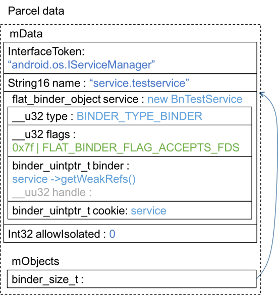
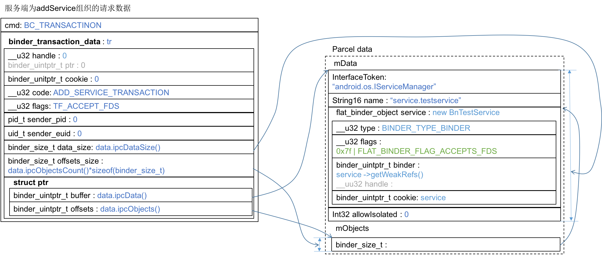

在checkService的调查中我们知道客户端向ServiceManager请求服务名，ServiceManager根据服务名遍历本地链表，找到匹配的handle返回给客户端。这个handle显然是由服务端注册的，这个handle究竟是什么？要先搞清楚这个问题，必须研究服务端和ServiceManager是如何共同完成一次addService操作的。我们从服务端代码出发。
<!-- more -->
TestService.cpp:30
``` c++
int main() {
    sp < ProcessState > proc(ProcessState::self());
    sp < IServiceManager > sm = defaultServiceManager(); 
         // sm = new BpServiceManager(new BpBinder(0))
    sm->addService(String16("service.testservice"), new BnTestService());
    ProcessState::self()->startThreadPool();
    IPCThreadState::self()->joinThreadPool();
    return 0;
}
```
在《defaultServiceManager()返回了什么？》一文中已经知道，sm就是new BpServiceManager(new BpBinder( 0 ) )，因此，找到BpServiceManager::addService(…)，frameworks/native/libs/binder/IServiceManager.cpp:155
``` c++
    virtual status_t addService(const String16& name, const sp<IBinder>& service,
            bool allowIsolated)
    {   // name="service.testservice", service=new BnTestService()，allowIsolated=false
        Parcel data, reply;
        data.writeInterfaceToken(IServiceManager::getInterfaceDescriptor());
        data.writeString16(name);
        data.writeStrongBinder(service);
        data.writeInt32(allowIsolated ? 1 : 0);
        status_t err = remote()->transact(ADD_SERVICE_TRANSACTION, data, &reply);
        return err == NO_ERROR ? reply.readExceptionCode() : err;
    }
```
Parcel的数据组织规则参见《Parcel是怎么打包的？》。这里打包的service是由main函数传入的new BnTestService()，它的类型是remote还是local呢？从命名上来看我猜是local（BpXXX代表proxy，BnXXX代表native）。来看看BnTestService的继承关系：BnTestService继承自BnInterface<ITestService>，BnInterface继承自BBinder，BBinder覆盖了虚函数localBinder(){return this;}在Binder.cpp:191。因此这个Parcel data的示意图为：

binder->localBinder()返回binder的this指针，因此就是传入的service参数，即new BnTestService()。
接下来在BpServiceManager::addService(…)函数中调用remote()->transact(…)组织数据的过程在《binder客户端是如何组织checkService数据》中已经分析过了，不再详细解释，只列出关键节点：
frameworks/native/libs/binder/IServiceManager.cpp:155
``` c++
    virtual status_t addService(const String16& name, const sp<IBinder>& service,
            bool allowIsolated)
    {   // name="service.testservice", service=new BnTestService()，allowIsolated=false
        Parcel data, reply;
        ……
        status_t err = remote()->transact(ADD_SERVICE_TRANSACTION, data, &reply);
        ……
    }
```
frameworks/native/libs/binder/BpBinder.cpp:159
``` c++
status_t BpBinder::transact(
    uint32_t code, const Parcel& data, Parcel* reply, uint32_t flags)
{   // code=ADD_SERVICE_TRANSACTION, flags=0
    // Once a binder has died, it will never come back to life.
        ……
        status_t status = IPCThreadState::self()->transact(
            mHandle, code, data, reply, flags);
        ……
}
```
frameworks/native/libs/binder/IPCThreadState.cpp:548
``` c++
status_t IPCThreadState::transact(int32_t handle,
                                  uint32_t code, const Parcel& data,
                                  Parcel* reply, uint32_t flags)
{   // handle=0, code=ADD_SERVICE_TRANSACTION, flags=0
    status_t err = data.errorCheck();

    flags |= TF_ACCEPT_FDS; 
    ……
        err = writeTransactionData(BC_TRANSACTION, flags, handle, code, data, NULL);
    ……    
    return err;
}
```
frameworks/native/libs/binder/IPCThreadState.cpp:904
``` c++
status_t IPCThreadState::writeTransactionData(int32_t cmd, uint32_t binderFlags,
    int32_t handle, uint32_t code, const Parcel& data, status_t* statusBuffer)
{  // cmd=BC_TRANSACTION, binderFlags=TF_ACCEPT_FDS, handle=0, 
   // code=ADD_SERVICE_TRANSACTION, 
    binder_transaction_data tr;

    tr.target.ptr = 0; /* Don't pass uninitialized stack data to a remote process */
    tr.target.handle = handle;
    tr.code = code;
    tr.flags = binderFlags;
    tr.cookie = 0;
    tr.sender_pid = 0;
    tr.sender_euid = 0; 
    ……
        tr.data_size = data.ipcDataSize();
        tr.data.ptr.buffer = data.ipcData();
        tr.offsets_size = data.ipcObjectsCount()*sizeof(binder_size_t);
        tr.data.ptr.offsets = data.ipcObjects();
    …… 
    mOut.writeInt32(cmd);
    mOut.write(&tr, sizeof(tr));
    
    return NO_ERROR;
}
```
它组织成最终的请求数据为：
