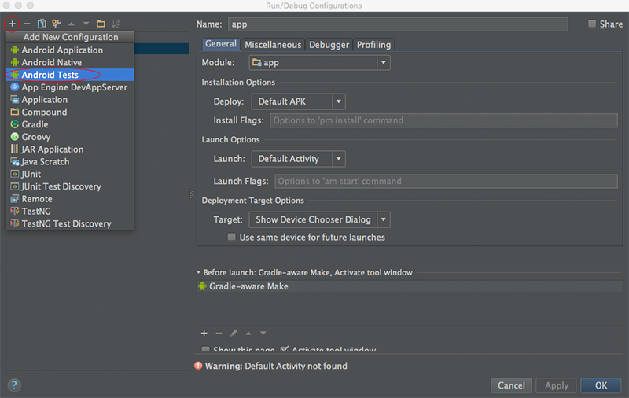
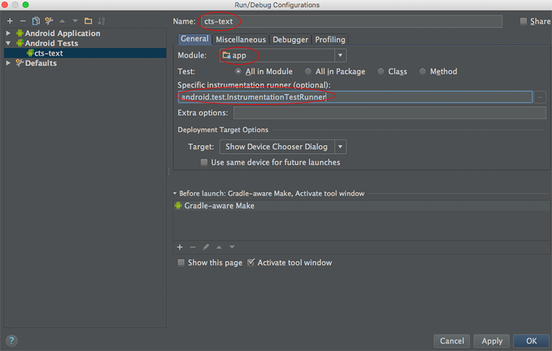
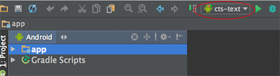

某厂商突然催命地报过来几个CTS Fail的问题，要求火速修改。接手团队以来，我对CTS的信息了解不多，当厂商说“CTS跑不过不能上线”时才有点慌了，赶紧恶补。

CTS是Google推出的兼容性测试集（Compatibility Test Suite），是一套免费且开源的工业级测试集合。既然是开源的，掌握它的王道当然是读代码、搭环境、跑起来、分析Fail的case、定位原因咯。CTS从使用者的角度定义了Android系统的技术规范，深入了解CTS对于理解Android系统是有帮助的。编译和调试CTS的过程还算顺利，本文记录下完整的步骤。
<!-- more -->
# 下载源码，缩小编译范围
CTS的源码可以从[https://android.googlesource.com/platform/cts/](https://android.googlesource.com/platform/cts/)下到。其实Android源码也是带CTS的，就在根目录下。

400M的代码量，庞大的目录树结构…… 先不管他们都是干嘛的，有空再仔细研究。Fail的case主要集中在目录`tests/tests/text/src/android/text/method/cts`下面，为了节省时间，我只把相关的test suites拆出来，独立编译和调试。

我把文件夹`tests/tests/text/src/android/text`单独拷贝一份，命名为`cts-text`。为什么是它，而不是子文件夹？因为我看这个文件夹下面有
`Android.mk`和`AndroidManifest.xml`，我猜它应该表示这是一个独立的Test Suite。

在`cts-text/src/android/text`下又有五个文件夹：`cts`、`format`、`method`、`style`、
`util`。厂商报过来Fail的case都在`method/cts/BaseKeyListenerTest.java`一个文件里，所以我可以把`method`以外的几个文件夹以及`method`里除`BaseKeyListenerTest.java`以外的`*Test.java`都删掉，干掉这些Test Case不会影响Test Suite的结构。最终的`cts-text`内容如下：
```
cts-text
├──Android.mk
├──AndroidManifest.xml
├──res
│  ├──...
│  └──...
└──src
   └──android
      └──text
         └──method
            └──cts
               ├──BaseKeyListenerTest.java
               ├──CtsActivity.java
               ├──KeyListenerCtsActivity.java
               ├──KeyListenerTestCase.java
               └──TextMethodUtils.java
```

# 创建Test Project
打开Android Studio，选择`Import project(Eclipse ADT, Gradle, etc.)`，选择`cts-text`文件夹，一路Next，完成。
菜单 - Run - Edit Configurations，点击"+"，选择`Android Tests`：

填写Name，指定runner：

选择`cts-text`并运行：

可以在模拟器上，也可以连接真机，TestCase就飞快地跑起来了。这是迄今为止，我摸索最顺利的源码编译。其中的TestCase写得非常清晰，两三分钟就能看懂每个Case都模拟了什么操作，预期结果是什么。找到Fail的Case后，重头在自己的代码上——需要确认在Case指定的操作下，自己的代码行为为什么没有符合预期。


