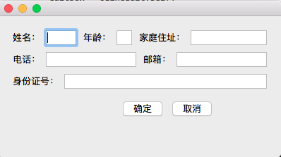

负责战略合作的同学最近接了一批边缘平台下的业务，这些分支和产品的主流逻辑有一些差异，每个平台都足以投一个小团队来搞了。可是由于业务比较边缘，很难给到那么多资源，最好的办法是挑一个可跨平台且开发成本低的语言和库来搞了，我选用了Qt，先用PyQt做个demo。周末花了一下午看看教程，果然醒目，够快~
<!-- more -->

关于布局，之前用WxPython的时候就常常迷惑，因为指定的尺寸不灵。这种现象在PyQt中依然存在，所以这里把QHBoxLayout和QVBoxLayout的布局简单梳理一下。

``` python
# -*- coding:utf-8 -*-
import logging
import sys
from PyQt5.QtWidgets import QApplication, QWidget, QVBoxLayout, QHBoxLayout, \
QLineEdit, QLabel, QPushButton

class MainWidget(QWidget):
    def __init__(self):
        super().__init__()
        self.initUI()

    def initUI(self):
        self.resize(400, 200)
        vbox = QVBoxLayout()

        # 第一行
        hbox = QHBoxLayout()
        label = QLabel('姓名：', self)
        hbox.addWidget(label)
        editBox = QLineEdit(self)
        hbox.addWidget(editBox)
        hbox.setStretchFactor(editBox, 2) # 设定三个控件横向拉伸比例为2:1:5

        label = QLabel('年龄：', self)
        hbox.addWidget(label)
        editBox = QLineEdit(self)
        hbox.addWidget(editBox)
        hbox.setStretchFactor(editBox, 1)

        label = QLabel('家庭住址：', self)
        hbox.addWidget(label)
        editBox = QLineEdit(self)
        hbox.addWidget(editBox)
        hbox.setStretchFactor(editBox, 5)
        vbox.addLayout(hbox)

        # 第二行
        hbox = QHBoxLayout()
        label = QLabel('电话：', self)
        hbox.addWidget(label)  # label按需分配，如果没有指定比例，QLineEdit平均分配
        editBox = QLineEdit(self)
        hbox.addWidget(editBox)

        label = QLabel('邮箱：', self)
        hbox.addWidget(label)
        editBox = QLineEdit(self)
        hbox.addWidget(editBox)
        vbox.addLayout(hbox)

        # 第三行   
        hbox = QHBoxLayout()
        label = QLabel('身份证号：', self)
        hbox.addWidget(label)
        editBox = QLineEdit(self)
        hbox.addWidget(editBox)
        vbox.addLayout(hbox)

        # 第四行
        hbox = QHBoxLayout()
        hbox.addStretch(2)        # 设定两个按钮的横向布局为 2 : 确定 : 取消 : 1
        btn = QPushButton('确定')
        hbox.addWidget(btn)

        btn = QPushButton('取消')
        hbox.addWidget(btn)
        hbox.addStretch(1)
        vbox.addLayout(hbox)

        vbox.addStretch(1)
        self.setLayout(vbox)

        self.show()

if __name__ == '__main__':
    loggingFormat = '%(asctime)s %(lineno)04d %(levelname)-8s %(message)s'
    logging.basicConfig(level=logging.DEBUG, format=loggingFormat, datefmt='%H:%M',)
    app = QApplication(sys.argv)
    mainWidget = MainWidget()

    sys.exit(app.exec_())
```
该例程在[test.py](https://github.com/palanceli/blog/blob/master/source/_posts/2016/1031PyQt/test.py)
运行结果如下图：

第一行的几个控件宽度比例通过
`QBoxLayout::setStretchFactor(QWidget *widget, int stretch)`
来设定：
``` python
 hbox.setStretchFactor(editBox, 2)
 ... ...
 hbox.setStretchFactor(editBox, 1)
 ... ...
 hbox.setStretchFactor(editBox, 5)
```
如果不设定，对于`QLabel`会按需分配，对于`QLineEdit`则会平分剩余的空间，如第二行；
如果只有一个`QLineEdit`则会独占剩余空间，如第三行。
如果要指定空占位，可以调用`QBoxLayout::addStretch(int stretch = 0)`，有人把Stretch称作弹簧，挺形象的——如果一个维度上没有其它弹簧，则添加一个弹簧会把其它所有控件压到最小；如果添加了多个弹簧，则按照配比分配空间，给控件设置的StretchFactor也算作弹簧。如最后一行，在`确定`左侧设定了因子为2的弹簧，在`取消`右侧设定了因子为1的弹簧。