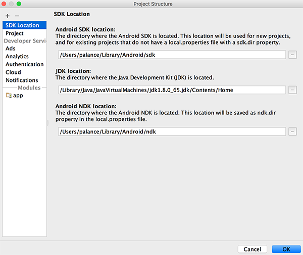
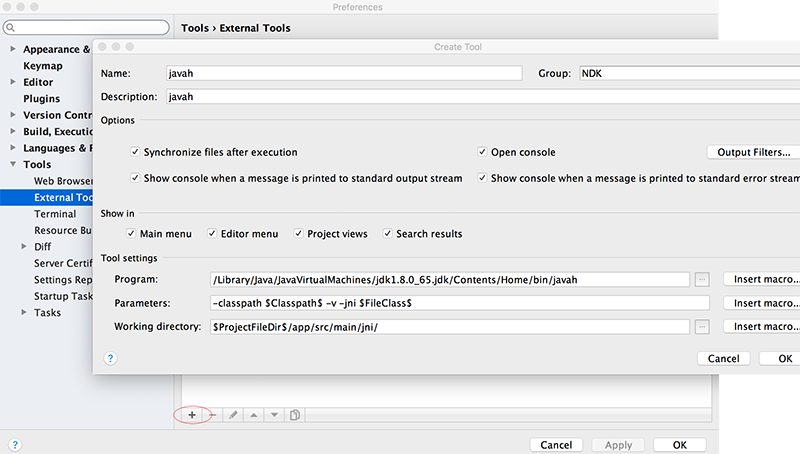
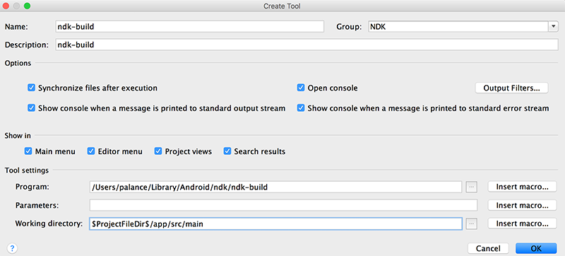
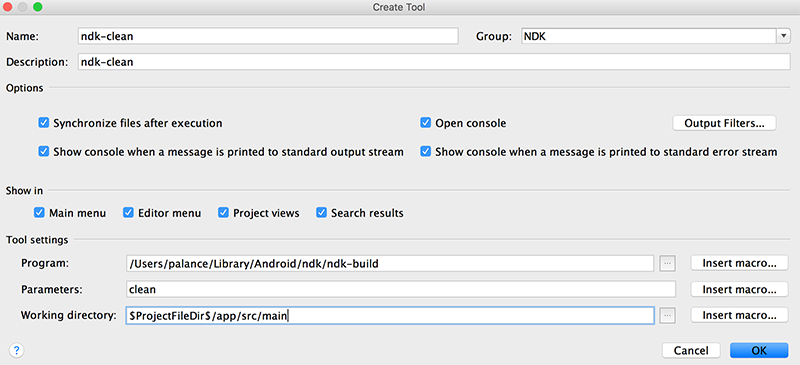
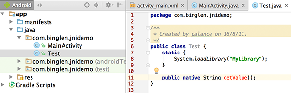
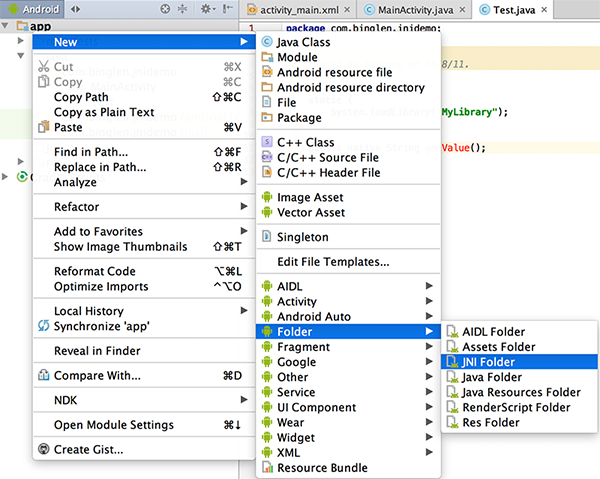
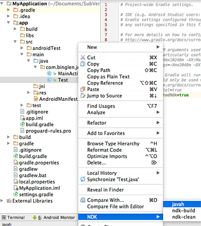
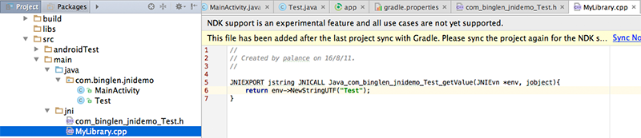

# 环境变量配置
从官网下载NDK，解压后放在~/Library/Android/ndk，然后去到SDK Location设置界面中填写`Android NDK location`。需要注意的是：在
`AS启动界面 - Configure - Porject Defaults - Porject Structure`这样打开的界面中，NDK的路径设置按钮是不让点的，只有新建project，在项目
`右键 - Open Modules Settings - SDK location`
这样进来才让修改NDK路径，设置如下：


# 添加External Tools
## javah
菜单`Android Studio - Preferences - Tools - External Tools`，点击加号，在弹出界面中添加javah如下图：


## ndk-build
继续添加，如下图：


## ndk-clean


# 创建新Project
## 为JNI添加java类


## 为JNI添加文件夹


## 配置build.gradle和gradle.properties文件
编辑build.gradle文件，在defaultConfig内添加ndk和sourceSets部分，如下：
```
... ...
android {
    ... ...
    defaultConfig {
        ... ...
        ndk{
            moduleName "mydll"
        }
        sourceSets.main{
            jni.srcDirs = []
            jniLibs.srcDir "src/main/libs"
        }
    }

    ... ...
}
... ...
```
编辑gradle.properties文件，添加如下一行：
`android.useDeprecatedNdk=true`

## 创建JNI头文件
在前面为JNI创建的java类右键 - NDK - javah

展开前面为JNI创建的文件夹，会发现为JNI创建的头文件被放在了这里。

## 创建C++源文件
在JNI文件夹右键 - New - C/C++ Source File创建源文件：


## 创建MakeFile文件
在jni文件夹下创建Android.mk文件，内容如下：
``` makefile
LOCAL_PATH :=$(call my-dir)

include $(CLEAR_VARS)

LOCAL_MODULE :=MyLibrary
LOCAL_SRC_FILES :=MyLibrary.cpp
include $(BUILD_SHARED_LIBRARY)
```

创建Application.mk，内容如下：
``` makefile
APP_MODULES :=MyLibrary

APP_ABI :=all
```
## 构建NDK库
在jni文件夹右键 - NDK - ndk-build

