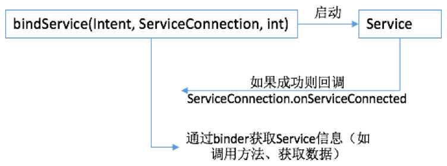

# Service用来解决什么问题？
如果某个程序在运行时需要呈现用户界面或者要和用户交互，就应该使用Activity，否则可以考虑使用Service。
# 创建Service
两个步骤：1、定义继承Service的子类；2、在AndroidManifest.xml中配置该子类
<!-- more -->
## 定义Service子类
五个关键接口：
``` java
IBinder onBind(Intent intent)
void onCreate()
void onDestory()
void onStartCommand(Intent intent, int flags, int startId)
boolean onUnbind(Intent intent) 
```

`Ibinder onBind(Intent intent)` 仅在通过bindService()方法启动Service的时候才会调用该方法。<font color='red'>参数是什么意思？</font>

`void onCreate()` 当Service被创建的时候调用该方法。如果多次通过startService()或bindService()启动Service，该方法仅会被回调一次。

`void onStartCommand(Intent intent, int flags, int startId)` 每次调用startService(Intent)启动Service时调用该方法

`void onDestory()` 当Service被销毁的时候调用该方法。<font color='red'>被销毁具体是什么意思？</font>

`void onUnbind(Intent intent)`当该Service上绑定的所有客户端都断开连接时将调用该方法。<font color='red'>断开连接具体是什么意思？</font>

## 配置Service子类
在AndroidManifest.xml文件中插入service配置，注意相对于application和其它已存在的activity的位置：
``` xml
<manifest …>
    <application …>
        <activity …>
        </activity>
        ……
        <service android:name=".MyService">
    </application>
</service>
</manifest>
```

# 使用（启停）Service
有两种方式可以启动Service：
1、调用`startService(...)/stopService(...)`
2、调用`bindService(...)/unbindService(...)`
可以做个类比：
* 通过startService启动的Service更像是一个线程：可以杀掉线程，可以通过变量与线程函数通信，除此之外没有更多与线程通信的机制。这种Service可以通过stopService(Intent)来停止，可以通过全局变量与Service通信，除此之外也没有更多与此Service通信的机制。
* 通过bindService启动的Service更像是一个窗体：它提供了窗体函数，可以发消息直接与窗体的消息处理函数通信。这种Service通过ServiceConnection参数把IBinder对象返回给调用者，Ibinder更像是Service的handler，通过它可以直接与Service通信。

## startService/stopService
ServiceA是即将启动的Service，在Activity的onCreate函数中写如下代码：
``` java
final Intent intent = new Intent(this, ServiceA.class);
Button startServiceAButton = (Button)findViewById(R.id.startServiceAButton);
startServiceAButton.setOnClickListener(new View.OnClickListener() {
    @Override
    public void onClick(View v) {
        Log.d(TAG, "startService ...");
        startService(intent);
        Log.d(TAG, "startService OK!");
    }
});

Button stopServiceAButton = (Button)findViewById(R.id.stopServiceAButton);
stopServiceAButton.setOnClickListener(new View.OnClickListener() {
    @Override
    public void onClick(View v) {
        Log.d(TAG, "stopService ...");
        stopService(intent);
        Log.d(TAG, "stopService OK!");
    }
});
```
## startService/stopService时序与多次调用
当多次调用startService/stopService时，观察Service的回调执行情况：

startService/stopService<br>调用时序|startService/stopService<br>调用时序|说明
---|----|----
startService<br>stopService|onCreate<br>onStartCommand|
startService<br>startService<br>stopService|onCreate<br>onStartCommand<br>onStartCommand<br>onDestroy|多次调用startService，仅回调一次onCreate，每次startService对应一次onStartCommand
startService<br>startService<br>stopService<br>stopService|onCreate<br>onStartCommand<br>onStartCommand<br>onDestroy|多次调用stopService，仅第一次生效
startService<br>stopService<br>startService<br>stopService|onCreate<br>onStartCommand<br>onDestroy<br>onCreate<br>onStartCommand<br>onDestroy|每次执行onDestroy会销毁该Service对象。因为之后再执行startService仍会回调onCreate，我在ServiceA的构造函数插入log，发现两次onCreate之前都调用了构造函数，也说明了这一点。

结论是：**多次调用startService，仅创建一个Service，执行一次onCreate，但会执行多次的onStartCommand；调用一次stopService就会销毁该Service，之后再多次调用stopService不会执行Service的任何方法。**

## 问题：startService和Service回调的调用时序是什么？
我在startService以及stopService的前后均查了log，发现每次启停，它们的输出结果为：
```
startService ...
startService OK!
ServiceA:     // 构造函数
onCreate:
onStartCommand:
...
stopService ...
stopService OK!
onDestory!
```
也就是说Service的构造、创建是在startService返回之后，销毁也是在stopService返回之后，这是为什么？具体的调用时序是什么样的？Service是在主线程里的，他的执行是插入在主线程的什么位置呢？

如果我的调用时序是：
```
startService
stopService
```
那么有没有可能stopService已经调用了，但onCreate还没被回调？
结论是：会！
## bindService/unbindService
bindService比startService稍微复杂，除了构造Intent指定要启动的Service，还需要传入一个ServiceConnection对象，当Service启动成功，将回调该对象的onServiceConnected方法，并把Service的Binder对象传给该ServiceConnection，Binder对象很像是Service的Handler，该对象可以提供访问Service的接口。

在Activity中定义ServiceConnection对象：
``` java
public class MyServiceConnection implements ServiceConnection{
    public BindServiceA.MyBinder binder;

    // 服务被成功启动后将回调，并把Service的binder传进来
    @Override
    public void onServiceConnected(ComponentName name, IBinder service) {
        Log.d(TAG, "onServiceConnected: ");
        binder = (BindServiceA.MyBinder)service;
    }

    @Override
    public void onServiceDisconnected(ComponentName name) {
        Log.d(TAG, "onServiceDisconnected: ");
    }
}
private MyServiceConnection conn = new MyServiceConnection();
在onCreate中定义启停服务函数：
// 启停BindServiceA
final Intent intent = new Intent(this, BindServiceA.class);
Button bindServiceAButton = (Button)findViewById(bindButtonId);
bindServiceAButton.setOnClickListener(new View.OnClickListener() {
    @Override
    public void onClick(View v) {
        Log.d(TAG, "bindService ...");
        bindService(intent, connection, Service.BIND_AUTO_CREATE);
        Log.d(TAG, "bindService OK!");
    }
});
Button unbindServiceAButton = (Button)findViewById(unbindButtonId);
unbindServiceAButton.setOnClickListener(new View.OnClickListener() {
    @Override
    public void onClick(View v) {
        Log.d(TAG, "unbindService ...");
        unbindService(connection);
        Log.d(TAG, "unbindService OK!");
    }
});
Button statBindServiceAButton = (Button)findViewById(statButtonId);
statBindServiceAButton.setOnClickListener(new View.OnClickListener() {
    @Override
    public void onClick(View v) {
        Log.d(TAG, "BindServiceA count = " + connection.binder.getCount());
    }
});
```
## bindService/unbindService时序与多次调用

bindService/<br>unbindService<br>调用时序|Service回调函数<br>执行时序|说明
---|----|----
bindService<br>unbindService|onCreate<br>onBind<br>onServiceConnected<br>onUnbind<br>onDestroy|
bindService<br>bindService<br>unbindService|onCreate<br>onBind<br>onServiceConnected<br>onUnbind<br>onDestroy|多次调用bindService，和一次调用没有区别，这是bindService和startService的差异
bindService<br>bindService<br>unbindService<br>unbindService|onCreate<br>onBind<br>onServiceConnected<br>onUnbind<br>崩溃|第二次bindService是无效的，故第二次unbindService也是无效的，但多次调用会导致崩溃，这也是和stopService的差异
bindService<br>unbindService<br>bindService<br>unbindService|onCreate<br>onBind<br>onServiceConnected<br>onUnbind<br>onDestroy<br>onCreate<br>onBind<br>onServiceConnected<br>onUnbind<br>onDestroy|没什么好讲，就是两次创建、启动、销毁，启动了两个不同的服务

对于同一个Service还可以先用startService启动，再用bindService再启动：

bindService/unbindService调用时序|Service回调函数执行时序
---|----
startService|onCreate<br>onStartCommand
bindService|onBind<br>onServiceConnected
unbindService|onUnbind
bindService|onServiceConnected<br>onRebind
unbindService|onUnbind
stopService|onDestroy

这说明：unbindService不会导致Service被销毁，因为还有一次startService没有stop对应，再次调用bindService会回调onRebind。

# IntentService解决什么问题
由于普通的Service是活在主线程里的，依然不能用来执行长程操作，以免阻塞主线程。为了解决这个问题，可以在Service中再启动子线程来干活。IntentService正是用来解决这个问题：它维护一个队列来管理请求Intent，并启动一条新线程依次串行处理Intent，因此IntentService不会阻塞主线程。
# IntentService的使用
扩展IntentService，并覆盖onHandleIntent(Intent intent)函数即可：
``` java
public class IntentServiceA extends IntentService {
    private final static String TAG = "LOG";
    public IntentServiceA() {
        super("IntentServiceA");
        Log.d(TAG, "IntentServiceA: ");
    }

    @Override
    protected void onHandleIntent(Intent intent) {
        Log.d(TAG, "onHandleIntent: ");
        for(int i=0; i<10; i++){
            try{
                Thread.sleep(1000);
            }catch(InterruptedException e){
            }
            Log.d(TAG, "tick = " + i);
        }
    }

}
```
需要注意的是：
1. 当所有任务执行完成后，Service会自动销毁，onDestroy会被调用。因此不要显式地调用stopService。
2. 如果覆盖了onStartCommand方法，再用startService启动Service，则onHandleIntent就不会被回调了，而是回调onStartCommand方法，该IntentService就退化成了普通的Service。

# 跨进程Service
## Server部分
首先在Server端，创建AIDL文件：
``` java
package com.binglen.sample.crossprocessservice;

interface IMyService {
    int getCount();
}
```
在AndroidStudio中Build – Make Project会为之生成Java文件。
定义Service：
``` java
public class MyService extends Service {
    private final static String TAG = "LOG";
    private IMyService.Stub mBinder = new IMyService.Stub(){
        @Override
        public int getCount(){
            return 100;
        }
    };
    
    public MyService() {
        Log.d(TAG, "MyService: ");
    }

    @Override
    public IBinder onBind(Intent intent) {
        Log.d(TAG, "onBind: ");
        return mBinder;
    }

    @Override
    public void onCreate(){
        Log.d(TAG, "onCreate: ");
        super.onCreate();
    }

    @Override
    public boolean onUnbind(Intent intent){
        Log.d(TAG, "onUnbind: ");
        return true;
    }

    @Override
    public void onDestroy(){
        Log.d(TAG, "onDestroy: ");
        super.onDestroy();
    }
}
```
配置AndroidManifest.xml，加入service部分，和本地Service最大区别在于name：
``` xml
<manifest xmlns:android="http://schemas.android.com/apk/res/android"
    package="com.binglen.sample.crossprocessservice">

    <application
        ……
        <activity
            ……
        </activity>

        <service
            android:name="com.binglen.sample.crossprocessservice.MyService"
            android:enabled="true"
            android:exported="true">
            <intent-filter>
                <action android:name="com.binglen.sample.cps.myservice"/>
            </intent-filter>
        </service>
    </application>

</manifest>
```
## Client部分
在client项目中新建package，路径和server端的保持一致，然后把server端的AIDL文件拷贝到该package下。
下面是client端的关键代码，这段代码写在client Activity的onCreate方法中，定义了启停Service的入口：
``` java
class MyCPServiceConnection implements ServiceConnection{
        public IMyService binder;

        @Override
        public void onServiceConnected(ComponentName name, IBinder service) {
            Log.d(TAG, "onServiceConnected: ");
            binder = IMyService.Stub.asInterface(service);
        }

        @Override
        public void onServiceDisconnected(ComponentName name) {
            Log.d(TAG, "onServiceDisconnected: ");
        }
    }

// 定义即将传入bindService的intent和ServiceConnection对象
    final MyCPServiceConnection conn = new MyCPServiceConnection();
// Android5.0不允许隐式intent，因此要指定package
    final Intent intent = new Intent(IMyService.class.getName());
    intent.setAction("com.binglen.sample.cps.myservice");
    intent.setPackage("com.binglen.sample.crossprocessservice");

    Button startButton = (Button)findViewById(R.id.startCrossProcessServiceA);
    startButton.setOnClickListener(new View.OnClickListener() {
        @Override
        public void onClick(View v) {
            Log.d(TAG, "bindService ...");
            bindService(intent, conn, Service.BIND_AUTO_CREATE);
            Log.d(TAG, "bindService OK!");
        }
    });

    Button statButton = (Button)findViewById(R.id.statCrossProcessServiceA);
    statButton.setOnClickListener(new View.OnClickListener() {
        @Override
        public void onClick(View v) {
            Log.d(TAG, "statService ...");
            if(conn.binder != null){
                int count = 0;
                try{
                    count = conn.binder.getCount();
                }catch (RemoteException e){
                    e.printStackTrace();;
                }
                Log.d(TAG, "count is " + count);
            }
        }
    });

    Button stopButton = (Button)findViewById(R.id.stopCrossProcessServiceA);
    stopButton.setOnClickListener(new View.OnClickListener() {
        @Override
        public void onClick(View v) {
            Log.d(TAG, "stopService ...");
            unbindService(conn);
            Log.d(TAG, "stopService OK!");
        }
    });
```