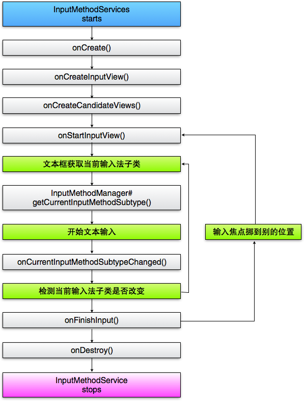
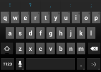

原文来自Android Delelopers开发官网：[Creating an Input Method](https://developer.android.com/guide/topics/text/creating-input-method.html)。<!-- more -->

# 概述
> An input method editor (IME) is a user control that enables users to enter text. Android provides an extensible input-method framework that allows applications to provide users alternative input methods, such as on-screen keyboards or even speech input. After installing the desired IMEs, a user can select which one to use from the system settings, and use it across the entire system; only one IME may be enabled at a time.

输入法是种交互控件，通过它用户得以输入文字。安卓通过提供可扩展的输入法框架，使应用程序可以向用户提供如基于触屏键盘的或基于语音的输入法。用户可以自主安装输入法，在系统设置里选择为默认，然后就能使用了。同一时刻只能使用一个输入法。

> To add an IME to the Android system, you create an Android application containing a class that extends InputMethodService. In addition, you usually create a "settings" activity that passes options to the IME service. You can also define a settings UI that's displayed as part of the system settings.
  

要在安卓系统创建输入法，首先应该让应用创建一个从`InputMethodService`基类派生的子类，此外通常还需要创建一个设置activity，用来设置输入法开关。还可以定义包含于系统设置界面中的输入法设置界面。

> This guide covers the following:
* The IME lifecycle
* Declaring IME components in the application manifest
* The IME API
* Designing an IME UI
* Sending text from an IME to an application
* Working with IME subtypes

本文将覆盖如下主题：
* 输入法生命周期
* 在manifest文件中声明输入法组件
* 输入法API
* 设计输入法UI
* 从输入法向应用程序上屏文字
* 输入法子类

> If you haven't worked with IMEs before, you should read the introductory article Onscreen Input Methods first. Also, the SoftKeyboard sample app included in the SDK contains sample code that you can modify to start building your own IME.

如果之前没有接触过输入法，建议先阅读[《触屏输入法》](http://android-developers.blogspot.com/2009/04/updating-applications-for-on-screen.html)这篇介绍性文章。SDK中包含了一个例子[SoftKeyboard](https://android.googlesource.com/platform/development/+/master/samples/SoftKeyboard/)也是学习编写输入法不错的参考。

# 输入法生命周期（The IME Lifecycle）
> The following diagram describes the life cycle of an IME:

下图展示了输入法的生命周期：


> The following sections describe how to implement the UI and code associated with an IME that follows this lifecycle.

本文剩下的部分将按照该生命周期介绍如何实现输入法的界面和编码。

# 在Manifest文件中声明输入法组件（Declaring IME Components in the Manifest）
> In the Android system, an IME is an Android application that contains a special IME service. The application's manifest file must declare the service, request the necessary permissions, provide an intent filter that matches the action action.view.InputMethod, and provide metadata that defines characteristics of the IME. In addition, to provide a settings interface that allows the user to modify the behavior of the IME, you can define a "settings" activity that can be launched from System Settings.

在安卓系统中，输入法是一类特殊的应用程序，它必须包含一个IME服务。需要在manifest文件中声明该服务和必要的权限，提供匹配`action.view.InputMethod`的intent filter，提供定义输入法特征的元数据。此外，还要提供一个设置界面，通过该界面可以让用户修改输入法配置；还可以定义一个能从系统设置界面中启动的输入法设置界面。

> The following snippet declares an IME service. It requests the permission BIND_INPUT_METHOD to allow the service to connect the IME to the system, sets up an intent filter that matches the action android.view.InputMethod, and defines metadata for the IME:

下面的代码段就声明了一个输入法服务。它申请了BIND_INPUT_METHOD权限，该权限允许本服务将输入法连接到系统。它创建了一个匹配`android.view.InputMethod`的intent filter，并定义了元数据：
``` xml
<!-- 定义IME 服务 -->
    <service android:name="FastInputIME"
        android:label="@string/fast_input_label"
        android:permission="android.permission.BIND_INPUT_METHOD">
        <intent-filter>
            <action android:name="android.view.InputMethod" />
        </intent-filter>
        <meta-data android:name="android.view.im"
android:resource="@xml/method" />
    </service>
```

> This next snippet declares the settings activity for the IME. It has an intent filter for ACTION_MAIN that indicates this activity is the main entry point for the IME application:

下面的代码段声明了输入法的设置activity。它在`intent filter`中指定了`ACTION_MAIN`，表明该activity是输入法应用的主入口。
``` xml
<!-- 可选设置: 控制输入法设置的Activity -->
    <activity android:name="FastInputIMESettings"
        android:label="@string/fast_input_settings">
        <intent-filter>
            <action android:name="android.intent.action.MAIN"/>
        </intent-filter>
    </activity>
```
> You can also provide access to the IME's settings directly from its UI.

还可以在输入法界面里提供访问输入法设置的入口。

# 输入法相关的API（The Input Method API）
>Classes specific to IMEs are found in the android.inputmethodservice and android.view.inputmethod packages. The KeyEvent class is important for handling keyboard characters.

在包[android.inputmethodservice](https://developer.android.com/reference/android/inputmethodservice/package-summary.html)和[android.view.inputmethod](https://developer.android.com/reference/android/view/inputmethod/package-summary.html)中可以找到和输入法相关的类。[KeyEvent](https://developer.android.com/reference/android/view/KeyEvent.html)也是处理键盘数据的重要类。

>The central part of an IME is a service component, a class that extends InputMethodService. In addition to implementing the normal service lifecycle, this class has callbacks for providing your IME's UI, handling user input, and delivering text to the field that currently has focus. By default, the InputMethodService class provides most of the implementation for managing the state and visibility of the IME and communicating with the current input field.

输入法的核心部分是从[InputMethodService](https://developer.android.com/reference/android/inputmethodservice/InputMethodService.html)派生的一个服务组件。除了要实现普通服务的生命周期以外，该类还未输入法UI绘制、用户输入处理、上屏文字提供了相应的回调函数。[InputMethodService](https://developer.android.com/reference/android/inputmethodservice/InputMethodService.html)已经实现了大部分管理输入法状态、是否可见以及和输入区域交互的默认行为。

>The following classes are also important:

> * BaseInputConnection
Defines the communication channel from an InputMethod back to the application that is receiving its input. You use it to read text around the cursor, commit text to the text box, and send raw key events to the application. Applications should extend this class rather than implementing the base interface InputConnection.
* KeyboardView
An extension of View that renders a keyboard and responds to user input events. The keyboard layout is specified by an instance of Keyboard, which you can define in an XML file.

下面的类同样重要：
* [BaseInputConnection](https://developer.android.com/reference/android/view/inputmethod/BaseInputConnection.html)
定义从[InputMethod](https://developer.android.com/reference/android/view/inputmethod/InputMethod.html)回调宿主应用的通信通道。使用该类可以读取光标附近的文字，上屏输入法写作、候选窗中文本，把原始的按键事件发送给应用程序。应用程序应该派生该类，而不只是实现[InputConnection](https://developer.android.com/reference/android/view/inputmethod/InputConnection.html)的接口。

* [KeyboardView](https://developer.android.com/reference/android/inputmethodservice/KeyboardView.html)
提供键盘布局并响应按键事件的[View](https://developer.android.com/reference/android/view/View.html)。可以通过xml文件定义[keyboard](https://developer.android.com/reference/android/inputmethodservice/Keyboard.html)，来描述一个键盘布局。

# 设计输入法界面（Designing the Input Method UI）
> There are two main visual elements for an IME: the input view and the candidates view. You only have to implement the elements that are relevant to the input method you're designing.

输入法有两个可以看到的界面元素：输入窗和候选窗。你只需要实现这些和输入法相关的元素即可。

## 输入窗（Input view）
> The input view is the UI where the user inputs text in the form of keyclicks, handwriting or gestures. When the IME is displayed for the first time, the system calls the onCreateInputView() callback. In your implementation of this method, you create the layout you want to display in the IME window and return the layout to the system. This snippet is an example of implementing the onCreateInputView() method:

输入窗是用户输入文字的区域，可以是键盘、手写或手势。当输入法首次显示的时候，系统将调用[onCreateInputView()](https://developer.android.com/reference/android/inputmethodservice/InputMethodService.html#onCreateInputView)回调函数。在实现该函数的时候，应当创建你希望在输入法窗体上展现的布局，并将此布局返回给系统。下面是一个[onCreateInputView()](https://developer.android.com/reference/android/inputmethodservice/InputMethodService.html#onCreateInputView\(\))函数的例程：
``` java
@Override
public View onCreateInputView() {
    MyKeyboardView inputView =
        (MyKeyboardView) getLayoutInflater().inflate( R.layout.input, null);

    inputView.setOnKeyboardActionListener(this);
    inputView.setKeyboard(mLatinKeyboard);

    return mInputView;
}
```
> In this example, MyKeyboardView is an instance of a custom implementation of KeyboardView that renders a Keyboard. If you’re building a traditional QWERTY keyboard, see the KeyboardView class.

在这个例子中，MyKeyboardView是一个自定义的[keyboard](https://developer.android.com/reference/android/inputmethodservice/Keyboard.html)实例，它实现了[KeyboardView](https://developer.android.com/reference/android/inputmethodservice/KeyboardView.html)接口，如果要创建一个传统的QWERT键盘，请参见[KeyboardView](https://android.googlesource.com/platform/development/+/master/samples/SoftKeyboard/%3E%20%20%20%20SoftKeyboard%3C/a%3E%20sample%20app%20for%20an%20example%20of%20how%20to%20extend%20the%20%3Ccode%3E%3Ca%20href=)类。

## 候选窗（Candidates view）
> The candidates view is the UI where the IME displays potential word corrections or suggestions for the user to select. In the IME lifecycle, the system calls onCreateCandidatesView() when it's ready to display the candidates view. In your implementation of this method, return a layout that shows word suggestions, or return null if you don’t want to show anything. A null response is the default behavior, so you don’t have to implement this if you don’t provide suggestions.

候选窗用来显示输入法的候选或联想文字。在输入法的生命周期里，当要显示候选窗时，系统将调用[onCreateCandidatesView()](https://developer.android.com/reference/android/inputmethodservice/InputMethodService.html#onCreateCandidatesView())函数。在该函数中应当返回显示候选文字的布局，如果没有要显示的内容则返回null。默认返回null。

> For an example implementation that provides user suggestions, see the SoftKeyboard sample app.

在[SoftKeyboard](https://android.googlesource.com/platform/development/+/master/samples/SoftKeyboard/)例程中，有候选窗的实现例子。

## 界面设计（UI design considerations）
> This section describes some specific UI design considerations for IMEs.

本节讲述关于输入法特殊的UI设计考虑。
### 处理不同的屏幕尺寸
> The UI for your IME must be able to scale for different screen sizes, and it also must handle both landscape and portrait orientations. In non-fullscreen IME mode, leave sufficient space for the application to show the text field and any associated context, so that no more than half the screen is occupied by the IME. In fullscreen IME mode this is not an issue.

输入法界面必须能适配不同的屏幕尺寸，还要处理横竖屏。在非全屏输入法模式下，必须为应用程序留出足够的空间显示上屏文字以及上下文，因此输入法不能占用超过一半的屏幕尺寸。在全屏输入法则不存在此问题。

### 处理不同的输入类型
> Android text fields allow you to set a specific input type, such as free-form text, numbers, URLs, email addresses, and search strings. When you implement a new IME, you need to detect the input type of each field and provide the appropriate interface for it. However, you don't have to set up your IME to check that the user entered text valid for the input type; that's the responsibility of the application that owns the text field.

安卓的文本输入区域允许设置一个输入类型，比如文本、数字、URL、email地址或者搜索串。当实现一个输入法时，需要探测当前输入区域的输入类型，并提供与之对应的界面。不过你不必通过输入法检查用户输入的合法性——这是应用程序中的输入区域应该干的事儿。

> For example, here are screenshots of the interfaces that the Latin IME provided with the Android platform provides for text and phone number inputs:

比如，下面是针对输入区域是普通文本和数字的输入法截图：



> When an input field receives focus and your IME starts, the system calls onStartInputView(), passing in an EditorInfo object that contains details about the input type and other attributes of the text field. In this object, the inputType field contains the text field's input type.

当输入区域获得焦点，系统会调用函数[onStartInputView()](https://developer.android.com/reference/android/inputmethodservice/InputMethodService.html#onStartInputView(android.view.inputmethod.EditorInfo, boolean))启动输入法，并传入一个[EditorInfo](https://developer.android.com/reference/android/view/inputmethod/EditorInfo.html)对象，该对象包含了输入区域的输入类型等相关属性，其[inputType](https://developer.android.com/reference/android/view/inputmethod/EditorInfo.html#inputType)成员表示输入区域的输入类型。

> The inputType field is an int that contains bit patterns for various input type settings. To test it for the text field's input type, mask it with the constant TYPE_MASK_CLASS, like this:

[inputType](https://developer.android.com/reference/android/view/inputmethod/EditorInfo.html#inputType)字段是一个整型值，它是代表不同输入类型的位“逻辑或”起来的数值。可以将该值与[TYPE_MASK_CLASS](https://developer.android.com/reference/android/text/InputType.html#TYPE_MASK_CLASS)求逻辑与，如下：
``` java
inputType & InputType.TYPE_MASK_CLASS
```
> The input type bit pattern can have one of several values, including:
* TYPE_CLASS_NUMBER
A text field for entering numbers. As illustrated in the previous screen shot, the Latin IME displays a number pad for fields of this type.
* TYPE_CLASS_DATETIME
A text field for entering a date and time.
* TYPE_CLASS_PHONE
A text field for entering telephone numbers.
* TYPE_CLASS_TEXT
A text field for entering all supported characters.
These constants are described in more detail in the reference documentation for InputType.

输入类型的位可有如下几种取值：
* [TYPE_CLASS_NUMBER](https://developer.android.com/reference/android/text/InputType.html#TYPE_CLASS_NUMBER)
    需要输入数字。如前文所示，Latin IME此时在键盘区域显示数字键盘。
* [TYPE_CLASS_DATETIME](https://developer.android.com/reference/android/text/InputType.html#TYPE_CLASS_DATETIME)
    需要输入日期和时间。
* [TYPE_CLASS_PHONE](https://developer.android.com/reference/android/text/InputType.html#TYPE_CLASS_PHONE)
    需要输入电话号码。
* [TYPE_CLASS_TEXT](https://developer.android.com/reference/android/text/InputType.html#TYPE_CLASS_TEXT)
    可以输入所有字符。

> These constants are described in more detail in the reference documentation for InputType.

这些常量在[InputType](https://developer.android.com/reference/android/text/InputType.html)的参考手册中有详细描述。

> The inputType field can contain other bits that indicate a variant of the text field type, such as:
* TYPE_TEXT_VARIATION_PASSWORD
A variant of TYPE_CLASS_TEXT for entering passwords. The input method will display dingbats instead of the actual text.
* TYPE_TEXT_VARIATION_URI
A variant of TYPE_CLASS_TEXT for entering web URLs and other Uniform Resource Identifiers (URIs).
* TYPE_TEXT_FLAG_AUTO_COMPLETE
A variant of TYPE_CLASS_TEXT for entering text that the application "auto-completes" from a dictionary, search, or other facility.
Remember to mask inputType with the appropriate constant when you test for these variants. The available mask constants are listed in the reference documentation for InputType.

此外，[InputType](https://developer.android.com/reference/android/text/InputType.html)字段还包含输入区域的其他属性，如：
* [TYPE_TEXT_VARIATION_PASSWORD](https://developer.android.com/reference/android/text/InputType.html#TYPE_TEXT_VARIATION_PASSWORD)
    在[TYPE_CLASS_TEXT](https://developer.android.com/reference/android/text/InputType.html#TYPE_CLASS_TEXT)类型下表示输入区域为密码，此时输入法应该不应明文显示输入内容
* [TYPE_TEXT_VARIATION_URI](https://developer.android.com/reference/android/text/InputType.html#TYPE_TEXT_VARIATION_URI)
    在[TYPE_CLASS_TEXT](https://developer.android.com/reference/android/text/InputType.html#TYPE_CLASS_TEXT)类型下表示输入区域为URL或者URI(Uniform Resource Identifiers)。
* [TYPE_TEXT_FLAG_AUTO_COMPLETE](https://developer.android.com/reference/android/text/InputType.html#TYPE_TEXT_FLAG_AUTO_COMPLETE)
    在[TYPE_CLASS_TEXT](https://developer.android.com/reference/android/text/InputType.html#TYPE_CLASS_TEXT)类型下表示输入的文本会被应用程序根据字典、搜索结果或其它机制自动补全。

> Caution: In your own IME, make sure you handle text correctly when you send it to a password field. Hide the password in your UI both in the input view and in the candidates view. Also remember that you shouldn't store passwords on a device. To learn more, see the Designing for Security guide.

注意：当输入法在密码区域输入时，在输入窗和候选窗中都不要显示密码明文，但在上屏时，发送给输入区域的应该是明文，此处应当注意。切记不要在磁盘上保存曾经输入过的密码。参照[安全设计](https://developer.android.com/guide/practices/security.html)，可以了解更多和安全相关的主题。

# 上屏文字到应用程序（Sending Text to the Application）
> As the user inputs text with your IME, you can send text to the application by sending individual key events or by editing the text around the cursor in the application's text field. In either case, you use an instance of InputConnection to deliver the text. To get this instance, call InputMethodService.getCurrentInputConnection().

当用户通过输入法输入时，通过发送按键事件，你可以向应用程序发送文字，也可以编辑输入区域中光标附近的文本。两种情况下，都是通过一个[InputConnection](https://developer.android.com/reference/android/view/inputmethod/InputConnection.html)的实例来传递文本的。可以调用静态函数[InputMethodService.getCurrentInputConnection()](https://developer.android.com/reference/android/inputmethodservice/InputMethodService.html#getCurrentInputConnection())来获得该实例。

## 编辑光标附近的文本（Editing the text around the cursor）
> When you're handling the editing of existing text in a text field, some of the more useful methods in BaseInputConnection are:
* getTextBeforeCursor()
Returns a CharSequence containing the number of requested characters before the current cursor position.
* getTextAfterCursor()
Returns a CharSequence containing the number of requested characters following the current cursor position.
* deleteSurroundingText()
Deletes the specified number of characters before and following the current cursor position.
* commitText()
Commit a CharSequence to the text field and set a new cursor position.

当编辑输入区域已存在的文字时，[BaseInputConnection](https://developer.android.com/reference/android/view/inputmethod/BaseInputConnection.html)的一些方法会很有用：
* [getTextBeforeCursor()](https://developer.android.com/reference/android/view/inputmethod/BaseInputConnection.html#getTextBeforeCursor(int, int))
    返回一个[CharSequence](https://developer.android.com/reference/java/lang/CharSequence.html)对象，该对象包含光标前指定数量的字符串序列。
* [getTextAfterCursor()](https://developer.android.com/reference/android/view/inputmethod/BaseInputConnection.html#getTextAfterCursor(int, int))
    返回一个[CharSequence](https://developer.android.com/reference/java/lang/CharSequence.html)对象，该对象包含光标后指定数量的字符串序列。
* [deleteSurroundingText()](https://developer.android.com/reference/android/view/inputmethod/BaseInputConnection.html#deleteSurroundingText(int, int))
    删除光标前/后指定数量的字符串。
* [commitText()](https://developer.android.com/reference/android/view/inputmethod/BaseInputConnection.html#commitText(java.lang.CharSequence, int))
    向输入区域上屏一个[CharSequence](https://developer.android.com/reference/java/lang/CharSequence.html)对象，并设置新的光标位置。
> For example, the following snippet shows how to replace the four characters to the left of the cursor with the text "Hello!":

例如：下面代码段演示了如何将光标左边的四个字符替换为"Hello!"：
``` java
    InputConnection ic = getCurrentInputConnection();
    ic.deleteSurroundingText(4, 0);
    ic.commitText("Hello", 1);
    ic.commitText("!", 1);
```
## 上屏前组织写作串（Composing text before committing）
> If your IME does text prediction or requires multiple steps to compose a glyph or word, you can show the progress in the text field until the user commits the word, and then you can replace the partial composition with the completed text. You may give special treatment to the text by adding a "span" to it when you pass it to setComposingText().

> The following snippet shows how to show progress in a text field: