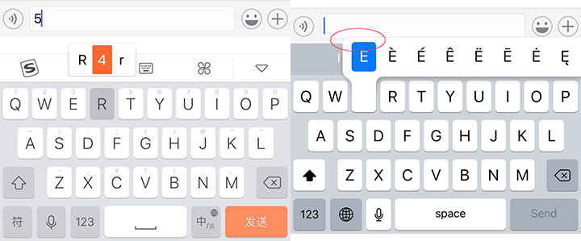
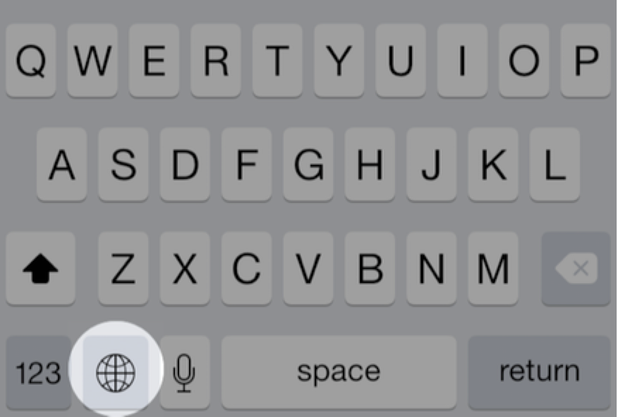

（本文来自[《Custom Keyboard》](https://developer.apple.com/library/content/documentation/General/Conceptual/ExtensibilityPG/CustomKeyboard.html)）
自定义键盘为那些希望体验更新颖的输入法或者需要用到iOS不支持的语言的用户，提供了替代系统键盘的备选。自定义键盘的核心功能很简单：响应按键、手势或其它输入事件，并提供转换后的文本字串，并将该字串插入到当前的光标位置。
<!-- more -->
> ** 开始阅读前 **
> 请先确认你需要开发的的确是系统范围的自定义键盘。如果只是希望在你的app内部提供可自定义的键盘，可以到[《Custom Views for Data Input 》](https://developer.apple.com/library/content/documentation/StringsTextFonts/Conceptual/TextAndWebiPhoneOS/InputViews/InputViews.html#//apple_ref/doc/uid/TP40009542-CH12)和[《Text Programming Guide for iOS》](https://developer.apple.com/library/content/documentation/StringsTextFonts/Conceptual/TextAndWebiPhoneOS/Introduction/Introduction.html#//apple_ref/doc/uid/TP40009542)了解`自定义输入视图`和`输入辅助视图`的相关内容，iOS SDK为此提供了更好的备选方案。

当用户选择了自定义键盘，该键盘即成为每个app的键盘。因此，你创建的键盘必须包含一些基本的功能。其中最重要的是，必须允许用户切换到其它键盘。

# 理解用户对键盘的预期
要理解用户对于自定义键盘的预期，可以系统键盘为标杆——它反应灵敏且高效。它不会用垃圾信息或请求打断用户输入。如果你提供了需要用户交互的功能，应该把它们放到键盘的app里，而不是键盘上。
## iOS用户预期的键盘功能
每个自定义键盘都必须提供的iOS用户所预期的键盘功能是：切换到其它键盘的方法。在系统键盘中，有一个小地球的按键用来完成此功能。iOS 8也提供了专门的API用于切换到下一个键盘，可以参见[《提供一种切换到其它键盘的方法》](https://developer.apple.com/library/content/documentation/General/Conceptual/ExtensibilityPG/CustomKeyboard.html#//apple_ref/doc/uid/TP40014214-CH16-SW4)。

系统键盘会根据当前文本输入对象的[UIKeyboardType](https://developer.apple.com/reference/uikit/uikeyboardtype)属性，展现与之匹配的键盘布局。如果当前的输入对象需要输入邮箱，系统键盘的句号建就会变化：长按会冒出一些顶级域名的后缀作为候选。你在设计自己的键盘布局时也应当考虑到当前的输入对象属性。

iOS用户还期望自动大写：在一个标准的文本输入区域，对于大小写敏感的语言来说，应当让句首的字母自动大写。

这类功能列出如下：

* 对输入对象的属性考虑适当的键盘布局
* 自动纠错和建议
* 自动大写
* 两个空格后自动添加句号
* Caps lock键的支持
* 键帽上的美观
* 对于象形文字的多层转换

你可以自行决定是否实现这些功能；系统并没有为这些功能提供专用的API，在自己的输入法中提供这些功能可以让你的产品更有竞争力。

## 系统键盘中的哪些功能不适用于自定义键盘
自定义键盘不能访问在系统设置中的通用键盘设置数据（设置 > 通用 > 键盘），比如自动大写、使Caps Lock可用。自定义键盘也不能访问字典还原信息（设置 > 通用 > 还原 > 还原键盘词典）。要满足你用户的灵活性要求，你应该创建一个标准的设置bundle，这个话题在[《偏好和设置编程指南》](https://developer.apple.com/library/content/documentation/Cocoa/Conceptual/UserDefaults/Introduction/Introduction.html#//apple_ref/doc/uid/10000059i)的[《实现iOS设置Bundle》](https://developer.apple.com/library/content/documentation/Cocoa/Conceptual/UserDefaults/Preferences/Preferences.html#//apple_ref/doc/uid/10000059i-CH6)中有讨论。这样你的自定义键盘的设置就会出现在系统设置的键盘区域。

还有一些文本输入对象，自定义键盘是不能在其上进行输入的。首先就是任何安全相关的文本输入对象。这类文本输入对象设置了其[secureTextEntry](https://developer.apple.com/reference/uikit/uitextinputtraits/1624427-securetextentry)属性为`YES`，在其上的输入内容将呈现为圆点。

当用户在密码框里输入时，系统会临时用系统键盘来替代自定义键盘。当用户在非密码框里输入时，自定义键盘又会恢复回来。

自定义键盘也无权在拨号输入的位置出现，例如通讯录的电话号码输入区域。对于这类输入对象，键盘是由运营商指定的一个数字/字母的小集合组成，并且具备如下属性：
[UIKeyboardTypePhonePad](https://developer.apple.com/reference/uikit/uikeyboardtype/1624426-phonepad)
[UIKeyboardTypeNamePhonePad](https://developer.apple.com/reference/uikit/uikeyboardtype/1624465-namephonepad)

当用户点击拨号输入对象时，系统将临时用系统键盘替换掉你的自定义键盘。当用户再点击其它标准输入对象时，自定义键盘又会恢复回来。

app的开发者可以选择在app内部不使用自定义键盘。例如银行类app，或者必须遵守美国HIPAA隐私规则的app，可以这么干。这类app实现来自`UIApplicationDelegate`协议的[application:shouldAllowExtensionPointIdentifier:](https://developer.apple.com/reference/uikit/uiapplicationdelegate/1623122-application)方法，并返回NO，以达到使用系统键盘的效果。

由于自定义键盘只能绘制其[UIInputViewController](https://developer.apple.com/reference/uikit/uiinputviewcontroller)对象内的主视图，在它上面不能选择文字。选择文字是使用键盘的应用程序控制的。如果app提供了编辑菜单（如剪切、拷贝和粘贴），键盘是无权访问它的。自定义键盘不能提供在光标位置的自动inline纠错能力。

在iOS8.0下，如所有扩展app一样，自定义键盘不能访问麦克风，因此不能实现语音输入。

最后，显示插图不能超过键盘的主视图上边缘，系统键盘可以，但自定义键盘不行。如下图，可以发现自定义键盘和系统输入法的差别：

# 自定义键盘API
本节将给出开发自定义键盘的快速入门。如下图，它展示了键盘运行过程中一些重要的对象，以及它们在开发流程中的的位置：


自定义键盘模板（在iOS“Application Extension”目标模板组）包含一个[UIInputViewController](https://developer.apple.com/reference/uikit/uiinputviewcontroller)的子类，它是你开发的键盘的主视图控制器。该模板包含键盘所必需的“下一个键盘”按钮的实现，它调用了`UIInputViewController`类的[advanceToNextInputMode](https://developer.apple.com/reference/uikit/uiinputviewcontroller/1618191-advancetonextinputmode)方法。如上图所示，可以在输入视图控制器的主视图（在其[inputView](https://developer.apple.com/reference/uikit/uiinputviewcontroller/1618192-inputview)属性）中添加子视图、控制器以及手势识别器等。对于其它类型的扩展应用，在目标上并不存在窗体，因此也就没有根视图控制器了。

在模板的`Info.plist`文件中有预先配置好的键盘所需要的最基本的值。参见其中的`NSExtensionAttributes`字典关键字，配置一个键盘的关键字在[《配置自定义键盘的Info.plist文件》](https://developer.apple.com/library/content/documentation/General/Conceptual/ExtensibilityPG/CustomKeyboard.html#//apple_ref/doc/uid/TP40014214-CH16-SW18)中有介绍。

默认，键盘不能访问网络，不能和它的app共享容器。如果要具备这种能力，必须要将`Info.plist`文件中`RequestsOpenAccess`的值置为`YES`。这需要扩展键盘的沙盒，在[《设计用户信任》](https://developer.apple.com/library/content/documentation/General/Conceptual/ExtensibilityPG/CustomKeyboard.html#//apple_ref/doc/uid/TP40014214-CH16-SW3)中有介绍相关内容。

一个输入视图控制器遵从各种与文本输入对象内容交互的协议：

* 响应触摸消息时如果要插入或删除文本，可以使用[UIKeyInput](https://developer.apple.com/reference/uikit/uikeyinput)协议的[insertText:](https://developer.apple.com/reference/uikit/uikeyinput/1614543-inserttext)和[deleteBackward](https://developer.apple.com/reference/uikit/uikeyinput/1614572-deletebackward)方法。可以在视图控制器的[textDocumentProxy](https://developer.apple.com/reference/uikit/uiinputviewcontroller/1618193-textdocumentproxy)属性中调用这些方法，该属性代表当前文本输入对象，它遵从[UITextDocumentProxy](https://developer.apple.com/reference/uikit/uitextdocumentproxy)协议。如下：
``` Obj-C
[self.textDocumentProxy insertText:@"hello "]; // Inserts the string "hello " at the insertion point
[self.textDocumentProxy deleteBackward];       // Deletes the character to the left of the insertion point
[self.textDocumentProxy insertText:@"\n"];     // In a text view, inserts a newline character at the insertion point
```

* 在调用[deleteBackward](https://developer.apple.com/reference/uikit/uikeyinput/1614572-deletebackward)之前要先决定删除的字符数。可以通过[textDocumentProxy](https://developer.apple.com/reference/uikit/uitextdocumentproxy/1618190-documentcontextbeforeinput)的[documentContextBeforeInput](https://developer.apple.com/reference/uikit/uiinputviewcontroller/1618193-textdocumentproxy)属性，来获得光标附近的文本上下文信息。如下：
``` obj-c
NSString *precedingContext = self.textDocumentProxy.documentContextBeforeInput;
```
    然后就可以删除你指定的文字区域了，比如单个字符还是空格后的所有字符。如果要按照语义执行删除，比如一个单词、句子、还是一个段落，可以使用[《 CFStringTokenizer Reference》](https://developer.apple.com/reference/corefoundation/cfstringtokenizer-rf8)中描述的函数，注意每个语种的语义规则是不同的。

* 为了控制光标所在位置的操作，比如支持向前删除文字，需要调用`UITextDocumentProxy`协议中的[《adjustTextPositionByCharacterOffset: 》](https://developer.apple.com/reference/uikit/uitextdocumentproxy/1618194-adjusttextposition)方法。比如向前删除一个字符，代码如下：
``` obj-c
- (void) deleteForward {
    [self.textDocumentProxy adjustTextPositionByCharacterOffset: 1];
    [self.textDocumentProxy deleteBackward];
}
```

* 通过实现[《UITextInputDelegate》](https://developer.apple.com/reference/uikit/uitextinputdelegate)协议中的方法，可以相应当前输入文本对象的一些变化，比如内容变化以及用户触发的光标位置的变化。

为了展现与当前文本输入对象适配的键盘布局，需要参照该对象的[UIKeyboardType](https://developer.apple.com/reference/uikit/uikeyboardtype)属性，根据每种你的键盘所能支持的属性，变化布局内容。

在自定义键盘中，有两种方式来支持多语言：

* 为每个语言创建一个键盘，每个键盘都作为向容器app添加的独立的Target
* 创建一个多语言键盘，动态切换当前语言。可以使用`UIInputViewController`类的[primaryLanguage](https://developer.apple.com/reference/uikit/uiinputviewcontroller/1618200-primarylanguage)属性来动态切换语言。

根据你要支持的语言数量以及你想提供的用户体验，你可以从上面选择最合适的方案。

每种自定义键盘（需要`RequestsOpenAccess`）都可以通过[UILexicon](https://developer.apple.com/reference/uikit/uilexicon)类访问自动纠错的词典。通过使用该类，并结合你自己的词典设计，可以在用户输入过程中为他提供输入建议和自动纠错。`UILexicon`对象包含来自如下源的单词：
* 来自用户通讯录的人名和姓
* 在 设置 > 通用 > 键盘 > 快捷方式（文本替换） 列表
* 通用词典

你可以使用自动布局来调整你的自定义键盘主视图的高度。默认情况下，自定义键盘会根据屏幕尺寸以及设备方向，和系统键盘的尺寸保持一致。自定义键盘的宽度通常与屏幕当前宽度一致。修改自定义键盘主视图的高度约束即可修改其高度。

下面的代码展示如何定义和添加约束：

``` obj-c
CGFloat _expandedHeight = 500;
NSLayoutConstraint *_heightConstraint = 
    [NSLayoutConstraint constraintWithItem: self.view 
                                 attribute: NSLayoutAttributeHeight 
                                 relatedBy: NSLayoutRelationEqual 
                                    toItem: nil 
                                 attribute: NSLayoutAttributeNotAnAttribute 
                                multiplier: 0.0 
                                  constant: _expandedHeight];
[self.view addConstraint: _heightConstraint];
```
> ** 注意 **
> 在 iOS8.8下，你可以在主视图画到屏幕之后的任何时间里调整键盘高度。

# 自定义键盘的开发关键
自定义键盘开发有两个关键点：
* **信任。** 自定义键盘能访问用户输入的内容 ，因此在键盘和用户间建立信任非常关键。
* **“下一个键盘”键。** 通过键盘界面必须能让用户能切换到下一个键盘。

## 为用户信任所做的设计
作为自定义键盘的开发者，你首先应当考虑的是如何建立和维护用户信任。你要理解隐私策略的最佳实践并知道如何实现它才能很好地践行。
> 注意
> 本节为你创建自定义键盘提供相关的开发手册，该手册要求尊重用户隐私。了解iOS编程要求，请阅读`应用商店审核手册`，`iOS人机交互手册`，`iOS开发许可协议`，请参见苹果的[《应用审核支持》](https://developer.apple.com/support/appstore/app-review/)，[《支持用户隐私》](https://developer.apple.com/library/content/documentation/iPhone/Conceptual/iPhoneOSProgrammingGuide/ExpectedAppBehaviors/ExpectedAppBehaviors.html#//apple_ref/doc/uid/TP40007072-CH3-SW6)，[《iOS应用编程指南》](https://developer.apple.com/library/content/documentation/iPhone/Conceptual/iPhoneOSProgrammingGuide/Introduction/Introduction.html#//apple_ref/doc/uid/TP40007072)。

对于键盘，如下三个方面对于建立和维护用户信任至关重要：
** 按键数据的安全。 **用户希望他们的敲键会落在文档以及输入区域内，而不是上传到服务器或者用于其他不明目的。
** 最小化合理利用其它用户数据。 **如果你的键盘还需要使用其他用户数据，例如定位服务或者通讯录，你有义务解释这给用户带来的好处是什么。
** 准确。 ** 把输入事件转换成文本要求精准，这本身虽然不是一个隐私话题，但他会影响到信任：每次文字转换需要体现出你的代码的精准。

在信任的开发设计过程中，首先考虑的是是否要获取open access权限。尽管开启了open access权限能给自定义键盘开发带来极大便利，但这也增加了你作为开发者的责任。下面是标准的open access的能力和隐私考虑：

Open Access|能力和限制|隐私考虑
----|----|----
Off(default)|·键盘可以执行所有基本键盘的职责<br>·可以访问通用词典以支持自动纠错和输入建议<br>·访问设置里的快捷短语<br>·不与containing应用共享容器<br>·不访问键盘容器以外的文件系统<br>·不访问键盘容器以外的文件系统<br>·不能直接或间接访问iCloud或游戏中心或应用内购买|用户了解按键仅仅被发送到当前使用键盘的应用里
On|·具备非联网自定义键盘的所有能力<br>·在用户许可情况下可以访问位置服务和通讯录<br>·键盘和containing app可以访问共享容器<br>·键盘可以为服务器侧处理过程发送按键或其他输入事件<br>·containing app自动纠错字典提供编辑界面<br>·通过containing app键盘可以使用iCloud来保证自动纠错词典和设置的更新<br>·通过containing app，键盘可以参与到游戏中心和应用内购买<br>·如果键盘支持移动设备管理(MDM)，它可与被管理的应用共同工作|·用户了解键盘开发者会利用按键数据<br>·你必须遵守`有联网能力的键盘开发手册`和`iOS开发许可协议`，可参见[《应用审核支持》](https://developer.apple.com/support/appstore/app-review/)

如果你的自定义键盘不需要open access权限，系统确保敲键信息不会被发送给你的键盘以及别的地方。如果只想提供一般的键盘功能，请不要给键盘配备联网能力。由于有沙盒限制，不联网的键盘一定是满足苹果的数据隐私手册并能获得用户信任的。

开启open access权限（如上所述，可以在Info.plist文件中配置），能给你的开发带来更多可能性，同时也带来更多的责任。

> 注意
> 向应用商店提交一个open-access的键盘必须遵守苹果[《应用审核支持》](https://developer.apple.com/support/appstore/app-review/)中的相关条款。

每一个与open access相关的功能都需要你履行相应的责任，应当最大限度地尊重用户数据，不得用于与用户输入无关的其他任何目的。下表列出了open access带来的好处以及开发者需承担的责任：

能力|用户利益示例|开发者责任
---|---|---
与containing app共享容器|为键盘的自动纠错词典管理UI界面|要考虑到自动纠错数据属于用户隐私。不要把他发到你的服务器，用作与输入无关的用途。
把按键数据发到你的服务器|通过开发者的计算资源可以提供更好的按键处理结果和输入预测|只有为用户提供更好的输入体验之用时，才能保存按键和语音数据
基于云的自动纠错词典|把人名、地名、热点新闻加入到自动纠错词典中|不要把用户身份与输入数据关联起来，不得将用户信息用作与输入体验无关的其他目的
通讯录|把人名、地名、电话号码添加到自动纠错词典中|不得讲通讯录用作与输入体验无关的其他目的
位置服务|将附近的地名添加到自动纠错词典中|不要在后台使用位置服务，不得将位置信息发送到你的服务器并用于与输入体验无关的其他目的

一个具有open-access权限的键盘和其containing app能将按键数据发送到服务器端，通过这些数据可以为用户提供更好的输入体验。如果你使用了这些能力，当不需要这些数据的时候，请及时在服务器端删除。参见上面的表格来履行你使用open-access权限中的义务。

## 提供切换到其他键盘的方法
系统键盘的小地球按键用于切换到其他键盘，如下所示：

你的自定义键盘必须提供类似的机制能切换到其他键盘。
> 注意
> 要通过应用审核，必须在你的键盘上提供明显允许用户切换键盘的UI标识。

调用[UIInputViewController](https://developer.apple.com/reference/uikit/uiinputviewcontroller)类的[advanceToNextInputMode](https://developer.apple.com/reference/uikit/uiinputviewcontroller/1618191-advancetonextinputmode)方法可以切换到其他键盘。系统会选择下一个键盘，没有能获得键盘列表的API，也没有切换到指定键盘的API。

Xcode自定义键盘模板中就已经在`下一个键盘`按钮上具备了[advanceToNextInputMode](https://developer.apple.com/reference/uikit/uiinputviewcontroller/1618191-advancetonextinputmode)的功能。为了提供最好的用户体验，应当把你的`下一个键盘`按键放在靠近系统键盘的小地球键的位置。

# 开始自定义键盘的开发
本节中你将学习到如何创建自定义键盘，根据你的目标配置并在iOS模拟器或物理机上把它运行起来。你还将学习到一些替代系统键盘应谨记的UI要点。

## 使用Xcode自定义键盘模板
创建键盘及其containing app与其他扩展应用略有不同。本节将带你领略基本键盘的开发和运行。

**在一个容器app中创建键盘，步骤如下：**
1. 在Xcode中选择`File > New > Project > iOS > Application`选择`Single View Application`模板。
2. 点击`Next`。
3. 填写`Project Name`（如CKIme），点击`Next`。
4. 选择要保存的位置，点击`Create`。这样，你就有了一个空app，该app只能完成一个简单的操作，接下来它将承载键盘。在你提交到应用商店之前，你需要完成一些有用的功能。请到[应用审核支持](https://developer.apple.com/support/appstore/app-review/)参考`应用商店审核指南`。
5. 选择`File > New > Target > iOS > Application Extension`选择`Custom Keyboard Extension`，点击`Next`。
6. 填写`Product Name`（如CKbd），点击`Finish`。
7. 确认`Project`和`Embed in Application`中都显示的是容器app的名字（CKIme），点击`Finish`。如果弹出`Activate “CKbd” scheme`提示让激活键盘工程，点击`Activate`。

接下来你可以根据需要决定是否要自定义键盘的group name，它会出现在设置中的已购买键盘列表中。

**自定义键盘group name，步骤如下：**
1. 在Xcode工程导航视图中，选择容器app的`Info.plist`文件，
2. 在右侧plist编辑器中，鼠标hover到`Bundle name`上，点“+”按钮创建一行空属性。
3. 在Key中填写`Bundle display name`，回车
4. 双击该行的Value，填写你要自定义的键盘group name。
5. 选择`File > Save`保存设置。

下表汇总了在容器app和键盘app的`Info.plist`文件中你可以配置的UI字符串：

iOSUI字符串|Info.plist关键字
----|----
· 在系统设置的已购键盘列表中的键盘group name|在容器app的Info.plist文件中的Bundle display name
· 系统设置中的键盘名称<br>· 键盘换列表中的键盘名称|在键盘app的Info.plist文件中的Bundle display name

现在你可以在iOS模拟器或真机上运行该键盘，看看它目前都具备什么行为和能力吧。

** 运行自定义键盘并将Xcode调试器attach到它上面 **
1. 在Xcode，你的view controller实现中设置一个断点（比如可以断在[viewDidLoad](https://developer.apple.com/reference/uikit/uiviewcontroller/1621495-viewdidload)上）。
2. 在Xcode工具栏确保当前活动的项目为键盘项目，并对应iOS模拟器或设备。
3. 选择菜单`Project > Run`，或点击`Build and then run the current scheme`按钮（即播放按钮）。Xcode会提示选择host app。选择一个带有输入框的，比如通讯录或Safari。
4. 点击`Run`。
Xcode将运行起你指定的host app。如果这是你第一次使用键盘扩展应用，需要现在设置中添加并启用键盘：
    1. `Settings > General > Keyboard > Keyboards`
    2. 点击`Add New Keyboard...`
    3. 在`OTHER IPHONE KEYBOARDS`中点击你刚刚创建的键盘
5. 在iOS模拟器或真机上，调出你的自定义键盘。
点击任意可输入区域，将显示出系统键盘。按住小地球，选择你的自定义键盘。
此时你将看到自定义键盘，但是调试器尚未attach上来。一个从模板构建而来的极简键盘仅有一个`Next Keyboard`按钮，点击后切换回前一个键盘。
6. 取消你的键盘（以便在第8步中你可以再次调出键盘以命中`viewDidLoad`断点）
7. 在Xcode中，选择`Debug > Attach to Process > By Process Identifier(PID) or Name`
在弹出对话框中，输入你的键盘扩展应用的名字（包含空格）.默认就是该扩展应用在工程导航窗口里的group name。
8. 点击`Attach`。
Xcode将显示出等待attach的调试器。
9. 在任意能输入文字的app中调出键盘。
当你的键盘主视图开始加载时，Xcode调试器将attache到你的键盘，并命中断点。

## 为自定义键盘配置Info.plist文件
自定义键盘的Info.plist文件允许静态定义键盘的现式特征，包括主要语言，以及是否需要open access权限。

打开Xcode并切换到自定义键盘的target。在工程导航栏选择Info.plist文件，按文本格式呈现如下：
``` xml
<key>NSExtension</key>
<dict>
    <key>NSExtensionAttributes</key>
    <dict>
        <key>IsASCIICapable</key>
        <false/>
        <key>PrefersRightToLeft</key>
        <false/>
        <key>PrimaryLanguage</key>
        <string>en-US</string>
        <key>RequestsOpenAccess</key>
        <false/>
    </dict>
    <key>NSExtensionPointIdentifier</key>
    <string>com.apple.keyboard-service</string>
    <key>NSExtensionPrincipalClass</key>
    <string>KeyboardViewController</string>
</dict>
```
每个关键字在[App Extension Keys](https://developer.apple.com/library/content/documentation/General/Reference/InfoPlistKeyReference/Articles/AppExtensionKeys.html#//apple_ref/doc/uid/TP40014212)中都有解释。可以使用字典`NSExtensionAttributes`中的关键字来描述你的自定义键盘的特征和需求，如下：

`IsASCIICapable` - 默认为NO的布尔值。用户键盘是否可以向文档中插入ASCII字串。如果要为`UIKeyboardTypeASCIICapable`属性的输入对象展现单独类型的键盘，需要将该值置为YES。

`PrefersRightToLeft` - 默认为NO的布尔值。是否为从右到左的语种设计的的自定义键盘。

`PrimaryLanguage` - 默认为`en-US`的字串。以<语种>-<区域>的形式描述键盘的主语言。可以到[http://www.opensource.apple.com/source/CF/CF-476.14/CFLocaleIdentifier.c](http://www.opensource.apple.com/source/CF/CF-476.14/CFLocaleIdentifier.c)找到对应的语种和区域。

`RequestsOpenAccess` - 默认为NO的布尔值。是否需要比基础键盘更大的沙盒范围。把该值置为YES将需要`完全访问`权限，你的键盘将获得如下能力，每个能力都伴随有相应的权限：
* 访问定位服务，通讯录数据库，相机，每个都需要用户允许
* 与键盘的容器app共享容器数据，以便完成比如在容器app中管理用户词库的界面的功能
* 通过网络发送按键、输入事件之类的数据供云端处理
* 使用[UIPasteboard](https://developer.apple.com/reference/uikit/uipasteboard)类
* 播放音频，包括使用[playInputClick](https://developer.apple.com/reference/uikit/uidevice/1620050-playinputclick)方法播放按键音
* 访问iCloud，可以用来根据用户身份同步比如键盘设置、自定义自动纠错词典
* 通过容器app访问游戏中心和应用内购买
* 如果你的键盘支持移动设备管理（MDM），可以与被管理的app无缝合作

当考虑是否将这些关键字设置为YES之前，一定要先阅读[《用户信任设计》](https://developer.apple.com/library/content/documentation/General/Conceptual/ExtensibilityPG/CustomKeyboard.html#//apple_ref/doc/uid/TP40014214-CH16-SW3)，这里描述了如何尊重和保护用户数据。