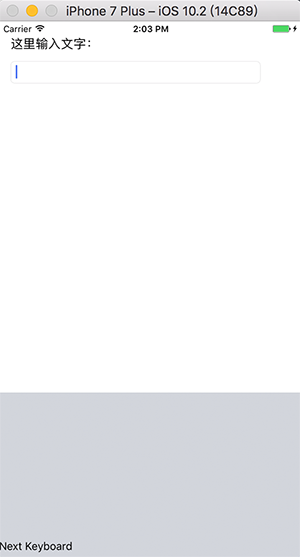
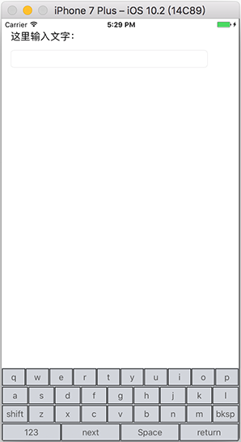

iOS下自定义键盘的创建方法在[《Custom Keyboard（译）》](http://palanceli.com/2017/03/07/2017/0307CustomKeyboard/#使用Xcode自定义键盘模板)中有详细描述，它生成的键盘只是一个白板。这里我们继续把它完善成为一个输入法的样子。<!-- more -->
项目的名称为`iOSCKImeSample`，这也是容器app的名字。键盘的Target name为`CKbd`。

# 在容器app中添加可输入对象
如图，在容器app中添加两个控件，以便验证键盘：


# Xcode模板生成的键盘
先来看看Xcode默认生成的输入法的样子：

在`iOSCKImeSampleCKbd/KeyboardViewController.m`中，
`KeyboardViewController::viewDidLoad`代码如下：
``` obj-c
- (void)viewDidLoad {
  [super viewDidLoad];
  
  // 生成方形圆角按钮
  self.nextKeyboardButton = [UIButton buttonWithType:UIButtonTypeSystem];
  // 设置标题，和状态
  [self.nextKeyboardButton setTitle:
   NSLocalizedString(@"Next Keyboard",
                     @"Title for 'Next Keyboard' button")
                           forState:UIControlStateNormal];
  // 按钮尺寸为能容纳内容的最小化尺寸
  [self.nextKeyboardButton sizeToFit];
  self.nextKeyboardButton.translatesAutoresizingMaskIntoConstraints = NO;
  
  // 设置响应：长按显示输入法列表，短按切换输入法
  [self.nextKeyboardButton addTarget:self action:@selector(handleInputModeListFromView:withEvent:) forControlEvents:UIControlEventAllTouchEvents];
  // 将按钮添加为view的子视图
  [self.view addSubview:self.nextKeyboardButton];
  // 将按钮左/下边缘对齐到view的左下边缘
  [self.nextKeyboardButton.leftAnchor constraintEqualToAnchor:self.view.leftAnchor].active = YES;
  [self.nextKeyboardButton.bottomAnchor constraintEqualToAnchor:self.view.bottomAnchor].active = YES;
}
```
它直接在主视图上生成了一个`Next Keyboard`按钮，并响应点击事件。完善该键盘，只需要在主视图上长出完整的键盘按钮，并响应点击事件即可。
# 创建按键
为`KeyboardViewController`添加函数`createCKbdUI`，并在`KeyboardViewController::viewDidLoad`中调用它：
``` obj-c
- (void)viewDidLoad {
  [super viewDidLoad];
  [self createCKbdUI]; // 创建键盘布局
}
```
`createCKbdUI`的定义如下：
``` obj-c

- (void)createCKbdUI{
  self.allButtons= [NSMutableArray array];
  self.isPressShiftKey= NO;
  // 定义每一行的键帽字符
  NSArray *titles = @[@[@"q",@"w",@"e",@"r",@"t",@"y",@"u",@"i",@"o",@"p"],
                      @[@"a",@"s",@"d",@"f",@"g",@"h",@"j",@"k",@"l"],
                      @[@"shift",@"z",@"x",@"c",@"v",@"b",@"n",@"m",@"bksp"],
                      @[@"123",@"next",@"Space",@"return"]];
  // 为每一行创建视图
  NSArray *rowViews = @[[self createRowOfButtons:titles[0]],
                    [self createRowOfButtons:titles[1]],
                    [self createRowOfButtons:titles[2]],
                    [self createRowOfButtons:titles[3]]];
  [self.view addSubview:rowViews[0]];
  [self.view addSubview:rowViews[1]];
  [self.view addSubview:rowViews[2]];
  [self.view addSubview:rowViews[3]];
  // 为每行视图添加约束
  for(UIView *rowView in rowViews) {
    NSInteger index = [rowViews indexOfObject:rowView];
    rowView.translatesAutoresizingMaskIntoConstraints = NO;
    // 左右都与主视图的左右边缘对齐
    NSLayoutConstraint *rightConstraint = [NSLayoutConstraint
                                           constraintWithItem:rowView
                                           attribute:NSLayoutAttributeRight
                                           relatedBy:NSLayoutRelationEqual
                                           toItem:self.view
                                           attribute:NSLayoutAttributeRight
                                           multiplier:1.0 constant:0];
    NSLayoutConstraint *leftConstraint = [NSLayoutConstraint
                                          constraintWithItem:rowView
                                          attribute:NSLayoutAttributeLeft
                                          relatedBy:NSLayoutRelationEqual
                                          toItem:self.view
                                          attribute:NSLayoutAttributeLeft
                                          multiplier:1.0 constant:0];
    // 首行view与主视图上边缘对齐，之后的与上邻view下边缘对齐
    id toItem = self.view;
    NSLayoutAttribute toItemAttribute = NSLayoutAttributeTop;
    if(index > 0){
      toItem = rowViews[index - 1];
      toItemAttribute = NSLayoutAttributeBottom;
    }
    NSLayoutConstraint *topConstraint = [NSLayoutConstraint
                                         constraintWithItem:rowView
                                         attribute:NSLayoutAttributeTop
                                         relatedBy:NSLayoutRelationEqual
                                         toItem:toItem
                                         attribute:toItemAttribute
                                         multiplier:1.0 constant:0];
    // 末行view与主视图下边缘对齐，之前的与下邻view上边缘对齐
    toItem = self.view;
    toItemAttribute = NSLayoutAttributeBottom;
    if(index < rowViews.count - 1){
      toItem = rowViews[index +1];
      toItemAttribute = NSLayoutAttributeTop;
    }
    NSLayoutConstraint *buttomConstraint = [NSLayoutConstraint
                                            constraintWithItem:rowView
                                            attribute:NSLayoutAttributeBottom
                                            relatedBy:NSLayoutRelationEqual
                                            toItem:toItem
                                            attribute:toItemAttribute
                                            multiplier:1.0 constant:0];
    // 等高约束
    UIView *firstRow = rowViews[0];
    NSLayoutConstraint *heightConstraint = [NSLayoutConstraint
                                            constraintWithItem:firstRow
                                            attribute:NSLayoutAttributeHeight
                                            relatedBy:NSLayoutRelationEqual
                                            toItem:rowView
                                            attribute:NSLayoutAttributeHeight
                                            multiplier:1.0
                                            constant:0];
    [self.view addConstraint:heightConstraint];
    [self.view addConstraints:@[leftConstraint,rightConstraint,topConstraint,buttomConstraint]];
  }
}

// 为新的一行titles创建视图及内部按键
- (UIView* )createRowOfButtons:(NSArray*)buttonTitles{
  // 为每行按键创建一个view
  UIView *keyBoardRowView = [[UIView alloc]initWithFrame:CGRectMake(0, 0, 320, 50)];
  
  NSMutableArray *buttons = [NSMutableArray array];
  //遍历title，依次创建按键，并加入到keyBoardRowView
  for(NSString *title in buttonTitles) {
    UIButton *btn = [UIButton buttonWithType:(UIButtonTypeSystem)];
    btn.frame = CGRectMake(0, 0, 20, 30);
    [btn setTitle:title forState:(UIControlStateNormal)];
    [btn sizeToFit];
    [btn.layer setBorderWidth:1.0];
    btn.titleLabel.font = [UIFont systemFontOfSize:15];
    [btn setTranslatesAutoresizingMaskIntoConstraints:false];
    [btn setTitleColor:[UIColor darkGrayColor]
              forState:(UIControlStateNormal)];
    // 指定响应函数
//    [btn addTarget:self action:@selector(didTapButton:)
//              forControlEvents:(UIControlEventTouchUpInside)];
    [buttons addObject:btn];
    [keyBoardRowView addSubview:btn];
  }
  [self.allButtons addObject:buttons];
  
  // 遍历每一个按键，设置约束
  for(UIButton *button in buttons) {
    NSInteger space = 1; // 边距
    NSInteger index = [buttons indexOfObject:button];
    //关闭button自动翻译约束的功能
    button.translatesAutoresizingMaskIntoConstraints = NO;
    
    // button 顶部与keyboardView顶部对齐
    NSLayoutConstraint *topConstraint = [NSLayoutConstraint
                                         constraintWithItem:button
                                         attribute:NSLayoutAttributeTop
                                         relatedBy:NSLayoutRelationEqual
                                         toItem:keyBoardRowView
                                         attribute:NSLayoutAttributeTop
                                         multiplier:1.0
                                         constant:space];
    // button 底部与keyboardView底部对齐
    NSLayoutConstraint *bottomConstraint = [NSLayoutConstraint
                                            constraintWithItem:button
                                            attribute:NSLayoutAttributeBottom
                                            relatedBy:NSLayoutRelationEqual
                                            toItem:keyBoardRowView
                                            attribute:NSLayoutAttributeBottom
                                            multiplier:1.0 constant:-space];
    // 行首button与keyboardView左侧对齐，之后的与左邻button右边缘对齐
    id toItem = keyBoardRowView;
    NSLayoutAttribute toItemAttribute = NSLayoutAttributeLeft;
    if (index > 0){
      toItem = buttons[index - 1];
      toItemAttribute = NSLayoutAttributeRight;
    }
    NSLayoutConstraint *leftConstraint = [NSLayoutConstraint
                                          constraintWithItem:button
                                          attribute:NSLayoutAttributeLeft
                                          relatedBy:NSLayoutRelationEqual
                                          toItem:toItem
                                          attribute:toItemAttribute
                                          multiplier:1.0 constant:space];
    // 行末button与keyboardView右侧对齐，之前的与右邻button左边缘对齐
    toItem = keyBoardRowView;
    toItemAttribute = NSLayoutAttributeRight;
    if(index < buttons.count - 1){
      toItem = buttons[index + 1];
      toItemAttribute = NSLayoutAttributeLeft;
    }
    NSLayoutConstraint *rightConstraint = [NSLayoutConstraint
                                           constraintWithItem:button
                                           attribute:NSLayoutAttributeRight
                                           relatedBy:NSLayoutRelationEqual
                                           toItem:toItem
                                           attribute:toItemAttribute
                                           multiplier:1.0 constant:-space];
    // 每个按键都等宽
    UIButton *firstButton = buttons[0];
    NSLayoutConstraint *widthConstraint = [NSLayoutConstraint
                                           constraintWithItem:firstButton
                                           attribute:NSLayoutAttributeWidth
                                           relatedBy:NSLayoutRelationEqual
                                           toItem:button
                                           attribute:NSLayoutAttributeWidth
                                           multiplier:1.0 constant:0];
    [keyBoardRowView addConstraint:widthConstraint];
    [keyBoardRowView addConstraints:@[topConstraint,bottomConstraint,rightConstraint,leftConstraint]];
  }
  return keyBoardRowView;
}
```
运行后能看到键盘布局如下：
