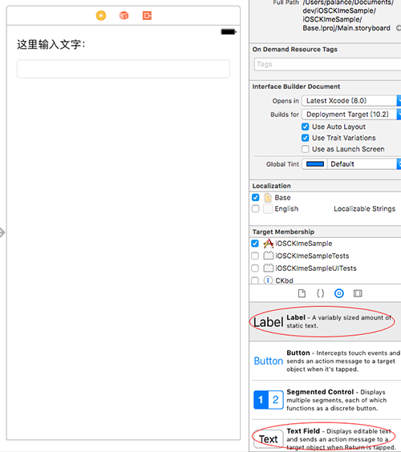

iOS下自定义键盘的创建方法在[《Custom Keyboard（译）》](http://palanceli.com/2017/03/07/2017/0307CustomKeyboard/#使用Xcode自定义键盘模板)中有详细描述，它生成的键盘只是一个白板。这里我们继续把它完善成为一个输入法的样子。<!-- more -->
项目的名称为`iOSCKImeSample`，这也是容器app的名字。键盘的Target name为`CKbd`。

# Step1 在容器app中添加可输入对象
如图，在容器app中添加两个控件，以便验证键盘：
