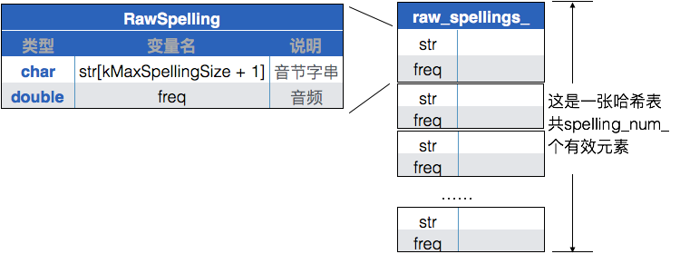
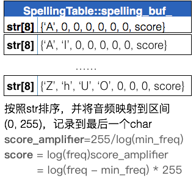
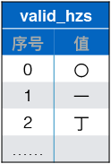
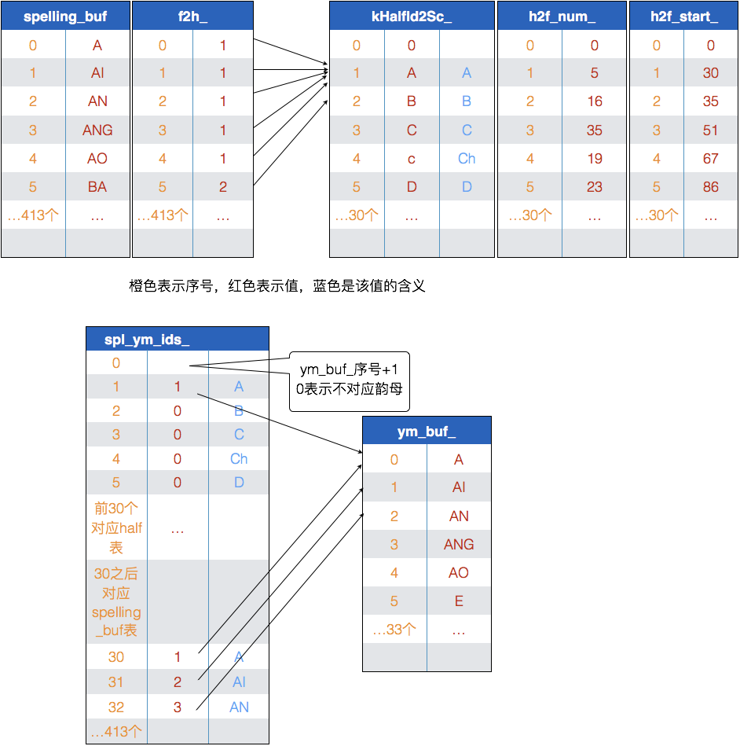
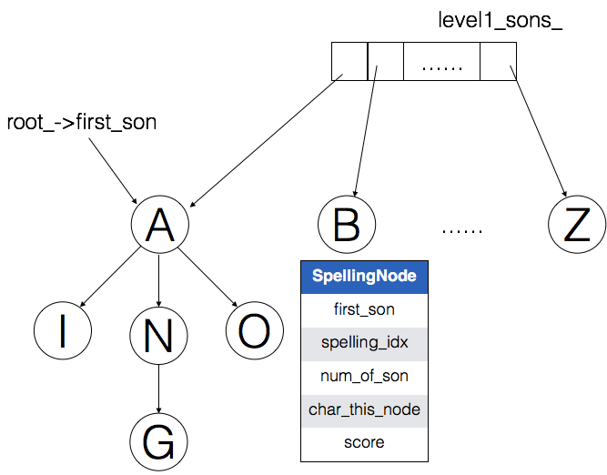

Fork了一份[libGooglePinyin](https://github.com/palanceli/libgooglepinyin)，并在此基础上稍作修改，以便能跑起来。开源的代码，方便讨论，并以此为切入点研究输入法引擎当中，解决具体问题的方法。libGooglePinyin的本尊在[这里](https://code.google.com/archive/p/libgooglepinyin/)，在Github上还有很多拷贝。<!-- more -->
本文讨论libGooglePinyin构建词库的过程，以及词库格式。由于对代码做了一些改动，我就以自己的代码树为标准来讨论。

词库的构建代码在tools/pinyinime_dictbuilder.cpp，生成可执行文件dictbuilder.exe，调用格式为：
`dictbuilder.exe <rawdict_utf16_65105_freq.txt的路径> <valid_utf16.txt的路径> <系统词库dict_pinyin.dat的生成路径>`

main函数的代码很简单：
``` c++
// tools/pinyinime_dictbuilder.cpp
int main(int argc, char* argv[]) {
  DictTrie* dict_trie = new DictTrie();
  ...
  success = dict_trie->build_dict("../data/rawdict_utf16_65105_freq.txt",
                                     "../data/valid_utf16.txt");
  ...
  success = dict_trie->save_dict("dict_pinyin.dat");
  ...
  return 0;
}
```
文件`rawdict_utf16_65105_freq.txt`是词库的文本形式；
文件`valid_utf16.txt`存放所有合法的汉字。

# Step1 DictTrie::build_dict(...)
``` c++
bool DictTrie::build_dict(const char* fn_raw, const char* fn_validhzs) {
  DictBuilder* dict_builder = new DictBuilder();

  free_resource(true);
 
  return dict_builder->build_dict(fn_raw, fn_validhzs, this); // 🏁
}
```
# Step2 DictBuilder::build_dict(...)
``` c++
// src/dictbuilder.cpp
bool DictBuilder::build_dict(const char *fn_raw,
                             const char *fn_validhzs,
                             DictTrie *dict_trie) {
  ...
  // 🏁Step3 读出原始数据，形成两个数据结构：
  // 1. lemma_arr_数组，它的每个元素存放词、词频、拼音串
  // 2. raw_spellings_哈希表，它的每个元素存放一个音节、音频（所有包含该音的词频总和）
  lemma_num_ = read_raw_dict(fn_raw, fn_validhzs, 240000);
  ...
```
数据结构`lemma_arr_`是从`rawdict_utf16_65105_freq.txt`读出系统词库并组织成的数组，每个元素是一个LemmaEntry结构体：
在解析拼音串的同时，它用哈希表`raw_spellings_`构建了一张拼音表，具体过程在Step4中分析。其有效元素即合法的音节字串个数413，这张哈希表的空间远比这个数字大，不过这个细节并不重要：


``` c++
  // Arrange the spelling table, and build a spelling tree
  // The size of an spelling. '\0' is included. If the spelling table is
  // initialized to calculate the spelling scores, the last char in the
  // spelling string will be score, and it is also included in spl_item_size.
  size_t spl_item_size;
  size_t spl_num;
  const char* spl_buf;
  // 🏁 Step5 将合法音节按顺序保存到spl_table_->spelling_buf_中，
  // 返回值spl_buf指向该成员
  spl_buf = spl_table_->arrange(&spl_item_size, &spl_num);
  ...
```
该函数将spl_table_->raw_spellings_中的音节串按照顺序，排列到spelling_buf_中。其中每个元素包含：音节拼音串 和 音节音频，前者占7个字节，以'\0'结尾；后者占1个字节。共413个元素。如下图：

`spl_table_->arrange`返回的spl_buf即spl_table_->spelling_buf_，继续被传入`spl_trie.construct`中：
``` c++
  SpellingTrie &spl_trie = SpellingTrie::get_instance();
  // 🏁 Step6 把所有合法音节组织成一个Trie树
  if (!spl_trie.construct(spl_buf, spl_item_size, spl_num,
                          spl_table_->get_score_amplifier(),
                          spl_table_->get_average_score())) {...}
  ...
  // 填充lemma_arr_数组每个元素的spl_idx_arr项，它表示每个汉字对应的音
  // 在spl_ym_ids_中的偏移
  for (size_t i = 0; i < lemma_num_; i++) {
    for (size_t hz_pos = 0; hz_pos < (size_t)lemma_arr_[i].hz_str_len;
         hz_pos++) {
      uint16 spl_idxs[2];
      uint16 spl_start_pos[3];
      bool is_pre = true;
      int spl_idx_num =
        spl_parser_->splstr_to_idxs(lemma_arr_[i].pinyin_str[hz_pos],
                                    strlen(lemma_arr_[i].pinyin_str[hz_pos]),
                                    spl_idxs, spl_start_pos, 2, is_pre);
      assert(1 == spl_idx_num);

      if (spl_trie.is_half_id(spl_idxs[0])) {
        uint16 num = spl_trie.half_to_full(spl_idxs[0], spl_idxs);
        assert(0 != num);
      }
      lemma_arr_[i].spl_idx_arr[hz_pos] = spl_idxs[0];
    }
  }
```

``` c++
  // 按照汉字串排序，并给每个唯一的汉字串赋予唯一id，即idx_by_hz字段
  sort_lemmas_by_hz();
  // 构建单字表到scis_，并根据该单字表更新lemma_arr_中的hanzi_scis_ids字段
  scis_num_ = build_scis();

  // Construct the dict list
  dict_trie->dict_list_ = new DictList();
  // 将单字序列化到scis_hz_，每个元素一个单字；
  // 将该单字对应的splid序列化到scis_splid_，每个元素一个SpellingId；
  // 将所有的词序列化到buf_，每个元素都是变长的词串
  bool dl_success = dict_trie->dict_list_->init_list(scis_, scis_num_,
                                                     lemma_arr_, lemma_num_);
  assert(dl_success);

  // 🏁Step9 构建NGram信息
  NGram& ngram = NGram::get_instance();
  ngram.build_unigram(lemma_arr_, lemma_num_,
                      lemma_arr_[lemma_num_ - 1].idx_by_hz + 1);

  // sort the lemma items according to the spelling idx string
  myqsort(lemma_arr_, lemma_num_, sizeof(LemmaEntry), compare_py);

  get_top_lemmas();

#ifdef ___DO_STATISTICS___
  stat_init();
#endif

  lma_nds_used_num_le0_ = 1;  // The root node
  bool dt_success = construct_subset(static_cast<void*>(lma_nodes_le0_),
                                     lemma_arr_, 0, lemma_num_, 0);
  if (!dt_success) {
    free_resource();
    return false;
  }

#ifdef ___DO_STATISTICS___
  stat_print();
#endif

  // Move the node data and homo data to the DictTrie
  dict_trie->root_ = new LmaNodeLE0[lma_nds_used_num_le0_];
  dict_trie->nodes_ge1_ = new LmaNodeGE1[lma_nds_used_num_ge1_];
  size_t lma_idx_num = homo_idx_num_eq1_ + homo_idx_num_gt1_ + top_lmas_num_;
  dict_trie->lma_idx_buf_ = new unsigned char[lma_idx_num * kLemmaIdSize];
  assert(NULL != dict_trie->root_);
  assert(NULL != dict_trie->lma_idx_buf_);
  dict_trie->lma_node_num_le0_ = lma_nds_used_num_le0_;
  dict_trie->lma_node_num_ge1_ = lma_nds_used_num_ge1_;
  dict_trie->lma_idx_buf_len_ = lma_idx_num * kLemmaIdSize;
  dict_trie->top_lmas_num_ = top_lmas_num_;

  memcpy(dict_trie->root_, lma_nodes_le0_,
         sizeof(LmaNodeLE0) * lma_nds_used_num_le0_);
  memcpy(dict_trie->nodes_ge1_, lma_nodes_ge1_,
         sizeof(LmaNodeGE1) * lma_nds_used_num_ge1_);

  for (size_t pos = 0; pos < homo_idx_num_eq1_ + homo_idx_num_gt1_; pos++) {
    id_to_charbuf(dict_trie->lma_idx_buf_ + pos * kLemmaIdSize,
                  homo_idx_buf_[pos]);
  }

  for (size_t pos = homo_idx_num_eq1_ + homo_idx_num_gt1_;
       pos < lma_idx_num; pos++) {
    LemmaIdType idx =
        top_lmas_[pos - homo_idx_num_eq1_ - homo_idx_num_gt1_].idx_by_hz;
    id_to_charbuf(dict_trie->lma_idx_buf_ + pos * kLemmaIdSize, idx);
  }

  if (kPrintDebug0) {
    printf("homo_idx_num_eq1_: %zd\n", homo_idx_num_eq1_);
    printf("homo_idx_num_gt1_: %zd\n", homo_idx_num_gt1_);
    printf("top_lmas_num_: %zd\n", top_lmas_num_);
  }

  free_resource();

  if (kPrintDebug0) {
    printf("Building dict succeds\n");
  }
  return dt_success;
}
```
# Step3 DictBuilder::read_raw_dict(...)
``` c++
// src/dictbuilder.cpp
size_t DictBuilder::read_raw_dict(const char* fn_raw,
                                  const char *fn_validhzs,
                                  size_t max_item) {
  ...

  Utf16Reader utf16_reader;
  // 打开文件，同时根据第二个参数申请buffer，以备盛放读出的数据
  if (!utf16_reader.open(fn_raw, kReadBufLen * 10))
    ...
  char16 read_buf[kReadBufLen];

  // Read the number of lemmas in the file
  size_t lemma_num = 240000;
  ...
  // Read the valid Hanzi list. 
  char16 *valid_hzs = NULL;
  size_t valid_hzs_num = 0;
  // 读出合法汉字表
  valid_hzs = read_valid_hanzis(fn_validhzs, &valid_hzs_num);

  // Begin reading the lemma entries
  for (size_t i = 0; i < max_item; i++) {
    // read next entry 每次读出一行
    if (!utf16_reader.readline(read_buf, kReadBufLen)) {...}

    size_t token_size;
    char16 *token;
    char16 *to_tokenize = read_buf;
    // 解析该行，并将每一列数据存放到lemma_arr_数组对应的字段

    // Get the Hanzi string 第一列：词
    token = utf16_strtok(to_tokenize, &token_size, &to_tokenize);
    ...
    size_t lemma_size = utf16_strlen(token);
    ...
    // Copy to the lemma entry
    utf16_strcpy(lemma_arr_[i].hanzi_str, token);

    lemma_arr_[i].hz_str_len = token_size;

    // Get the freq string 第二列：词频
    token = utf16_strtok(to_tokenize, &token_size, &to_tokenize);
    ...
    lemma_arr_[i].freq = utf16_atof(token);
    ...
    // 第三列：是否属于GBK，这一列值是不对的，很多GBK字串也被标0了。代码愿意是：
    // 如果没有合法汉字表，非GBK的行被抛弃；如果有合法汉字表，不在此表中的行被抛弃。
    // 由此来扔掉原是预料中的非法汉字，错误处理的细节，不必深究。
    ...
    token = utf16_strtok(to_tokenize, &token_size, &to_tokenize);
    ...

    // Get spelling String 第四列：拼音串
    bool spelling_not_support = false;
    for (size_t hz_pos = 0; hz_pos < (size_t)lemma_arr_[i].hz_str_len;
         hz_pos++) {
      // Get a Pinyin
      token = utf16_strtok(to_tokenize, &token_size, &to_tokenize);
      ...
      utf16_strcpy_tochar(lemma_arr_[i].pinyin_str[hz_pos], token);
      // 转成大写，双声母转成Zh、Ch、Sh
      format_spelling_str(lemma_arr_[i].pinyin_str[hz_pos]);

      // Put the pinyin to the spelling table 🏁Step4 将音节存入拼音表
      if (!spl_table_->put_spelling(lemma_arr_[i].pinyin_str[hz_pos],
                                    lemma_arr_[i].freq)) {
        spelling_not_support = true;
        break;
      }
    }
    ...
  }
  ...
  return lemma_num;
}
```
合法汉字表是一个char16的数组，它将valid_utf16.txt中的汉字按编码顺序排列：

# Step4 SpellingTable::put_spelling(...)
``` c++
// src/spellingtable.cpp
// 将spelling_str添加到哈希表raw_spellings_中
bool SpellingTable::put_spelling(const char* spelling_str, double freq) {
  ...
  total_freq_ += freq;
  // 根据拼音串找到hash位置
  size_t hash_pos = get_hash_pos(spelling_str);
  ...
  // 如果已经有该拼音串，则词频累加成为音频
  if (strncmp(raw_spellings_[hash_pos].str, spelling_str,
              spelling_size_ - 1) == 0) {
    raw_spellings_[hash_pos].freq += freq;
    return true;
  }

  size_t hash_pos_ori = hash_pos;
  // 如果hash表里没有保存过该拼音串
  while (true) {
    ...
    // 此hash位置的拼音串必为空
    if ('\0' == raw_spellings_[hash_pos].str[0]) {
      // 复制拼音串，追加词频
      raw_spellings_[hash_pos].freq += freq;
      strncpy(raw_spellings_[hash_pos].str, spelling_str, spelling_size_ - 1);
      raw_spellings_[hash_pos].str[spelling_size_ - 1] = '\0';
      spelling_num_++;
      return true;
    }

    hash_pos = hash_pos_next(hash_pos);
    if (hash_pos_ori == hash_pos)
      return false;
  }

  // never reach here
  return false;
}
```

# Step5 SpellingTable::arrange(...)

``` c++
// src/spellingtable.cpp
const char* SpellingTable::arrange(size_t *item_size, size_t *spl_num) {
  ...
  // 四个参数分别为快排基址、元素个数、每个元素尺寸和比较函数
  // 执行快排后，将结果有序排到raw_spellings_上，
  // 每个元素为一个RawSpelling，包含一个音节和对应的音频
  qsort(raw_spellings_, spelling_max_num_, sizeof(RawSpelling),
        compare_raw_spl_eb);

  // 将所有音节顺序拷贝到spelling_buf_，共412个
  for (size_t pos = 0; pos < spelling_num_; pos++) {
    strncpy(spelling_buf_ + pos * spelling_size_, raw_spellings_[pos].str,
            spelling_size_);
  }

  if (need_score_) {
    ...
    double max_score = 0;
    double min_score = 0;

    // 每个元素的音频=原始音频/总音频，max_score和min_score分别为最大、最小音频
    for (size_t pos = 0; pos < spelling_num_; pos++) {
      raw_spellings_[pos].freq /= total_freq_;
      if (need_score_) {
        if (0 == pos) {
          max_score = raw_spellings_[0].freq;
          min_score = max_score;
        } else {
          if (raw_spellings_[pos].freq > max_score)
            max_score = raw_spellings_[pos].freq;
          if (raw_spellings_[pos].freq < min_score)
            min_score = raw_spellings_[pos].freq;
        }
      }
    }
    ...
    max_score = log(max_score);
    min_score = log(min_score);
    ...
    score_amplifier_ = 1.0 * 255 / min_score;

    double average_score = 0;
    // 将音频统一到(0, 255)之间的数字，并保存在spelling_buf_数组中，
    // 该数组每个元素为8字节，前7字节为以'\0'结尾的音节，最后一个字节为音频
    for (size_t pos = 0; pos < spelling_num_; pos++) {
      double score = log(raw_spellings_[pos].freq) * score_amplifier_;
      assert(score >= 0);

      average_score += score;
      ...
      char *this_spl_buf = spelling_buf_ + pos * spelling_size_;
      this_spl_buf[spelling_size_ - 1] =
          static_cast<char>((unsigned char)score);

      if (kPrintDebug0) {
        printf("---pos:%zd, %s, psb:%d\n", pos, this_spl_buf,
               (unsigned char)this_spl_buf[spelling_size_ -1]);
      }
    }
    average_score /= spelling_num_;
    assert(average_score <= 255);
    average_score_ = static_cast<uint8>(average_score);
    ...
  }

  *item_size = spelling_size_;
  *spl_num = spelling_num_;
  frozen_ = true;
  return spelling_buf_;
}
```
# Step6 SpellingTrie::construct(...)
``` c++
// src/spellingtrie.cpp
bool SpellingTrie::construct(const char* spelling_arr, size_t item_size,
                             size_t item_num, float score_amplifier,
                             unsigned char average_score) {
  ...
  memset(h2f_start_, 0, sizeof(uint16) * kFullSplIdStart);
  memset(h2f_num_, 0, sizeof(uint16) * kFullSplIdStart);

  if (spelling_arr != spelling_buf_) { // 将spelling_arr拷贝至spelling_buf_
    ...
    memcpy(spelling_buf_, spelling_arr, sizeof(char) * item_size * item_num);
  }

  spelling_size_ = item_size;
  spelling_num_ = item_num;

  score_amplifier_ = score_amplifier;
  average_score_ = average_score;

  ...
  splstr_queried_ = new char[spelling_size_];
  ...
  splstr16_queried_ = new char16[spelling_size_];
  ...
  // 在Step5中排过序的，再次按照{拼音, 音频}的值排序是不是多余？
  qsort(spelling_buf_, spelling_num_, spelling_size_, compare_spl);

#ifdef ___BUILD_MODEL___
  node_num_ = 1;
#endif

  root_ = new SpellingNode();
  memset(root_, 0, sizeof(SpellingNode));

  dumb_node_ = new SpellingNode();
  memset(dumb_node_, 0, sizeof(SpellingNode));
  dumb_node_->score = average_score_;

  splitter_node_ = new SpellingNode();
  memset(splitter_node_, 0, sizeof(SpellingNode));
  splitter_node_->score = average_score_;

  // 包含26个SpellingNode元素的数组
  memset(level1_sons_, 0, sizeof(SpellingNode*) * kValidSplCharNum);
  // 🏁Step7 组织Trie树
  root_->first_son = construct_spellings_subset(0, spelling_num_, 0, root_);

  // Root's score should be cleared.
  root_->score = 0;
  ...
  h2f_start_[0] = h2f_num_[0] = 0;

  if (!build_f2h()) // 构建f2h表
    return false;

#ifdef ___BUILD_MODEL___
  if (kPrintDebug0) {
    printf("---SpellingTrie Nodes: %zd\n", node_num_);
  }
  return build_ym_info(); // 构建
#else
  return true;
#endif
}
```
在词库的构建过程中，有几个表结构：f2h_，kHalfId2Sc_，h2f_num_，h2f_start_和之前生成的spelling_buf，他们之间的关系如下：
spelling_buf中保存的是原始的音节和音频，这些完整的音节称为full；
kHalfId2Sc_中将这些音节的首字母编码成一个单字符，`Zh`、`Ch`、`Sh`编为小写的`z`、`c`、`s`，这些单字符称为half；
h2f_num_则记录每个half打头有多少个合法音节；h2f_start_则记录首个音节的偏移；
f2h则表示在spelling_buf中，每个full音节对应的kHalfId2Sc_的序号；
ym_buf是韵母表；
spl_ym_ids_表示每个音节对应的韵母。
# Step7 SpellingTrie::construct_spellings_subset(...)
传入实参分别为：
`item_start`：0，`item_end`：413，`level`：0，`parent`：root_
该函数的作用是创建Trie树。
``` c++
// src/spellingtrie.cpp
SpellingNode* SpellingTrie::construct_spellings_subset(
    size_t item_start, size_t item_end, size_t level, SpellingNode* parent) {
  ...
  SpellingNode *first_son = NULL;
  uint16 num_of_son = 0;
  unsigned char min_son_score = 255;

  const char *spelling_last_start = spelling_buf_ + spelling_size_ * item_start;
  char char_for_node = spelling_last_start[level];
  ...
  // 计算该层共有多少个节点，例如level1层的节点数就是所有413个合法音节中首字母出现的个数，23个
  for (size_t i = item_start + 1; i < item_end; i++) {
    const char *spelling_current = spelling_buf_ + spelling_size_ * i;
    char char_current = spelling_current[level];
    if (char_current != char_for_node) {
      num_of_son++;
      char_for_node = char_current;
    }
  }
  num_of_son++;

  // Allocate memory
#ifdef ___BUILD_MODEL___
  node_num_ += num_of_son;
#endif
  first_son = new SpellingNode[num_of_son]; // 为该层节点分配空间
  memset(first_son, 0, sizeof(SpellingNode)*num_of_son);

  // Now begin construct tree
  size_t son_pos = 0;
  // 该层首音节 和 首字母，例如首层首音节是A，首字母也是A。
  // 首音节其后的音节是AI、AN、ANG、AO、BA
  spelling_last_start = spelling_buf_ + spelling_size_ * item_start;
  char_for_node = spelling_last_start[level];

  bool spelling_endable = true;
  if (spelling_last_start[level + 1] != '\0')
    spelling_endable = false;

  size_t item_start_next = item_start;

  // 遍历该层所有音节，从第二个开始
  for (size_t i = item_start + 1; i < item_end; i++) { 
    const char *spelling_current = spelling_buf_ + spelling_size_ * i;
    char char_current = spelling_current[level];
    ...
    // 如果当前音节和前一个音节在该层字母不同，例如首层遍历A、AI、AN、ANG、AO、BA，
    // 当走到BA时，应当为A打头的音节创建Trie树枝
    if (char_current != char_for_node) {
      // 指向该层节点，如首层遍历时指向代表A的节点
      SpellingNode *node_current = first_son + son_pos;
      node_current->char_this_node = char_for_node;

      // For quick search in the first level
      if (0 == level)
        level1_sons_[char_for_node - 'A'] = node_current;

      if (spelling_endable) {
        node_current->spelling_idx = kFullSplIdStart + item_start_next;
      }
      // 如果有多个节点，如首层遍历时A打头的除了A还有AI、AN、ANG、AO，5个
      if (spelling_last_start[level + 1] != '\0' || i - item_start_next > 1) {
        size_t real_start = item_start_next;
        if (spelling_last_start[level + 1] == '\0')
          real_start++;
        // 为其子节点再创建Trie分支
        node_current->first_son =
            construct_spellings_subset(real_start, i, level + 1,
                                       node_current);
        // 取所有子节点和本节点score最小值作为本节点的score
        if (real_start == item_start_next + 1) {
          uint16 score_this = static_cast<unsigned char>(
              spelling_last_start[spelling_size_ - 1]);
          if (score_this < node_current->score)
            node_current->score = score_this;
        }
      } else {
        node_current->first_son = NULL;
        node_current->score = static_cast<unsigned char>(
            spelling_last_start[spelling_size_ - 1]);
      }

      if (node_current->score < min_son_score)
        min_son_score = node_current->score;
      ...
      // for next sibling
      spelling_last_start = spelling_current;
      char_for_node = char_current;
      item_start_next = i;
      spelling_endable = true;
      if (spelling_current[level + 1] != '\0')
        spelling_endable = false;

      son_pos++;
    }
  }
...
  parent->num_of_son = num_of_son;
  parent->score = min_son_score;
  return first_son;
}
```
生成的Trie树结构如下：
这是其逻辑结构，物理结构上指向子节点的指针并没有保存在父节点，而是用一个数组顺序保存子节点。例如：AI、AN、AO三个元素保存在数组中，A的first_son指针指向该数组。

# Step8 SpellingParser::splstr_to_idxs(...)
``` c++
// src/splparser.cpp
uint16 SpellingParser::splstr_to_idxs(const char *splstr, uint16 str_len,
                                      uint16 spl_idx[], uint16 start_pos[],
                                      uint16 max_size, bool &last_is_pre) {
  ...
  last_is_pre = false;

  const SpellingNode *node_this = spl_trie_->root_;

  uint16 str_pos = 0;
  uint16 idx_num = 0;
  if (NULL != start_pos)
    start_pos[0] = 0;
  bool last_is_splitter = false;

  while (str_pos < str_len) {
    char char_this = splstr[str_pos];
    // all characters outside of [a, z] are considered as splitters
    if (!SpellingTrie::is_valid_spl_char(char_this)) {
      // test if the current node is endable
      uint16 id_this = node_this->spelling_idx;
      if (spl_trie_->if_valid_id_update(&id_this)) {
        spl_idx[idx_num] = id_this;

        idx_num++;
        str_pos++;
        if (NULL != start_pos)
          start_pos[idx_num] = str_pos;
        if (idx_num >= max_size)
          return idx_num;

        node_this = spl_trie_->root_;
        last_is_splitter = true;
        continue;
      } else {
        if (last_is_splitter) {
          str_pos++;
          if (NULL != start_pos)
            start_pos[idx_num] = str_pos;
          continue;
        } else {
          return idx_num;
        }
      }
    }

    last_is_splitter = false;

    SpellingNode *found_son = NULL;

    if (0 == str_pos) {
      if (char_this >= 'a')
        found_son = spl_trie_->level1_sons_[char_this - 'a'];
      else
        found_son = spl_trie_->level1_sons_[char_this - 'A'];
    } else {
      SpellingNode *first_son = node_this->first_son;
      // Because for Zh/Ch/Sh nodes, they are the last in the buffer and
      // frequently used, so we scan from the end.
      for (int i = 0; i < node_this->num_of_son; i++) {
        SpellingNode *this_son = first_son + i;
        if (SpellingTrie::is_same_spl_char(
            this_son->char_this_node, char_this)) {
          found_son = this_son;
          break;
        }
      }
    }

    // found, just move the current node pointer to the the son
    if (NULL != found_son) {
      node_this = found_son;
    } else {
      // not found, test if it is endable
      uint16 id_this = node_this->spelling_idx;
      if (spl_trie_->if_valid_id_update(&id_this)) {
        // endable, remember the index
        spl_idx[idx_num] = id_this;

        idx_num++;
        if (NULL != start_pos)
          start_pos[idx_num] = str_pos;
        if (idx_num >= max_size)
          return idx_num;
        node_this = spl_trie_->root_;
        continue;
      } else {
        return idx_num;
      }
    }

    str_pos++;
  }

  uint16 id_this = node_this->spelling_idx;
  if (spl_trie_->if_valid_id_update(&id_this)) {
    // endable, remember the index
    spl_idx[idx_num] = id_this;

    idx_num++;
    if (NULL != start_pos)
      start_pos[idx_num] = str_pos;
  }

  last_is_pre = !last_is_splitter;

  return idx_num;
}
```
# Step9 NGram::build_unigram(...)
``` c++
bool NGram::build_unigram(LemmaEntry *lemma_arr, size_t lemma_num,
                          LemmaIdType next_idx_unused) {
  ...
  double total_freq = 0;
  double *freqs = new double[next_idx_unused];
  ...
  freqs[0] = ADD_COUNT;
  total_freq += freqs[0];
  LemmaIdType idx_now = 0;
  for (size_t pos = 0; pos < lemma_num; pos++) {
    if (lemma_arr[pos].idx_by_hz == idx_now)
      continue;
    idx_now++;

    assert(lemma_arr[pos].idx_by_hz == idx_now);

    freqs[idx_now] = lemma_arr[pos].freq;
    if (freqs[idx_now] <= 0)
      freqs[idx_now] = 0.3;

    total_freq += freqs[idx_now];
  }

  double max_freq = 0;
  idx_num_ = idx_now + 1;
  assert(idx_now + 1 == next_idx_unused);

  for (size_t pos = 0; pos < idx_num_; pos++) {
    freqs[pos] = freqs[pos] / total_freq;
    assert(freqs[pos] > 0);
    if (freqs[pos] > max_freq)
      max_freq = freqs[pos];
  }

  // calculate the code book
  if (NULL == freq_codes_df_)
    freq_codes_df_ = new double[kCodeBookSize];
  assert(freq_codes_df_);
  memset(freq_codes_df_, 0, sizeof(double) * kCodeBookSize);

  if (NULL == freq_codes_)
    freq_codes_ = new LmaScoreType[kCodeBookSize];
  assert(freq_codes_);
  memset(freq_codes_, 0, sizeof(LmaScoreType) * kCodeBookSize);

  size_t freq_pos = 0;
  for (size_t code_pos = 0; code_pos < kCodeBookSize; code_pos++) {
    bool found = true;

    while (found) {
      found = false;
      double cand = freqs[freq_pos];
      for (size_t i = 0; i < code_pos; i++)
        if (freq_codes_df_[i] == cand) {
          found = true;
          break;
        }
      if (found)
        freq_pos++;
    }

    freq_codes_df_[code_pos] = freqs[freq_pos];
    freq_pos++;
  }

  myqsort(freq_codes_df_, kCodeBookSize, sizeof(double), comp_double);

  if (NULL == lma_freq_idx_)
    lma_freq_idx_ = new CODEBOOK_TYPE[idx_num_];
  assert(lma_freq_idx_);

  iterate_codes(freqs, idx_num_, freq_codes_df_, lma_freq_idx_);

  delete [] freqs;

  if (kPrintDebug0) {
    printf("\n------Language Model Unigram Codebook------\n");
  }

  for (size_t code_pos = 0; code_pos < kCodeBookSize; code_pos++) {
    double log_score = log(freq_codes_df_[code_pos]);
    float final_score = convert_psb_to_score(freq_codes_df_[code_pos]);
    if (kPrintDebug0) {
      printf("code:%zd, probability:%.9f, log score:%.3f, final score: %.3f\n",
             code_pos, freq_codes_df_[code_pos], log_score, final_score);
    }
    freq_codes_[code_pos] = static_cast<LmaScoreType>(final_score);
  }

  initialized_ = true;
  return true;
}
#endif

}  // namespace ime_pinyin
```