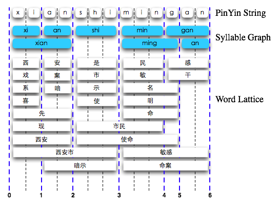

转自[sunpinyin - CodeTourOfIME.wiki](https://code.google.com/archive/p/sunpinyin/wikis/CodeTourOfIME.wiki)
<!-- more -->
# 输入法的概念模型
让我们来看看ime部分的概念模型（concept model）：

Static SLM，Lexicon：我们在前面介绍slm部分的代码时已经了解过了。访问统计语言模型和拼音词表的代码，分别位于ime/src/slm和ime/src/lexicon目录中。这里就不多介绍了。

View：由Window-Handler接收用户的输入，通过回调（call-back），将pre-edit string和candidates返回给Window-Handler来进行显示。用户的按键输入，可能会对当前的拼音串儿进行添加、删除、插入等操作，然后将拼音串儿传递给Syllable Segmentor进行音节切分。在用户提交（commit）候选句（或词）之后，它要更新History Cache来记录用户最近的输入。如果用户通过数字键对候选进行了选择，它要通知Lattice Builder对用户选择进行相应的处理（给用户选择的词一个很高的评分。并不是将用户选择之外的词及由它们转移得到的状态从Lattice上删除，因为用户后面的编辑可能会取消该选择，保留这些信息可以节省重构建Lattice的工作量）。

Syllable Segmentor：使用Lexicon，对拼音串进行切分。因为切分可能存在歧义，例如mingan可以切分为ming’an或min’gan，故而生成一个Syllable Graph，将其传递给Lattice Builder。（不过，目前的实现尚不支持模糊音节切分，用户需要通过输入’键来明确指定音节边界，所以Graph目前只是一个List。就下面的示例来说，得到的切分结果为xian’shi’min’gan。）



Lattice Builder：对每个有效的音节，从Lexcion及History Cache中查到对应的词（通常有很多个），将它们放到Lattice上。Lattice的宽度会影响搜索的速度。在这里会进行了一定的剪枝（pruning）：优先将History Cache中的词放到Lattice上；再将Lexicon中出现频率较高的词，也放到Lattice上。上图中，蓝色加粗显示的竖线，就是Lattice的一列（或称为frame）。如果我们从左向右对Lattice的列进行编号，L0是句子开始，L1上的词有（西，戏，系，喜），L2上的词有（安，案，暗，先，现，西安），L3上的词有（是，市，示，使，西安市，暗示）… 我们也可以将每个拼音字母作为Lattice的一个frame，这样并不会增加许多内存上的开销，而且对将来的插入删除操作更为方便。

Context Searcher：对得到的Word Lattice进行搜索。我们设置beam width（缺省为32），来限制每个Lattice frame上状态节点的数目。某些得分比较低的状态，可能就被剪枝掉了（例如下图中带红叉的节点）。如我们在第六回所讲的，这是一个动态规划问题，其搜索的复杂度为O(B*C*N)，其中B为beam width，C为Lattice每一帧上词的平均个数，N是Lattice的长度。因为两处都进行了剪枝，得到结果的可能并不是最优解。

另外要注意，在下图中（目前的实现），每个音节下面的状态节点，是属于前一个音节的。这种结构是不适用于Syllable Graph的。我们需要一个单独的、共有的起始帧，这样就不需要T2这一列了。如颜色较浅的第二行所示。


History Cache：记录用户最近提交的句子。这里使用的是一个类Bigram的模型。在计算P(z|xy)时，用Psmooth(z|xy)和Pcache(z|y)来插值得到。而Pcache(z|y)，是P(z|y)的MLE (Maximum Likelihood Estimation)，和P(z)的MLE的插值。

注：在实现中，计算Pcache的公式稍有不同。到时我们再具体说明。
# 数据结构及核心算法
原先SunPinyin是使用CBone/CSkeleton来组织search lattice的，参见sunpinyin代码导读（九）。每一个Bone对应一个syllable（或者严格的说，是一个segment），而CSkeleton是CBone的双向链表（std::list）。这个结构不太适合对模糊切分的支持。因此在SunPinyin2中，lattice不再以syllable为单位了，而是以单个的拼音字符为单位。

我们定义了一个CLattice的类，表示整个的search lattice，其对应于原来的CSkeleton。将每个column称为一个CLatticeFrame，对应于原来的CBone/CBoneInnerData。而TLexiconState和TLatticeState和以前的差别不大，只是把位置信息从iterator换成了index。另外为了支持用户词典，在TLexiconState加入了一些相应的字段，例如m_words，m_syls。

CIMIContext类的主要入口是buildLattice (segments, rebuildFrom, doSearch)。rebuildFrom这个参数值其实就是IPySegmentor::updatedFrom() + 1，因为在lattice上，拼音字符串是从index 1开始的，而在切分器中是从0开始的。buildLattice遍历segments（由IPySegmentor::getSegments所返回的），跳过rebuildFrom之前的那些segments，然后调用_forwardXXX方法，build每个目标frame上的lexiconStates。直到segments的结束或者超过一定长度，调用_forwardTail处理结尾。然后，在doSearch为true的情况下，调用searchFrom进行搜索。

CIMIContext类中的_forwardXXX方法，和原来的forwardXXX方法大同小异。_forwardSingleSyllable中对用户词典做了一些额外的处理。因为我们现在的用户词典是基于sqlite实现的，不是一棵trie树，所以和基于trie树的系统词典处理起来有所不同。例如，用户词典中有“测试拼音”这个词，当用户输入到ceshipin的时候，从数据库中得到的词的列表是空的，且对系统词典（CPinyinTrie）的transfer也会返回一个空节点。但这种情况下，我们不能drop掉ceshipin这个音节序列，还是要把它加入到目标latticeFrame的lexiconStates中。

CIMIContext::searchFrom也和前作基本相同，都是通过frame上的lexiconStates，调用_transferBetween方法来构建latticeStates，同时调用语言模型进行句子的评分。最后调用_backTraceBestPath，把最佳路径标识出来。稍有不同的是，searchFrom对fuzzyForwarding进行了一些处理，收窄了易混淆音节的搜索范围，并降低了其初始的评分。

其他的方法，例如_transferBetween, getBestSentence, getCandidates都和之前的实现大体相同。cancelSelection和makeSelection得到了简化。memorize方法加入了将<=6个字符的短句（其中含有用户选择的），作为用户词条保存的功能。

另外CIMIContext有两个助手类，CGetFullPunctOp和CGetFullSymbolOp，用来处理标点符号和字符的全角转换。这两个类也是可配置的，并且CIMIContext的所有实例都share同一份拷贝。因此，也属于shared & global的配置选项。

新版本的CIMIContext，在将拼音切分剥离之后，其职责更加明确和清晰；采用新的数据结构之后，逻辑也更简单和直观。代码行数也由原来的1.5k下降到0.6k；同时可配置性也得到了提升。
# History Cache
这一回我们来考察History Cache：

``` c++
class CBigramHistory{ 
  typedef unsigned TWordId; 
  typedef std::pair TBigram; 
  typedef TWordId TUnigram; 
  typedef std::map TBigramPool; 
  typedef std::map TUnigramPool; 
  typedef std::deque TContextMemory;

  TContextMemory          m_memory;   // 双向队列，context_memory_size是其空间的上限，缺省为8K
  TUnigramPool            m_unifreq;  // 每个Unigram出现在History Cache中的次数
  TBigramPool             m_bifreq;  // 每个Bigram出现在History Cache中的次数
}; 
```

**CBigramHistory::incUniFreq(ug):**  
&emsp;将TUnigram ug的出现次数加1。

**CBigramHistory::decUniFreq(ug):**  
&emsp;如果m_unifreq map中存在这个unigram，且出现的次数大于1，则减1；如果出现次数已经为0，则将其从m_unifreq中删除，以避免m_unifreq这个map占用的空间过大。

**CBigramHistory::uniFreq(ug):**
&emsp;如果ug不是stopword（在CBigramHistory::initClass()时初始化，且要和slm词典的id相一致），且存在于m_unifreq中，则返回这个key对应的value。否则返回0。

**CBigramHistory::incBiFreq(bg):**
&emsp;将TBigram bg的出现次数加1。

**CBigramHistory::decBiFreq(bg):**
&emsp;如果m_bifreq map中存在这个bigram，且出现的次数大于1，则减1；如果出现次数已经为0，则将其从m_bifreq中删除，以避免m_bifreq这个map占用的空间过大。

**CBigramHistory::biFreq(bg):**
&emsp;如果bg不是，且存在于m_unifreq中，则返回这个key对应的value。否则返回0。

**CBigramHistory::memorize(its_wid, ite_wid):**
&emsp;将词的序列[its_wid, ite_wid)记录下来。首先我们要在当前的历史记录中，插入一个分割符（DCWID，相当于</s>），以和前一个流分隔开来；如果此时m_memory已经达到上限，则需将m_memory头部的一个词弹出，并且要减少相应unigram和bigram的出现次数。接下来，遍历[its_wid, ite_wid)，假定当前的词为Wi（i从0开始），将Wi加入到m_memory中，将Wi出现的次数加1，并将bigram （W-1为DCWID）出现的次数加1；期间，如果m_memory达到了上限，和上面的操作一样，将头部的记录弹出。

当视图类调用doCommit()时，会调用这个方法将用户提交的候选句子记录下来。

**CBigramHistory::bufferize(buf_ptr, sz):**
&emsp;将m_memory持久化到buf_ptr指向的缓冲区中，同时注意大端和小端的问题。而m_unifreq和m_bifreq并不保存。

**CBigramHistory::loadFromBuffer(buf_ptr, sz)：**
&emsp;加载已持久化的History Cache，并统计unigram和bigram的出现次数。

**CBigramHistory::seenBefore(wid):**
&emsp;如果wid不是分割符，且非stopword，同时存在于m_unifreq中，则返回true。

**CBigramHistory::pr(bigram):**
&emsp;求P(bigram.second|bigram.first)的概率值。以Bigram 举例来说，uf0是C(x), bf为C(x, y)，而uf1是C(y)。求解概率的计算公式为:

&emsp;这个公式是Pml(y|x)、Pml(y)的插值，0.5是为了平滑Pml(y|x)，而(actual_size + unused_size/10)是为了防止刚开始的时候history cache的size过小。最后这个概率值再和Pslm(y|h)进行插值，参见ime/src/imi_context.cpp#902。

**CBigramHistory::pr(its_wid, ite_wid):**
&emsp;y = *(ite_wid-1)，x = *(ite_wid-2)，求P(y|x)。

**CBigramHistory::pr(its_wid, ite_wid, wid):**
&emsp;y = wid, x = *(ite_wid-1)，求P(y|x)。

# 用户词典
原先的SunPinyin没有用户词典，只是通过User History Cache纪录了用户近期输入的bi-gram信息。如果一个bi-gram，其概率比系统词典的某个uni-gram要低，这个bi-gram的组合就不会出现在用户的候选列表中。例如，虽然用户频繁的输入钥匙，但是它依然很难出现在候选列表中，因为“要是”这个unigram的概率要更高。如果“钥匙”出现在候选中，一定是第一候选，因为它是作为一个最佳候选句子来呈现给用户的。如果用户选择了“要是”，那么“钥匙”又不知道要过多久才能出现了。这个缺陷也是广受大家诟病的地方。其实，SunPinyin原先的架构是支持将用户自定义词放到lattice上进行搜索的。

我们在SunPinyin2中，通过sqlite3来实现用户词典，目前我们的用户词典支持记录<=6个的字符。

**CUserDict::_createTable/_createIndexes:**
&emsp;这两个私有方法尝试创建一个table和index。这个表的结构是，首先词的ID（从1开始的）和长度，接下来是6个声母，然后是6个韵母，再其次是6个声调。然后我们为长度＋6个声母建立了一个索引。sqlite的query对搜索条件和index有一些限制，要求条件的次序和index的次序相同，并且一旦某个条件是非相等性的（例如>），则该条件及其之后的条件都无法用index来加速。另外，每个from子句只能使用一个index。因为我们经常会有不完整拼音的查询，或者换句话说用户经常会输入不完整拼音，所以table和index就被设计成了这个样子。

**CUserDict::addWord (syllables, word):**
&emsp;使用了sqlite中的prepared statement来进行插入。最后，在插入成功的情况下，调用sqlite3_last_insert_rowid得到上一次插入记录的row id，加上一个offset并返回。如果失败，就返回0。

**CUserDict::removeWord (wid):**
&emsp;这个相对简单，按照wid将记录从数据库中删除。

**CUserDict::getWords (syllables, result):**
&emsp;这个方法将syllables在数据库中对应的记录，放到result中。我们返回的词id类型，和系统词典的保持一致，都是CPinyinTrie::TWordIdInfo。这里再解释一下，用户词典的最大容量为什么是6万多个。这个就是由于CPinyinTrie::TWordIdInfo的m_id的长度决定的，是2^18-1。我们按照sqlite的限制，小心翼翼地组织好查询的where子句，查询，然后迭代结果，填充results，最后返回。

**CUserDict::operator .md (wid):**
&emsp;这个方法也相对简单，就是返回wid对应的字符串。因为sqlite只支持utf8和utf16，而且utf16还要使用一套不同的接口，所以我们还是使用utf8作为数据库内的字符串编码。而sunpinyin-ime要求的是ucs-4编码的字符串，所以还要进行一个编码转换。同时把(wid, wstr)这个pair加入到m_dict中。wstr是动态分配的，由m_dict在析构时释放。这里还利用了这样一个事实，std::basic_string是COW的。我们在m_dict中保存的其实是wstr的拷贝，不过这个拷贝和wstr共享同一个C string的buffer。
# 用户配置
SunPinyin2在设计和实现的过程中，希望能同时支持简体、繁体的词典及语言模型，支持不同的拼音方案，支持不同的输入风格（包括微软拼音和类似sogou或google拼音）。不同的输入风格，对应了不同的view的实现。（虽然目前SunPinyin2还没有重新实现微软拼音的输入风格——CIMIModernView。）

这些选项组合起来数目繁多，不过它们都是正交的，正好可以让我们使用policy based的实现方式。

我们定义了一个CSunpinyinProfile的模板类，它继承了ISunpinyinProfile这个公共接口类（否则我无法声明一个保存其指针的container），和它的三个模板参数，LanguagePolicy，PinyinSchemePolicy，InputStylePolicy。它的createProfile方法，调用policy类中的相关方法，来创建具体的一个view实例。为了避免创建policy的实例，并且更重要的是要共享policy的公共数据，policy类都是单件（singleton）。

LanguagePolicy负责初始化词典、用户词典和语言模型，以及根据这些资源创建CIMIContext类的实例。CSimplifiedChinesePolicy是一个具体的实现。另外还有一些方法，可以让你设置CIMIContext类实例的缺省属性。例如，enableFullPunct和enableFullSymbol，setPunctMapping方法设置s_getFullPunctOp（被所有由该policy类创建的CIMIContext实例所共享）的标点符号影射。我们之前总结为shared & global的用户配置项。可以设想，用户在设置对话框自行定义标点符号的映射关系后，程序员只需要调用CSimplifiedChinesePolicy::setPunctMapping。这个配置项的更改会应用到所有现有的输入上下文（或会话），对输入上下文来说是透明的。

PinyinSchemePolicy负责创建拼音切分器的实例。CQuanpinSchemePolicy和CShuangpinSchemePolicy是两个具体的实现。以CQuanpinSchemePolicy类为例，createPySegmentor方法创建了CQuanpinSegmentor的一个实例并返回。和CSimplifiedChinesePolicy类似，CQuanpinSchemePolicy也有一些shared & global的配置项，例如是否支持易混淆音和自动纠错。

InputStylePolicy负责创建CIMIView的实例。CClassicStylePolicy是一个具体的实现。它只是简单的创建一个CIMIClassicView的实例并返回。CSunPinyinProfile<…>::createProfile方法虽然也是返回一个view的实例，不过这个view是已经设置停当、可以工作的view。

CSunpinyinSessionFactory是一个singleton的工厂类，其createSession方法根据factory中policy的设定，调用某个CSunpinyinProfile实例的createProfile方法，创建一个具体的view。要添加新的语言支持或拼音方案，不仅要完成自己的那部分coding，还要记得编写相应的policy classes，并将支持的所有组合注册到CSunpinyinSessionFactory中（没办法，在这个地方就只能穷举了）。

因为我们最后expose给外部的是一个view的实例，所以如果用户的配置涉及到对policy的切换（我们之前总结为non-shared but global的配置项），以前创建的输入上下文（即view），就面临一个抉择。要么保持不变，继续使用其目前的输入风格；要么要重新创建，discard掉以前上下文的状态信息（例如preedit/candidates）。通常，我们对某个平台的移植，都是创建一个包含view的会话类，这个会话类适配该平台的接口，并将输入事件filter给view。那么我们的这些会话类是如何知道发生了non-shared but global选项的改变呢？

CSunpinyinSessionFactory类提供了一个简单的方法，updateToken/getToken。当平台相关的会话类调用CSunpinyinSessionFactory类创建一个view的实例，同时应该调用getToken得到一个token（口令）。当会话类得到焦点的时候，它可以调用getToken再次得到一个token，比较与自己持有的这个token是否一致。如果不一致，就表明发生了non-shared but global选项的更改。与此相对应地，如果用户对non-shared but global的选项发生了修改，程序员应该要调用updateToken去更新factory当前的token。

这个方式有些丑陋，稍微改观一点的方法可能是，我们再加入一个抽象层次，例如CSunpinyinSession，然后它用signal/slot的方式connect到factory的reset_session信号。另一个问题，配置项还是比较分散，如果要编写一个集中的CSunpinyinOption类的话，就会有很多duplicated的代码。我对上面这些问题，还没有想得很清楚，也非常欢迎大家多提宝贵意见！:)
# 杂项
**TDoubleAnatomy and TLongExpFloat:**TDoubleAnatomy是一个union，用来把一个双精度的浮点数，分解为符号位、指数和尾数。这个方法适用于所有符合IEEE-754浮点数的平台。下面是双精度浮点数的二进制布局：

这个浮点数对应的有理数为：
V = sign * 2^{exp} * (1.fract)

注意：其中指数使用的是移码，对双精度浮点数来说，指数是11位，因此实际的指数要减去2(11-1)-1，即0×3FF。TDoubleAnatomy::clearExp()方法将浮点数的指数部分清除（即设置为0×3FF），然后再调用TDoubleAnatomy::getValue()得到的双精度浮点数，就是sign (1.fraction)，这也就是TLongExpFloat::m_base的值。且在Sunpinyin中，所有的概率值都不会出现负值。

直接使用double进行概率值的连续相乘运算，容易溢出。而TLongExpFloat表示的范围要大了很多，相当于将64位（1+11+52）的浮点数扩展到96位（32+64）。因此能缓解溢出的状况。TLongExpFloat重载了部分算术操作符，让我们可以像对一个primitive数据类型那样进行比较和乘除的操作（但不支持加减）。

你可能会问另外一个问题，为什么不用对数将乘法操作转换为加法呢？这是因为插值的原因，回忆一下插值的公式。如果使用对数，必须将对数形式的结果转换回来，才能执行加法。

**处理计算bow时由于浮点数累加所造成的误差**
在计算bow时（参见CalcNodeBow()），可能因为浮点数的连续相加造成的误差，而导致sumnext或sum出现大于1的情况，此时使用下面的公式计算bow：


原来要考察的是sumnext和sum离1.0距离的比值，现在因为误差的原因，两者都有可能稍稍超过1.0，因此将比较的基准点向右移动一些（即γ = Max(sumnext, sum)+δ，且δ是一个较小的值，0.0001）。