转自[sunpinyin - CodeTourOfSLMTraining.wiki](https://code.google.com/archive/p/sunpinyin/wikis/CodeTourOfSLMTraining.wiki)
<!-- more -->
# 综述
首先check out输入法项目的代码：
`$ git clone git://github.com/sunpinyin/sunpinyin.git`
sunpinyin的代码包括三个部分：
* src/slm 是统计语言模型的代码（slm: statistical language model），用来构建一个支持back-off（回退）的n-gram（n元语法）静态统计语言模型
* src/ime-core 是和输入法相关的接口（ime: input method engine）
* wrapper 是各个输入法平台的前端。

**执行下面的步骤来编译各个工具：**
``` bash
$ scons
$ scons install
# 因为语料库和词表都使用UTF-8的编码，因此在进行后续步骤之前，
# 需要将当前的语言环境设置为任意一个UTF-8的locale。
$ export LC_ALL=zh_CN.UTF-8 
$ mkdir /path/to/temp/dir && cd /path/to/temp/dir # 建立并进入临时目录。
# 在临时目录建立语料库文件和词典文件的链接。
$ ln -s /path/to/corpus corpus.utf8; ln -s /path/to/dict dict.utf8 
# 将语言模型训练所使用的 Makefile 复制到临时目录。
$ cp /usr/share/doc/sunpinyin/SLM-train.mk Makefile 
# 这一步 bootstrap 一个 trigram 语言模型（详细解释见下一部分）
$ make bootstrap3 
```
## 训练和构建语言模型的步骤
1. 首先使用 mmseg（最大正向分词），根据词表对语料库进行分词，并将词的 ID 序列输出到临时文件中。
2. 然后使用 ids2ngram，对所有 3 元组出现的次数进行统计，并输出到临时文件中。例如下面的句子：ABCEBCA。得到的3元列包括：(&lt;S&gt; A B), (A B C), (B C E) ... ( B C A), (C A '。'), (A '。' &lt;/S&gt;)。&lt;S&gt;和&lt;/S&gt;分别表示句首和句尾。
3. 使用 slmbuild 来构造一个 back-off 的 trigram 语言模型，但是未经裁剪。
4. 使用 slmprune 对刚输出的 trigram 语言模型进行剪裁，使用的算法是基于熵的剪裁算法。
5. 使用 slmthread 对剪裁后的语言模型进行线索化，加快 back-off（回退）查找的速度。将最终的结果输出到 lm_sc.t3g。
6. $ make slm_trigram3：这个和上面的类似，不同的是使用 slmseg 进行分词，它借助刚刚生成的基于最大正向分词得到的语言模型，对语料库进行重新分词，这样可以进一步提高语言模型的精确程度。
7. $ make lexicon3： 根据生成语言模型中的 unigram 数据，对词表进行处理，得到一个支持不完全拼音的词库文件。

# 词典与分词
在SunPinyin中，第一遍分词使用的正向最大匹配方法（FMM，forward maximum matching）。辞典加载之后，保存在trie树的数据结构中，其key是以USC-4编码（32位）的字符。其中某些节点是有效的词，例如在下图中最左侧的一条路径中，“中国”是一个有效的词。而有些节点，则是不成词的。例如“中华人民共和国”这个路径中的，“共”节点，就不成为一个有效的词。（和参考3中的数据结构相似）

需要注意的是，root的所有子节点都是有效词，因为所有的“字”都被被视为“单字词”。

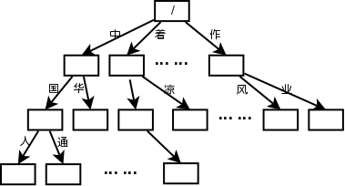

[sim_dict.h](http://github.com/sunpinyin/sunpinyin/blob/master/src/slm/sim_dict.h)
1. [parseText ()](http://github.com/sunpinyin/sunpinyin/blob/master/src/slm/sim_dict.cpp#L81) : 加载text格式的辞典，并以trie树的形式保存在内存中。
2. [matchLongest ()](http://github.com/sunpinyin/sunpinyin/blob/master/src/slm/sim_dict.cpp#L65): 进行最长匹配，并返回匹配的长度。
3. [step ()](http://github.com/sunpinyin/sunpinyin/blob/master/src/slm/sim_dict.cpp#L55): 从当前节点转移到匹配给定key的一个孩子节点，并返回。

[mmseg/mmseg.cpp:](http://github.com/sunpinyin/sunpinyin/blob/master/src/slm/mmseg/mmseg.cpp)
在[processSingleFile()](http://github.com/sunpinyin/sunpinyin/blob/master/src/slm/mmseg/mmseg.cpp#L201)中，逐句读取语料库，例如，"为人民办实事的精神"，然后进行调用[SIMDict::matchLongest()](http://github.com/sunpinyin/sunpinyin/blob/master/src/slm/sim_dict.cpp#L65)进行最长匹配。

因为辞典中有“为人民”这个词条，因此分割到的第一个词是“为人民”，其长度为3，然后调用[getAmbiLen()](http://github.com/sunpinyin/sunpinyin/blob/master/src/slm/mmseg/mmseg.cpp#L187)，来分析是否有交集歧义,并返回最大交集歧义的长度。下面是每次迭代的情况：
1. 人民, 办实事的精神 -> i=1, len=2, word_len=3, 对“人民办实事”进行最长匹配，分割到的词为“人民”，其长度为2，
2. 民办, 实事的精神 -> i=2, len=2, word_len=4, 对“民办实事”进行最长匹配，分割到的词为“民办”，其长度为2，因为i与len的合超过了最初传入的word_len，则设置word_len为4，继续迭代。可以看出，此时歧义已经检测到了。
3. 办实事, 的精神 -> i=3, len=3, word_len=6
4. 实事, 的精神 -> i=4, len=2, word_len=6
5. 事, 的精神 -> i=5, len=1, word_len=6, 最后歧义的长度为6

退出循环，返回得到的长度，即6。

如果指定了ambiguous-id，则会将这6个字符作为一个AMBI-ID（由参数-a指定），输出到分词的结果中。然后跳过这6个字符，继续进行分词。当句子结束时，如果使用二进制格式输出，则会输出一个句子结束的ID（由参数-s指定）。最后得到的结果是:

``` bash
$ echo "为人民办实事的精神" | ./mmseg -d ../raw/dict.utf8 -f text -s 10 -a 9 <ambi>为人民办实事</ambi> 的 精神
```

那么，我们最终得到的分词结果中，所有的交集歧义都作为作为一个词AMBI-ID，相当于我们忽略了这部分信息（这个比例并不低）。这样在我们后面的统计中，绝大部分的3元组都可以保证是有意义和有价值的。进而训练得到的统计语言模型，能够排除交集歧义的影响。然后，可以这个模型，使用slmseg，重新对语料库进行分词，并计算新的语言模型。这一次，原来忽略的带有歧义的信息，我们也加以利用了。

``` bash
$ echo "为人民办实事的精神" | ./slmseg -d ../raw/dict.utf8 -f text -s 10 -m ../data/lm_sc.t3g 为人民 办实事 的 精神
```

参考：

[数学之美 系列二 — 谈谈中文分词](http://googlechinablog.com/2006/04/blog-post_10.html)
[中文搜索引擎技术揭密：中文分词](http://www.stlchina.org/twiki/bin/view.pl/Main/SESegment)
[“天堂的阶梯”设计的中文分词算法](http://xiecc.itpub.net/post/1476/52479)

# 统计三元组
分词并ID化之后，是统计每个三元组出现的次数：
``` bash
$ make m3_idngram ./ids2ngram -n 3 -s ../swap/swap -o ../swap/lm_sc.id3gram -p 5000000 ../swap/lm_sc.ids
```
[ids2ngram.cpp：](http://github.com/sunpinyin/sunpinyin/blob/master/src/slm/ids2ngram/ids2ngram.cpp)

* [ProcessingRead()：](http://github.com/sunpinyin/sunpinyin/blob/master/src/slm/ids2ngram/ids2ngram.cpp#L72)
读取上一步生成的ID文件。首先读取N-1个ID（也就是2个词），保存到ngram对象中的ids成员数组中。然后读取一个词，保存为ids数组的第三个（也就是ids[N-1]）元素。使用std::map的operator []，以ids[0..2]为key，取出该三元组对应的出现次数（如果是第一次出现，[]操作符会将这个<key,0>对儿加入到map中），并加1。将ids数组向左移动一个单位，继续迭代上述过程。
在迭代过程中，还会判断是否map的大小超过了预先设置的段的最大值（paraMax）。这是为了防止map在内存占用了过多的空间。如果超过了，则将map写入到交换文件中，记录下该段在交换文件的偏移，然后将map清空，继续统计。值得提醒的是，在使用iterator迭代std::map时是有序的，因为其内部是一个平衡的有序二叉树（通常为红黑树，即rb-tree）。后面会对这些段进行一个归并排序。

* [ProcessingIdngramMerge()：](http://github.com/sunpinyin/sunpinyin/blob/master/src/slm/ids2ngram/idngram_merge.h#L79)
归并排序。对多个已经有序的数据段（或队列）进行归并排序，就是找出最小（或）最大的队头元素并输出，然后将该元素所在队列的队头后移一个单元，重复上面的过程，直至所有队列为空。如果归并的路数比较多时，对队头元素的排序就成为一个重要的步骤。在SunPinyin中，有一个模板类类处理文件的多路归并，即[slm/sim_fmerge.h](http://github.com/sunpinyin/sunpinyin/blob/master/src/slm/sim_fmerge.h)；它使用了heap（堆）算法，对队头元素进行排序。[getBest()](http://github.com/sunpinyin/sunpinyin/blob/master/src/slm/sim_fmerge.h#L143)从heap中得到具有最小队头元素的分段，[next()](http://github.com/sunpinyin/sunpinyin/blob/master/src/slm/sim_fmerge.h#L148)将该队列的后续元素重新插入到heap中。

最后，我们得到了一个没有进行任何平滑的原始trigram，所有出现的三元组以及其出现的次数。

# 构造back-off的n-gram语言模型
接下来是构建一个支持back-off的n-gram模型：
``` bash
$ make m3_slm ./slmbuild -n 3 -o ../swap/lm_sc.3gram -w 120000 -c 0,2,2 -d ABS,0.0005 -d ABS -d ABS,0.6 -b 10 -e 9 ../swap/lm_sc.id3gram
```
首先让我们了解一下何为n-gram。

对基于概率统计的自然语言处理来说，计算一个句子（S=W1,W2,…Wn）的概率，根据链式规则，为：
```
P(S) = P(W1).P(W2|W1).P(W3|W1,W2).P(W4|W1,W2,W3)...P(Wn|W1,W2,...Wn-1) 
    = P(W1).prod_i^n (P(Wi|W1,W2,...Wi-1))
```
为了在字符模式下表示数学公式，这里使用类Latex的公式语言。用Latex表示上面的公式，
`P(S) = P(W_1)\prod_i^nP(W_i|W_1,W_2,…W_{i-1})`
即：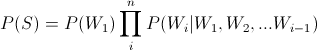
而在现实中，因为数据稀疏性的问题，是不可能按照这个式子去计算的。一种可行的方案是，假定`P(Wi|W1,W2,…Wi-1)`只依赖于前面的N个词，即`Wi-N+1,Wi-N+2,…Wi-1`。具体来说，我们有
unigram（N=0，context-free grammer，上下文无关文法），
bigram（N=1），
trigram（N=2），
以及fourgram（N=3）。
通常实际使用的多为trigram。

再了解几个常用的术语：
* types（型）：单词表（或词典）的大小
* tokens（例）：语料库的大小
* vector/solution space（解空间）：对于N-gram模型来说，V = types^N
* data sparseness（数据稀疏性）：tokens << V，也就是说语料库的大小远远小于解空间的大小。
* Maximum likelihood（最大似然估计）：Pml(Wi|Wi-2,Wi-1) = C(Wi-2,Wi-1,Wi)/C(Wi-2,Wi-1)，C表示出现的次数。这个式子的意思是，P(Wi|Wi-2,Wi-1)的最大似然估计为，(Wi-2,Wi-1,Wi)出现的次数除以(Wi-2,Wi-1)出现的次数。

许多可能的词序列，也许并没有被收集到训练语料库中。如果Pml(Wi|h)为0，那么整个句子的概率也就化为乌有了。例如，如果在语料库中只出现过"Tom read a book"，而没有出现过"Yong read xxx"的序列，那么Pml(Yong read a book) = 0。因此我们必须要对语言模型进行平滑处理（smoothing）。所谓平滑，就是将已知（已见到）事件的概率分出一小部分，匀给未知（或未见的）的事件，也就是出现次数为0的事件。

平滑的方法有许多种：
* 简单平滑：有加1（或加delta）平滑，单独使用效果很差。
* discounting（打折）平滑：例如Absolute Discounting，线性平滑，Witten-Bell方法，Good-Turing方法等等
* 复合平滑，包括back-off平滑，插值平滑等

一般的back-off模型的表示如下：
`Ps(Wi|h) = Pd(Wi|h) -- C(h,Wi) > 0 bow(h).Ps(Wi|h') -- C(h,Wi) == 0`

1. h’是h去掉其第一个词，对trigram (A,B,Wi)来说，h为(A,B)，h’为B。
2. Pd(Wi|h) < Pml(Wi|h)，对最大似然估计进行打折（discount），可使用多种不同的打折方法。
3. bow(h)被称为back-off weight（回退权重），对于给定的h，bow(h)是一个常数，并且可以通过下面的方法来确定`Ps(W1|h)+Ps(W2|h)+…+Ps(Wn|h) = sum_i (Ps(Wi|h)) = 1`

上面这个式子是递归的，如果(h’,Wi)出现次数为0，还会继续回退，也许会回退到Wi，甚至回退到平均分配（如果Wi也未出现） 如果h在训练中没有见到，则P(Wi|h) = P(Wi|h’)

Katz的back-off模型使用的是Good-Turing方法。Kneser-Ney是另一种back-off模型，其平滑效果要好于Katz方法。Stanley Chen和Joshua Goodman专门写过一篇论文，详细比较了各种平滑方法的优劣，有兴趣可以去读一读。

对于back-off平滑，请参见： Stanley F. Chen, Joshua Goodman. 《An Empirical Study of Smoothing Techniques for Language Modeling》.Proceedings of the 34th annual meeting on Association for Computational Linguistics. 1996.6, 310~318

这篇论文对back-off平滑方法进行了总结，其中包括了大部分的back-off平滑的方法。

下面来看代码。

sim_slmbuilder.[h|cpp]：

* CSlmBuilder::Create(n)：
根据n初始化level数组，level[0]为pseudo root，其意义为平均分布。level[1]为unigram，level[2]为bigram，level[3]为trigram…对trigram来说，level[3]上的节点为叶子节点。叶子节点是没有bow信息的，因为它属于C(h,Wi)>0的情况。

* CSlmBuilder::AddNGram(ngram, fr)：
调用isExcludeId()来判断ngram的第一个词是否为排除在外的词（我们在参数中指定为9，也就是上一回所说的AMBI-ID）。对数组level[1..n]的每个成员，检查其预留（reserve）的空间是否已经用尽，如果用尽，则分配更多的内存。如果第一个词不是排除在外的词，则将这个三元组出现的次数，累加到level[0][0]（也就是pseudo root）上。将ngram中的每个id加入到leveli (0n（即leaf level），只有ngram的出现次数大于指定的cut number，才会加入；这样做是为了避免叶节点的数目过于庞大（可能达到数千万个）而无法保存在内存中。
其间还要判断，如果ngrami (0i (0<=i<=n-1) 为句子分割词的ID（我们在参数中指定为10），则只统计ngram[0..i]的出现次数。举例来说，如果某个trigram为(9, x, y)，则直接就跳过了；如果是(x, 9, y)，则只统计unigram (x)；如果是(10, x, y)，则统计unigram (10)；如果是(x, 10, y)，则统计unigram(x)和bigram (x, 10)。

* CSlmBuilder::Build()：
构建back-off的n-gram语言模型。

* CSlmBuilder::CountNr()：
统计出现次数小于SLM_MAX_R（即16）的n-gram的个数。例如nr[3][0]表示trigram的总数，nr[3][10]表示出现次数为10的trigram的总数（只可能是10的倍数，例如500）。这些数据是在进行打折时需要的。

* CSlmBuilder::AppendTails()：
为每个level添加一个tail，方便后面迭代条件的判断。
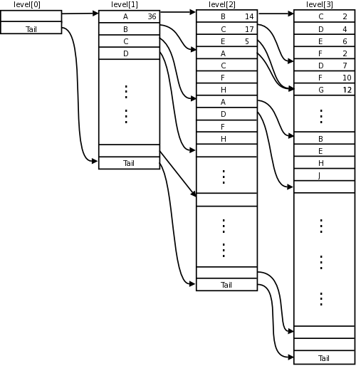

* CSlmBuilder::Cut()：
将每个level中出现次数小于指定值的n元组删除。我们指定的cut数组为（-c 0,2,2），这表示我们将忽略出现次数小于等于2的bigram和trigram，但是并不对unigram进行裁剪。

* CSlmBuilder::Discount()：
初始化每个level所使用的discounter。由高的level到低的level，调用DiscountOneLevel()来为每个level执行打折。将level[0]（pseudo root）设为平均分布，其概率为1除以词的总数（由参数-w指定，本例为120000）。

* CSlmBuilder::DiscountOneLevel(v, ch, disc …)：
参数v是上一个level，例如，如果为level[3]执行打折，那么传入的第一个参数是level[2]。要为levelm打折，遍历level[m-1]的每个节点，对每个节点的后续节点（[it->child, itnext->child)）进行打折。这里折扣掉的是出现的次数（frenquency），而非概率值。然后除以前继节点上记录的次数（root_freq），得到条件概率，并保存在原节点上。

* CSlmBuilder::CalcBOW()：
计算back-off weight，是从低的level向高的level进行的。basei指向的是leveli的第一个元素，idxi表示在每个level上的游标，(basei)[idxi]就是当前遍历的节点（这里利用了这样一个事实，那就是std::vector中分配的内存空间是连续的，可以通过指针偏移或数组下标来直接访问）。
我们以计算level[2]上的BOW为例。此时lvl为2，迭代base[2]的每个词。首先用一个for循环，找到这个词的前继，例如idx[2]指向上图的level[2][1]（C），则其前继为level[1][0]（A），将它们放到words数组中，words[4]={0, A, C, .}。然后调用CalcNodeBow()来计算这个节点的BOW值，这个函数的最后两个参数，表示该节点的后续节点范围，[ch+node.child, ch+nodenext.child)。

* CalcNodeBow(...)：
遍历[chh, cht)，将每个节点的概率值累加起来，放到sumnext变量中；同时调用builder->getPr(lvl, words+2)得到一个概率值，累加到sum变量中。words+2实际的作用是，去掉h最前面的那个词。沿用上面的例子，在第一次迭代时，words[4]={0, A, C, D}，那么words+2为{C, D}，getPr()得到的概率值为Ps(D|C)（注意，getPr()本身是一个递归函数，且当lvl为0时，返回level[0]的平均分布概率）。BOW值为(1.0-sumnext)/(1.0-sum)。
我们前面介绍过，BOW的值是通过公式sum_i (Ps(Wi|h)) = 1来求解的。通过下面的转换，你就可以看出sumnext和sum各自的含义了。
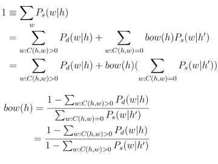

# 基于熵对back-off模型进行剪枝
这一回我们要介绍的是，如何基于熵对back-off模型进行剪枝（pruning）。
``` bash
$ make m3_prune ./slmprune ../swap/lm_sc.3gram ../swap/lm_sc.3gm R 100000 1250000 1000000
```

首先来看熵的定义，设p(x)是随即变量X的概率密度函数，则X的熵为：
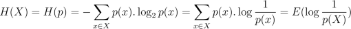
注：log均是以2为底的对数，且假定0log 0 = 0。

熵用来描述随机事件的不确定性的大小。熵值越大，不确定性就越高。等式的后半部分表明，熵实际上是log(1/p(X))的期望。假如p(X=xi)的概率为1/256，那么log(1/p(xi))=log(256)=8，也就是说要传输xi所表示的随机事件，需要用8个bit。而H(p)是对这个值的期望（加权平均），即平均信息长度。

再来看看相对熵（即Kullback-Leibler距离）：
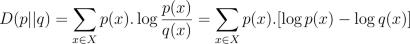
它表示的含义是，如果一个随机变量X的分布为p，我们却用概率分布q为其编码，所要多使用的比特位。

条件相对熵的计算公式为：
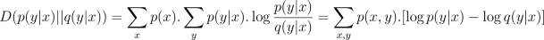
注：这个公式的证明，请参见 “Elements of Information Theory” （《信息论基础》，机械工业出版社）。

下面来看看如何应用相对熵来对back-off语言模型进行剪枝。下面的分析源自 “Entropy-based Pruning of Backoff Language Models” 一文。
回忆一下back-off模型的一般形式：
`Ps(Wi|h) = Pd(Wi|h) -- C(h,Wi) > 0 bow(h).Ps(Wi|h') -- C(h,Wi) == 0`

剪枝的目标，就是要从模型中删除某些有明确估计（explicit estimation，即C(h,Wi) > 0）的n-gram，以降低模型的参数规模，同时尽可能减少准确度的损失。（注意，在剪枝之后，剩余的那些有明确估计的n-gram，其概率并不改变。）

剪枝的步骤是：
1. 选取阈值，
2. 分别计算剪去每个n-gram所引起的相对熵的增长，
3. 将增长幅度偏低的那些n-gram从模型中删除，然后重新计算back-off weights。

假设从模型中删除(h, w)后，再计算p(w|h)时，就需要进行回退估计（back-off or implicit estimation）了。要保证概率模型的规整性，即sum_wi p(wi|h) = 1，bow(h)必须重新计算，记为bow’(h)，则p’(w|h) = bow’(h).p(w|h’)。同时，原模型中所有涉及h的回退估计都会受到影响，将这种情况记为BO(wi,h)（实际上就是C(h,wi) == 0的情况）。我们可以得到：
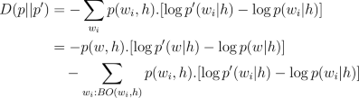
注意，h和w都是给定的、具体的。且除了(h,w)之外的，原先有明确估计的n-gram，其概率不变，因此相互抵消掉了。

最后（推导过程见上面引用的那篇论文），我们可以得到：
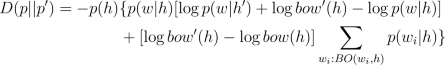
其中，p(h) = p(h1)p(h2|h1)…，并且，我们知道：
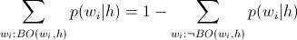
那么接下来的问题就是，如何计算bow’(h)了。
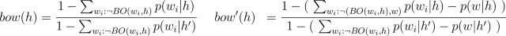
计算bow’(h)，就是将计算bow(h)公式分子分母中的求合式中，去掉已经剪枝的w。因为bow(h)是已知的，我们求得分子，也就可以得到分母，然后在分子和分母上分别加上p(w|h)和p(w|h’)。这样就可以得到bow’(h)了。

下面来看代码，

slmprune.cpp：

* CSlmPruner::Prune()：
从levelN到level[1]，调用PrunLevel(lvl)进行剪枝。完成后调用CalcBOW()重新计算level[0..N-1]上各节点的back-off weight。

* CSlmPruner::PruneLevel(lvl)：
szlvl是levellvl中节点的数量，其中包括一个尾节点（pseudo tail），减1为实际的节点数，赋值给n。cutlvl中是要剪去的n-gram的数量。分配TNodeInfon数组，赋给pbuf。迭代levellvl中的节点，用一个for循环找出该节点的前继节点，然后将这个n-gram放到hw[0..lvl]中，并将各个level上的下标保存在idx[0..lvl]中。判断这个节点是否有子节点（(pn+1)->child > pn->child），如果有子节点，则这个节点不可被剪掉。如果没有子节点，调用CalcDistance(lvl, idx, hw)计算剪掉这个节点所引起的相对熵的增量。将上述信息保存到pbuf中。继续迭代levellvl的下一个节点。

    迭代完成后，对TNodeInfo数组进行一个堆排序。然后迭代TNodeInfo数组的前cutlvl个元素，将levellvl[pinfo->idx]上节点的概率值标为1.0。然后执行CutLevel()，将标记概率有1.0的节点从levellvl中删除，并修改level[lvl-1]前继节点的child下标。将levellvl新的大小赋值给szlvl。清理分配的内存空间和成员变量，然后退出。

* CSlmPruner::CalcDistance(lvl, idx.md, hw[0..lvl])：
首先从parent节点上得到bow(h)，保存在BOW变量中。然后计算p(h)，p(h) = p(hw1).p(hw2|hw1)…p(hwlvl-1|hw1hw2…hwlvl-2)，保存在PH变量中。然后levellvl[idxlvl]节点上概率值，即为p(w|h)，保存在PHW变量中。调用getPr(lvl-1, hw+2)，得到p(w|h’)的概率指，保存在PH_W变量中。

    如果cache_level不是lvl-1（那么只可能是-1），或者cache_idx不等于idx[lvl-1]（那么只可能是-1），则将cache_level和cache_idx分别赋值，并且将cache_PA和cache_PB初始化有1.0。迭代父节点的所有子节点[parent->child, (parent+1)->child)，得到每个子节点上的概率值pr（即p(wi|h)），并从cache_PA中减去；将hwlvl赋值为当前子节点的词id，调用getPr(lvl-1, hw+2)，得到概率值p_r（即p(wi|h’)），并从cache_PB中减去。迭代结束之后，PA = sum_{w_i:BO(w_i,h)} P(w_i|h)，而PB = sum_{w_i:BO(w_i,h)} P(w_i|h’)。然后分别加上p(w|h)和p(w|h’)，相除得到bow’(h)，保存在_BOW中。

    最后套用公式，得到D(p||p’)，并返回。

* CSlmPruner::CalcBOW()，CalcNodeBow(…)：
和上一回中的CSlmBuilder::CalcBOW()和CalcNodeBow(…)基本雷同。就不再赘述了。

# 语言模型线索化
让我们来看看最后一个步骤，将剪枝后的语言模型线索化（threading）。
``` bash
$ make m3_thread ./slmthread ../swap/lm_sc.3gm ../data/lm_sc.t3g
```

线索化的目的是为了加快语言模型的查找速度。以trigram为例，如果我们要计算句子“ABCDE。”的概率`P(S) = P(A).P(B|A).P(C|AB).P(D|BC).P(E|CD).P(<EOS>|DE)`，并假定这些条件概率的求解无需回退。

首先我们从level[1]（unigram中），可以通过二分查找，找到P(A)；然后从A的孩子节点中，二分找到B，得到P(B|A)；然后从B的孩子节点二分找到C，得到P(C|AB)。再接下来呢，我们要计算的是P(D|BC)。这时，我们只有重新在unigram中二分找到B，然后再在B的孩子节点中二分找到C，才能计算P(D|BC)的值。这无疑是很低效的。如果我们在计算P(C|AB)时，能够从它的节点上，直接定位到(B,C)，就可以大大加快查找的速度。

我们用(level, idx)来标识一个节点，节点上的信息用(W, h’, p, b, c)来表示，其中：

* W：跟在history后面的词ID。这个节点所在位置，还隐含了一个信息，就是它的历史由来。
* h’：指向下一步要回退到的节点，用(level’, idx’)来表示。
* p：p(W|h)
* bow(h)
* 其下一个level中后续节点的开始位置

当然，叶子节点上是没有b和c的。现在，回退模型的结构，就从一棵树变成了一个网。它的基本操作是：在当前历史状态hi(level,idx)下，输入一个词W，则转移到一个新的历史状态hj(level’, idx’)，并返回P(W|h)。新节点hj的level’，并不总等于level-1。例如，C(ABC)>0，但是(B,C)在训练时没有见到，则这个节点的h’就是level[1]上的C节点。如果C也没有统计到，则h’就是pseudo root节点（level[0][0]）了。

让我们考察下面一个片段。
`level+1 h (level,idx) -----------> W1,p1,h'1,[b,c] h',bow \ ... ... \ Wi,pi,h'i,[b,c] \ ... ... --------> Wk,pk,h'k,[b,c]`
输入一个词W。如果W出现在h的孩子节点中，记为(level+1,idx’)，其p值就是P(W|h)。

如果该节点有子节点，那么(level+1,idx’)就是新的历史节点； 如果该节点没有子节点，则它的h’，即为新的历史节点。

如果W没有出现在h的孩子节点中，则从(level,idx)节点中的h’开始，继续进行上面相同的操作，找到新的历史节点，并将得到的概率值乘上bow(h)，作为P(W|h)返回。注意，这是一个递归的过程。

下面来看看代码：

slmthread.cpp：

* CSIMSlmWithIteration::getIdString(it, history)：
成员变量m_history中保存的是各个level中的index，将节点上的词ID保存到传入的history参数中。next()方法将m_history最后面的下标（即当前level的下标）加1，然后调用adjustIterator()，找出新节点各前继节点的下标，保存在m_history中。

* CSIMSlmWithIteration::findBackOffState(n, hw, bol, bon)：
寻找某个n-gram（长度为n，保存在hw[1..n]中）的回退节点（h’），返回它的level和idx。调用findState()去查找hw[2..n]在level[n-1]上的下标idx，如果下标>=0且该节点(n-1, idx)有子节点，则返回h’的位置。否则调用findState()查找hw[3..n]在level[n-2]上的下标，…，如果循环到hwn还是找不到，则返回pseudo root节点。

    举例来说，查找trigram (A,B,C)的回退节点。查找(B,C)是否存在，如果存在则返回(2, idx_BC)。否则，查找(C)是否存在，如果存在则返回(1, idx_C)。否则返回(0, 0)。

* CSIMSlmWithIteration::findState(n, hw)：
寻找n-gram（长度为n，保存在hw[1..n]中）在leveln上状态节点的下标。如果该n-gram没有找到，则返回-1。

在threading的过程中，还对32位浮点数进行了压缩。其中bow被压缩到14个bits，pr被压缩到16个bits。大致思想是，对在bow（或pr）中出现的所有浮点数进行统计，将距离比较近的浮点数进行“合并”，将浮点数的总数控制在1<

现在，我们就得到了最终的语言模型–lm_sc.t3g。你可以用tslminfo来查看它的信息：

``` 
$ make m3_tslminfo ./tslminfo -p -v -l ../raw/dict.utf8 ../data/lm_sc.t3g >../swap/lm_sc.t3g.arpa

$ tail ../swap/lm_sc.t3g.arpa 点击 率 也 0.036363638937 (2,839922) 点击 率 最高 0.081818044186 (2,840054) 点击 率 的 0.096969485283 (2,840080) 点击 率 达到 0.036363638937 (2,840122) 点击 量 达 0.485714286566 (2,1132198) 点击 鼠标 ， 0.400000005960 (1,1) 点击 鼠标 左 0.309090882540 (2,1186378) 
```

我们可以通过CThreadSlm类来访问或使用它，下一节将以slmseg为例，看看如何利用最终生成的语言模型来进行搜索。

# 如何使用生成的语言模型
我们上一回中，已经得到了线索化（threaded）的语言模型。那么如何来访问或使用这个模型呢？让我们看看slm.h文件，CThreadSlm类的public方法，只有下面几个：

load()：将语言模型加载到内存中 
free()：释放语言模型所占据的内存 
isUseLogPr()：是否使用log值作为概率值 
transfer(history, wid, result)：从历史状态history，给定输入wid，转移到一个新的状态result，并返回P(wid|history)的概率值。 
transferNegLog(history, wid, result)：和上面的方法一样，只不过返回的是-log(p(wid|history)。 
history_state_of(st)：求得状态st的h’，并返回。 historify(st)：将状态st设置为它的h’。 
lastWordId(st)：返回状态st的最后一个词的id。设st为(lvl, idx)，如果lvl>=N，则返回m_LevelsNidx；如果0lvlidx；如果lvl==0，且idx==0，则返回pseudo root的wid（即0），但如果idx>0，就返回idx（我们将来在介绍输入法的history cache时，会涉及到这种情况）。 让我们看看slmseg如何使用CThreadSlm类来进行基本的搜索。
``` bash
$ make slmids3 ./slmseg -d ../raw/dict.utf8 -f bin -s 10 -m ../data/lm_sc.t3g ../raw/corpus.utf8 >../swap/lm_sc.ids
```
来看slmseg/slmseg.cpp的代码：

``` c++
struct TLatticeWord 
{
    int m_left; int m_right; //[m_left, m_right)为这个词在lattice上的位置范围 
    int m_wordId; //词的ID 
};

struct TLatticeStateValue
{ 
    double m_pr; //该状态节点上的概率值。 
    TLatticeWord* mp_btword; //回溯的(back-trace)词，即由哪个词跳转到当前状态的 
    CThreadSlm::TState m_btstate; //回溯的(back-trace）状态节点，即由哪个状态跳转过来的 
};

/* 语言模型的状态节点，及其状态信息 */ 
typedef std::map TLatticeColumnStates;

/* 表示lattice上的一列 */ 
struct TLatticeColumn 
{ 
    TLatticeWordVec m_wordstarting; // 起始于该列上的词。其实就是在扩展本列状
                                    // 态节点时，将要输入的词。转移得到的新状
                                    // 态节点，位于后面的lattice[word.m_right]上。 
    TLatticeColumnStates m_states; //该列上的状态节点及其对应的状态信息 
}; 
```

* processSingleFile()：
逐句读取文件。对每个句子，调用buildLattice()构建搜索需要的lattice（栅格），然后调用searchBest()进行搜索，通过getBestPath()得到最佳的切分，最后调用output()将其输出。

* buildLattice(sentence, lattice)：
将lattice[0]上的状态，设置为pseudo root。将i初始化为0，对sntnc[i..n]进行最大正向匹配，得到词长len。然后调用getAmbiLen()得到最大交集歧义长度ambilen。如果ambilen<=len，则无交集歧义，调用insertLatticeWord()，将分词得到的词([i,i+len),Wid)，加入到latticei的词列表中；令i=i+len，继续循环。如果有歧义，则调用fullSegBuildLattice()，对sntnc的[i..i+ambilen)子句进行全切分，将所有可能的词划分（包括所有的单字词），假设其位置为[left, right)，加入到latticeleft中；然后i=i+ambilen，继续循环。遍历完整个句子之后，在最后面加入一个句子结束的标识（下面的例子中，我们用“。”来表示）。

    我们还借用第二回中的例子：
    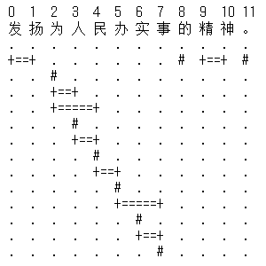
    对例句进行最大正向匹配，得到的词为“发扬”，且无歧义，则将“发扬”加入到lattice[0]上的词列表中。然后i=2，继续循环。FMM得到的词是“为人民”，但是歧义长度为6，则需要对sntnc[2..7]进行全切分。将idx由2向7移动，将idx上所有可能的词（包括单字词），加入到latticeidx中。然后i=2+6=8，继续循环。FMM得到的词为“的”，且无歧义。然后i=9，最大正向匹配得到的词为“精神”，且无歧义。循环结束，最后在末尾加上一个句子结束的ID。可以看到lattice[1]上没有词，而lattice[2]中的词有：“为”、“为人”和“为人民”。依次类推…

* searchBest(lattice)：
从0开始，遍历lattice。对latticei上的所有状态节点，用该列上的各个词([left, right), Wid)，来扩展它（调用CThreadSlm::transferNegLog()），将新状态节点的h'（CThreadSlm::historify(his)），保存在lattice[word.m_right].m_states中。注意，两个不同的状态节点，例如(A, C)和(B, C)，给定一个输入词D，可能得到相同的h’（即(C, D)），那么这两条路径中只保留概率大者就可以了。
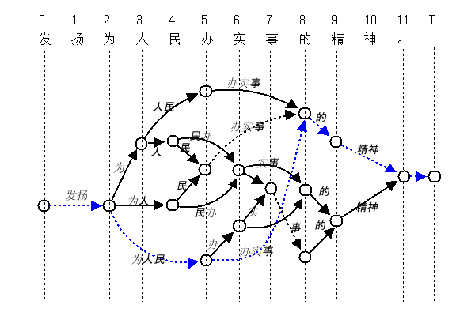首先从lattice[0]的states开始，我们在buildLattice()时，已经将它设置为pseudo root节点(0, 0)了。lattice[0]上只有一个词，“发扬”；调用CThreadSlm::transferNegLog((0,0), wid_of("发扬"))，得到新的状态节点和概率值（P("发扬")），将该节点的h’（lvl=1, idx)，及其状态信息（概率值和回溯信息），放到lattice[2]上。然后查看lattice[1]，它上面没有要扩展的状态节点。进而判断lattice[2]，有一个状态节点，并有三个词（“为”，“为人”，“为人民”），将三个新的h’状态节点，分别保存在lattice[3]，lattice[4]和lattice[5]上。依次类推…

    这是一个动态规划（dynamic programming）问题，这里使用的是Viterbi网格（Viterbi Lattice）算法。

* getBestPath(lattice, segResult)：
从后向前，回溯lattice，将回溯的词id放到segResult中。最后再将segResult翻转一下，就得到了最佳的切分。对本例来说，就是上图中的蓝色路径。