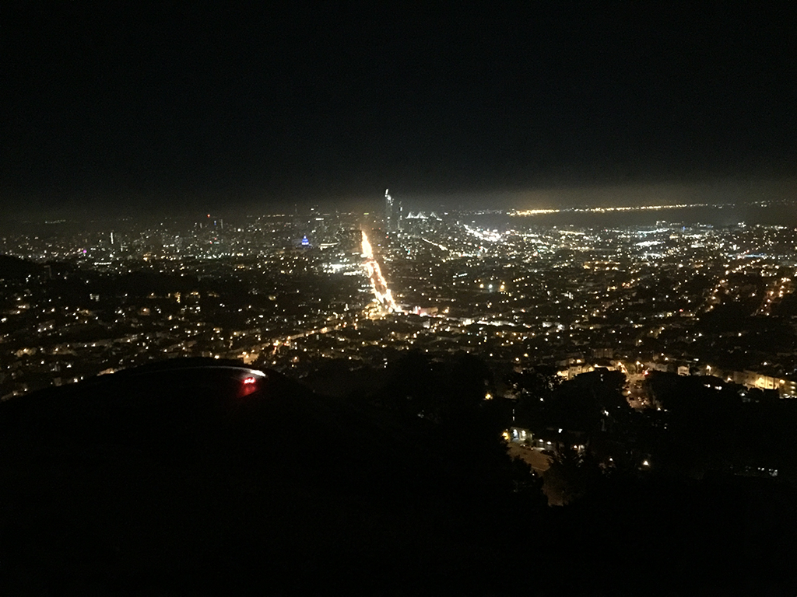

旧金山给我留下最美好的印象就是那里的阳光，每天早上醒来都是阳光明媚，但是不会觉得晒，不会感到热，非常地清新舒服。相比之下北京在七八点钟的太阳虽然也是那个亮度，但给人感觉就已经是大上午，热！丝毫没有一天之计在于晨的冲动。每当看到这张照片，似乎就闻到了那里清晨的味道。这是早上醒来在酒店拍到楼下的景象，那辆车是我们租的：

<!-- more -->
我们住在圣何塞，位于旧金山东南七八十公里。跟北京的纬度差不多，大概因为靠海的原因，这里气温明显比北京低，早晚温差大。中午在太阳地儿下跟北京差不多，穿短袖就可以了；早上却能看到老外有穿羽绒服的。

除了气候，这里能让我喜欢的不多。走在宽阔的高速路上，跟北京的好像差别不大，路两边偶尔有些公司、小工厂、仓库，然后就是荒地。不像在欧洲，两边郁郁葱葱的，随手都能拍到一幅WinXP桌面背景式的蓝天白云。这里的山好奇怪，山的北坡都很荒，远处看就是黄色的石头山，南坡才是绿的。总体给人的感觉就是粗糙，没有那种山水城市的清新。也许是因为之前听关于硅谷的各种描述，期望值太高了吧。

参加WWDC大会还是让我很兴奋的事儿，虽然我不算是苹果的死忠粉，我见过那种对苹果粉到信仰的人，真地把WWDC大会当成一种朝圣。我没有粉到这种程度，但是当来到会场，看到这么多苹果的拥趸，看到苹果员工的热情，我很容易就被这里的氛围感染了。

我们的飞机在北京时间6月2日 星期五 15:40起飞，旧金山时间6月2日 星期五 12:20到达，没有倒时差，落地就被带到一个shopping mall扫荡，我对于购物没啥瘾，那天晚上过得比较无聊。让我觉得奇妙的是时差，上飞机的时候是下午，在飞机上很快穿过了黑夜，然后是朝阳，下飞机是半下午，有种恍如隔世的感觉。

第二天6月3日星期六，本来想去NASA，结果人家周末不迎客。我们就去电脑历史博物馆逛了一下午，那天没有留下任何照片。

第三天6月四日星期日，这一天可以领取WWDC的通行证了，我们早早地过去就是前面那张照片的景象。

领完我们就直奔斯坦福大学，这是一个让我肃然起敬的地方。不知道为什么，我对这里的印象总是一块大草坪，上面有学生读书，谈恋爱，发呆…… 我没有看到这样的景象，但是这里的建筑给我一种扑面而来的学院范，真想一头扎到某个教室成为其中的一员。特别喜欢教学楼的走廊：

大多数的教学楼都是这种风格，也许是离开校园太久了，其实每天上班穿过清华的校园也都有种重新回去读书的冲动

非常意外的是斯坦福校园里面有一座华丽丽的大教堂。美国和欧洲最大的不同就是欧洲的城市里随处可见教堂，美国就少多了，也许不是少，而是地儿太大了，教堂不像在欧洲那么稠密。一路上看到像斯坦福里这么华丽的都不多

进入教堂刚好遇到学校的合唱团排练，排练的是宗教音乐，原来赞美上帝的歌曲这么美妙，坐下来就不想走了，一直听到排练结束，快两个小时了。

在去教堂之前，我们登了胡佛塔

站在塔顶可以一览斯坦福的全貌

在这能看到草坪，但是人并不多

这一张张笑脸，特别容易把我带回那个下午，那抹阳光和那一缕清风

从斯坦福出来，我们马不停蹄赶往1号码头，到地儿天已经擦黑了。这里栖息着好多海豹，它们都是野生的，据说某年某月某日突然从海里钻出几头海豹，在这里落脚就不走了，后来越来越多的海豹聚集在这里，就成了这幅景象：

晚上自然要尝一尝这里的海鲜，不过挺让我失望，虾和蟹个头倒是挺大的，也很新鲜，但是这做法好像是拿油煎的，把鲜味都煎没了，没吃几块就觉得有点腻。跟高晓松形容的美国西岸美食落差不小~

吃完大餐继续马不停蹄上山俯瞰旧金山的夜景，那条主干线就是金门大桥。旧金山白天和晚上温差特别大，我在拍这张夜景的时候快冻成冰块了，拍完赶紧躲进车里瑟瑟发抖。

这一天晚上玩得太晚，回到圣何塞还要个把小时，到酒店睡下已经是凌晨一两点钟了。早上WWDC开幕，回房间前有人问早上几点起，却没人搭腔。大家都想美美睡一觉，第二天的正事儿就再说吧 ;P