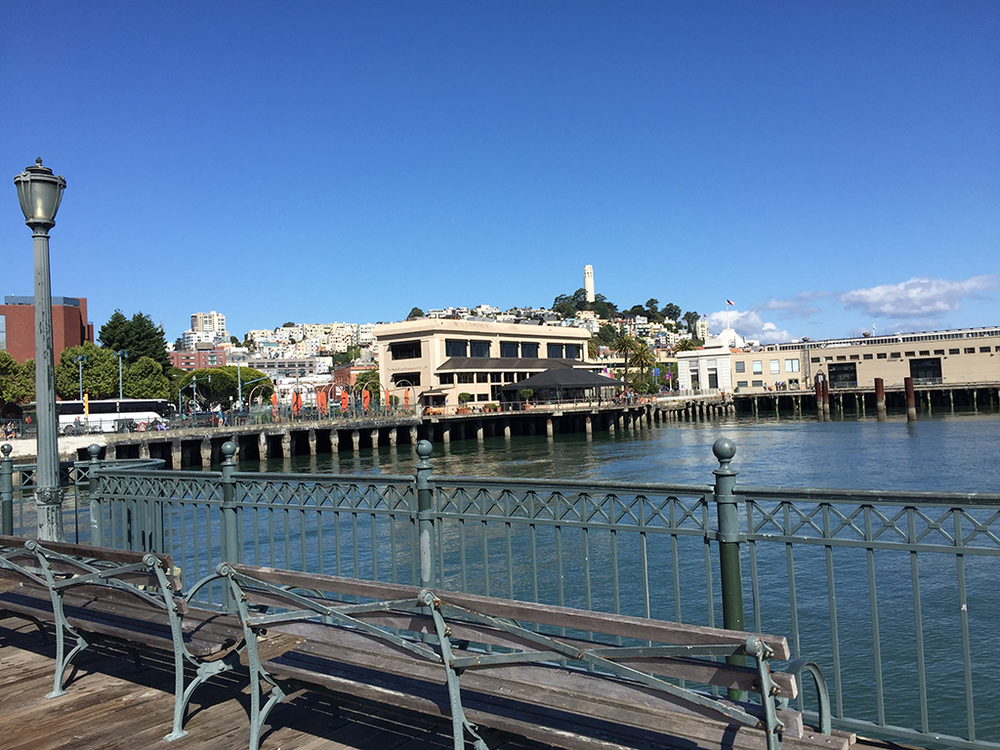

旧金山给我留下最美好的印象就是那里的阳光，每天早上醒来都是阳光明媚，但是不会觉得晒，不会感到热，非常地清新舒服。相比之下北京在七八点钟的太阳虽然也是那个亮度，但给人感觉就已经是大上午，热！丝毫没有一天之计在于晨的冲动。每当看到这张照片，似乎就闻到了那里清晨的味道。这是早上醒来在酒店拍到楼下的景象，那辆车是我们租的：

<!-- more -->
我们住在圣何塞，位于旧金山东南七八十公里。跟北京的纬度差不多，大概因为靠海的原因，这里气温明显比北京低，早晚温差大。中午在太阳地儿下跟北京差不多，穿短袖就可以了；早上却能看到老外有穿羽绒服的。

除了气候，这里能让我喜欢的不多。走在宽阔的高速路上，跟北京的好像差别不大，路两边偶尔有些公司、小工厂、仓库，然后就是荒地。不像在欧洲，两边郁郁葱葱的，随手都能拍到一幅WinXP桌面背景式的蓝天白云。这里的山好奇怪，山的北坡都很荒，远处看就是黄色的石头山，南坡才是绿的。总体给人的感觉就是粗糙，没有那种山水城市的清新。也许是因为之前听关于硅谷的各种描述，期望值太高了吧。

参加WWDC大会还是让我很兴奋的事儿，虽然我不算是苹果的死忠粉，我见过那种对苹果粉到信仰的人，真地把WWDC大会当成一种朝圣。我没有粉到这种程度，但是当来到会场，看到这么多苹果的拥趸，看到苹果员工的热情，我很容易就被这里的氛围感染了。

我们的飞机在北京时间6月2日 星期五 15:40起飞，旧金山时间6月2日 星期五 12:20到达，没有倒时差，落地就被带到一个shopping mall扫荡，我对于购物没啥瘾，那天晚上过得比较无聊。让我觉得奇妙的是时差，上飞机的时候是下午，在飞机上很快穿过了黑夜，然后是朝阳，下飞机是半下午，有种恍如隔世的感觉。

第二天6月3日星期六，本来想去NASA，结果人家周末不迎客。我们就去电脑历史博物馆逛了一下午，那天没有留下任何照片。

第三天6月四日星期日，这一天可以领取WWDC的通行证了，我们早早地过去就是前面那张照片的景象。

领完我们就直奔斯坦福大学，这是一个让我肃然起敬的地方。不知道为什么，我对这里的印象总是一块大草坪，上面有学生读书，谈恋爱，发呆…… 我没有看到这样的景象，但是这里的建筑给我一种扑面而来的学院范，真想一头扎到某个教室成为其中的一员。特别喜欢教学楼的走廊：

大多数的教学楼都是这种风格，也许是离开校园太久了，其实每天上班穿过清华的校园也都有种重新回去读书的冲动

非常意外的是斯坦福校园里面有一座华丽丽的大教堂。美国和欧洲最大的不同就是欧洲的城市里随处可见教堂，美国就少多了，也许不是少，而是地儿太大了，教堂不像在欧洲那么稠密。一路上看到像斯坦福里这么华丽的都不多

进入教堂刚好遇到学校的合唱团排练，排练的是宗教音乐，原来赞美上帝的歌曲这么美妙，坐下来就不想走了，一直听到排练结束，快两个小时了。

在去教堂之前，我们登了胡佛塔

站在塔顶可以一览斯坦福的全貌

在这能看到草坪，但是人并不多

这一张张笑脸，特别容易把我带回那个下午，那抹阳光和那一缕清风

从斯坦福出来，我们马不停蹄赶往1号码头，到地儿天已经擦黑了。这里栖息着好多海豹，它们都是野生的，据说某年某月某日突然从海里钻出几头海豹，在这里落脚就不走了，后来越来越多的海豹聚集在这里，就成了这幅景象：

晚上自然要尝一尝这里的海鲜，不过挺让我失望，虾和蟹个头倒是挺大的，也很新鲜，但是这做法好像是拿油煎的，把鲜味都煎没了，没吃几块就觉得有点腻。跟高晓松形容的美国西岸美食落差不小~

吃完大餐继续马不停蹄上山俯瞰旧金山的夜景，那条主干线就是金门大桥。旧金山白天和晚上温差特别大，我在拍这张夜景的时候快冻成冰块了，拍完赶紧躲进车里瑟瑟发抖。

这一天晚上玩得太晚，回到圣何塞还要个把小时，到酒店睡下已经是凌晨一两点钟了。早上WWDC开幕，回房间前有人问早上几点起，却没人搭腔。大家都想美美睡一觉，第二天的正事儿就再说吧 ;P

第二天早上四点多我就醒了，大概是内心里对WWDC还是挺激动的。翻来覆去睡不着，心里挣扎着要不要喊同伴呢？大家才睡两三个小时，这时候把大家喊醒了确实有点残忍；不喊呢，我确实想去早早地排队占个好位置，大家开一辆车，必须统一行动。到了五点钟，天蒙蒙亮了，我决定跑步到会场。从酒店到会场的距离是7公里，跑过去大概需要一个小时。我在微信群里喊了几声，其实我希望不要吵醒大伙——还好没人被我吵醒~ 背上行装，出发！

六点多到了会场门前，蛇形的队伍已经拐了一条街了

排队期间把前一天领到的徽章都带在身上，徽章里有一枚是国旗，戴在身上大家一眼就能分辨出你来自哪个国家

队伍缓慢移动，终于挪到了会场门口

即将进入会场之前，请旁边的朋友帮我来张具有仪式感的留影

大概七八点钟，进入大厅以后还要再排一个长长的队伍，一直要到接近十点才能入场。但在继续下一轮长队之前，苹果的员工会让大家短暂地聚集在大厅，用有节奏的鼓掌和笑容表达对远方来客的热烈欢迎，迎接英雄归来般的掌声，这个场面还是挺有感染力的：

上到二楼，继续排队，身边有各国的开发者，大家近距离接触，相互聊几句

终于进入了会场，迎来第一场keynote。如果不是为了给同伴抢座位，还能抢得更靠前一点。库克出场那一刻，全场起立，鼓掌，拍照…… 这一天从早上排队，一直到大会开始的这一刻，让人觉得所有的人都是苹果的忠实信徒，会场就是圣城，大家从全球汇集到这一个点上是在参加一场朝圣。

热闹过后开始进入务实的环节，上午的keynote完成一系列产品的发布，所有的听众都聚集在这一个会场，后面的议题按照分类分两种形式进行：第一种是Session，还是在这个主会场，每天会有三四场，更深入地讲解新产品、新技术，比如“iOS11在Cocoa Touch frameworks中做了哪些提升和改进”，“新版swift有哪些新特性”等等；第二种就是Lab，按照主题、模块划分了十几个场地，每个场地都有苹果的工程师负责一对一的交流，解决开发者提出的具体问题，由于人很多，Lab是需要提前预约排队的。既然到这里提问，通常都是一些疑难杂症、不易重现的问题，如果没有经验，事先准备不足，很难让苹果的工程师理解问题的本源，需要提前把现象、分析、论证都准备充分，有时候甚至要提供一个简单的demo，因为有些问题其实是iOS的缺陷造成的，我们需要尽可能精准地分析和定位出问题发生的点，这样苹果也才能更快地给出解决办法，或者推进内部去解决。这是我们在现场茶歇的时候准备材料：

接下来的几天就是在不断地整理材料，找苹果的人讨论。讨论前需要预演提问过程，假设苹果的工程师给出各种回答后我们应该怎么应对，因为每个lab都需要预约排队，尽量地一次性把问题问全了，得出我们想要的答复，可以节省不少排队的时间。

按照惯例，周四晚上会有一场小show，所有开发者来到一个户外的场地，有乐队有表演，有啤酒晚餐……不过，苹果这些天的食物供应真是不怎么样，天天吃草。在会场一待就是一天，苹果提供午餐，这是其中一次午餐的德行：

每天都差不多，有时候会有两块饼干，有时候是一小块面包，都是甜品。
周四晚上的show还挺好玩的，场地的影响振聋发聩，来自各地的开发者聚集在这里相互碰个杯，聊上几句。

一礼拜的会安排非常紧凑，我们在周五中午终于把所有议题都讨论完了，不过大部分问题都是我们指出并证明iOS的某个缺陷，苹果工程师们也确认问题存在了，但是短时间内无法解决，他们号称会推进解决。但是我们没有工程师的联系方式，也没有议题的跟踪路径，所以是否解决，解决到什么程度，都不得而知。这种被确认的问题如果能给提问者开放出一个issue就好了，这样提问者就能知道解决的程度，如果真的解决了，也能帮助验证，对双方都是有好处的。工作完成，接下来还有点时间，可以小小的happy一下了~~~~

先是去苹果总部Infinite Loop，

期待在苹果和Google总部的商店里能找到一些有科技感的纪念品，不过扫荡一圈失望而回，这里跟一般的苹果店没啥区别，除了苹果的产品，就是T恤，没别的新鲜玩意儿。

给我印象最深刻的是第二天我们又来到1号码头，清晨有人在码头演示载人飞行器，就在这个位置，当时被演示震惊了，都没顾上拍张照片。一个人坐在大号的四轴飞行器上，在水上飞了大概十五分钟。试验成功后他们项目负责人站在这个椅子上做了激情四溢的演讲，向人们宣布他的宏伟蓝图。接下来要解决的问题是降噪，下一次实验是有更好的安全保障后，将尝试从更高的大楼飞下来，在陆地飞行。未来人们可以驾着飞行器上下班，出行了。也许就在今后的几年将变成现实，想想还挺激动人心的。
