在我生命当中，三十岁以后能留下深刻印记的事件不多，每天貌似忙忙碌碌的，好几年时间瞬间滑过，好像就只过去几天。而这次登顶岗什卡，绝对是插在我人生旅途中的一支醒目的旗标。<!-- more -->

先来秀一下登顶证书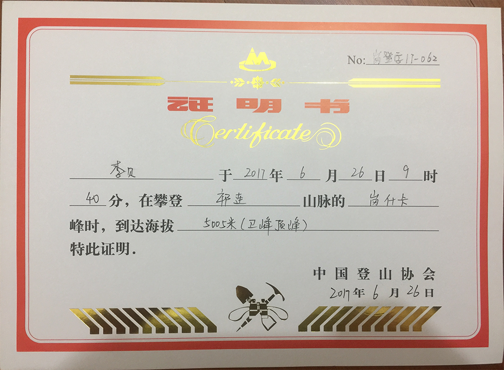

岗什卡的登山计划是由大哥发起，酝酿两个多月，终于在6月23日成行。我本来没打算参加，因为今年五六月份的差旅特别多，本想在六月底好好休息。后来经不住二哥挑逗，抱着打酱油的心态，就入伙了，直到落地西宁还是观光客一枚。一张充满仪式感的合影之后：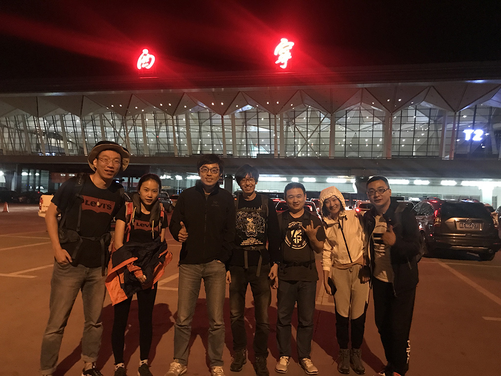就进入了胡吃海塞的节奏：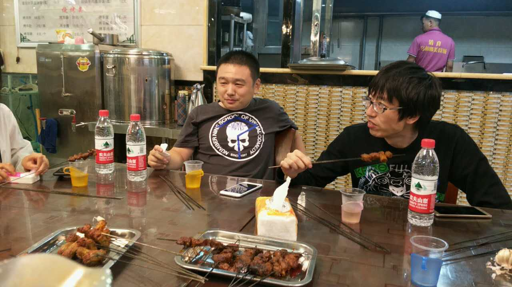羊肉串、大腰子，哈哈哈。如果不是教练叮嘱登山前不准喝酒，桌上码出一排酒瓶才是标配！

第二天（24日）一早就被迅速拉入角色，上午10点钟出发，三个小时徒步3.5公里，到达海拔4300多米的大本营。一路上的风景就像西北汉子一样粗狂不羁，偶尔还能看到不远处的雪山顶：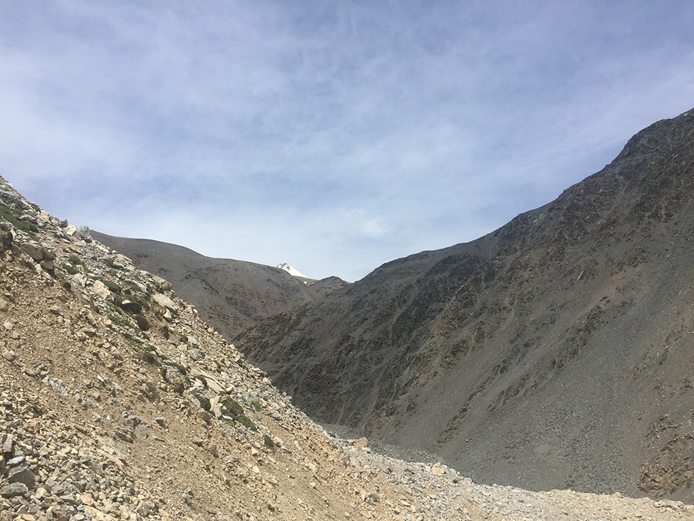随着露出越来越多的白色山尖，内心里的激动也开始越来越不安分了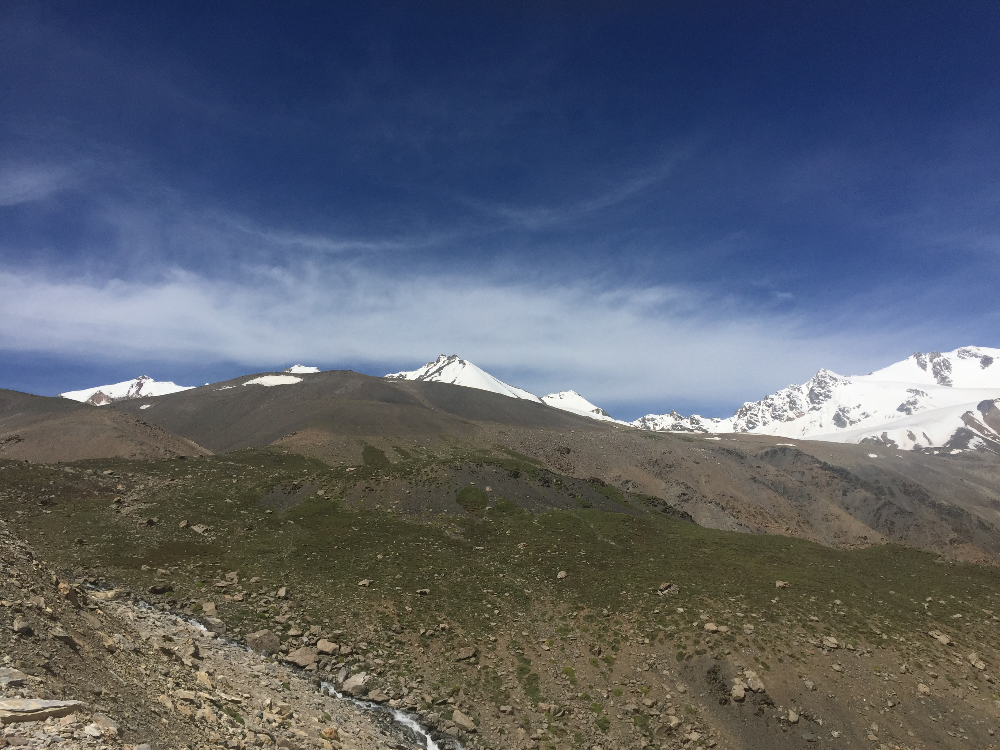无法掩饰一副踌躇满志的表情：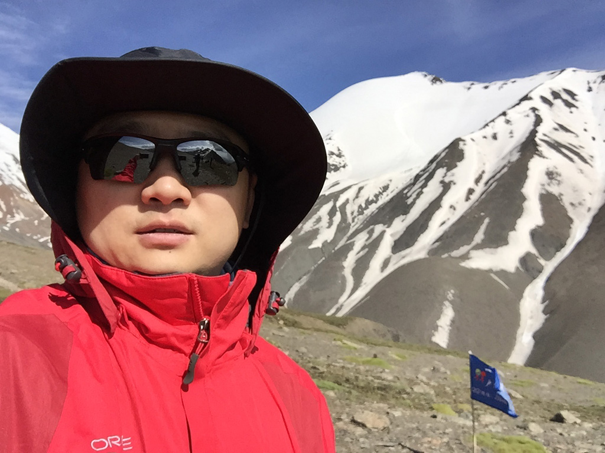中午1点多到达大本营：

按照计划，当天下午休息，第二天出来拉练、适应，第三天登顶。此时一直令我内心不安的是：爬雪山会不会出现传说中的高原反应？如果爬到半山腰高反了谁把我扛下去？如果山上出现暴风雪，天昏地暗、飞沙走石，会不会小命就交代在山上？然而事实证明我想多了，因为拍完上面这张照片，进入大本营，我就差不多失忆了……

所谓大本营就是一栋木屋，晚上在这里休息，装备都运到这里，作为冲顶的基地。刚进屋落下脚，我就开始剧烈头痛，反胃。刚刚徒步那3.5公里更像是下肚了半斤劣质白酒，此时已融入浑身的血液，开始在体内撒欢，让你想吐又吐不出来。教练不让睡觉，因为睡太早夜里会难受地醒来，然后就更难入睡了，第二天会更难受。

据说一下午我都闭着眼睛，夹着尾巴，蜷在马扎上。说失忆也不准确，因为我能听到身边的人在走动、说话，就好像从天上传下来的声音，嗡嗡作响；同时还要忍受来自自己驱壳里的种种难受，真想从这驱壳里抽离出来，又做不到。那真的比死还难受！不知道那一下午的怂样有没有被人拍到，如果有回头会补一张:)

我不知道怎么挨到了晚上十点钟。终于，终于教练放我们睡觉了。睡前想最多的就是——老子不爬了！坐那喘口气儿都是负担，爬山？去他姥姥的…… 睡前我还艰难地睁开眼睛环顾下四周，发现Ruby高反也挺严重的，不禁心中暗喜，明儿打退堂鼓有伴了，好歹老子不是唯一一个怂包。不过人家Ruby是女生……哈哈哈哈，就算是唯一一个，老子也不爬了，太tm难受了，实在扛不住！岗什卡，拜一个拜啦~

我从晚上十点睡到第二天早上九点，中间要不是被尿憋醒，那一觉就完美了。说起晚上撒尿，实在不爽，因为要从热乎乎的睡袋里钻出来，穿好绒衣、羽绒服，到门口脱下保暖鞋换上外出的登山鞋，出去找个空地儿解决完之后，再回来换鞋、脱衣服、钻入睡袋。看看我们的睡袋：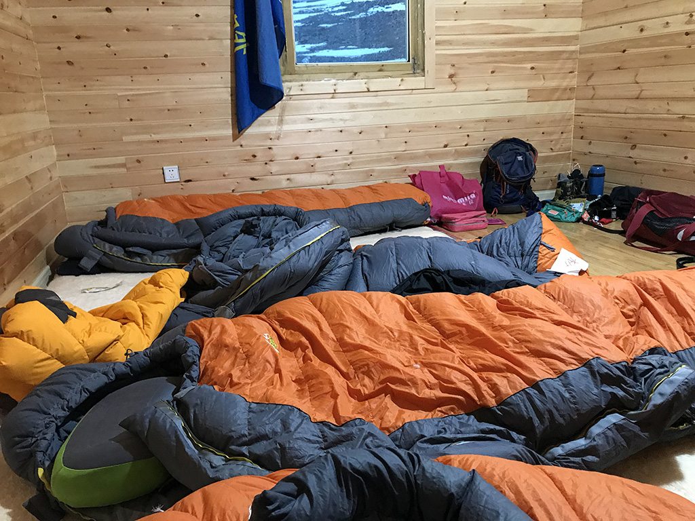睡袋是用拉链拉起来的，为了不让热气散掉，起夜要尽量拉开一个小口，从里面钻出来，而不是噗嗤拉开半截从里面跳出来。

为了要不要起来解决问题，我先斗争了二十分钟——他姥姥的晚上没吃没喝怎么会有尿呢？不会是做梦吧？好像是真的，还是谨慎一点，别一个不小心尿睡袋里可就糗大了……再憋一会？可这才凌晨一点多，憋到天亮非炸了……最后只好像豆虫蜕皮一样从睡袋里翻滚着钻了出来，钻出一身白毛汗，睡意全无。回来钻进去好像比钻出来更难，只好把拉链的口拉大一些。早知如此，出来的时候就直接拉开了嘛。

第三天（25日）醒来，我惊喜地发现不反胃了，头疼好像也缓解了很多。艹，昨天到底是走了3.5公里还是喝了半斤白酒？怎么跟喝了酒的感觉一模一样呢？如果真地是喝高了，那症状应该越来越轻，弄不好明天可以冲顶哦~ 这一天的任务是出来做适应性拉练，早饭已经有胃口了，吃点东西好像可以跟教练出来活动了。Ruby还是跟昨天一样痛苦，可是她还是坚持出来拉练，如果我说不行，好像是在有点太丢人。哎，真是上了贼船，出发吧！

这天上午的主要任务是穿上高山靴、雪套，走上几公里适应一下鞋子、道路、空气，再找个小雪坡，学习怎么上下。大家高反后的状态都不太一样，我是比较早出现反应的，第二天就明显缓解了；有人夜里睡觉开始高反，早上醒来也缓解了，二哥属于这种；也有第二天开始头疼，只是没那么严重，晓峰属于这种；还有武爷越来越难受的；最痛苦的还是Ruby，跟我差不多同时高反，直到从大本营撤下山才好转。不管是哪种情况，这一天大家全都集体出来拉练，没少走一步路。这一点让我觉得我们的团队很牛逼！

这是我们在学习走雪坡：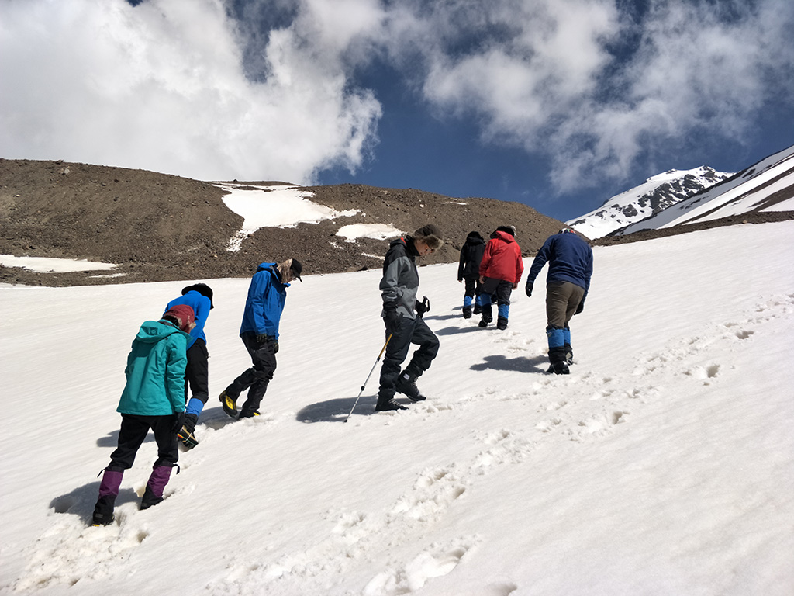累了休息，气色真地好了很多：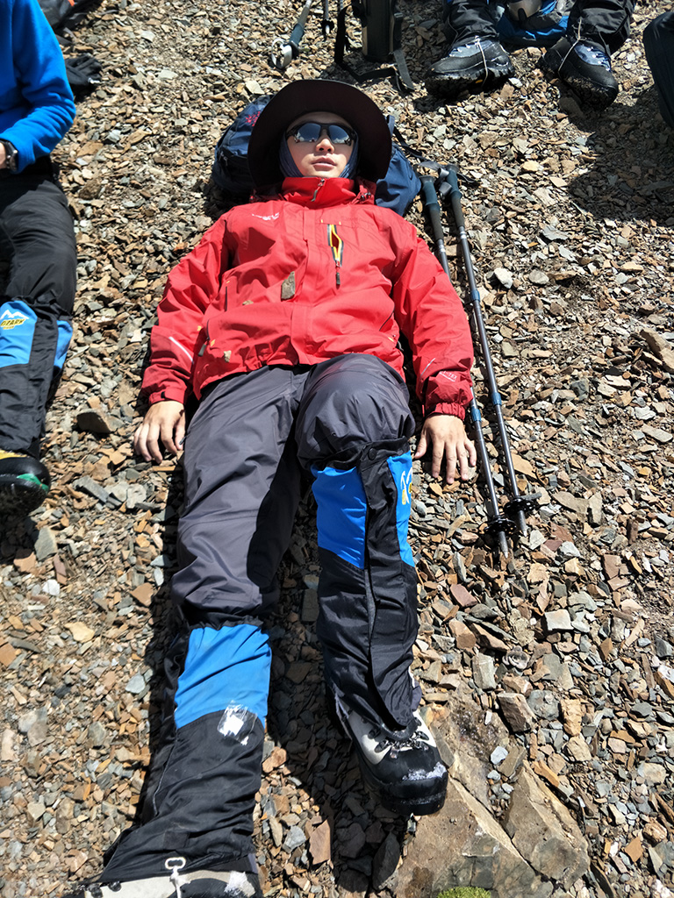后面雪坡上是我们走出的脚印，稍微运动几下，高反症状随时反扑，在这个雪坡上印出这些痕迹差不多等效于二两白酒吧：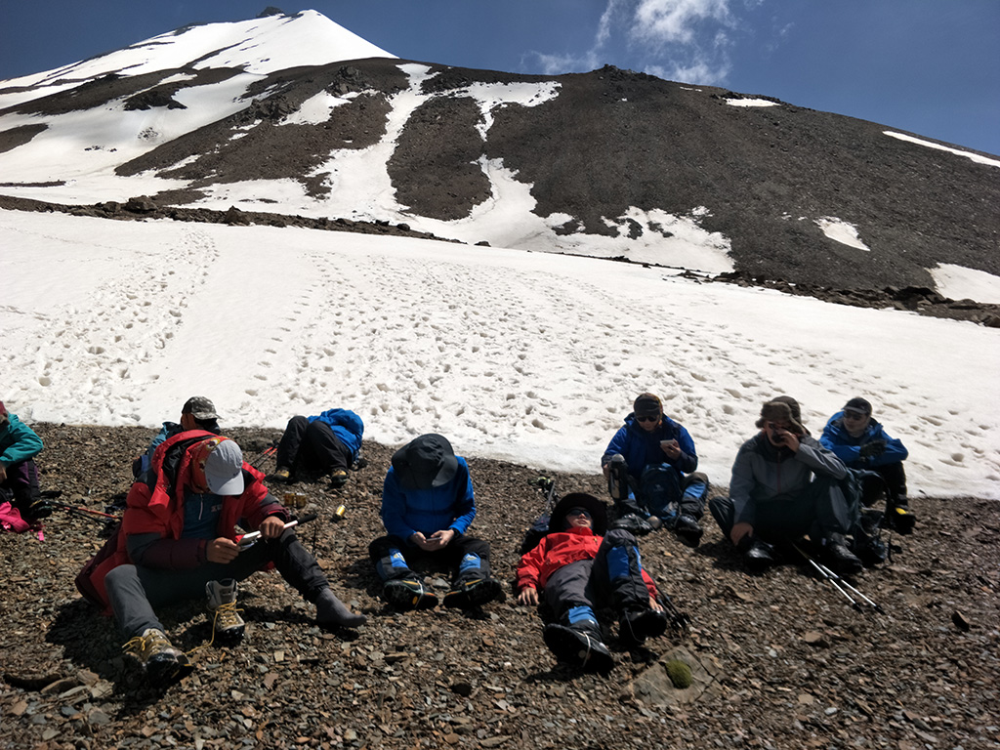这姑娘就是倔强的Ruby，我要是高反成她那样，这天早上绝对不出来了：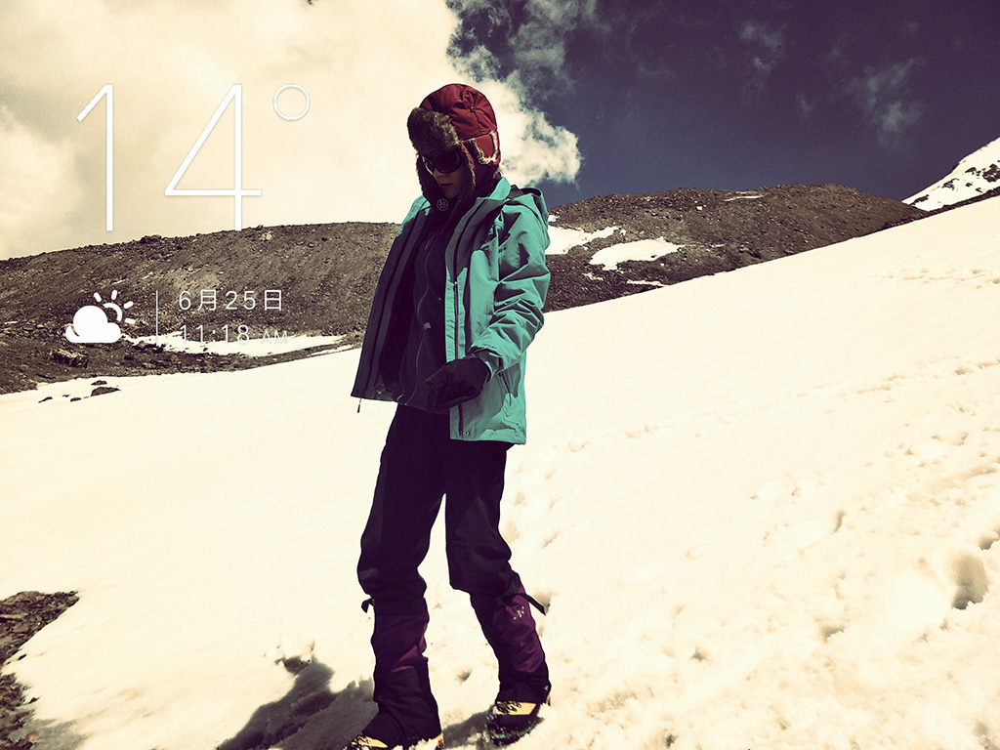还有两个逗比，二哥和晓峰：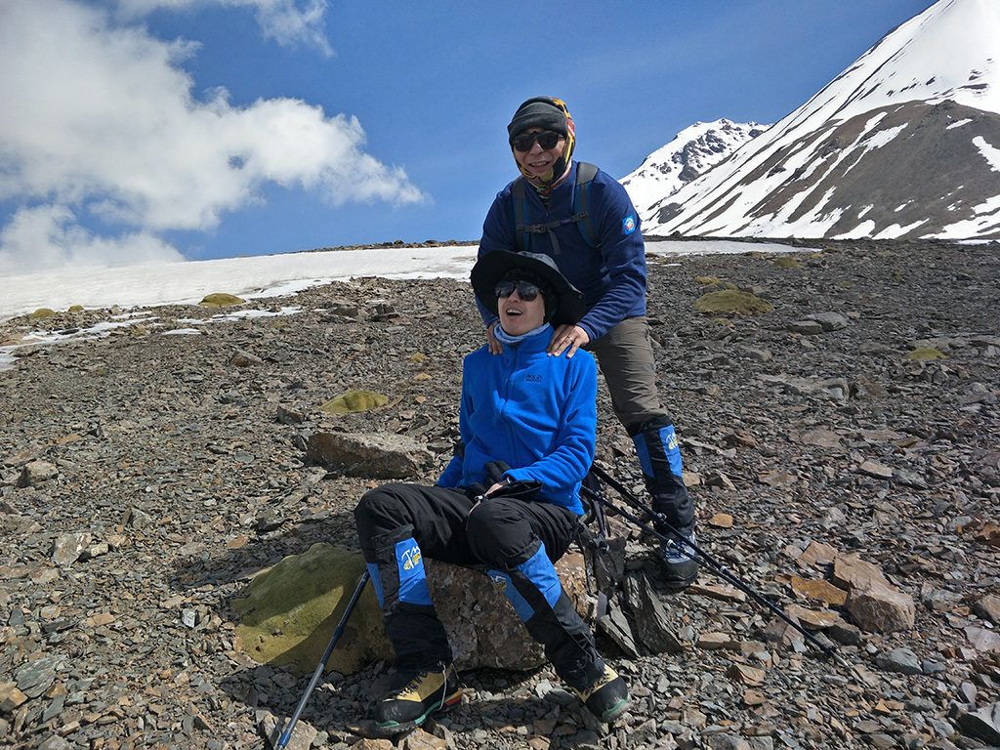这一天已经能清晰地看到我们即将挑战的山峰，最高那个尖尖就是：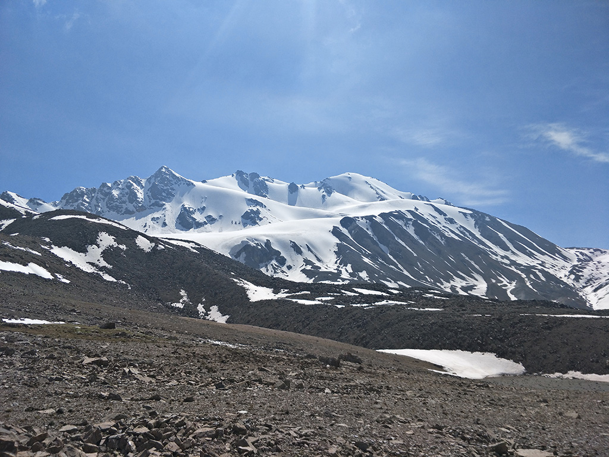

上午完成拉练，中午回大本营饱餐一顿，我们从下午三点睡到五点，晚上一顿美餐之后，教练给我们看纪录片——记录的是他带过的“7+2登山团”。所谓“7+2”是指七个大洲的最高峰+两个极点：非洲的乞力马扎罗（5895m）、亚洲珠穆朗玛峰（8844m）、南美洲阿空加瓜（6962m）、大洋洲查亚（5030m)、欧洲厄尔布鲁士（5642m）、北美洲麦金利（6194m）、南极洲文森（4897m）和南北极点。

看完之后大家血脉贲张，因为白天的拉练让大家初步体会到了带着高反在高山行走、攀登时的艰难。教练带的团队每次出征的平均年龄都要比我们大，他们面对挑战，勇敢面对，那股豪气感染了我们。那些场面、那些话语、那些在雪山下的行走，平时在自家客厅里看和这一晚在雪山脚下的大本营里看，那感受完全不同！

第四天（26日）凌晨三点，教练集合令响，大家收拾行装，向岗什卡山顶行进！

未完待续……