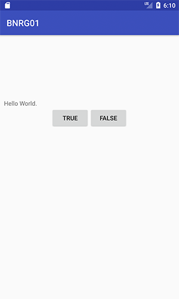

本章实现该界面的创建和按钮的消息响应，点击TRUE或FALSE按钮，弹出Toast提示。
本章要点：
- ConstraintLayout布局
- 为控件创建变量并关联响应函数
- 匿名内部类
- Toast控制
<!-- more -->

# ConstraintLayout布局
本章从一个非常简单的界面开始，主界面由三个元素组成：第一行居中的“Hello World" TextView，第二行并排放置的“TRUE”和“FALSE”两个按钮，点击按钮后弹出Toast，分别提示“Correct!”和“InCorrect!”。如下图：

首先要做的是布局，书中介绍的根布局还是RelativeLayout，我使用的Android Studio版本是2.3.3，它默认生成的根布局改成了ConstraintLayout。

ConstraintLayout是Google I/O 2016推出，将成为主流布局样式，完全替代其他布局。有点事减少布局层级，优化渲染性能。这和iOS的布局方式很像了。
## 基本使用
基本格式为
```
layout_constraint[本源位置]_[目标位置]="[目标ID]"
```
例如：`app:layout_constraintTop_toBottomOf="@+id/textView"`表示将自己的顶部对齐到textView的底部。

## 引导线
可以通过引入引导线，类似一条辅助线，让其他元素与该引导线对齐来完成布局。例如：距离左边缘10dp拉一条竖直的引导线，让textView与该引导线对齐：
``` xml
...
    <android.support.constraint.Guideline
        android:id="@+id/guideLine"
        android:layout_width="wrap_content"
        android:layout_height="wrap_content"
        android:orientation="vertical"
        app:layout_constraintGuide_begin="10dp"/> <!-- 添加引导线 -->

    <TextView
        android:id="@+id/textView"
        android:layout_width="wrap_content"
        android:layout_height="wrap_content"
        android:text="Hello World."
        app:layout_constraintBottom_toBottomOf="parent"
        app:layout_constraintTop_toTopOf="parent" 
        app:layout_constraintStart_toStartOf="@+id/guideLine" /> <!-- 对齐引导线 -->
...
```
运行，得到界面如下：


## 比例
还可以按照比例关系，摆放控件的位置。例如让textView在竖直方向上，放在父窗口的1/4处：
``` xml
    <TextView
        android:id="@+id/textView"
        android:layout_width="wrap_content"
        android:layout_height="wrap_content"
        android:text="Hello World."
        app:layout_constraintTop_toTopOf="parent"
        app:layout_constraintBottom_toBottomOf="parent"
        app:layout_constraintStart_toStartOf="@+id/guideLine"
        app:layout_constraintVertical_bias="0.25"/> <!-- 增加比例约束 -->
```
注意还是要指定textView的上下边缘对齐到父窗口的上下边缘，只是多了一条比例约束。运行，得到界面如下：


## 链条样式（Chain Style）
如果在一条线上有多个元素需要平均排布，过去可以嵌套一个LinearLayout，现在既然要全面使用ConstraintLayout，可以使用它的链条样式。
给链上的第一个元素设置属性`layout_constraintHorizontal_chainStyle` 或`layout_constraintVertical_chainStyle`，其后的元素通过添加上/下或左/右边缘约束加入这条链。对于空出的空间如何分配，取决于链条样式的具体值，各值的含义如下：

本章中的布局，原书是通过LinearLayout来实现的，我改成ConstraintLayout后如下：
``` xml
<?xml version="1.0" encoding="utf-8"?>
<android.support.constraint.ConstraintLayout xmlns:android="http://schemas.android.com/apk/res/android"
    xmlns:app="http://schemas.android.com/apk/res-auto"
    xmlns:tools="http://schemas.android.com/tools"
    android:layout_width="match_parent"
    android:layout_height="match_parent"
    tools:context="com.palanceli.ime.bnrg01.QuizActivity">

    <TextView
        android:id="@+id/textView"
        android:layout_width="wrap_content"
        android:layout_height="wrap_content"
        android:text="Hello World."
        app:layout_constraintStart_toStartOf="parent"
        app:layout_constraintEnd_toEndOf="parent"
        app:layout_constraintTop_toTopOf="parent"
        app:layout_constraintBottom_toBottomOf="parent"
        app:layout_constraintVertical_bias="0.25"/>

     <!-- 设置链头，并与其后的Button手拉手 -->
    <Button
        android:id="@+id/true_button"
        android:layout_width="wrap_content"
        android:layout_height="wrap_content"
        android:text = "@string/true_button"
        app:layout_constraintTop_toBottomOf="@id/textView"
        app:layout_constraintHorizontal_chainStyle="packed"
        app:layout_constraintLeft_toLeftOf="parent"
        app:layout_constraintRight_toLeftOf="@+id/false_button"/>
    <Button
        android:id="@+id/false_button"
        android:layout_width="wrap_content"
        android:layout_height="wrap_content"
        android:text = "@string/false_button"
        app:layout_constraintTop_toBottomOf="@id/textView"
        app:layout_constraintLeft_toRightOf="@id/true_button"
        app:layout_constraintRight_toRightOf="parent"/>

</android.support.constraint.ConstraintLayout>
```
运行后界面如下：


## Layout根元素的要求
和LinearLayout一样，作为布局xml文件中的布局根元素，ConstraintLayout必须指定Android资源xml的namespace为`http://schemas.android.com/`。

## @id还是@+id？
上面的xml文件中有时候是`@+id/true_button`，有时候是`@id/true_button`，它们之间什么区别呢？

Android中的组件需要用一个int类型的值来表示，这个值就是id属性值。id属性只能接受资源类型的值，因此必须以@开头的值。

如果在@后面使用“+”，表示在访问该id后需要为之在R.java文件中生成相应的int类型变量。变量名就是“/”后面的值，例如，`@+id/true_button`会在R.java文件中生成`int true_button = value`，其中value是一个十六进制的数。如果在R.java中已经存在同名的变量，就不再重新生成。

如果R.java中已存在`true_button`变量，则再访问该变量的时候可以不带`+`，使用`@id/true_button`即可。

上文中，在`true_button`中对齐`false_button`的时候，由于`false_button`变量还未生成，所以必须带加号。之后在定义`false_button`的时候，该变量已经存在了，所以可以把加号去掉。


## setContentView(...)函数都做了什么？
在`QuizActivity.java`中的`onCreate(...)`函数中，除了调用父类的同名函数外，还调用了`setContentView(...)`：
``` java
public class QuizActivity extends AppCompatActivity {
    ...
    @Override
    protected void onCreate(Bundle savedInstanceState) {
        super.onCreate(savedInstanceState);
        setContentView(R.layout.activity_quiz);
        ...
    }
}
```
该函数的作用是根据xml实例化每一个控件，按照布局摆放这些控件，并显示到屏幕上。实例化过程是通过`LayoutInflater`类来实现的。

在编译Android应用的时候，aapt（Android Asset Packaging Tool）会把所有资源编译成一个压缩文件，打到apk包里，以便在运行时被`setContentView(...)`访问。

## 其它
在xml中可以看到元素的宽高值被设为`match_parent`或`wrap_content`，他们的含义分别是：
`match_parent`：与父窗口等大
`wrap_content`：与内容等大

尽管ConstraintLayout是xml的根布局元素，但它仍然有父窗口——app的最顶层view，因此ConstraintLayout的宽高均为`match_parent`。

## 如何关联xml中的控件到java变量？
通过Activity的成员函数
`public View findViewById(int id)`
可以访问xml中的控件，因此根据id可以很方便地提领到按钮：
``` java
public class QuizActivity extends AppCompatActivity {
    private Button mTrueButton;
    private Button mFalseButton;

    @Override
    protected void onCreate(Bundle savedInstanceState) {
        super.onCreate(savedInstanceState);
        setContentView(R.layout.activity_quiz);
        mTrueButton = (Button)findViewById(R.id.true_button);
        mFalseButton = (Button)findViewById(R.id.false_button);
        ...
    }
}
```

## 如何响应按钮消息？
给按钮变量设置Listener对象，在该对象中可以实现响应处理。
``` java
public class QuizActivity extends AppCompatActivity {
    private Button mTrueButton;
    ...
    @Override
    protected void onCreate(Bundle savedInstanceState) {
        super.onCreate(savedInstanceState);
        setContentView(R.layout.activity_quiz);
        mTrueButton = (Button)findViewById(R.id.true_button);
        ...
        mTrueButton.setOnClickListener(new View.OnClickListener(){
            @Override
            public void onClick(View v){
                // true_button按钮的响应代码
            }
        });
        ...
    }
}
```
mTrueButton.setOnClickListener(...)的参数是一个匿名内部类的实例。

这和iOS的处理方式就有很大差异，iOS通过委托代理，把处理函数放到按钮所在的View或ViewController中实现，而Android则是在按钮内部来实现（尽管不是在按钮类中实现，通过设置Listener，终究是要关联到这个按钮类上的）。这就不可避免地要生成很多零碎的按钮类，也会让上下层的业务逻辑和机制混在一起。Java有自己的方式来解决这个问题，那就是匿名内部类。

# 内部匿名类（anonymous inner class）
这里内部匿名类的使用，最大的好处就是把与mTrueButton关联的业务层逻辑代码放到了业务层（即QuizActivity），而不是mTrueButton的机制层。体现了依赖倒置原则。

# Toast
Toast是一个提示气泡，可以在指定的时间消失。

## 怎么显示Toast
调用`Toast`的静态函数`Toast Toast::makeText(Constext context, int resId, int duration)`来生成气泡。其中参数`context`是`Activity`实例，`resId`是气泡中的文字，`duration`是显示多久后消失。
调用`Toast::show()`显示气泡：
``` java
public class QuizActivity extends AppCompatActivity {
    private Button mTrueButton;
    ...
    @Override
    protected void onCreate(Bundle savedInstanceState) {
        super.onCreate(savedInstanceState);
        setContentView(R.layout.activity_quiz);
        mTrueButton = (Button)findViewById(R.id.true_button);
        ...
        mTrueButton.setOnClickListener(new View.OnClickListener(){
            @Override
            public void onClick(View v){
                Toast.makeText(QuizActivity.this, R.string.correct_toast, Toast.LENGTH_SHORT).show();
            }
        });
        ...
    }
}
```
需要注意：`makeText`的第一个参数不能直接使用`this`，因为此时在一个内部匿名类里，这个`this`表示该匿名类，需要指定`QuizActivity.this`表明是Activity的this指针。