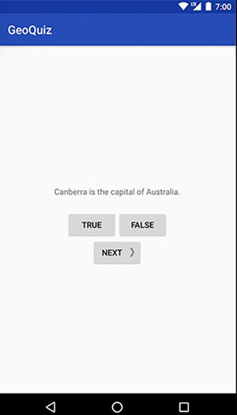
本章加入了问答题目列表，点击Next会轮询问题。
本章要点：
- AndroidStudio的一些基础操作
- 介绍Android的MVC结构
- 为不同密度屏添加资源
<!-- more -->

# AndroidStudio的基础操作

## 添加Java类的步骤
在`app/java/[包名]`右键，`New > Java Class`
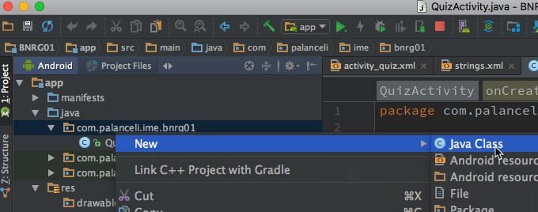
在弹出的窗口中填写新创建的java类的相关信息：
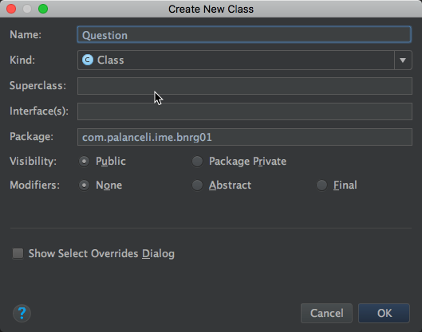

## 让AS自动生成getter/setter
在要生成代码的地方右键，选择Generate...
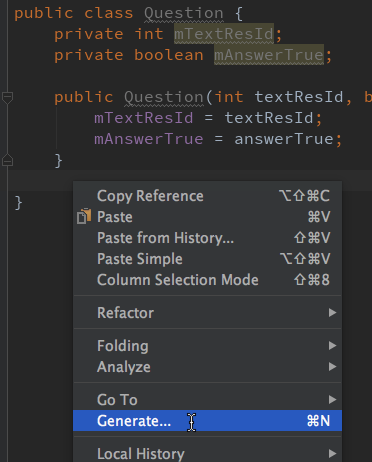
选择Getter/Setter：
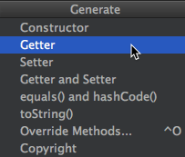
选择要生成的成员变量：
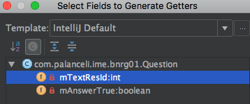
AndroidStudio默认会为mTextResId生成getMTextResID()。
可以在AndroidStudio设置中告诉它成员函数的前缀，这样在生成getter/setter函数的时候就会忽略该前缀了：
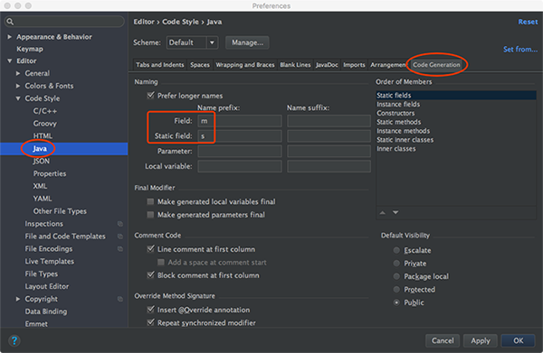
再执行上面的操作，AndroidStudio会给mTextResId生成getTextResID()，而不是getmTextResID()了。

# Android下的MVC结构以及和iOS的差异
这是本章应用的MVC结构，M和V与iOS下没有区别，不同的是C在Android下是Activity，在iOS下是Controller。
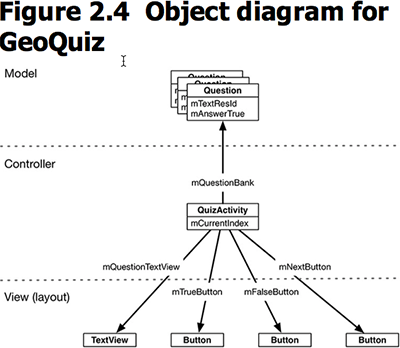
书中提到Model叫做业务逻辑（business logic），Controller叫做应用逻辑（application logic），我觉得很有道理。以前我把Controller叫做业务逻辑，它包含业务逻辑，但比业务逻辑更广泛，它还包含交互逻辑，比如按下什么按钮导致什么窗体如何响应，这其实是独立于业务逻辑的。Model是更纯粹的业务逻辑。

扩展到更广泛的Android应用，MVC表述如下，这张图和iOS的很像
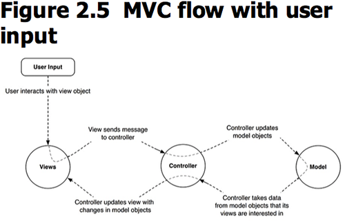

# 其它
## 打开调试模式
Android设备需要打开USB调试模式后才能在上面调试应用。具体步骤：
先让开发者选项可见：进入系统设置 > 关于 连击7次Build号，之后就能看到开发者选项，进入后打开USB调试模式。

# 不同密度屏的显示
## ?dpi的含义
在res/下，和屏幕分辨率相关的资源会后缀-mdpi、-hdpi、-xhdpi和-xxhdpi，他们表示：
-mdpi		中密度屏（dedium-density screens）~160dpi
-hdpi		高密度屏（high-density screens） ~240dip
-xhdpi		超高密度屏（extra-high-density screens）~320dpi
-xxhdpi	超超高密度屏（extra-extra-high-density screens）~480dpi
应用在运行时，Android系统会根据设备的情况选择最匹配的资源。

## 如何添加不同密度屏的资源
以drawable-?dpi为例，在Project Files视图中，app/src/main/res中创建drawable-?dpi文件夹，把对应的文件拷贝到这里，如下：
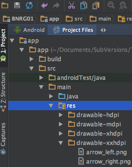
在Android视图里，会体现在app/res/drawable下，隐藏了不同密度屏的信息：
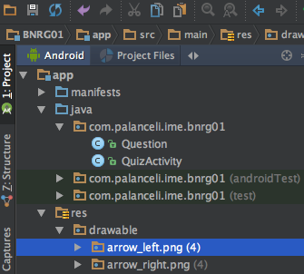
添加了资源后，AndroidStudio会自动为资源分配ID，但是需要注意：文件名必须为小写且不带空格。自动分配的ID和屏密度无关，因此在写代码的时候不用关心设备的适配问题。

# 如何为按钮添加图片
在xml文件的Button定义中，可以为之设置`android:drawableRight`和`android:drawablePadding`属性：
``` xml
<Button
    android:id="@+id/next_button"
    android:layout_width="wrap_content"
    android:layout_height="wrap_content"
    android:text="@string/next_button"
    android:drawableRight="@drawable/arrow_right"
    android:drawablePadding="4dp"
    app:layout_constraintStart_toStartOf="parent"
    app:layout_constraintEnd_toEndOf="parent"
    app:layout_constraintTop_toBottomOf="@id/false_button"/>
```
按钮张这样：

