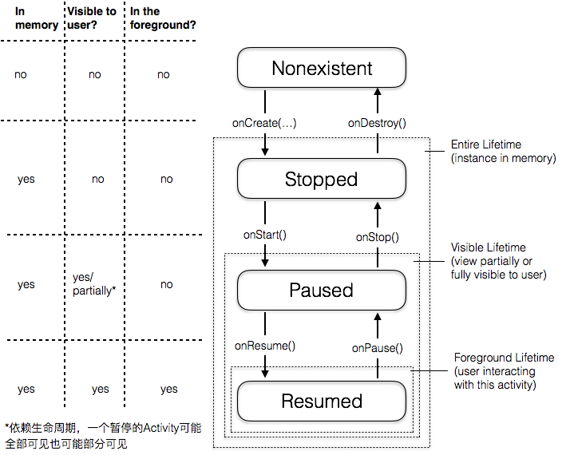
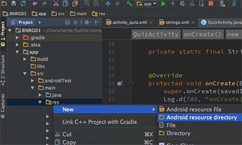
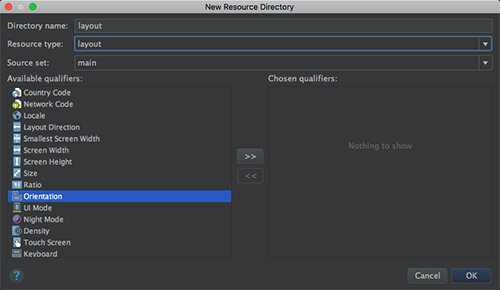
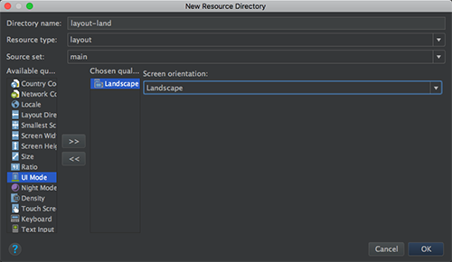
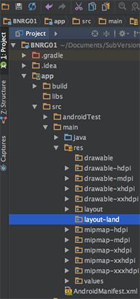
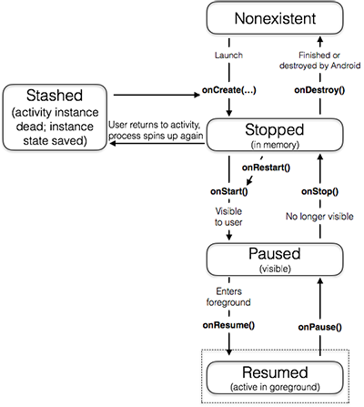
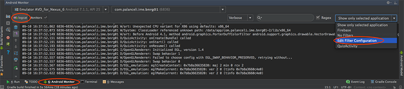
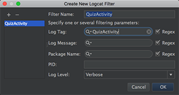
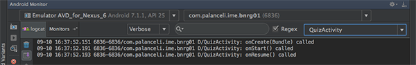

本章实现了。
本章要点：
<!-- more -->
# Activity的生命周期
## Activity的状态迁移图

在某一时刻，系统只有一个Activity可以出于Resumed状态。

## 在onCreate(...)中经常做的事情
- 在setContentView(...)函数中，从xml读取并创建控件，把它们呈现在屏幕上
- 提领前一步创建的控件
- 为控件设置listener，以响应交互
- 连接model

## 生命周期回调函数的基类函数都做了什么？
onCreate(...)
onStart()
onResume()
onPause()
onStop()
onDestroy()
这几个函数称为Activity的生命周期回调函数，这些函数不应由开发者调用，而是由系统调用，它们的调用时机在前面的状态迁移图中标出。在实现这些函数的时候，第一行要首先调用基类的同名函数，如：
``` java
@Override protected void onCreate(Bundle savedInstanceState) {    
    super.onCreate(savedInstanceState);
    ...
}
```
<font color='red'>这些基类的同名函数都做了什么？</font>

## Back和Home的不同含义
Android手机底部三个按钮：◁ ○ □ 的名称分别为Back、Home、Recent。Back和Home都会让当前的activity退出，但它们的含义和具体执行的回调是不同的。
Back的含义：该activity的工作已经完成，我不再需要它了。它会导致onPause()、onStop()、onDestroy()回调，让activity进入nonexistent状态，它被从内存中清理掉了。
Home的含义：我要临时转到别的地方，很快还会回来。它会导致onPause()、onStop()回调，让activity进入Stopped状态，它还在内存中。

## 当activity处于paused状态时，什么时候部分可见，什么时候全部可见？
当一个背景透明的activity或者尺寸比屏幕小的activity启动成为顶层activity时，原先的顶层activity就会处于paused并且部分可见。
在多窗口模式下（Android 6.0及以后版本支持），当用户和其它窗口中的activity交互式，原先的activity就处于paused状态，并且全部可见。

<font color=red>如何实现这些效果？</font>

# 旋转屏幕会发生什么？
当屏幕发生旋转，通过log会发现onPause()、onStop()、onDestroy()、onCreate()、oonStart()、onResume()被调用了，也就是说activity被先销毁再重新创建了！只是旋转一下屏幕，为什么这么大动静呢？

当设备配置发生变化时，可能会有更适合新配置的资源可以利用，因此Android会销毁掉activity，寻找更适合新的设备配置的资源，重建activity。

## 什么是设备配置？
设备配置（device configuration）是描述设备当前状态的一套参数，包括屏幕方向、屏幕密度、屏幕尺寸、键盘类型、dock mode、语言等等。有些参数是固定的，比如屏幕密度，有一些是可变的，例如屏幕方向。当这类可变的设备配置发生变化时，Android就会重建当前的activity。

## 怎么创建横屏布局？
系统默认的布局文件放在res/layout下，还可以创建res/layout-land或res/layout-port。
-land 后缀和-?dpi类似，是另一种与设备配置相关的资源后缀。参见[API指南之应用资源](https://developer.android.com/guide/topics/resources/providing-resources.html)可以找到所有设备配置相关的后缀命名规范。
-land表示横屏；-port表示竖屏。当屏幕方向发生变化时，Android会去res/ayout-land或res/layout-port找资源，如果找不到才去res/layout。

具体步骤：
在Project窗口中，找到app/src/main/res，右键 > New > Android resource directory：

在弹出的面板中选择Available qualifiers=Orientation，填写Directory name，选择Resource type=layout：

点击>>按钮，在弹出面板中填写Directory name，选择Screen orientation=Landscape：

点击OK，Android Studio会创建目录：app/src/main/res/layout-land/

将res/layout下的布局文件拷贝到res/layout-land下，修改横屏版的布局文件，即可在横屏发生时生效。

## 旋转屏幕时，重建前保存数据
前面已经讲过，旋转屏幕会导致activity重建，这会导致业务数据重置。例如当前正在第2个问题，旋转屏幕后，变成第1个了。必须在旋转屏幕时，重建activity之前保存数据，重建后恢复数据。
可以覆盖`Activity::onSaveInstanceState(Bundle)`来完成该任务，该函数是在onStop()前被调用的。本章中的具体代码如下。
``` java
...
public class QuizActivity extends AppCompatActivity {    
    ...    
    private int mCurrentIndex = 0;    
    private static final String TAG = "QuizActivity";   
    // 定义mCurrentIndex保存的key 
    private static final String KEY_INDEX = "index"; 	    
    @Override    
    protected void onCreate(Bundle savedInstanceState) {        
        ...        
        if(savedInstanceState != null){	// 启动时读取            
            mCurrentIndex = savedInstanceState.getInt(KEY_INDEX, 0);        
        }        
        ...
    }
    ...
    @Override
    public void onSaveInstanceState(Bundle savedInstanceState){        
        ...			        // 退出前写回        
        savedInstanceState.putInt(KEY_INDEX, mCurrentIndex);
    }
}
```
<font color=red>通过savedInstanceState把数据写到哪了？</font>

注意：`onCreate(Bundle savedInstanceState)`的参数，如果是转屏导致activity重建，系统会传入该参数，该参数保存了activity重建前的数据；如果是通过Back按钮退出应用，再重新进入应用，该参数为null。这符合Back按钮的定义。

## activity退出前的数据保存策略
当系统其它的运行时配置发生变化而导致Activity被重建时，都可以使用`onSaveInstanceState(...)`来保存数据；当用户暂时导航到其它界面，Activity被暂时换到后台，此时系统回收内存导致Activity被销毁时，系统也会调用`onSaveInstanceState(...)`函数。当这些情况发生时，Activity调用了`onSaveInstanceState(...)`函数后会进入Stashed状态：


在函数`onSaveInstanceState(...)`中，数据被保存到`Bundle`对象中，该对象被系统保存到Activity的`activity record`中。进入Stashed状态后，Activity就被销毁了，但是`activity record`仍然存在，系统可以通过它复活Activity。

需要注意：Activity可能不会调用`onDestroy()`函数而直接进入Stashed状态，也就是说在`onDestroy()`中完成Activity退出时的数据保存是不可靠的，应当在`onStop()`中完成。

那么`onSaveInstanceState(...)`和`onStop()`作为退出时数据保存的时机有什么差别呢？通常`onSaveInstanceState(...)`保存的是小的瞬态数据，比如当前所在界面；后者保存业务相关的永久性数据，比如用户当前正在编辑的文本。

## activity record在什么时候消失？
activity record数据只是瞬态信息，而不是永久数据，系统可能会清除该数据。当用户点击Back按钮，或者系统重启，都会导致该数据被清除。

# 其它
## 关键字@Override的作用
`@Override`的作用是告诉编译器：这是该类已经存在的方法，如果编译器找不到就会发出警告。这有助于发现笔误。

## 关键字final的作用？

<font color='red'>关键字final的作用？</font>

## 设置Logcat过滤器
在AndroidStudio中选择Android Monitor > logcat > Edit Filter Configuation

在弹出的面板中设置Log Tag关键字：

之后Log就只剩下与关键字匹配的内容：
