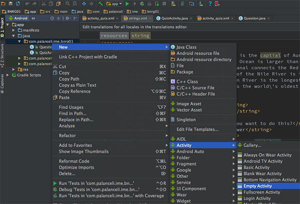
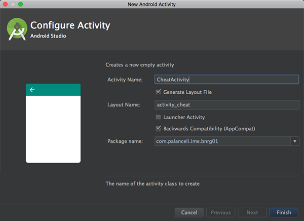
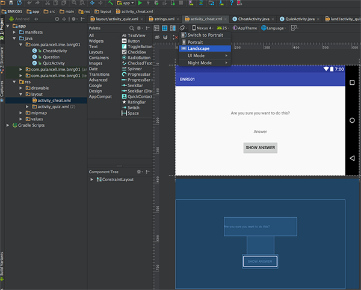
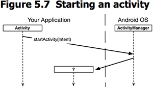
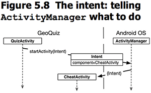

本章添加了新的Activity，用于显示作弊界面。
本章要点：
- 添加Activity，并为之生成布局
- 从一个Activity跳转到另一个Activity
- 在两个Activity之间传递数据

<!-- more -->
# 怎样添加Activity
在Android视图中，找到java/<包名> 右键 > New > Activity > Empty Activity：

在弹出的面板中填写Activity Name

点击完成。该步骤：
1. 生成两个文件：activity_cheat.xml布局文件，CheatActivity.java代码文件
2. 修改AndroidManifest.xml文件，在其中添加CheatActivity

## 添加Activity后AndroidManifest文件的改动
``` xml
<?xml version="1.0" encoding="utf-8"?>
<manifest xmlns:android="http://schemas.android.com/apk/res/android"
    package="com.palanceli.ime.bnrg01">
    <application
        ...
        android:theme="@style/AppTheme">
        <activity android:name=".QuizActivity">
            ...
        </activity>
        <!-- 会在这里插入新activity -->
        <activity android:name=".CheatActivity"></activity> 
    </application>
</manifest>
```
activity的必填属性是android:name，其值由`.`开头，表示它的包名和manifest的package相同。

## 如何预览横竖屏布局
找到预览视图左上角的屏幕旋转标志，点开选择Portrait或Landscape：


# tools:text属性
在xml布局文件中，可以为widget添加tools属性，它可以用于覆盖widget的任何属性，使得widget在Android Studio预览时的性质发生变化。例如：
``` xml
    <TextView
        android:id="@+id/answer_text_view"
        android:layout_width="wrap_content"
        android:layout_height="wrap_content"
        android:padding="24dp"
        tools:text="Answer"
        />
```
该TextView的内容是在运行时设置，因此不会给它的`android:text`定义默认值，但是可以定义`tools:text`，这样在Android Studio预览时，它就会显示为Answer。

# 启动一个Activity
通过调用Activity的startActivity(Intent intent)函数，可以启动另一个Activity：

这个调用会将启动Activity的请求发送到ActivityManager，由ActivityManager创建新Activity并调用它的onCreate(Bundle)函数，这个过程在之前分析安卓源码的时候已经走查过了。
结合本章的例子，过程如下：

代码如下：
``` java
mCheatButton.setOnClickListener(new View.OnClickListener(){
    @Override
    public void onClick(View v){
        Intent intent = new Intent(QuizActivity.this, CheatActivity.class);
        startActivity(intent);	// 启动intent中指定的Activity
    }
});
```