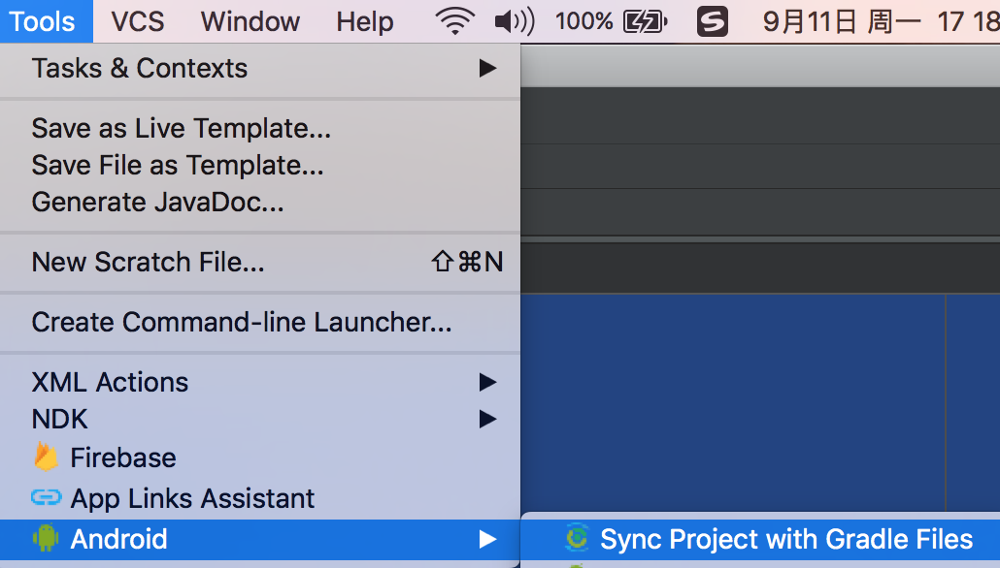
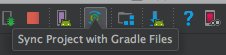

本章介绍了编写Android应用时几个版本号的含义。
本章要点：
- Android API level版本号和发行版的对应关系。
- compileSdkVersion、minSdkVersion和targetSdkVersion的含义。

<!-- more -->
# Android API级别和固件版本对应关系

<style>
table th:nth-of-type(1){
    width: 80px;
}
table th:nth-of-type(2){
    width: 200px;
}
</style>

API level|Codename|Device fireware version
---|---|---
24|Nougat|7.0
23|Marshmallow|6.0
22<br>21|Lollipop|5.1<br>5.0
19|KitKat|4.4
18<br>17<br>16|Jelly Bean|4.3<br>4.2<br>4.1
15|Ice Cream Sandwich(ICS)|4.0.3<br>4.0.4
10|Gingerbread|2.3.3-2.3.7
8|Froyo|2.2

# build.gradle中几个版本的含义
在app/build.gradle中有三个和系统相关的版本号：compileSdkVersion、minSdkVersion和targetSdkVersion：
```
android {
    compileSdkVersion 25
    buildToolsVersion "25.0.0"
    defaultConfig {
        applicationId "com.palanceli.ime.bnrg01"
        minSdkVersion 23
        targetSdkVersion 25
        ...
    }
    ...
}
```
- Minimum SDK version：应用在低于该版本的系统上将无法安装，系统会拒绝安装这样的应用。

- Target SDK version：在指定的SdkVersion已做充分测试，Android系统不会针对此版本进行兼容处理
	如果app跑在系统SdkVersion 等于 targetSdkVersion的手机上，Android系统不会做任何兼容处理，从而提高了性能
	如果app跑在系统SdkVersion 大于 targetSdkVersion的手机上，Android系统需要做兼容处理以保障app仍然以targetSdkVersion的特性运行
	如果app跑在系统SdkVersion 小于 targetSdkVersion的手机上，可能会出现错误，所以至少要保证app在minSdkVersion的手机上测试通过

- compileSdkVersion：app在该版本的SDK上编译，如果要使用某版本的API，必须将compileSdkVersion设置为大于等于此版本。

通常的原则是：根据产品策略选择要支持的最低系统版本，设为minSdkVersion。
根据用户分布，在分布最广的版本上重点测试，设为targetSdkVersion。
根据编译的SDK版本，设为comileSdkVersion。

如果app实际运行的版本高于minSdkVersion且低于compileSdkVersion，且app使用了compileSdkVersion的API，则需要在代码里对此做判断，只能调用V及以下版本的API。

注意：修改了这些版本之后，需要执行Tools > Android > Sync Project with Gradle Files

或者点击工具条

通知Android Studio更新。

## 在运行时根据系统版本执行不同代码
如果minSdkVersion=11，CompileSdkVersion=23，如果代码里调用了SdkVersion=23的API，而app运行在20的系统上时，就必须根据系统版本好做分别处理。如：
``` java
if(Build.VERION.SDK_INT<23){
	... // 调用更低level的API，尽量达成同样的效果
}else{
	... // 调用23的API
}
```
其中Build.VERION.SDK_INT就是当前设备的Android版本。

