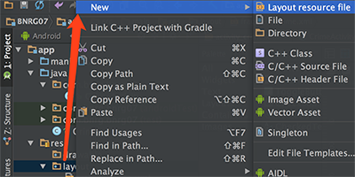
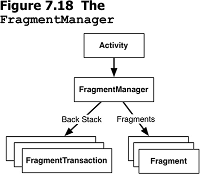
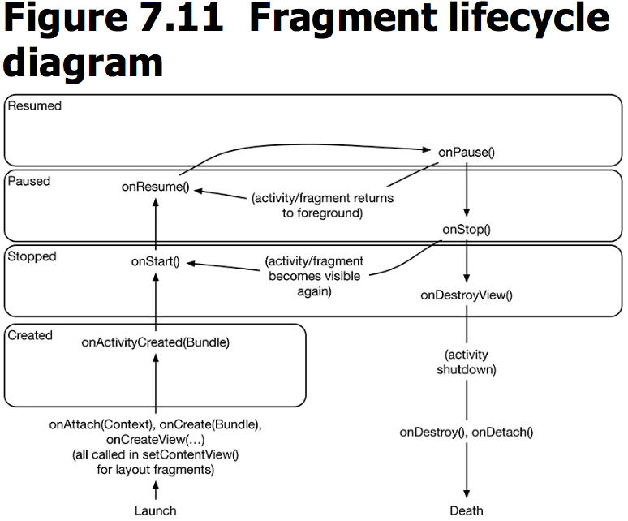
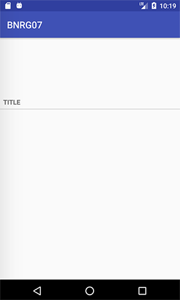

本章开启了一个新的应用，list-details模式，在接下来的几章中都会完善该应用。本章引入了Fragment，用于显示details的信息。
本章要点：
- fragment的概念、使用步骤、使用原则
- Android依赖关系的引入

<!-- more -->

# 什么是fragment？
fragment用来解决UI和事件的分离问题。当app在横竖屏间切换的时候，activity会被销毁重建，如果其中正在执行一些任务，例如下载以及表示下载进度的进度条。如果连进度条信息都要保存和读取，会大大增加代码的复杂性。通过引入UI fragment和工作fragment，让工作不随UI的重建而重建。

## fragment的两种实现版本
native fragment和support fragment。
- native fragment被编译到了设备中，不同版本的Android系统下，native fragment实现可能会有细微的差别。
- support fragment被编译到你的app include的库里，因此不管当前运行的Android版本是什么，support fragment的表现是完全一致的。

使用support fragment的好处在于它可以随你的app更新，Google每年会更新support fragment很多次，当新的feature被添加到fragment API，它也同时会被添加到support fragment中。

## 两种部署fragment的方法
- 使用activity的layout。这种方法基本上没什么意义，因为它缺乏弹性，不能在运行时动态调整、替换fragment。而引入fragment的目的就是为了这种弹性，引入的代价是复杂度增加。使用这种方式只有代价没有好处，所以我认为没意义。

- 使用java代码。书中说尽管会带来复杂度，但这是唯一一种能动态调整fragment，在运行时增加、删除、替换fragment的方法。

## 添加fragment的步骤
第一步 定义容纳fragment的view，本节是Listing7.5定义在activity_crime.xml中的FrameLayout。这是一个完全通用的空容器，可以用来容纳任何fragment。activity_crime.xml代码如下：
``` xml
<?xml version="1.0" encoding="utf-8"?>
    <android.support.constraint.ConstraintLayout
    android:id="@+id/fragment_container"
    android:layout_width="match_parent"
    android:layout_height="match_parent">
```
其中最重要的是`android:id`标签，这在后面将Fragment添加到Activity时还会用到。
第二步 创建fragment UI。这个步骤和创建activity UI一致：
1. 在layout文件中布局控件。res/layout右键，选择New > Layout resource file

填写File name: `fragment_crime`，Root element:`LinearLayout`

在生成的fragment_crime.xml文件中布局控件：
``` xml
<?xml version="1.0" encoding="utf-8"?>
<android.support.constraint.ConstraintLayout
xmlns:android="http://schemas.android.com/apk/res/android"
xmlns:app="http://schemas.android.com/apk/res-auto"
xmlns:tools="http://schemas.android.com/tools"
android:layout_width="match_parent"
android:layout_height="match_parent"
android:layout_margin="16dp">
    <TextView .../>
    <EditText .../>
    <TextView .../>
    <Button .../>
    <CheckBox .../>
</android.support.constraint.ConstraintLayout>
```
2. 在java代码中添加变量，关联到布局中的控件，并为之实现消息响应代码。新建CrimeFragment.java，派生自Fragment。系统有两个Fragment：android.app.Fragment 和 android.support.v4.app.Fragment，前者是native fragment，后者是support fragment，这里使用后者。
``` java
...
import android.support.v4.app.Fragment;
...
public class CrimeFragment extends Fragment {
    private Crime mCrime;
    private EditText mTitleField;
    @Override
    public void onCreate(Bundle savedInstance){
        uper.onCreate(savedInstance);
        mCrime = new Crime();
    }
    
    @Override
    public View onCreateView(LayoutInflater inflater, ViewGroup container, Bundle savedInstance){
        // 创建Fragment View的实例，container是该View的父View，第三个参数表示是否把创建的Fragment View实例添加到它的父View
        View v = inflater.inflate(R.layout.fragment_crime, container, false);
        // 关联到控件，Activity调用的是Activity::findViewById(...)，此处调用的是View::findViewById(...)
        mTtitleField = (EditText)v.findViewById(R.id.crime_title);
        mTitleField.addTextChangedListener(new TextWatcher(){	// 实现消息响应代码
            ...
            @Override
            public void onTextChanged(CharSequence s, int start, int count){
                mCrime.setTitle(s.toString());
            }
            ...
        });
        return v;
    }
}
```
需要注意：
- Fragment的生命周期接口都是public，而Activity的对应接口是protected的。
- 和Activity类似，Fragment也可以把它的状态信息存取到bundle内，通过覆盖Fragment::onSaveInstanceStat(...)来完成存取。
- 在Fragment::onCreate(...)中只加载了数据Model，在Fragment::onCreateView(...)中加载和关联界面元素。
- 在Fragment::onCreateView(...)中调用inflater.inflate(...)用于加载子视图。其中第一个参数是布局的sourceID，第二个参数是该布局的父View，第三个参数表示是否把创建的Fragment View实例添加到container中。
- 在Fragment::onCreateView(...)中调用View::findViewById(int)来获取视图对象，而不像在Activity中调用Activity::findViewById(int)

第三步 把fragment加入Activity。向Activity的FragmentManager添加Fragment UI，FragmentManager负责管理Fragments，并且把它们的View添加到Activity View的层次结构中。FragmentManager负责处理两件事：fragment的list和fragment事务栈。FragmentManager和Activity的关系如下：

代码如下：
``` java
public class CrimeActivity extends AppCompatActivity {
    @Override
    protected void onCreate(Bundle savedInstanceState) {
        super.onCreate(savedInstanceState);
        setContentView(R.layout.activity_crime);
        
        FragmentManager fm = getSupportFragmentManager();
        // 先检查该fm的list中是否已经存在fragment，如果屏幕旋转导致activity被销毁，
        // FragmentManager保存list，该list里面的fragment不会因为旋转屏幕而重建，
        // 当activity重建后，FragmentManager会加载该list
        Fragment fragment = fm.findFragmentById(R.id.fragment_container);
        if(fragment  == nuLL){	// 如果不存在则创建
            fragment = new CrimeFragment();
            // 向fm的list中添加fragment
            fm.beginTransaction().add(R.id.fragment_container, fragment).commit();
        }
    }
}
```
需要注意：
- 如果Activity派生自AppCompatActivity，调用getSupportFragmentManager()来获取Support Fragment Manager；如果Activity派生自Activity，调用getFragmentManager()来获取Native Fragment Manager

- `FragmentManager::beginTransaction()`返回`FragmentTransaction`。
`FragmentTransaction::add(...)`的一个参数是Fragment的ContainerID，第二个参数是Fragment对象，第三个参数是Fragment的tag名，指定tag的好处是可以通过`Fragment1 frag = getSupportFragmentManager().findFragmentByTag("f1")`从FragmentManager中查找Fragment对象。

- ContainerID有两个作用：1、告诉FragmentManager加入的fragment应该展现到activity view的什么地方；2、作为Fragment list中的UID
如果两个Fragment都要加入到同一个Activity中，那应该怎么写呢？在书中P578提到：应该为每个fragment分别创建Container View，每个Container有各自的ID。
<font color=red>本节的容器就是activity的布局，如何在一个Activity中容纳多个fragment？</font>

- `commit()`是异步操作，内部通过`mManager.enqueueAction()`加入处理队列。对应的同步方法为`commitNow()`。commit()内部会有checkStateLoss()操作，如果开发人员使用不当（比如commit()操作在onSaveInstanceState()之后），可能会抛出异常，而commitAllowingStateLoss()方法则是不会抛出异常版本的commit()方法，但是尽量使用commit()，而不要使用commitAllowingStateLoss()。<font color=red>为什么？checkStateLoss()做了什么？为什么会抛异常？</font>

- `addToBackStack("fname")`是可选的。FragmentManager拥有回退栈（BackStack），类似于Activity的任务栈，如果添加了该语句，就把该事务加入回退栈，当用户点击返回按钮，会回退该事务（回退指的是如果事务是add(frag1)，那么回退操作就是remove(frag1)）；如果没添加该语句，用户点击返回按钮会直接销毁Activity。

> [《Android基础：Fragment，看这篇就够了》](https://mp.weixin.qq.com/s/dUuGSVhWinAnN9uMiBaXgw)中提到：
Fragment有一个常见的问题，即Fragment重叠问题，这是由于Fragment被系统杀掉，并重新初始化时再次将fragment加入activity，因此通过在外围加if语句能判断此时是否是被系统杀掉并重新初始化的情况。
该异常出现的原因是：commit()在onSaveInstanceState()后调用。首先，onSaveInstanceState()在onPause()之后，onStop()之前调用。onRestoreInstanceState()在onStart()之后，onResume()之前。
<font color=red>没有理解根本原因是什么。</font>

## 向创建的Fragment传入参数
需要通过`setArguments(Bundle bundle)`的方式添加，而不是在构造函数传入。因为通过`setArguments()`方式添加，当内存紧张导致Fragment被系统杀掉并回复时能保留这些数据。

传入的参数可以在Fragment的`onAttach()`中通过`getArgments()`获得。

## fragment的生命周期

和Activity的回调名称都是一样的，差别在于：
fragment的生命周期回调是被其所在的activity调用，而activity的生命周期回调则是被OS调用的，OS并不知道fragment的存在，fragment是activity的内部逻辑。

由FragmentManager负责调用fragment的生命周期函数：
- 当向FragmentManager添加fragment时，会调用它的onAttach(Context), onCreate(Bundle)和onCreateView(...)函数
- 当fragment所在的activity的onCreate(Bundle)函数调用完成后，会调用它的onActivityCreated(Bundle)函数

如果activity已经处于resumed状态，此时再加入fragment，FragmentManager会遍历其list中的fragments，并逐个调用其生命周期函数：
onAttach(Context)
onCreate(Bundle)
onCreateView(...)
onActivityCreated(Bundle)
onStart()
onResume()
确保fragement和其所在的activity的状态是同步的，之后activity的状态发生变化，将同步调用其fragment对应的生命周期函数。

<font color=red>为什么使用fragment可以避免Activity销毁重建的复杂性？
如果fragment可以避免该复杂性，为什么还要用activity？或者至少应该让fragment成为Activity的标配吧？
</font>

## 使用fragment的原则
书中提到，把每个可重用的组件都是用fragment来实现，这是不对的；fragment是用来封装主要的业务逻辑，而不是用来封装底层机制的；建议的做法是把小的底层的机制层做成自定义view，把大的策略层封装成fragment，一个界面不要使用超过三个fragment。

如果需要使用fragment，尽量在一开始就引入，而不要在需要的时候才添加，因为中途添加fragment是个雷区，会导致一堆疑难杂症。所以书中提出AUF原则：Always Use Fragments。

# 关于gradle
## 两个build.gradle的作用
在你的project里面有两个build.gradle，一个是project总的，一个是app模块的。

## gradle中dependence是什么含义？
在app/build.gradle中的dependencies有如下记录：
```
dependencies {
    compile fileTree(dir: 'libs', include: ['*.jar'])
    ...
    compile 'com.android.support:appcompat-v7:25.3.1'
    ...
}
```
其中第一个compile表示此工程依赖其libs目录下的所有.jar文件；
第二个compile表示工程此工程依赖由Android Studio自动包含的库appcompat-v7，其格式为`groupId:artifactId:version`，`groupId`（com.android.support）为该库在Maven repository中的uid，`artifactId`（appcompat-v7）是库名，`version`（25.3.1）是最低版本号。通过指定dependencies，可以不必把文件拷贝到你的项目目录中。在app编译时，gradle会查找、下载并包含这些依赖文件。

还可以通过Project Sturcture来配置，这和修改build.gradle是等效的：


AppCompat是谷歌的兼容库，它里面包含了support fragment，再添加了dependencies之后，让你的Activity派生自`AppCompatActivity`，如果编译通过，说明添加依赖生效了。

# listSeparatorTextViewStyle的作用
P526在布局TextView时加入了listSeparatorTextViewStyle的风格，如下：
``` xml
<TextView
style="?android:listSeparatorTextViewStyle"
android:layout_width="match_parent"
android:layout_height="wrap_content"
android:text="@string/crime_title_label"
app:layout_constraintBottom_toBottomOf="parent"
app:layout_constraintLeft_toLeftOf="parent"
app:layout_constraintRight_toRightOf="parent"
app:layout_constraintTop_toTopOf="parent"
app:layout_constraintVertical_bias="0.25"/>
```
这会在TextView下面加一条分割线
