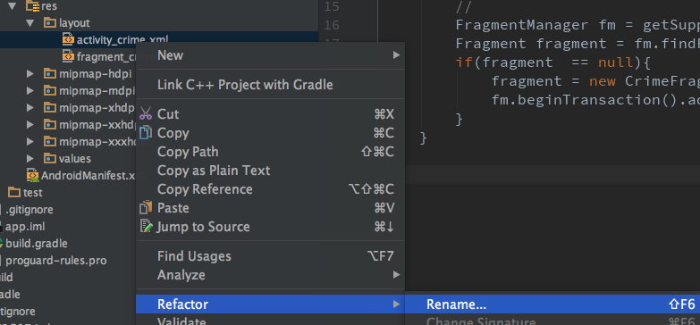
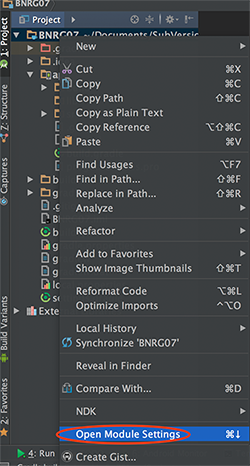
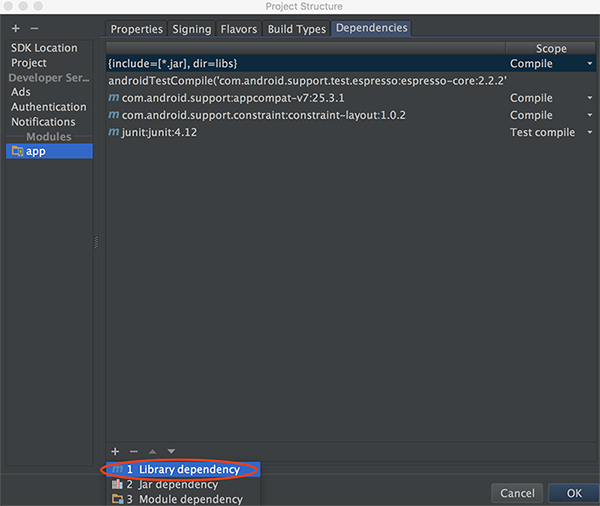
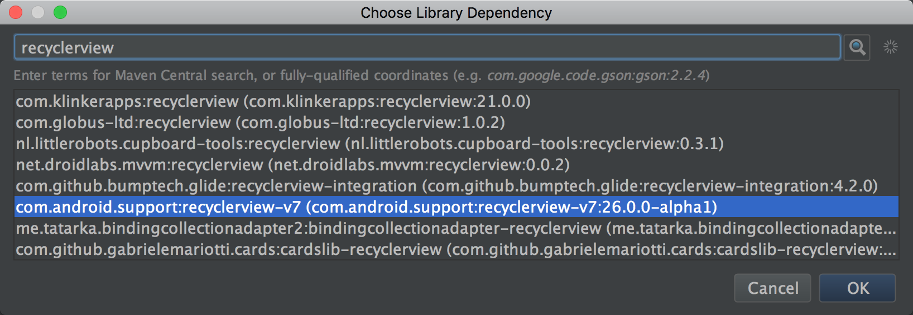

本章继续CriminalIntent的list部分，并且让list和details公用Fragment的容器、类。
本章要点：
- 抽象一个通用的Fragment，包括xml容器和java实现

<!-- more -->

# 修改fragment的容器、java文件
## 重命名fragment xml容器文件
本节为了让Fragment更通用，把原先的`activity_crime.xml`改名为`activity_fragment.xml`：

内容如下：
``` xml
<?xml version="1.0" encoding="utf-8"?>
    <android.support.constraint.ConstraintLayout
    android:id="@+id/fragment_container"
    android:layout_width="match_parent"
    android:layout_height="match_parent">
```
AndroidStudio会自动修改引用该资源的代码，比如`CrimeActivity.java`：
``` java
public class CrimeActivity extends AppCompatActivity {
    @Override
    protected void onCreate(Bundle savedInstanceState) {
        ...
        setContentView(R.layout.activity_fragment); // 自动修改
        ...
    }
}
```
如果没有自动修改，需要手动解决。
## 为通用的Fragment配备对应的java文件
xml容器文件只是在命名上体现出通用性，具体实现更多是在java代码上:
``` java
// SingleFragmentActivity.java
...
public abstract class SingleFragmentActivity extends AppCompatActivity {
    protected abstract Fragment createFragment();

    @Override
    protected void onCreate(Bundle savedInstanceState) {
        super.onCreate(savedInstanceState);
        setContentView(R.layout.activity_fragment);

        FragmentManager fm = getSupportFragmentManager();
        Fragment fragment = fm.findFragmentById(R.id.fragment_container);
        if(fragment  == null){
            fragment = createFragment();
            fm.beginTransaction().add(R.id.fragment_container, fragment).commit();
        }
    }
}
```
SingleFragmentActivity在`onCreate(...)`中加载Fragment容器文件，并创建Fragment实例，具体的实例的创建则由派生类来实现：
``` java
// CrimeActivity.java
...
public class CrimeActivity extends SingleFragmentActivity {
    @Override
    protected Fragment createFragment(){
        return new CrimeFragment();
    }
}
```

> 疑问：把Fragment的添加放到基类里，这不会导致所有Fragment共用同一个id么？FragmentManager是绑定在Activity的，也就是说Fragment ID的唯一性只要在具体Activity的范围内即可。

## 向manifest添加新的Activity并置为启动项
在[启动本应用内的Activity的要求](/2016/10/16/2017/1016AndroidProgrammingBNRG05/#启动本应用内的Activity的要求)中提到，如果希望应用的Activity能被启动，必须在其manifest文件中声明该组件。
``` xml
<?xml version="1.0" encoding="utf-8"?>
<manifest xmlns:android="http://schemas.android.com/apk/res/android"
    package="com.bnrg.bnrg07">

    <application
        ... android:theme="@style/AppTheme">
        
        <!-- 新加入的Activity，并设置为启动项 -->
        <activity android:name=".CrimeListActivity">
            <intent-filter>
                <action android:name="android.intent.action.MAIN" />
                <category android:name="android.intent.category.LAUNCHER" />
            </intent-filter>
        </activity>

        <activity android:name=".CrimeActivity">
        </activity>
    </application>

</manifest>
```

# 怎么实现一个RecyclerView

## ViewHolder的职责
它负责维护一个具体的View
为什么需要ViewHolder这一层抽象？它抽象的又是什么？

在P620中提到ViewHolder让itemView和Crime的连接更简单，更有效率，具体怎么连接的呢？为什么简单，有效率？

## Adapter的职责
Adapter位于RecyclerView和Model之间，它的职责是：
1. 创建必要的ViewHolders
2. 绑定ViewHolder和Modle层之间的数据

Adapter和RecyclerView之间的关系如下：

可见有RecyclerView和Adapter、ViewHolder共同完成了“可复用View”的协议部分：RecyclerView负责“可复用View”的业务逻辑，Adapter负责实现复用资源，ViewHolder负责表示资源。由Adapter和ViewHolder的派生类负责实现具体业务的业务逻辑。

但在P624中提到：当这些调用完成后，RecyclerView将把list item显示到屏幕上。onCreateViewHolder(...)的调用次数会比onBindViewHolder(...)少得多，因为一旦创建了足够多的ViewHolder之后，RecyclerView将不再调用onCreateViewHolder(...)。
我的问题是：这一串调用是需要开发者自己写还是固化在RecyclerView内的？它怎么判断是否有“足够”多的ViewHolder呢？

# RecyclerView的具体实现步骤
## 添加RecyclerView的依赖
项目 > 右键 > Open Module Settings：

app > Dependencies > +号 > Library dependency：

搜索recyclerview，并选择com.android.support:recyclerview-v7：

但实际情况是添加了次依赖会导致如下错误：
> Manifest merger failed : Attribute meta-data#android.support.VERSION@value value=(25.3.1) from [com.android.support:appcompat-v7:25.3.1] AndroidManifest.xml:27:9-31
is also present at [com.android.support:recyclerview-v7:26.0.0-alpha1] AndroidManifest.xml:24:9-38 value=(26.0.0-alpha1).
Suggestion: add 'tools:replace="android:value"' to element at AndroidManifest.xml:25:5-27:34 to override.

这主要是android.support:appcompat-v7:25.3.1和android.support:recyclerview-v7:26.0.0-alpha1有冲突，修改`app/build.gradle`：
```
...
dependencies {
    ...
    compile 'com.android.support:recyclerview-v7:26.0.0-alpha1'
    compile 'com.android.support:appcompat-v7:26.0.0-alpha1'
}
```

## 为list的Fregment创建layout文件
在res/layout右键，选择New > layout resource file，命名为fragment_crime_list.xml
``` xml
<?xml version="1.0" encoding="utf-8"?>
<android.support.v7.widget.RecyclerView
    xmlns:android="http://schemas.android.com/apk/res/android"
    android:id="@+id/crime_recycler_view"
    android:layout_width="match_parent"
    android:layout_height="match_parent"/>
```
## 为list的布局创建java代码
``` java
public class CrimeListFragment extends Fragment {
    private RecyclerView mCrimeRecyclerView;
    @Override
    public View onCreateView(LayoutInflater inflater, ViewGroup container, Bundle savedInstanceState){
        View view = inflater.inflate(R.layout.fragment_crime_list, container, false);
        mCrimeRecyclerView = (RecyclerView)view.findViewById(R.id.crime_recycler_view);
        mCrimeRecyclerView.setLayoutManager(new LinearLayoutManager(getActivity()));
        return view;
    }
}
```
注意：RecyclerView必须需要一个LayoutManager实例才能正常工作，因为它并不直接负责布局itmes，而是通过这个LayoutManager实例来完成的，除了负责布局每一个item，LayoutManager还负责定义如何滚动。

## 实现itemView
### 布局文件
``` xml
<LinearLayout xmlns:android="http://schemas.android.com/apk/res/android"
    android:orientation="vertical" android:layout_width="match_parent"
    android:layout_height="match_parent">

    <TextView android:id="@+id/crime_title"
        android:layout_width="match_parent"
        android:layout_height="wrap_content"
        android:text="Crime Title"/>

    <TextView
        android:id="@+id/crime_date"
        android:layout_width="match_parent"
        android:layout_height="wrap_content"
        android:text="Crime Date"/>
</LinearLayout>
```