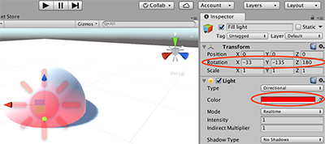

转自[Unity官方实例教程 Roll-a-Ball（一）](http://www.jianshu.com/p/6e4b0435e30e)
本章主要介绍Unity官方实例教程 Roll-a-Ball。视频地址：[点击这里](https://unity3d.com/cn/learn/tutorials/projects/roll-ball-tutorial/introduction-roll-ball?playlist=17141)

本章要点：
- 如何创建一个新的项目（Project）
- 如何创建一个新的游戏场景（Scene）
- 如何添加基本的游戏对象（GameObject）
- 如何添加灯光（Light）
- 如何给游戏对象添加脚本（Script）
- 实现一个简单的计分板UI（UI Text）
- 如何发布游戏（Build）
<!-- more -->

# 1.创建一个新的项目（New Project）
在开始面板中点击 New > 输入Project Name和Location > 点击Create project

修改右上角的Layout可以改变IDE界面布局：


# 2.创建第一个游戏场景（Scene）
第1步：创建一个文件夹来存放游戏场景文件。
unity中，所有的游戏资源文件都放在Assets文件夹下面，为了便于管理游戏资源文件，应对游戏资源进行合理分类，尤其是后期游戏资源文件多起来，合理分类能帮你更好的管理资源。首先创建一个名为_Scenes的文件夹，来存放游戏场景文件。
在Project窗口中 > 选中Asset文件夹 > 点击Create弹出下拉菜单 > 点击Folder，如下图：


第2步：保存当前游戏场景。
【⌘ + s】保存当前游戏场景，然后给Scene命名和制定存放路径，记住，这里一定要将场景文件保存在_Scene文件夹下面，要从一开始养成良好的习惯：


# 3.添加游戏对象：平台（Plane）
保存了游戏场景后，就可以开始在场景中添加所需要的游戏对象（GameObject）了，第一个需要添加的就是游戏进行的平台，这里使用的是unity自带的Plane对象。

将其命名为Ground：

然后还需要做一件很重要的事情（官方强力推荐），重置Transform属性。在Inspector窗口 > Transform > 点击右上角小齿轮 > 点击reset（官方是建议每次我们添加新的GameObject后最好都做一次）：


平台添加成功后，就可以对其的属性进行调整，例如调整平台的大小，将目光锁定到Scene窗口，可以在其中直观地修改平台的属性，这里有3个很实用的快捷键可以使用：

W：切换到移动模式，可以任意拖动平台，改变它的位置
E：切换到旋转模式，可以任意旋转平台，改变它的角度
R：切换到缩放模式，可以任意缩放平台，改变它的大小
也可以直接在Transform里面直接输入想要的数值。在本例中，我们把平台的Scale X和Z的数值设置为2。

> 先选中一个GameObject，然后点击F快捷键，可以在Scene窗口将摄像机对准你选中的GameObject，方便你快速定位

# 4.添加游戏玩家：球体（Sphere）
有了平台后，制作Roll-a-Ball游戏还需要一个球体。添加球体的方式，和上面添加平台的方式一样，只不过选择Sphere对象，如下图：

球体对象创建成功后，根据官方推荐的做法，重置球体的Transform属性，然后将其命名为Player，因为在这个游戏里面，这个球就代表玩家。选中球体，通过F快捷键，定位到球体，会发现此时球有一个半是陷入在平台中的，调节他的Position的Y值为0.5，让它处于平台上：


# 5.添加灯光（Light）
新版中，每个新建的项目，都会自动带有一个平行光（Directional Light）。官方视频中的版本（4.3），灯光是需要手动添加的，这里就不用再添加灯光，直接修改平行光的属性就可以了。
之前提到过应该规整出清晰的资源分类，接下来把平行光也归入文件夹：创建一个空的游戏对象，Create Empty；然后将其的Transform重置，并改名为Lighting，最后我们把Directional Light拖入到Lighting。未来把所有的灯光对象放到这个里面，便于管理：


为了让球和阴影有个明显的区分，还需要再增加一个新光源，用来照射在球体上。创建一个新的平行光（Directional Light），改名为Fill Light，把之前那个灯光改名为Main Light

选中Fill Light，设置颜色和Rotation属性：


# 6.让球体动起来：添加脚本（Script）和刚体（Rigidbody）
第1步：给球添加刚体。刚体可以给球体添加物理效果，让他可以检测物理碰撞，便于我们后面实现拾取物体和碰撞墙面。
选中球体 > Add Component > Physics > Rigidbody：

第2步：给球体添加脚本。
选中球体Player，在Inspector窗口中点击Add Component，选中New Script，选择编程语言为C Sharp，设置脚本名称：

创建用于存放脚本的文件夹，并将脚本拖进去：

点击脚本组件右上角的小齿轮 > Edit Script 就可以编辑脚本了：


# 7.编写脚本
``` csharp
using System.Collections;
using System.Collections.Generic;
using UnityEngine;

public class PlayerController : MonoBehaviour {
	public float speed;

	// Use this for initialization
	void Start () { }
	
	// Update is called once per frame
	void Update () { }

	void FixedUpdate(){
		float moveHorizontal = Input.GetAxis ("Horizontal");
		float moveVertical = Input.GetAxis ("Vertical");

		Vector3 movement = new Vector3 (moveHorizontal, 0.0f, moveVertical);
		GetComponent<Rigidbody> ().AddForce (movement * speed * Time.deltaTime);
	}
}
```
在Inspector窗口中可以看到public变量speed，为之设置初始值500：

点击IDE顶部的三角按钮，就可以运行了，按方向键会为之加速。