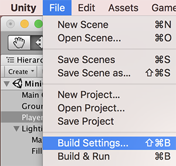
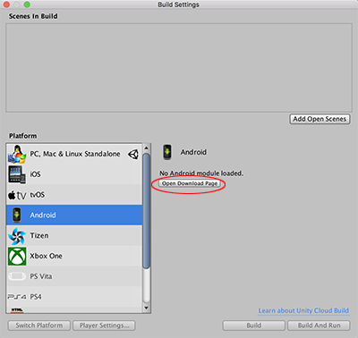
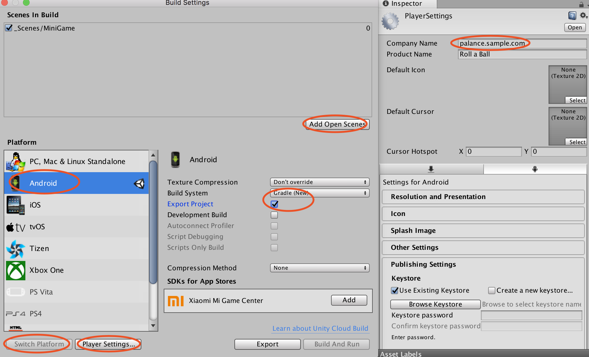
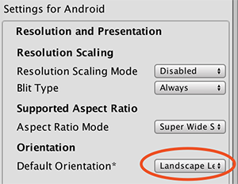
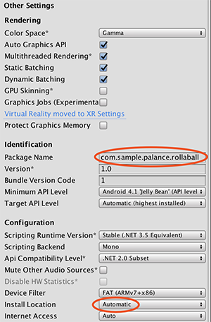
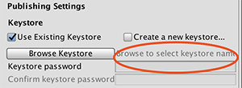
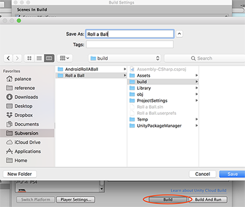
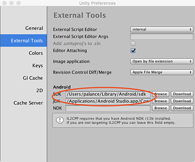
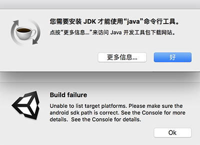
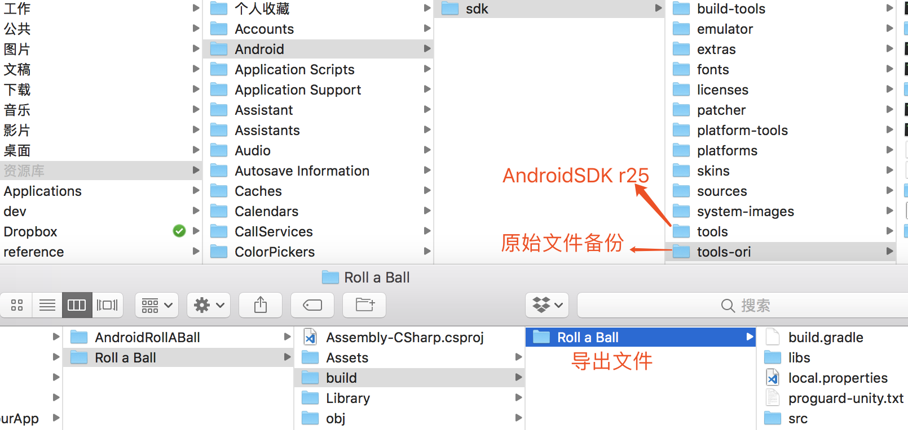

本章

本章要点：
<!-- more -->
# 导出Unity
在Unity中，File > Build Settings

## project导出设置
首次打开时，Unity还没有Android module，点击`Open Download Page`下载并安装：

重启unity后这个界面就变成了这样，点击`Switch Platform`切换平台 > 点击`Add Open Scenes`将要导出的scene添加进来。
点击`Player Settings...` > Inspector > 修改Company Name，使之和Android App一致：

继续修改Resolution and Presentation > Orientation > Default Orientation为Landscape Left：

Other Settings > Identification > Package Name和Android App包同名，
Other Settings > Configuration > Install Location 为 Automatic：

Publishing Settings > Keystore，和Android App相同（截图还没设置，因为我的Android App也没有）：

点击Build > 选择路径并设置名称：

## Unity External Tools设置
第一次生成会询问Android SDK和JDK目录，可以事先在Unity > Preferences...中设置好：

如果不知道路径在哪，可以打开AndroidStudio，随便找一个app去Project Structure > SDK Location找到。

## 问题
点击Build遇到如下错误：

回到Unity底部的输出窗口，可以看到`Error:Invalid command android`的错误，原来新版本的AndroidStudio把`android`命令废掉了，去下载一个[Android SDK tools r25](http://dl.google.com/android/repository/tools_r25-macosx.zip)可以解决。先备份好原来的~/Library/Android/sdk/tools，下载r25解压后改名到这里。再次导出终于OK了：

记得完成后把原先的备份恢复回来。

## 运行导出的apk
点击Build and Run或者把Export Project勾掉，将生成apk，把生成的apk装入Android可以直接运行，而且在虚拟机下能直接接收键盘控制，这是Unity官网的Roll a Ball例程：
