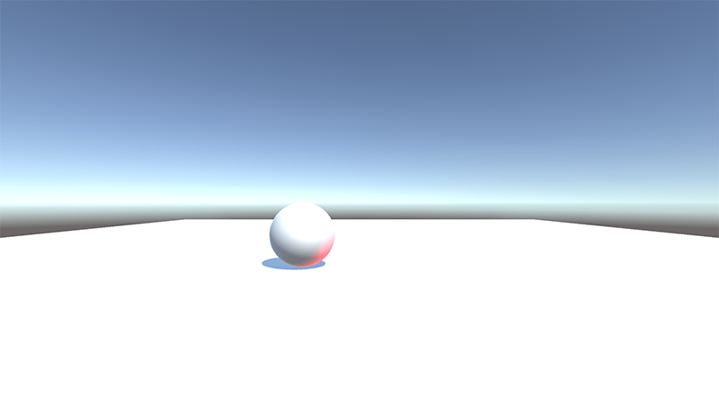

本章将已经完成的Unity工程“Roll A Ball”导入到一个简单的Android工程中，我在网上找了一些操作步骤，但在实际动手操作的时候，还是在很多环节遇到了新状况。

本章要点：
- 为Android工程导出Unity
- 在Android工程中操作Unity元素

<!-- more -->
# 导出Unity
在Unity中，File > Build Settings

## project导出设置
首次打开时，Unity还没有Android module，点击`Open Download Page`下载并安装：

重启unity后这个界面就变成了这样，点击`Switch Platform`切换平台 > 点击`Add Open Scenes`将要导出的scene添加进来。
点击`Player Settings...` > Inspector > 修改Company Name，使之和Android App一致：

继续修改Resolution and Presentation > Orientation > Default Orientation为Landscape Left：

Other Settings > Identification > Package Name和Android App包同名，
Other Settings > Configuration > Install Location 为 Automatic：

Publishing Settings > Keystore，和Android App相同（截图还没设置，因为我的Android App也没有）：

点击Build > 选择路径并设置名称：


## Unity External Tools设置
第一次生成会询问Android SDK和JDK目录，可以事先在Unity > Preferences...中设置好：

如果不知道路径在哪，可以打开AndroidStudio，随便找一个app去Project Structure > SDK Location找到。

## 问题
点击Build遇到如下错误：

回到Unity底部的输出窗口，可以看到`Error:Invalid command android`的错误，原来新版本的AndroidStudio把`android`命令废掉了，去下载一个[Android SDK tools r25](http://dl.google.com/android/repository/tools_r25-macosx.zip)可以解决。先备份好原来的~/Library/Android/sdk/tools，下载r25解压后改名到这里。再次导出终于OK了：

记得完成后把原先的备份恢复回来。

我的做法是让`tools-r25`和`tools-ori`都放在sdk下面，再创建一个软链：
`ln -s /Users/palance/Library/Android/sdk/tools-r25 /Users/palance/Library/Android/sdk/tools`
> 软链的参数顺序是`原-目`
软链的参数顺序是`原-目`
软链的参数顺序是`原-目`
这事儿tm永远记不住……:(

## 运行导出的apk
点击Build and Run或者把Export Project勾掉，将生成apk，把生成的apk装入Android可以直接运行，而且在虚拟机下能直接接收键盘控制，这是Unity官网的Roll a Ball例程：


# 在Android中调用Unity
本节的例程我放到了[unitySample](https://github.com/palanceli/unitySample)，其中`Roll a Ball`是Unity工程，`AndroidRollABall`是Android工程。
## 将Unity导出的文件拷贝到Android工程
Unity的导出目录为`build`，`Android`工程目录为`AndroidRollABall`，需要拷贝文件：
`build/Roll a Ball/libs/*` -> `AndroidRollABall/app/libs/`
`build/Roll a Ball/src/main/assets/bin/` -> `AndroidRollABall/app/src/main/assets/bin/`
`build/Roll a Ball/src/main/jniLibs/` -> `AndroidRollABall/app/src/main/jniLibs/`
`build/Roll a Ball/src/main/java/com/sample/palance/rollaball/UnityPlayerActivity.java` -> `AndroidRollABall/app/src/main/java/com/sample/palance/rollaball/UnityPlayerActivity.java`
我写了一个脚本[Roll a Ball/setup.sh](https://github.com/palanceli/unitySample/tree/master/Roll%20a%20Ball)完成这些文件的拷贝，只需要在`unitySample`目录下执行`sh setup.sh`即可。

在Android Studio打开工程的Project视图，在app/libs/unity-classes.jar右键 > Add As Library...，这会在app/build.gradle中添加依赖：
```
dependencies {
    ...
    implementation files('libs/unity-classes.jar')
} 
```

## 在Android中控制UnityPlayer动画
还是`Roll A Ball`的例子，在Unity中通过键盘控制球的滚动方向和速度，现在把控制权通过函数交给Android。
### 在Android中控制Unity对象
需要在`onCreate(...)`、`onResume()`、`onWindowFocusChanged(...)`三个回调中分别加入如下代码，虽然还不知道具体原理，先跑通再说~
``` java
// MainActivity.java
...
import com.unity3d.player.UnityPlayer;
public class MainActivity extends AppCompatActivity {
    protected UnityPlayer mUnityPlayer;

    @Override
    protected void onCreate(Bundle savedInstanceState) {
        ...
        mUnityPlayer = new UnityPlayer(this);
        ConstraintLayout layout = (ConstraintLayout)findViewById(R.id.layout);
        layout.addView(mUnityPlayer);
        mUnityPlayer.UnitySendMessage("Player", "ARoll", "-3#-3");
    }

    @Override protected void onResume(){
        super.onResume();
        mUnityPlayer.resume();
    }

    @Override public void onWindowFocusChanged(boolean hasFocus){
        super.onWindowFocusChanged(hasFocus);
        mUnityPlayer.windowFocusChanged(hasFocus);
    }
}
```
在`onCreate(...)`的末尾通过调用Unity对象的接口控制小球的运行方向和速度。这个接口还没有做，这是下一步要做的事儿。需要注意的是：`UnityPlayer::UnitySendMessage(...)`第一个参数是Unity对象，第二个参数是成员函数，第三个参数是传参。只能传一个参数进去，因此如果是多参数，需要把它们串起来，到了Unity代码里再解析。

### 在Unity中导出接口供Android调用
首先修改Unity代码：
``` csharp
public class PlayerController : MonoBehaviour {
	public float speed;

	void Start () {}
	void Update () {}

	void FixedUpdate(){
		float moveHorizontal = Input.GetAxis ("Horizontal");
		float moveVertical = Input.GetAxis ("Vertical");
		Roll (moveHorizontal, moveVertical);
	}

	void Roll(float moveHorizontal, float moveVertical){
		Vector3 movement = new Vector3 (moveHorizontal, 0.0f, moveVertical);
		GetComponent<Rigidbody> ().AddForce (movement * speed * Time.deltaTime);		
	}
	// 供Android调用的接口
	void ARoll(string paramString){
		// 解析参数
		string[] paramArray = paramString.Split('#');
		if(paramArray.Length != 2)
			return;
		float moveHorizontal = float.Parse (paramArray [0]);
		float moveVertical = float.Parse(paramArray[1]);
		Roll(moveHorizontal, moveVertical);
	}
}
```
每次修改了Unity工程后记得把相关文件拷贝给Android工程。运行，你会发现小球在手机里有了初始的速度和方向。


# 参考
[如何把 Unity 项目 嵌入 Android](https://zhuanlan.zhihu.com/p/30710788)
[实现Unity和Android进行交互](http://www.jianshu.com/p/7e46fe7485bb)
[Unity项目开发完成后如何嵌入到Android中](http://blog.csdn.net/qq_15267341/article/details/52692407)