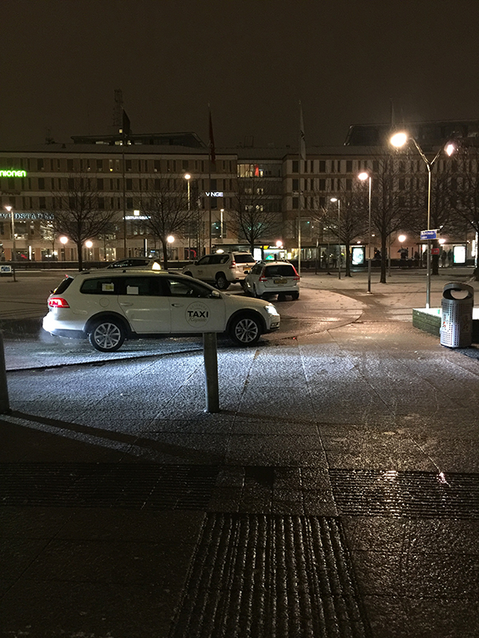

因为工作需要，这次要去瑞典、德国出两个礼拜的差，两个礼拜！跟老板汇报的时候都有点心虚，不过老板还是同意了，哈哈，工作之余顺便四处走走。

上次来德国是2017年5月，这回再次申请德国签证，申请到了1年的，据说1年后如果再有机会申请，就能拿到3年的，再往后……先别想那么远了，欧盟能不能撑过3年不好说:)
<!-- more -->

我们一行四人，北京时间1月16日13:50从首都机场出发，当地时间16:19到达斯德哥尔摩机场。瑞典和德国是一个时区，和北京差7个小时，所以到达是北京时间23:19，总共9个半小时。去年经历几次国外旅行才知道机票上的起落时间都是当地时间。在斯德哥尔摩我们乘坐18:45的飞机，转机到哥德堡，到达时间是19:45。

我们在斯德哥尔摩落地后，天就已经黑透了，这段时间刚好赶上极夜。后来我们去基律纳时极夜更明显，早上10点多太阳才升起，下午13点就落下了。我们仅在斯德哥尔摩机场待了一会，对这个城市没什么感观。

从哥德堡下了飞机就去租辆车，住在市中心的First Hotel G。这是我们酒店门口

我这是第一次来北欧，来之前专门听了晓松奇谈里“八一八欧罗巴”的北欧部分，给我印象最深刻的是：这里的人们与世无争，这里的办事效率低下，这里的饭菜美味。可是来到以后我发现这三点都被颠覆了。

# 热情的瑞典人
首先在机场租车的时候我就嘀咕，会不会遇到“服务员拒绝使用电脑，队伍排成长龙，每个人要等1个小时才租到车”的情况。让我惊喜的是租车过程非常快，柜台那里并没有遇到长龙，我们也就在基律纳租车，队伍稍微长点，办完手续也就15分钟，还是在正常的范围内。而且人工作人员都使用电脑，没见谁还打电话联络的。而且最为颠覆的是，晓松奇谈里有一个理论：通常越往北的人民对人越冷淡，越往南越热情。这一点在瑞典也没得到验证，因为每次租车时都能跟办公人员聊上几句，我们不熟悉当地路况，所以总要再额外租用一个导航仪。工作人员每次都介绍特详细，生怕没给你讲明白。那种热情是你能够直接感受出来的，不只是处于职业需要。

一个更明显的例子是我们在停车缴费时常常要求助。瑞典停车缴费都是自动化的，但是很难用，而且规则不一样。有一次我们在一个停车场缴费的时候实在搞不定那台机器了，求助一路过的小伙。刚开始没有给他解释清楚，后来我们几个人七嘴八舌终于解释清楚了，哥们帮我们操作，试了几次也总是失败。搞了十几分钟我们都不好意思了，但是那哥们很是执着，知道给我们完全搞定缴费才离开。

# 半自动化的停车场
瑞典停车的“半自动化”挺让人头疼的，前面已经说过，我们见到的停车场都是无人值守，并且缴费机器很不好用，有时候连瑞典当地人都要操作半天。瑞典的停车场很多是进入停车场前先去机器领一张条，把条放到车窗前面，离开时再把条塞到机器里付费。我们停车的时候没找到工作人员，就把车停那了，出来就发现车窗上贴了罚单——400克朗，因为我们停车前没有领条。让人郁闷的是，罚单上既没有写去哪里交罚款，也没写联系方式。左等右等，半个小时也没见一个工作人员，我就纳了闷了，贴罚单怎么就那么迅速呢？我们只好询问在那停车的瑞典人，他们还是很热情地告诉我们停车规则，但是没人知道在哪里交罚款。最后一个出租车司机特别详细地给我们指了个地儿，怕我们听不懂还在一张纸条上写下地址、门牌号，还给我们画了地图！我们不知道开着车去交罚单会不会被认为逃逸，所以只好步行过去，又走了半小时才到，郁闷的是到那发现根本不是缴费的管理处，而是一家公司。这时候刚好从门里出来一人，我们继续问他，哥们还是非常热情，只是他也不知道管理处在哪里。最后我们还是委托当地客户找了一瑞典人帮我们交了罚单。

# 这里没有北京冷
我们到达哥德堡的晚上正在下雪，虽然这里维度比较高，但是总感觉比北京暖喝一点，就算雨雪天气也没有北京那么冷。据说是因为这里处于墨西哥暖流的范围，听当地的朋友说，斯德哥尔摩比哥德堡要冷一些。我从北京来穿一件羽绒服和一件厚T恤，到了这就把厚T恤改成薄T恤了。
