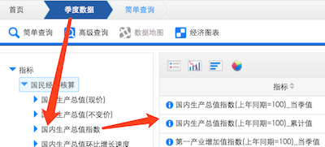
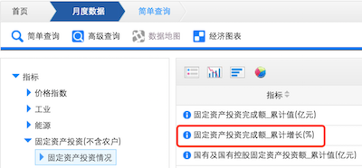
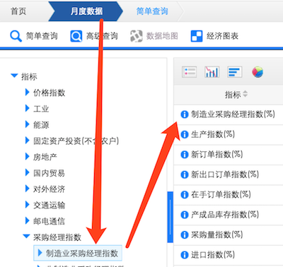
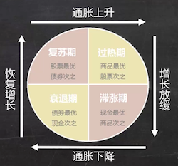

任何一件小事做好了都不容易，而理财绝对不是小事，而是在生活的方方面面琐碎之处都应该考虑的事情。幸运的是，世界上每件事总有人花费精力去仔细琢磨，因此站在他们的肩膀上让自己生活得更有效率是非常值得的。理财这件事应该早学，越早越好。

<!-- more -->

# 基本概念
## 通货膨胀
**通货膨胀的定义**：流通中的钱增加了，但实际商品、服务的数量并没有相应的增加，买同样的东西就需要花更多的钱。  
货币发行量增大、收入的增加、企业利润上涨和进口商品涨价，都会导致通货膨胀。  

> 我的问题是：除了这些还有什么因素？收入增加和货币发行量增大是不是一回事？为什么这些因素都会导致通货膨胀？

## CPI的计算公式
2015年6月，在银行账户存了10,000元，此时  
名义：10,000元，实际：10,000元。
假设活期利率=0.35%；CPI=1.9%。
则到2016年6月，这部分钱虽然名义上有10035，实际却贬值了1.55%：  
10000 × (1 + 0.35% -1.9%) = 9692  

需要注意：我国的CPI是不包含房价影响的，因此我们实际感受到的金钱贬值的幅度远比CPI的要高。

## 复利效应
复利效应的威力在很多地方都被引用过，建议还是自己拿个Excel拉张单子感受一下：

这张图展示了用1块钱做本金，从1996年以每年6%或8%的增长率，以及从2001年开始以每年6%的增长率，到2026年的收益。它体现了收益和投资年限及每年增长率的相关性。实际生活中找到一个高增长的投资渠道需要运气，6%的年复合增长是普通人可以做到的。我们最可控的因素就是投资年限，这也是投资功课要尽早做的原因。  

这是股神巴菲特的资产岁年限增长的示意图，他14岁开始投资，可以看到出现魔幻性暴增也是在他近60岁的时候：

## 投资自己才是最好的投资
现实生活中的投资效果还与另一个因素密切相关——那就是投资基数。增长率体现的是投资效率和策略是否靠谱，而当资产达到一定程度后，消费不再呈线性增长，所以投资基数越高，收入与消费成本的差将越大，利润率就越高。投资基数与自己的值钱程度密切相关，越早让自己值钱，越能尽早提升这个基数。因此说“投资自己才是最好的投资”。

> 简七论坛：[http://course.jane7.com](http://course.jane7.com)

# 富人思维
## 跨越稀缺陷阱，把钱当做手段，而不是目的  
挣钱的目的是为了达到财务自由，财务自由的目的是为了可以自由地去做自己想做的事情，让自己更幸福，这是我的金钱观。如果把钱当做目的，或者像机器一样终生劳碌，或者在梦醒的一刹那感到迷茫，那都不是我追求的。  

索罗说过：一个人的富有程度跟他能够忽略的东西数量成正比。  
当我们越缺钱时，我们就越容易在意钱本身而忽略其他。我认为：当我们缺什么的时候，都会进入这种思维定势。
不要把囤积金钱本身当做价值体现，而要把金钱所能交换取得的好处去衡量它的价值。这种思维方式是需要刻意练习的。

## 注重长期回报。
投资中最难的事——等待。这是一件反人性的事情，但是在投资中获得与众不同的收益，往往就需要能克服人的很多本能，忍耐常人所不能忍的寂寞，这背后需要理性的支撑。

## 先考虑目标，再寻找资源。
这也是伊龙马斯克所说的第一性原理，基于目标考虑实现它最需要做什么。如果倒过来，很容易被一堆资源困难所吓住，在这些资源里往往**最难办**的是钱，可是基于目标本身，也许**最需要**的并不是钱。

# 从愿望到目标到执行路径
本节的内容更像是执行力的培训——将自己的愿望分解成可实现的目标，再进一步量化分解成可执行的路径。作者为什么要将这些呢？我认为她要强调的还是想清楚自己挣钱的目的是什么，不要只顾挣钱忘了目的，也不要把很多愿望还不能实现的原因都归结为没钱。这都会导致挣钱慢慢退化成声明的目的。
让上帝的归上帝，凯撒的归凯撒。钱的问题分解成挣钱的计划和路径，钱以外的问题，要尽快落实到行动上来。只有这样才能促成实现愿望的各方面条件逐步具备。  

在具体方法上，她提出两点：

- 量化，即多角度具体化
- 分解，即把目标拆分成最小可行步骤

# 让目标可控
本节为把控目标提供了几个工具：

- 目标分析卡。确认达成愿望是否要实现预定目标。
- 目标量化卡。从时间、预算、精力和外部支持上量化达成目标需要的支持。
- 目标分解卡。把大目标分解成可行的小目标，并确定里程碑和对应时间。
    - 迭代调整。这一点是我添加的，因为在执行过程中可能因为各种原因而变化，要让调整体现出来，而不是覆盖修改原先的分解项。如果一个大目标的实现跨度比较长，尤其需要这么做——它可以让执行预期越来越精准，也可以为类似的工作提供参考。人们往往高估自己的执行效率，反正我是这样的。

点击[目标管理模板](https://github.com/palanceli/blog/blob/master/source/_attachment/201805LiCaiNote/%E7%9B%AE%E6%A0%87%E7%AE%A1%E7%90%86.xlsx)可以下载。

# 那些必知的宏观经济指标
## 关注经济指标的角度：
- 整体经济
- 实体行业
- 金融体系
- 个体生活  

这和职业规划中跳槽时考虑的角度是一样的。

## 判断经济景气度
### GDP国内生产总值
衡量一个国家一定时期内全部生产活动的总产出，一般通过`同比增长百分比（比去年同时期）`来判断经济总体增长的情况。  
可以去[这里](http://data.stats.gov.cn/easyquery.htm?cn=B01)选择`季度数据 > 指标 > 国民经济核算 > 国内生产总值指数`查看：  

国民经济主要由`消费`、`投资`、`政府采购`和`进出口`组成。  

`固定资产投资增速`反映`投资`情况，用来衡量固定资产总投资量的变化，数字越大，说明固定资产投资增长越多。可以去[这里](http://data.stats.gov.cn/easyquery.htm?cn=B01)选择`月度数据 > 指标 > 固定资产投资（不含农户） > 固定资产投资情况`查看：

`社会消费品零售总额`反应`消费`，用来衡量消费品（含商品和服务）销售总额的增长，数字越大，说明社会总消费对应的总额增长越快。可以去[这里](http://data.stats.gov.cn/easyquery.htm?cn=B01)选择`月度数据 > 指标 > 国内贸易 > 社会消费品零售总额`查看：

`出口增速`，描述出口量的月度变化，数字越大，说明出口量增长越多。可以去[这里](http://data.stats.gov.cn/easyquery.htm?cn=B01)选择`月度数据 > 指标 > 对外经济 > 进出口总额`查看：

### PMI采购经理人指数
经济景气度的领先指标。当PMI＞50%时，说明经济在发展；当PMI＜50%时，说明经济在衰退。它和GDP有很高的相关性，有时甚至会比GDP早几个月。
原因是GDP反映的是结果，而PMI反应从生产、订单、商品价格、存活等等从生产链条的初期到完成的完整指数。可以去[这里](http://data.stats.gov.cn/easyquery.htm?cn=B01)选择`月度数据 > 指标 > 采购经理指数 > 制造业采购经理指数`查看：  

### 判断货币供应的松紧
`M2：`总货币供应量的统计口径（基础货币+衍生货币），它反映了整个经济中货币和衍生货币（信贷）的总量，判断货币供应的松紧。可以去[这里](http://data.stats.gov.cn/easyquery.htm?cn=B01)选择`月度数据 > 指标 > 金融 > 货币供应量`查看：

`存贷款基准利率`：银行存贷款利率的制定基准，数字越小，代表较为宽松的货币政策，抑制存款，鼓励贷款。  
`存款准备金率：`规定各大银行在央行存放的准备金比例，直接制约银行的放贷能力。数字越低，越鼓励宽松信贷。  
这两个指标可以去[中国人民银行网站](http://pbc.gov.cn)，选择`货币政策 > 货币政策工具`，查看：

### 判断是否有通货膨胀
`CPI（消费者物价指数）：`衡量日常消费的一揽子商品和服务的价格变化。数字越大，表示通胀压力越大，以不超过3%为宜。注意：这个指标是不包含房价的。可以去[这里](http://data.stats.gov.cn/easyquery.htm?cn=B01)选择`月度数据 > 指标 > 价格指数 > 居民消费价格分类指数 > 全国居民消费价格分类指数`查看：  

`PPI（工业生产者出厂价格指数）：`衡量工业产品出厂价格总水平的变动程度。数字越大，工业产出产品价格增长越大。可以去[这里](http://data.stats.gov.cn/easyquery.htm?cn=B01)选择`月度数据 > 指标 > 价格指数 > 工业生产者出厂价格分类指数 > 工业生产者出厂价格指数`查看：  

这两个指数都反映通货膨胀的情况，CPI反应消费环节，PPI反应消费前的生产、流通环节。

## 美林时钟
美林时钟体现的是经济不同的周期是由不同的原因以及不同的现象，就像一年中的四季变换。但与自然不同之处在于：经济周期是人的社会活动导致，当人了解了经济规律，经济规律就失效了。所以美林时钟的作用在于揭示规律的存在，而不要生搬规律本身。

# 推荐阅读
《穿越历史聊经济》汪凌燕/汪通（阅读难度★★☆☆☆）  
《逃不开的经济周期》拉斯·特维德（阅读难度★★★☆☆）  

雷·达里奥的“三部曲”：  
[《经济是如何运行的》](http://wemedia.ifeng.com/7986197/wemedia.shtml)，也可以看[视频](https://open.163.com/movie/2016/6/I/Q/MBPO9ED98_MBPO9S8IQ.html)  
[《论国家经济成败的原因》](http://new.qq.com/cmsn/20160428/20160428041629)2011年6月  
[《关于去杠杆化的深入理解》](http://www.360doc.com/content/16/0805/22/33557079_581108503.shtml)2012年2月  

[统计数据是如何产生的——生产者价格指数（PPI）](http://www.stats.gov.cn/tjzs/spdb/tjxcycb/201109/t20110914_57080.html)
[从三个影响因子，探讨寻找人生目标的可操作性](https://www.jianshu.com/p/966899f97c0f)
[你费尽心思优秀，却得了场“精英病”丨来自耶鲁的提醒](https://mp.weixin.qq.com/s/PnL4a3x_H3Vo4BBlAuzYfA)
[为什么有些人嗑瓜子可以一小时以上，看书学习却不可以？](https://mp.weixin.qq.com/s/MU9sGUeKYuESYnWbHlObnA)
[年底迷思：我手中的期权值多少钱？](https://mp.weixin.qq.com/s?src=3&timestamp=1526221369&ver=1&signature=ev6qs1lpZnJ2eBr2muppkncDByeKuRrtIm4IVsoBbhfopLjZ7k5IQNWsnkiEY*zjG40svuh8CHHPzjXLydem7z4fYuh9iLj84fJsIeFheuNm8bFDhlg4eahtSGR4ErKuI1MGoFrVnT*f60zAYDbAOh3yjZLVWaMrT6k7hc9uOVM=)

[“财务自由”终极书单:从入门到进阶](https://mp.weixin.qq.com/s?src=3&timestamp=1526222367&ver=1&signature=QanNwYgIQxaM0LnBKvzSYQKpcC7BwZTvScrvDmffnaC5RF87ARYgZximTuRI6Hd3UuExXSS7wPxkP4G6A*3GPz482iXW65vFFs4FuXeqHx*tCi*WUNXxy193y*HFrO3Ze93BhT1xEUIn1iry9e*paQHbV4hYr4Gxu8mF6bnLZYY=)  
《小狗钱钱》  
《解读基金》  