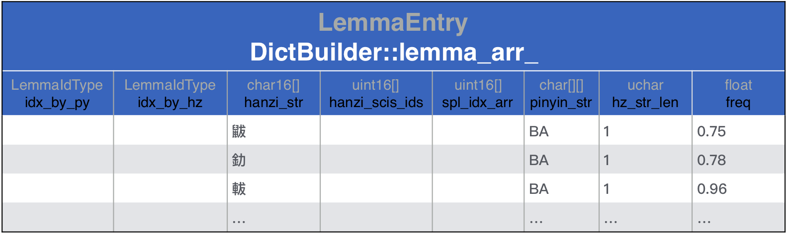
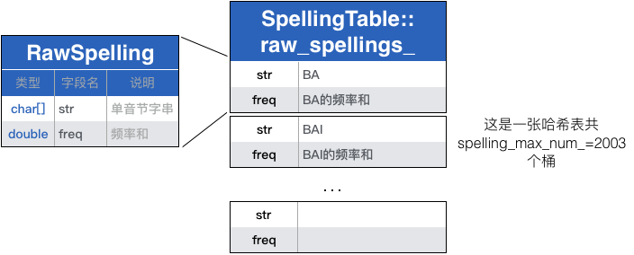

# 创建词库的命令
- 编译时自动生成。  
在`libgooglepinyin/data/CMakeLists.txt`中有如下命令：
  ``` cmake
  add_custom_command(OUTPUT dict_pinyin.dat
        DEPENDS dictbuilder
        COMMAND dictbuilder 
        ${CMAKE_CURRENT_SOURCE_DIR}/rawdict_utf16_65105_freq${DATA_SUFFIX}.txt 
        ${CMAKE_CURRENT_SOURCE_DIR}/valid_utf16${DATA_SUFFIX}.txt 
        ${CMAKE_CURRENT_BINARY_DIR}/dict_pinyin.dat)
  ```
  它会在编译完成后执行`dictbuilder`生成词库。词库的生成路径为：`libgooglepinyin/build/data/dict_pinyin.dat`。

- 通过`dictbuilder`生成。  
`dictbuilder`是`libgooglepinyin`的子模块，是用来生成词库的可执行程序。我在代码`dictbuilder/pinyinime_dictbuild.er.cpp`中，将词库默认生成路径也改成了该路径，因此调试的时候，可以不用设置命令行参数，直接调试。

# 词库生成过程
## 输入输出文件
`dicebuilder`的输入参数有两个：
1. `libgooglepinyin/data/rawdict_utf16_65105_freq.txt`包含了65105行数据：
  ```
  鼥 0.750684002197 1 ba
  釛 0.781224156844 1 ba
  軷 0.9691786136 1 ba
  釟 0.9691786136 1 ba
  蚆 1.15534975655 1 ba
  弝 1.52927012045 1 ba
  ……
  ```
2. `libgooglepinyin/data/valid_utf16.txt`包含了16466个汉字：
  ```
  〇一丁七万丈三上下丌不与丏丐丑专且丕世丗丘丙业丛东丝丞丟両丢两……
  ```
  
`dicebuilder`的输出参数指定了词库bin文件的生成路径。

## 词库生成代码
```
// 加载数据，在内存中生成数据结构
> dictbuilder/pinyinime_dictbuilder.cpp:54 dict_trie->build_dict(...)
 > googlepinyin-static/dicttrie.cpp:113 dict_builder->build_dict(...)
  // 🏁1 将rawdict_utf16_65105_freq.txt中的内容读入DictBuilder::lemma_arr_
  > googlepinyin-static/dictbuilder.cpp:513 read_raw_dict(...) 
  // 将raw_spellings_按照字母排序，并拷贝到SpellingTable::spelling_buf_
  > googlepinyin-static/dictbuilder.cpp:524 spl_table_->arrange(...)
  > 🏁2 googlepinyin-static/dictbuilder.cpp:530 spl_trie.construct(...)
// 将内存中的词库写入文件
> dictbuilder/pinyinime_dictbuilder.cpp:67 dict_trie->save_dict(...)
```
### 🏁1 将rawdict_utf16_65105_freq.txt中的内容读入DictBuilder::lemma_arr_
`read_raw_dict(...)`的主要工作就是组织`DictBuilder::lemma_arr_`，该结构体的原型如下：
``` c++
// googlepinyin-static/dictdef.h:150
struct LemmaEntry {
  LemmaIdType idx_by_py;
  LemmaIdType idx_by_hz;
  char16 hanzi_str[kMaxLemmaSize + 1];                  // 中文词串

  // The SingleCharItem id for each Hanzi.
  uint16 hanzi_scis_ids[kMaxLemmaSize];

  uint16 spl_idx_arr[kMaxLemmaSize + 1];
  char pinyin_str[kMaxLemmaSize][kMaxPinyinSize + 1];   [8][6+1]拼音串utf16表示
  unsigned char hz_str_len;                             // 中文词串长度
  float freq;                                           // 词频
};
```
根据函数`read_raw_dict(...)`可以将每个字段的含义和数据文件`rawdict_utf16_65105_freq.txt`对应起来。

函数`read_raw_dict(...)`更像是一个词法分析器，它每次读取`rawdict_utf16_65105_freq.txt`中的一行，每一行个元素又以空格隔开，称为一个token。按顺序读取每一个token放入`lemma_arr_`：
``` c++
// googlepinyin-static/dictbuilder.cpp:513
size_t DictBuilder::read_raw_dict(const char* fn_raw,
                                  const char *fn_validhzs,
                                  size_t max_item) {
  ...
  utf16_reader.open(fn_raw, kReadBufLen * 10)                       // 打开rawdict_utf16_65105_freq.txt
  
  ...
  valid_hzs = read_valid_hanzis(fn_validhzs, &valid_hzs_num);       // 读取valid_utf16.txt 得到所有汉字

  for (size_t i = 0; i < max_item; i++) {                           // 读取rawdict所有行
    utf16_reader.readline(read_buf, kReadBufLen)
    ...

    token = utf16_strtok(to_tokenize, &token_size, &to_tokenize);   // token1：中文词串
    ...
    size_t lemma_size = utf16_strlen(token);
    ... 
    utf16_strcpy(lemma_arr_[i].hanzi_str, token);

    lemma_arr_[i].hz_str_len = token_size;                          // 中文词串长度

    token = utf16_strtok(to_tokenize, &token_size, &to_tokenize);   // token2：词频
    ...
    lemma_arr_[i].freq = utf16_atof(token);

    ...
    token = utf16_strtok(to_tokenize, &token_size, &to_tokenize);   // token3: GBK标志
    // 如果valid_utf16.txt没有内容，则只读取GBK=1的行，其余的抛弃
    // 如果valid_utf16.txt有内容，则只读取在该文件范围内的中文词串，其余的抛弃
    ...
 
    bool spelling_not_support = false;
    for (size_t hz_pos = 0; hz_pos < (size_t)lemma_arr_[i].hz_str_len; 
         hz_pos++) {                                                // token4: 拼音串
      token = utf16_strtok(to_tokenize, &token_size, &to_tokenize);
      ...
      utf16_strcpy_tochar(lemma_arr_[i].pinyin_str[hz_pos], token);
      // 所有拼音都转成大写，除了ZH/CH/SH转为Zh/Ch/Sh
      format_spelling_str(lemma_arr_[i].pinyin_str[hz_pos]); 

      if (!spl_table_->put_spelling(lemma_arr_[i].pinyin_str[hz_pos],
                                    lemma_arr_[i].freq)) {
        spelling_not_support = true;
        break;
      }
    }
    ...
  }
  ...
}

```
在读取中文词的拼音串时，分隔成每个字的读音，用`SpellingTable::raw_spellings_`该音的累计频率，用`SpellingTable::total_freq_`累计所有音的总频率：
``` c++
// googlepinyin-satic/spellingtable.cpp:138
bool SpellingTable::put_spelling(const char* spelling_str, double freq) {
  ...

  total_freq_ += freq;                                      // 总词频累加

  size_t hash_pos = get_hash_pos(spelling_str);

  raw_spellings_[hash_pos].str[spelling_size_ - 1] = '\0';

  if (strncmp(raw_spellings_[hash_pos].str, spelling_str,
              spelling_size_ - 1) == 0) {
    raw_spellings_[hash_pos].freq += freq;                  // 同音节词频累加
    return true;
  }

  // 以下解决碰撞问题，基本策略还是让同音节词频累加
  ...
}
```

--------
综上所述，🏁1逐行读取输入文件`libgooglepinyin/data/rawdict_utf16_65105_freq.txt`：
```
鼥 0.750684002197 1 ba
釛 0.781224156844 1 ba
軷 0.9691786136 1 ba
……
```
按文件顺序组织成数据结构：`DictBuilder::lemma_arr_`，该结构体的原型如下：
``` c++
// googlepinyin-static/dictdef.h:150
struct LemmaEntry {
  LemmaIdType idx_by_py;
  LemmaIdType idx_by_hz;
  char16 hanzi_str[kMaxLemmaSize + 1];                  // 中文词串

  // The SingleCharItem id for each Hanzi.
  uint16 hanzi_scis_ids[kMaxLemmaSize];

  uint16 spl_idx_arr[kMaxLemmaSize + 1];
  char pinyin_str[kMaxLemmaSize][kMaxPinyinSize + 1];   [8][6+1]拼音串utf16表示
  unsigned char hz_str_len;                             // 中文词串长度
  float freq;                                           // 词频
};
```
组织后的结果为：



同时使用`SpellingTable::raw_spellings_`记录每个单音的累计频率，使用`SpellingTable::total_freq_`记录所有音频率总和。其中`SpellingTable::raw_spellings_`中每个元素的原型为：
``` c++
// googlepinyin-static/spellingtable.h:29
typedef struct {
  char str[kMaxSpellingSize + 1];
  double freq;
} RawSpelling, *PRawSpelling;
```
组织后的结果为：


