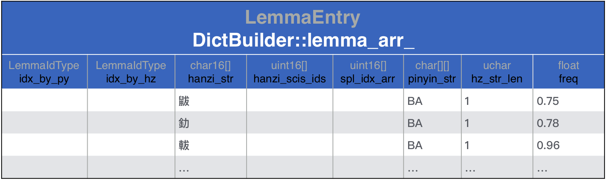
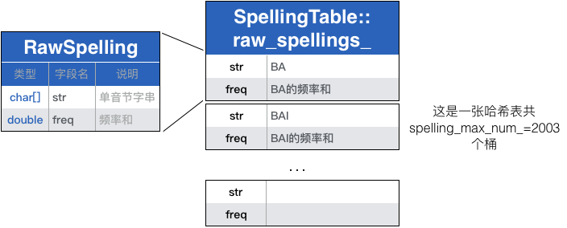
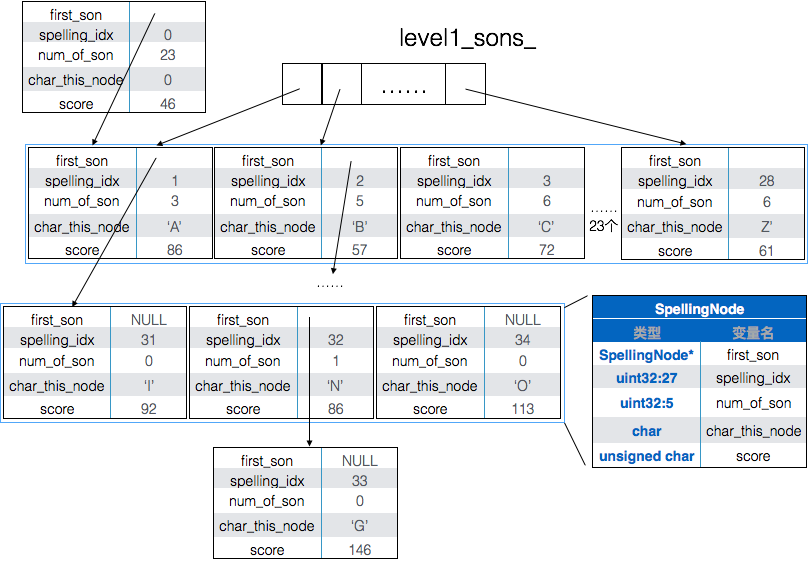

libGooglePinyin的词库生成过程。
<!-- more -->
# 输入输出文件
`dicebuilder`的输入参数有两个：
1. `libgooglepinyin/data/rawdict_utf16_65105_freq.txt`包含了65105行数据：
  ```
  鼥 0.750684002197 1 ba
  釛 0.781224156844 1 ba
  軷 0.9691786136 1 ba
  釟 0.9691786136 1 ba
  蚆 1.15534975655 1 ba
  弝 1.52927012045 1 ba
  ……
  ```
2. `libgooglepinyin/data/valid_utf16.txt`包含了16466个汉字：
  ```
  〇一丁七万丈三上下丌不与丏丐丑专且丕世丗丘丙业丛东丝丞丟両丢两……
  ```
  
`dicebuilder`的输出参数指定了词库bin文件的生成路径。

# 词库生成代码
```
// 加载数据，在内存中生成数据结构
> dictbuilder/pinyinime_dictbuilder.cpp:54 dict_trie->build_dict(...)
 > googlepinyin-static/dicttrie.cpp:113 dict_builder->build_dict(...)

  // 🏁1 将rawdict_utf16_65105_freq.txt中的内容读入DictBuilder::lemma_arr_
  > googlepinyin-static/dictbuilder.cpp:513 read_raw_dict(...) 

  // 将raw_spellings_按照字母排序，并拷贝到SpellingTable::spelling_buf_
  > googlepinyin-static/dictbuilder.cpp:524 spl_table_->arrange(...)

  // 🏁2 
  > googlepinyin-static/dictbuilder.cpp:530 spl_trie.construct(...)
// 将内存中的词库写入文件
> dictbuilder/pinyinime_dictbuilder.cpp:67 dict_trie->save_dict(...)
```


## 🏁1 将rawdict_utf16_65105_freq.txt中的内容读入DictBuilder::lemma_arr_
`read_raw_dict(...)`的主要工作就是组织`DictBuilder::lemma_arr_`，该结构体的原型如下：
``` c++
// googlepinyin-static/dictdef.h:150
struct LemmaEntry {
  LemmaIdType idx_by_py;
  LemmaIdType idx_by_hz;
  char16 hanzi_str[kMaxLemmaSize + 1];                  // 中文词串

  // The SingleCharItem id for each Hanzi.
  uint16 hanzi_scis_ids[kMaxLemmaSize];

  uint16 spl_idx_arr[kMaxLemmaSize + 1];
  char pinyin_str[kMaxLemmaSize][kMaxPinyinSize + 1];   [8][6+1]拼音串utf16表示
  unsigned char hz_str_len;                             // 中文词串长度
  float freq;                                           // 词频
};
```
根据函数`read_raw_dict(...)`可以将每个字段的含义和数据文件`rawdict_utf16_65105_freq.txt`对应起来。

函数`read_raw_dict(...)`更像是一个词法分析器，它每次读取`rawdict_utf16_65105_freq.txt`中的一行，每一行个元素又以空格隔开，称为一个token。按顺序读取每一个token放入`lemma_arr_`：
``` c++
// googlepinyin-static/dictbuilder.cpp:513
size_t DictBuilder::read_raw_dict(const char* fn_raw,
                                  const char *fn_validhzs,
                                  size_t max_item) {
  ...
  utf16_reader.open(fn_raw, kReadBufLen * 10)                       // 打开rawdict_utf16_65105_freq.txt
  
  ...
  valid_hzs = read_valid_hanzis(fn_validhzs, &valid_hzs_num);       // 读取valid_utf16.txt 得到所有汉字

  for (size_t i = 0; i < max_item; i++) {                           // 读取rawdict所有行
    utf16_reader.readline(read_buf, kReadBufLen)
    ...

    token = utf16_strtok(to_tokenize, &token_size, &to_tokenize);   // token1：中文词串
    ...
    size_t lemma_size = utf16_strlen(token);
    ... 
    utf16_strcpy(lemma_arr_[i].hanzi_str, token);

    lemma_arr_[i].hz_str_len = token_size;                          // 中文词串长度

    token = utf16_strtok(to_tokenize, &token_size, &to_tokenize);   // token2：词频
    ...
    lemma_arr_[i].freq = utf16_atof(token);

    ...
    token = utf16_strtok(to_tokenize, &token_size, &to_tokenize);   // token3: GBK标志
    // 如果valid_utf16.txt没有内容，则只读取GBK=1的行，其余的抛弃
    // 如果valid_utf16.txt有内容，则只读取在该文件范围内的中文词串，其余的抛弃
    ...
 
    bool spelling_not_support = false;
    for (size_t hz_pos = 0; hz_pos < (size_t)lemma_arr_[i].hz_str_len; 
         hz_pos++) {                                                // token4: 拼音串
      token = utf16_strtok(to_tokenize, &token_size, &to_tokenize);
      ...
      utf16_strcpy_tochar(lemma_arr_[i].pinyin_str[hz_pos], token);
      // 所有拼音都转成大写，除了ZH/CH/SH转为Zh/Ch/Sh
      format_spelling_str(lemma_arr_[i].pinyin_str[hz_pos]); 

      if (!spl_table_->put_spelling(lemma_arr_[i].pinyin_str[hz_pos],
                                    lemma_arr_[i].freq)) {
        spelling_not_support = true;
        break;
      }
    }
    ...
  }
  ...
}

```
在读取中文词的拼音串时，分隔成每个字的读音，用`SpellingTable::raw_spellings_`该音的累计频率，用`SpellingTable::total_freq_`累计所有音的总频率：
``` c++
// googlepinyin-satic/spellingtable.cpp:138
bool SpellingTable::put_spelling(const char* spelling_str, double freq) {
  ...

  total_freq_ += freq;                                      // 总词频累加

  size_t hash_pos = get_hash_pos(spelling_str);

  raw_spellings_[hash_pos].str[spelling_size_ - 1] = '\0';

  if (strncmp(raw_spellings_[hash_pos].str, spelling_str,
              spelling_size_ - 1) == 0) {
    raw_spellings_[hash_pos].freq += freq;                  // 同音节词频累加
    return true;
  }

  // 以下解决碰撞问题，基本策略还是让同音节词频累加
  ...
}
```

--------
综上所述，🏁1逐行读取输入文件`libgooglepinyin/data/rawdict_utf16_65105_freq.txt`：
```
鼥 0.750684002197 1 ba
釛 0.781224156844 1 ba
軷 0.9691786136 1 ba
……
```
按文件顺序组织成数据结构：`DictBuilder::lemma_arr_`，该结构体的原型如下：
``` c++
// googlepinyin-static/dictdef.h:150
struct LemmaEntry {
  LemmaIdType idx_by_py;
  LemmaIdType idx_by_hz;
  char16 hanzi_str[kMaxLemmaSize + 1];                  // 中文词串

  // The SingleCharItem id for each Hanzi.
  uint16 hanzi_scis_ids[kMaxLemmaSize];

  uint16 spl_idx_arr[kMaxLemmaSize + 1];
  char pinyin_str[kMaxLemmaSize][kMaxPinyinSize + 1];   [8][6+1]拼音串utf16表示
  unsigned char hz_str_len;                             // 中文词串长度
  float freq;                                           // 词频
};
```
组织后的结果为：



同时使用`SpellingTable::raw_spellings_`记录每个单音的累计频率，使用`SpellingTable::total_freq_`记录所有音频率总和。其中`SpellingTable::raw_spellings_`中每个元素的原型为：
``` c++
// googlepinyin-static/spellingtable.h:29
typedef struct {
  char str[kMaxSpellingSize + 1];
  double freq;
} RawSpelling, *PRawSpelling;
```
组织后的结果为：



## 🏁2 spl_trie.construct(...)

``` c++
// myexe_test/spellingtrie.cpp:287
bool SpellingTrie::construct(const char* spelling_arr, size_t item_size,
                             size_t item_num, float score_amplifier,
                             unsigned char average_score) {
  ...
  // 🏁2.1
  root_->first_son = construct_spellings_subset(0, spelling_num_, 0, root_);

  // Root's score should be cleared.
  root_->score = 0;

  if (NULL == root_->first_son)
    return false;

  h2f_start_[0] = h2f_num_[0] = 0;

  if (!build_f2h())
    return false;

#ifdef ___BUILD_MODEL___
  if (kPrintDebug0) {
    printf("---SpellingTrie Nodes: %zd\n", node_num_);
  }
  return build_ym_info();
#else
  return true;
#endif
}
```

### 🏁2.1 SpellingTrie::construct_spellings_subset(...)
该函数的实现比较复杂，它采用递归的方式构建了拼音的trie树，结构如下：

``` c++
// myexe_test/spellingtrie.cpp:476
// 其中start和end是相对于spelling_buf_的偏移；
// level是构建第几层trie树，例如：A~Z是第0层，AI、AN…是第1层
SpellingNode* SpellingTrie::construct_spellings_subset(
    size_t item_start, size_t item_end, size_t level, SpellingNode* parent) {
  ...
  SpellingNode *first_son = NULL;
  uint16 num_of_son = 0;
  unsigned char min_son_score = 255;

  const char *spelling_last_start = spelling_buf_ + spelling_size_ * item_start;
  char char_for_node = spelling_last_start[level];
  ...

  // 计算当前层共需要多少个节点
  for (size_t i = item_start + 1; i < item_end; i++) {
    const char *spelling_current = spelling_buf_ + spelling_size_ * i;
    char char_current = spelling_current[level];
    if (char_current != char_for_node) {
      num_of_son++;
      char_for_node = char_current;
    }
  }
  num_of_son++;

  // 分配该层节点
#ifdef ___BUILD_MODEL___
  node_num_ += num_of_son;
#endif
  first_son = new SpellingNode[num_of_son];
  memset(first_son, 0, sizeof(SpellingNode)*num_of_son);

  // Now begin construct tree
  size_t son_pos = 0;

  spelling_last_start = spelling_buf_ + spelling_size_ * item_start;
  char_for_node = spelling_last_start[level];

  bool spelling_endable = true;
  if (spelling_last_start[level + 1] != '\0')
    spelling_endable = false;

  size_t item_start_next = item_start;

  for (size_t i = item_start + 1; i < item_end; i++) {
    // 遍历spelling_buf_，把关注的层级节点安放就位
    const char *spelling_current = spelling_buf_ + spelling_size_ * i;
    char char_current = spelling_current[level];
    assert(is_valid_spl_char(char_current));

    if (char_current != char_for_node) {// 对于第0层，当从A...遍历到B...时，将A就位
      // Construct a node
      SpellingNode *node_current = first_son + son_pos;
      node_current->char_this_node = char_for_node;

      // For quick search in the first level
      if (0 == level)
        level1_sons_[char_for_node - 'A'] = node_current;

      if (spelling_endable) {
        node_current->spelling_idx = kFullSplIdStart + item_start_next;
      }
      // 如果A下还有更多子节点，则通过递归将子节点都就位
      if (spelling_last_start[level + 1] != '\0' || i - item_start_next > 1) {
        size_t real_start = item_start_next;
        if (spelling_last_start[level + 1] == '\0')
          real_start++;

        node_current->first_son =
            construct_spellings_subset(real_start, i, level + 1,
                                       node_current);

        if (real_start == item_start_next + 1) {
          uint16 score_this = static_cast<unsigned char>(
              spelling_last_start[spelling_size_ - 1]);
          if (score_this < node_current->score)
            node_current->score = score_this;
        }
      } else {
        node_current->first_son = NULL;
        node_current->score = static_cast<unsigned char>(
            spelling_last_start[spelling_size_ - 1]);
      }

      if (node_current->score < min_son_score)
        min_son_score = node_current->score;

      bool is_half = false;
      if (level == 0 && is_szm_char(char_for_node)) {
        node_current->spelling_idx =
          static_cast<uint16>(char_for_node - 'A' + 1);

        if (char_for_node > 'C')
          node_current->spelling_idx++;
        if (char_for_node > 'S')
          node_current->spelling_idx++;

        h2f_num_[node_current->spelling_idx] = i - item_start_next;
        is_half = true;
      } else if (level == 1 && char_for_node == 'h') {
        char ch_level0 = spelling_last_start[0];
        uint16 part_id = 0;
        if (ch_level0 == 'C')
          part_id = 'C' - 'A' + 1 + 1;
        else if (ch_level0 == 'S')
          part_id = 'S' - 'A' + 1 + 2;
        else if (ch_level0 == 'Z')
          part_id = 'Z' - 'A' + 1 + 3;
        if (0 != part_id) {
          node_current->spelling_idx = part_id;
          h2f_num_[node_current->spelling_idx] = i - item_start_next;
          is_half = true;
        }
      }

      if (is_half) {
        if (h2f_num_[node_current->spelling_idx] > 0)
          h2f_start_[node_current->spelling_idx] =
            item_start_next + kFullSplIdStart;
        else
          h2f_start_[node_current->spelling_idx] = 0;
      }

      // for next sibling
      spelling_last_start = spelling_current;
      char_for_node = char_current;
      item_start_next = i;
      spelling_endable = true;
      if (spelling_current[level + 1] != '\0')
        spelling_endable = false;

      son_pos++;
    }
  }

  // the last one
  SpellingNode *node_current = first_son + son_pos;
  node_current->char_this_node = char_for_node;

  // For quick search in the first level
  if (0 == level)
    level1_sons_[char_for_node - 'A'] = node_current;

  if (spelling_endable) {
    node_current->spelling_idx = kFullSplIdStart + item_start_next;
  }

  if (spelling_last_start[level + 1] != '\0' ||
      item_end - item_start_next > 1) {
    size_t real_start = item_start_next;
    if (spelling_last_start[level + 1] == '\0')
      real_start++;

    node_current->first_son =
        construct_spellings_subset(real_start, item_end, level + 1,
                                   node_current);

    if (real_start == item_start_next + 1) {
      uint16 score_this = static_cast<unsigned char>(
          spelling_last_start[spelling_size_ - 1]);
      if (score_this < node_current->score)
        node_current->score = score_this;
    }
  } else {
    node_current->first_son = NULL;
    node_current->score = static_cast<unsigned char>(
        spelling_last_start[spelling_size_ - 1]);
  }

  if (node_current->score < min_son_score)
    min_son_score = node_current->score;

  assert(son_pos + 1 == num_of_son);

  bool is_half = false;
  if (level == 0 && szm_is_enabled(char_for_node)) {
    node_current->spelling_idx = static_cast<uint16>(char_for_node - 'A' + 1);

    if (char_for_node > 'C')
      node_current->spelling_idx++;
    if (char_for_node > 'S')
      node_current->spelling_idx++;

    h2f_num_[node_current->spelling_idx] = item_end - item_start_next;
    is_half = true;
  } else if (level == 1 && char_for_node == 'h') {
    char ch_level0 = spelling_last_start[0];
    uint16 part_id = 0;
    if (ch_level0 == 'C')
      part_id = 'C' - 'A' + 1 + 1;
    else if (ch_level0 == 'S')
      part_id = 'S' - 'A' + 1 + 2;
    else if (ch_level0 == 'Z')
      part_id = 'Z' - 'A' + 1 + 3;
    if (0 != part_id) {
      node_current->spelling_idx = part_id;
      h2f_num_[node_current->spelling_idx] = item_end - item_start_next;
      is_half = true;
    }
  }
  if (is_half) {
    if (h2f_num_[node_current->spelling_idx] > 0)
      h2f_start_[node_current->spelling_idx] =
        item_start_next + kFullSplIdStart;
    else
      h2f_start_[node_current->spelling_idx] = 0;
  }

  parent->num_of_son = num_of_son;
  parent->score = min_son_score;
  return first_son;
```