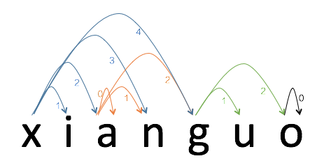

# 阅读下面这段代码，说出它的目的，每个成员函数的作用，最终的输出结果以及设计思路
<!-- more -->

``` java
public class PinyinNet {
    private ArrayList<String> mPyMap = ["a", "ai", "an", "ang", "ao",
    ...
    "gu", "gua", "guai", "guan", "guang", "gui", "gun", "guo", ...
    "o", "ou", ...
    "xi", "xia", "xian", ...
    ];// 共412个合法的音节串，按字母序排列

    public ArrayList<Integer> findValidSyllable(String str){
        ArrayList<Integer> result = new ArrayList<Integer>();
        if(str.length() == 0)
            return result;
        boolean bHit = false;

        for(int i=0; i<mPyMap.size(); i++){
            String syllable = mPyMap.get(i);
            if(syllable.charAt(0) > str.charAt(0))
                return result;
            
            if(str.startsWith(syllable))
                result.add(syllable.length() - 1);
        }
        return result;
    }

    public ArrayList<ArrayList<Integer> > preProcess(String inputStr){
        ArrayList<ArrayList<Integer> > seg = new ArrayList<ArrayList<Integer> >();
        for(int i=0; i<inputStr.length(); i++){
            seg.add(this.findValidSyllable(inputStr.substring(i)));
        }
        return seg;
    }

    private void printPyNet(String inputStr, ArrayList<Integer> pyNet, ArrayList<ArrayList<Integer> > seg){
        String str = new String();
        for(Integer item : pyNet){
            int nStart = (item.intValue() >> 16) & 0x0000ffff;
            int nIdx = item.shortValue();
            int nEnd = nStart + seg.get(nStart).get(nIdx) + 1;
            str = str.concat(inputStr.substring(nStart, nEnd));
            str = str.concat("'");
        }
        System.out.println(str);
    }

    public void MainProc(String inputStr){
        ArrayList<ArrayList<Integer> > seg = this.preProcess(inputStr);

        int nStart = 0;
        int nIdx = 0;
        ArrayList<Integer> pyNet = new ArrayList<Integer>();
        while(true){
            if(nStart<seg.size() && seg.get(nStart).size() !=0 && nIdx<seg.get(nStart).size()){
                pyNet.add(((nStart << 16)&0xffff0000) |(nIdx & 0x0000ffff));
                int nStep = seg.get(nStart).get(nIdx) + 1;
                nStart += nStep;
                nIdx = 0;

                if(nStart == inputStr.length()){
                    this.printPyNet(inputStr, pyNet, seg);
                }
            }else{
                if(nStart == 0)
                    return;
                Integer item = pyNet.remove(pyNet.size() - 1);
                nStart = (item.intValue() >> 16) & 0x0000ffff;
                nIdx = item.shortValue() + 1;
            }
        }

    }

    public static void main(String [] args){        
        PinyinNet pinyinNet = new PinyinNet();

        pinyinNet.MainProc("xianguo");
    }
}
```
* 成员函数`findValidSyllable(String str)`返回str开头处所有合法的音节串。
* 成员函数`preProcess(String inputStr)`则从左到右，以inputStr每一个字符为起点，找到所有合法的音节串，并返回。对于"xianguo"，它返回的就是：
`[[1, 2, 3, 4], [], [0, 1, 2], [], [1, 2], [], [0]]`
即：

* 成员函数`MainProc(String inputStr)`尝试从左到右按照弧线走通整个字符串，如果能走通，则向右走一条弧线；如果走不通，则向左回退一条弧线，并尝试当前节点的下一条弧线。如果成功走到头，也向左退回一条弧线，并尝试当前节点的下一条弧线。
例如：
`xi-a-n`最后一个n再也无路可走，则退回再走：
`xi-an-gu-o`成功，打印。退回一条弧线再走：
`xi-an-guo`成功，打印，再退回一条弧线再走：
`xi-ang-u`无路可走，退回再走：
`xia-n`无路可走，退回再走：
`xian-gu-o`成功，打印，退回再走：
`xian-guo`成功，打印，退回再走：
`xiang-u`无路可走，且无路可退，则退出。

所以最终的输出结果为：
```
xi'an'gu'o'
xi'an'guo'
xian'gu'o'
xian'guo'
```