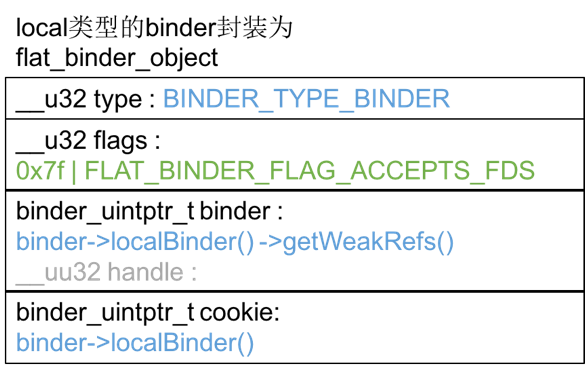

前文中曾经遇到过Parcel，从命名上知道他负责数据打包。在checkService的请求/响应体系中，Parcel只打包了基本数据类型，如Int32、String16……后面还要用于打包抽象数据类型flat_binder_object，这会稍微复杂一些，因此有必要拿出来单独研究。我们从Parcel::writeInterfaceToken(…)追起，它的层层调用关系如下，这些函数都在frameworks/native/libs/binder/Parcel.cpp文件中，行数和函数名为:
>582    writeInterfaceToken(…)
>748      Parcel::writeInt32(int32_t val)
>1149       Parcel::writeAligned(val)

所有的基本数据类型的打包最后都由writeAligned(…)实现的，其内部逻辑也非常简单，
frameworks/native/libs/binder/Parcel.cpp:1149
``` c++
template<class T>
status_t Parcel::writeAligned(T val) {
    COMPILE_TIME_ASSERT_FUNCTION_SCOPE(PAD_SIZE_UNSAFE(sizeof(T)) == sizeof(T));

    if ((mDataPos+sizeof(val)) <= mDataCapacity) {
restart_write:
        *reinterpret_cast<T*>(mData+mDataPos) = val; // 将val追加到mData
        return finishWrite(sizeof(val));
    }

    status_t err = growData(sizeof(val));  // 如果mData空间不够，则先扩容
    if (err == NO_ERROR) goto restart_write;
    return err;
}
```
mData是一块内存栈，writeXXX则把数据写入栈，如果mData空间不够，先给mData扩容，并把原先的数据搬到新的空间，再把新数据写入栈。
Parcel::writeStrongBinder(…)的逻辑更复杂一些，它的调用关系如下：
frameworks/native/libs/binder/Parcel.cpp
>872    Parcel::writeStrongBinder(const sp<IBinder>& val)
>205     Parcel::flatten_binder(const sp<ProcessState>& /*proc*/,  const sp<IBinder>& binder =val, Parcel* out=this)

来看flatten_binder(…)，frameworks/native/libs/binder/Parcel.cpp:205
``` c++
status_t flatten_binder(const sp<ProcessState>& /*proc*/,
    const sp<IBinder>& binder, Parcel* out)
{
    flat_binder_object obj;

    obj.flags = 0x7f | FLAT_BINDER_FLAG_ACCEPTS_FDS;
    if (binder != NULL) {
        IBinder *local = binder->localBinder();
        if (!local) { // remote类型的binder封装逻辑
            BpBinder *proxy = binder->remoteBinder();
            if (proxy == NULL) {
                ALOGE("null proxy");
            }
            const int32_t handle = proxy ? proxy->handle() : 0;
            obj.type = BINDER_TYPE_HANDLE;
            obj.binder = 0; /* Don't pass uninitialized stack data to a remote process */
            obj.handle = handle;
            obj.cookie = 0;
        } else {       // local类型的binder封装逻辑
            obj.type = BINDER_TYPE_BINDER;
            obj.binder = reinterpret_cast<uintptr_t>(local->getWeakRefs());
            obj.cookie = reinterpret_cast<uintptr_t>(local);
        }
    } else {
        obj.type = BINDER_TYPE_BINDER;
        obj.binder = 0;
        obj.cookie = 0;
    }

    return finish_flatten_binder(binder, obj, out);
}
```
它根据传入binder的类型做不同的数据封装，在frameworks/native/include/binder/IBinder.h:139，可以看到IBinder声明了两个虚函数：
``` c++
class IBinder : public virtual RefBase
{
public:
    ……
    virtual BBinder*        localBinder();
    virtual BpBinder*       remoteBinder();
    ……
};
```
并在frameworks/native/libs/binder/Binder.cpp:47定义了默认实现：
``` c++
BBinder* IBinder::localBinder()
{
    return NULL;
}

BpBinder* IBinder::remoteBinder()
{
    return NULL;
}
```
flat_binder_object这个数据结构在《Binder学习笔记（四）—— ServiceManager如何响应checkService请求》研究ServiceManager如何组织reply数据时遇到过，它定义在external/kernel-headers/original/uapi/linux/binder.h:57。对于不同的binder封装成的数据示意图如下：


然后flatten_binder(…)调用finish_flatten_binder(…)，frameworks/native/libs/binder/Parcel.cpp:199
``` c++
inline static status_t finish_flatten_binder(
    const sp<IBinder>& /*binder*/, const flat_binder_object& flat, Parcel* out)
{
    return out->writeObject(flat, false);
}
```
继续调用writeObject(…)，frameworks/native/libs/binder/Parcel.cpp:1035
``` c++
status_t Parcel::writeObject(const flat_binder_object& val, bool nullMetaData)
{
    const bool enoughData = (mDataPos+sizeof(val)) <= mDataCapacity;
    const bool enoughObjects = mObjectsSize < mObjectsCapacity;
    if (enoughData && enoughObjects) {
restart_write:
        // 如果空间足够，他把前面组装的flat_binder_object实体追加到mData里
        *reinterpret_cast<flat_binder_object*>(mData+mDataPos) = val;
        ……
        if (nullMetaData || val.binder != 0) {
      // mObjects记录每次向mData追加的flat_binder_object的偏移位置
            mObjects[mObjectsSize] = mDataPos; 
            acquire_object(ProcessState::self(), val, this, &mOpenAshmemSize);
            mObjectsSize++;
        }

        return finishWrite(sizeof(flat_binder_object));
    }
    ……
}
```
> 总结一下：Parcel的数据区域分两个部分：mData和mObjects，所有的数据不管是基础数据类型还是对象实体，全都追加到mData里，mObjects是一个偏移量数组，记录所有存放在mData中的flat_binder_object实体的偏移量。Parcel的数据模型如下：

