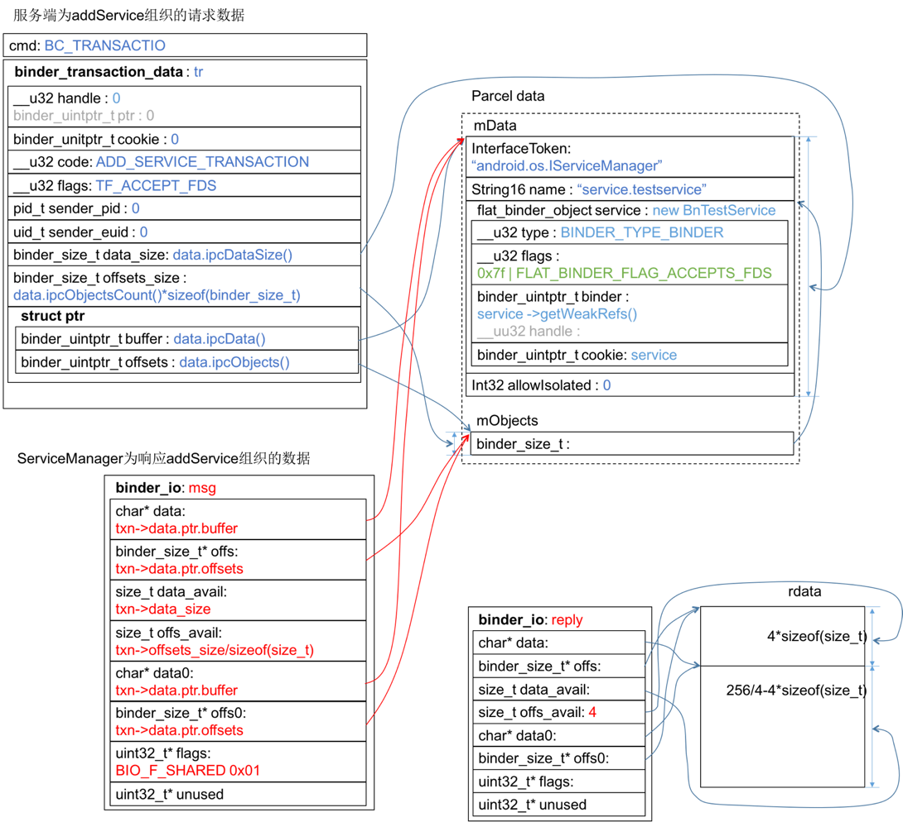

有了《ServiceManager如何响应checkService请求》的探索，研究addService就轻车熟路了，中间过程不再多说，仅把关键节点列出：
frameworks/native/cmds/servicemanager/service_manager.c:347
``` c++
int main(int argc, char **argv)
{
    ……
    binder_loop(bs, svcmgr_handler);
    ……
}
```
<!-- more -->
frameworks/native/cmds/servicemanager/binder.c:372
``` c++
void binder_loop(struct binder_state *bs, binder_handler func)
{
    ……
    for (;;) {
        ……
        res = binder_parse(bs, 0, (uintptr_t) readbuf, bwr.read_consumed, func);
        ……
    }
}
```
frameworks/native/cmds/servicemanager/binder.c:204
``` c++
int binder_parse(struct binder_state *bs, struct binder_io *bio,
                 uintptr_t ptr, size_t size, binder_handler func)
{
        ……
        case BR_TRANSACTION: {
            struct binder_transaction_data *txn = (struct binder_transaction_data *) ptr;
            ……
            if (func) {
                unsigned rdata[256/4];
                struct binder_io msg;
                struct binder_io reply;
                int res;

                bio_init(&reply, rdata, sizeof(rdata), 4);
                bio_init_from_txn(&msg, txn);
                res = func(bs, txn, &msg, &reply);
                binder_send_reply(bs, &reply, txn->data.ptr.buffer, res);
            }
            ptr += sizeof(*txn);
            break;
        }
        ……

    return r;
}
```
此时的内存数据结构为：

frameworks/native/cmds/servicemanager/service_manager.c:244
``` c++
int svcmgr_handler(struct binder_state *bs,
                   struct binder_transaction_data *txn,
                   struct binder_io *msg,
                   struct binder_io *reply)
{
    struct svcinfo *si;
    uint16_t *s;
    size_t len;
    uint32_t handle;
    uint32_t strict_policy;
    int allow_isolated;

    ……
   
    switch(txn->code) {
    ……

    case SVC_MGR_ADD_SERVICE:
        s = bio_get_string16(msg, &len); // "service.testservice"
        if (s == NULL) {
            return -1;
        }
        handle = bio_get_ref(msg);
        allow_isolated = bio_get_uint32(msg) ? 1 : 0;  // 0
        if (do_add_service(bs, s, len, handle, txn->sender_euid,
            allow_isolated, txn->sender_pid))
            return -1;
        break;

    ……
    default:
        ALOGE("unknown code %d\n", txn->code);
        return -1;
    }

    bio_put_uint32(reply, 0);
    return 0;
}
```
SVC_MGR_ADD_SERVICE分之内从msg读出的数据对照“服务端为addService组织的请求数据”示意图很容易拆解出来，需要看一下bio_get_ref(…)，frameworks/native/cmds/servicemanager/binder.c:627
``` c++
uint32_t bio_get_ref(struct binder_io *bio)
{
    struct flat_binder_object *obj;

    obj = _bio_get_obj(bio);
    if (!obj)
        return 0;

    if (obj->type == BINDER_TYPE_HANDLE)  // 如果为BINDER_TYPE_BINDER呢？都返回0？
        return obj->handle;

    return 0;
}
```
这里有一个很大的疑团：<font color="red">根据前面的数据结构图， obj->type应该就是service.type，它等于BINDER_TYPE_BINDER，可是在bio_get_ref(...)中仅对obj->type为BINDER_TYPE_HANDLE的情况返回obj->handle，其余情况都返回0。这不符合常识啊，难道所有的BINDER_TYPE_BINDER类型的handle都共用0？</font>
frameworks/native/cmds/servicemanager/binder.c:611
``` c++
static struct flat_binder_object *_bio_get_obj(struct binder_io *bio)
{
    size_t n;
    size_t off = bio->data - bio->data0;

    /* TODO: be smarter about this? */
    for (n = 0; n < bio->offs_avail; n++) {
        if (bio->offs[n] == off)
            return bio_get(bio, sizeof(struct flat_binder_object));
    }

    bio->data_avail = 0;
    bio->flags |= BIO_F_OVERFLOW;
    return NULL;
}
```
经过前面几条bio_get_xxx，msg的data指针已经挪到了flat_binder_object实体处，如下图所示，橙色箭头表示msg初始化后到执行bio_get_ref(msg)之前，data指针的挪动情况。_bio_get_obj(…)负责将此flat_binder_object实体返回。

frameworks/native/cmds/servicemanager/service_manager.c:194
``` c++
int do_add_service(struct binder_state *bs,
                   const uint16_t *s, size_t len,
                   uint32_t handle, uid_t uid, int allow_isolated,
                   pid_t spid)
{   // s="service.testservice", allow_isolated=0, handle=?
    struct svcinfo *si;

    ……

    si = find_svc(s, len);
    if (si) {
        if (si->handle) {
            ALOGE("add_service('%s',%x) uid=%d - ALREADY REGISTERED, OVERRIDE\n",
                 str8(s, len), handle, uid);
            svcinfo_death(bs, si);
        }
        si->handle = handle;
} else {
    // 重点在这里，如果服务没有add过，则为之创建节点，保存名字和handle
        si = malloc(sizeof(*si) + (len + 1) * sizeof(uint16_t));
        if (!si) {
            ALOGE("add_service('%s',%x) uid=%d - OUT OF MEMORY\n",
                 str8(s, len), handle, uid);
            return -1;
        }
        si->handle = handle;
        si->len = len;
        memcpy(si->name, s, (len + 1) * sizeof(uint16_t));
        si->name[len] = '\0';
        si->death.func = (void*) svcinfo_death;
        si->death.ptr = si;
        si->allow_isolated = allow_isolated;
        si->next = svclist;
        svclist = si;
    }

    binder_acquire(bs, handle);
    binder_link_to_death(bs, handle, &si->death);
    return 0;
}
```
到这就结束了，最终的落地代码出乎意料的简单：它只是保存服务的name和binder，并把它们串到链表上去。等待客户端checkService则返回handle。总感觉谜团还是没解决，do_add_service(...)函数中handle参数存疑，我断定它应该是service的handle字段，可是按照代码走查的结果，却在service_manager中被改成了0，为什么？这个handle究竟怎么做到的连接客户端与服务端？ServiceManager的角色应该让C/S关联起来，接下来C、S之间就可以直接通过binder通信了，可是flat_binder_object里面只是保存了服务端的几个指针，客户端怎么凭着这坨binder数据链接到服务端的呢？看来还得研究一条具体的服务请求及响应才能找到最终的答案。

