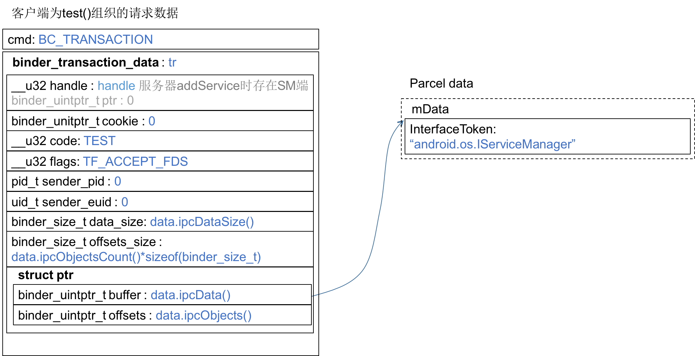

还从客户端代码看起TestClient.cpp:14
``` c++
int main() {
    sp < IServiceManager > sm = defaultServiceManager();    // new BpServiceManager(new BpBinder(0));
    sp < IBinder > binder = sm->getService(String16("service.testservice"));  // 
    sp<ITestService> cs = interface_cast < ITestService > (binder);
    cs->test();
    return 0;
}
```
# sm->getService(...)返回了什么？
其中第2行`defaultServiceManager()`返回的是`new BpServiceManager(new BpBinder(0));`这在[《 defaultServiceManager()返回了什么？》](http://palanceli.github.io/blog/2016/05/07/2016/0514BinderLearning2/)中有分析。
接下来的`sm->getService(...)`在[《ServiceManager如何响应checkService请求》](http://palanceli.github.io/blog/2016/05/09/2016/0514BinderLearning4/)的结尾给出了ServiceManager响应checkService返回的数据，我们再进入BpServiceManager::getService(...)
frameworks/native/libs/binder/IServiceManager.cpp:134
``` c++
    virtual sp<IBinder> getService(const String16& name) const
    {
        unsigned n;
        for (n = 0; n < 5; n++){
            sp<IBinder> svc = checkService(name);  // 调用下面的checkService(...)
            if (svc != NULL) return svc;
            ALOGI("Waiting for service %s...\n", String8(name).string());
            sleep(1);
        }
        return NULL;
    }

    virtual sp<IBinder> checkService( const String16& name) const
    {
        Parcel data, reply;
        data.writeInterfaceToken(IServiceManager::getInterfaceDescriptor());
        data.writeString16(name);
        remote()->transact(CHECK_SERVICE_TRANSACTION, data, &reply);
        return reply.readStrongBinder();  // 在这里读取了ServiceManager返回的数据
    }
```
进入Parcel::readStrongBinder()，frameworks/native/libs/binder/Parcel.cpp:1334
``` c++
sp<IBinder> Parcel::readStrongBinder() const
{
    sp<IBinder> val;
    unflatten_binder(ProcessState::self(), *this, &val);
    return val;
}
```
进入Parcel::unflatten_binder(...)，frameworks/native/libe/binder/Parcel.cpp:293
``` c++
status_t unflatten_binder(const sp<ProcessState>& proc,
    const Parcel& in, sp<IBinder>* out)
{
    const flat_binder_object* flat = in.readObject(false);

    if (flat) {
        switch (flat->type) {
            case BINDER_TYPE_BINDER:
                *out = reinterpret_cast<IBinder*>(flat->cookie);
                return finish_unflatten_binder(NULL, *flat, in);
            case BINDER_TYPE_HANDLE:
                *out = proc->getStrongProxyForHandle(flat->handle);
                return finish_unflatten_binder(
                    static_cast<BpBinder*>(out->get()), *flat, in);
        }
    }
    return BAD_TYPE;
}
```
我们看服务端返回的数据：

返回的flat_binder_object的type是BINDER_TYPE_HANDLE，于是进入ProcessState::getStrongProxyForHandle(...)，frameworks/native/libs/binder/ProcessState.cpp:179
``` c++
sp<IBinder> ProcessState::getStrongProxyForHandle(int32_t handle)
{
    sp<IBinder> result;

    AutoMutex _l(mLock);

    handle_entry* e = lookupHandleLocked(handle);

    if (e != NULL) {
        ......
        IBinder* b = e->binder;
        if (b == NULL || !e->refs->attemptIncWeak(this)) {
            if (handle == 0) {  // 显然handle是0，因为0是ServiceManager
                ......
            }

            b = new BpBinder(handle); // 走到这里
            e->binder = b;
            if (b) e->refs = b->getWeakRefs();
            result = b;
        } else {
            ......
            result.force_set(b);
            e->refs->decWeak(this);
        }
    }

    return result;
}
```
首次执行，会创建一个新的BpBinder(handle)，并缓存该节点；以后在被调用，就直接返回该节点了。Parcel::finish_unflatten_binder(...)内部没有任何调用，直接返回了。
> 因此客户端的getService(...)调用就返回了new BpBinder(handle);其中handle是有服务端在addService时生成（见[《binder服务端是如何组织addService数据的？》](http://palanceli.github.io/blog/2016/05/11/2016/0514BinderLearning6/)尾部的addService组织的请求数据图），并由ServiceManager缓存的，binder_uintptr_t值。

# interface_cast < ITestService> (binder)返回了什么？
这个函数定义在frameworks/natvie/include/binder/IInterface.h:41
``` c++
template<typename INTERFACE>
inline sp<INTERFACE> interface_cast(const sp<IBinder>& obj)
{
    return INTERFACE::asInterface(obj);
}
```
代入模板参数：
``` c++
inline sp<ITestService> interface_cast(const sp<IBinder>& obj)
{
    return ITestService::asInterface(obj);
}
```
再来看ITestService的定义，Test.h
``` c++
    class ITestService : public IInterface
    {
    public:
        DECLARE_META_INTERFACE(TestService);
        virtual void test()=0;
    };
```
宏DECLARE_META_INTERFACE定义在frameworks/native/include/binder/IInterface.h:74，展开为：
``` c++
    class ITestService : public IInterface
    {
    public:
        static const android::String16 descriptor;
        static android::sp<ITestService> asInterface(
            const android::sp<android::IBinder>& obj);
    virtual const android::String16& getInterfaceDescriptor() const;
    ITestService();
    virtual ~ITestService(); 

        virtual void test()=0;
    };
```
在ITestService.cpp中只有这么一行：
``` c++
IMPLEMENT_META_INTERFACE(TestService, "android.TestServer.ITestService");
```
展开后为：
``` c++
    const android::String16 ITestService::descriptor("android.TestServer.ITestService");
    const android::String16& ITestService::getInterfaceDescriptor() const {
        return ITestService::descriptor;
    }
    android::sp< ITestService > ITestService::asInterface(
            const android::sp<android::IBinder>& obj)
    {   // obj就是在main函数中传入的binder，即 new BpBinder(handle)
        android::sp< ITestService > intr;
        if (obj != NULL) {
            intr = static_cast< ITestService *>( 
                obj->queryLocalInterface(ITestService::descriptor).get());
            if (intr == NULL) {
                intr = new BpTestService(obj);
            }
        }
        return intr;
    }
    ITestService::ITestService() { }
    ITestService::~ITestService() { }
```
BpBinder::queryLocalInterface(...)这个函数继承自基类IBinder，它直接返回NULL
``` c++
sp<IInterface>  IBinder::queryLocalInterface(const String16& /*descriptor*/)
{
    return NULL;
}
```
因此ITestService::asInterface(...)就返回了`new BpTestService(new BpBinder(handle));`即：
> interface_cast < ITestService > (binder)返回
> `new BpTestService(new BpBinder(handle));`

# 进入cs->test()
即BpTestService::test()，TestClient.cpp
``` c++
void BpTestService::test() {
    printf("BpTestService::test()\n");
    Parcel data, reply;
    data.writeInterfaceToken(ITestService::getInterfaceDescriptor());
    remote()->transact(TEST, data, &reply);
    printf("reply: %d\n", reply.readInt32());
}
```
他的remote()是什么？在[《defaultServiceManager()返回了什么？》](http://palanceli.github.io/blog/2016/05/07/2016/0514BinderLearning2/)中遇到过BpInterface::remote()，它返回的是在构造函数中传入的Binder。BpTestService正是继承自BpInterface：
``` c++
class BpTestService: public BpInterface<ITestService>
```
所以BpTestService的remote()就返回构造时传入的`new BpBinder(handle)`。
在[《binder客户端是如何组织checkService数据的 ？》](http://palanceli.github.io/blog/2016/05/08/2016/0514BinderLearning3/)中曾分析过，`BpBinder::transact(...)`调用了`IPCThreadState::transact(...)`
frameworks/native/libs/binder/IPCThreadState.cpp:548
``` c++
status_t IPCThreadState::transact(int32_t handle,
                                  uint32_t code, const Parcel& data,
                                  Parcel* reply, uint32_t flags)
{   // code=TEST, flags=0
    status_t err = data.errorCheck();

    flags |= TF_ACCEPT_FDS;

    ......
    
        err = writeTransactionData(BC_TRANSACTION, flags, handle, code, data, NULL);
    ......
    
    return err;
}
```
进入waitForResponse(...)，frameworks/native/libs/binder/IPCThreadState.cpp:904
``` c++
status_t IPCThreadState::writeTransactionData(int32_t cmd, uint32_t binderFlags,
    int32_t handle, uint32_t code, const Parcel& data, status_t* statusBuffer)
{   // cmd=BC_TRANSACTION, code=TEST, binderFlags=TF_ACCEPT_FDS
    binder_transaction_data tr;

    tr.target.ptr = 0; /* Don't pass uninitialized stack data to a remote process */
    tr.target.handle = handle;
    tr.code = code;
    tr.flags = binderFlags;
    tr.cookie = 0;
    tr.sender_pid = 0;
    tr.sender_euid = 0;
    
    ......
        tr.data_size = data.ipcDataSize();
        tr.data.ptr.buffer = data.ipcData();
        tr.offsets_size = data.ipcObjectsCount()*sizeof(binder_size_t);
        tr.data.ptr.offsets = data.ipcObjects();
    ......
    
    mOut.writeInt32(cmd);
    mOut.write(&tr, sizeof(tr));
    
    return NO_ERROR;
}
```
又是一个`binder_transaction_data`数据包，不过这块数据很简单，内容如下：

TEST定义在Test.h中：
``` c++
    enum
    {
        TEST = IBinder::FIRST_CALL_TRANSACTION,
    };
```
它为每一个Binder接口定义一个枚举数字。
> * 轮廓渐渐清晰了：服务端通过addService向ServiceManager注册服务，后者记录下service name和服务实体（实体是什么以后再讨论）。客户端通过getService接口向ServiceManager请求获取到符合指定名称的service。之后调用service的服务接口只不过是向service发送一个数据包，该数据包中包含了指定的服务接口的序列号及参数，具体服务执行是由服务端收到该数据包后完成。
> * 客户端通过getService获得service之后，客户端请求服务就直接发往service，而不再经过ServiceManager。因为上文cs->test()内调用的是new BpInterface(handle)的transact(...)函数，而不再是BpBinder(0)::transact(...)，在最终组成的binder_transaction_data包中，handle也是服务端注册在ServiceManager的handle了。

因此，下一步就应该去到服务端，看它是怎么响应test()请求的。


