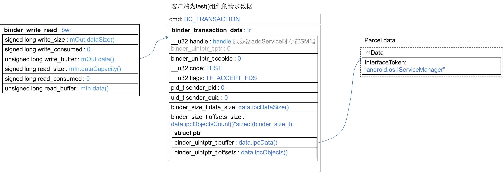

Binder驱动层的代码在`kernel/goldfish/drivers/staging/android`下的`binder.c`和`binder.h`。Android源码是不带Linux内核的，驱动正是在这个内核里，需要单独下载，出门左转参见[《Anrdoid源码、内核编译》](http://www.cnblogs.com/palance/p/5187103.html)。驱动的相关知识先不在这里展开了，那又是一个庞大的体系，以后再啃。直奔我们的主题——客户端为`test()`组织的请求数据是：

驱动程序是如何处理这个数据包的呢？
# 从应用层登陆，顺流直下
为此，还需要先从应用层往下看，frameworks/native/libs/binder/IPCThreadState.cpp:548，就从这里登陆吧。客户端组织test()请求数据时，调用到IPCThreadState::transact(...)
``` c
status_t IPCThreadState::transact(int32_t handle,
                                  uint32_t code, const Parcel& data,
                                  Parcel* reply, uint32_t flags)
{   // code=TEST, flag=0

    flags |= TF_ACCEPT_FDS;
    ......
    
        err = writeTransactionData(BC_TRANSACTION, flags, handle, code, data, NULL);
    
        ......
        if (reply) {
            err = waitForResponse(reply);  // 这次重点看这里
        } else {
            Parcel fakeReply;
            err = waitForResponse(&fakeReply);
        }
        ......
    
    return err;
}
```
函数使用writeTransactionData(…)打包好数据后，接下来调用waitForResponse(…)把数据发出去。
frameworks/native/libs/binder/IPCThreadState.cpp:712
``` c
status_t IPCThreadState::waitForResponse(Parcel *reply, status_t *acquireResult)
{
    uint32_t cmd;
    int32_t err;

    while (1) {
        if ((err=talkWithDriver()) < NO_ERROR) break;
        ......
        }
        ......
    
    return err;
}
```
继续调用talkWithDriver()和驱动对话,frameworks/native/libs/binder/IPCThreadState.cpp:803
``` c
status_t IPCThreadState::talkWithDriver(bool doReceive)
{   // doReceive=true
    ......
    binder_write_read bwr;
    ......
    const bool needRead = mIn.dataPosition() >= mIn.dataSize();// mIn有上一轮IO读出尚未解析的数据，因此needRead=true
    ......
    const size_t outAvail = (!doReceive || needRead) ? mOut.dataSize() : 0; // outAvail=mOut.dataSize()
    
    bwr.write_size = outAvail;
    bwr.write_buffer = (uintptr_t)mOut.data();
    ......
    if (doReceive && needRead) {
        bwr.read_size = mIn.dataCapacity();
        bwr.read_buffer = (uintptr_t)mIn.data();
    } 
    ......
    bwr.write_consumed = 0;
    bwr.read_consumed = 0;
    status_t err;
    do {
        ......
        if (ioctl(mProcess->mDriverFD, BINDER_WRITE_READ, &bwr) >= 0) // 重点在这
            err = NO_ERROR;
        ......
    } while (err == -EINTR);
    ......    
    return err;
}
```
doReceive取默认值为true，在通过`test()`调用到`talkWithDriver(...)`之前，和驱动的对话已经做了好几轮了，比如`defaultServiceManager()`和ServiceManager的对话，`getService(...)`和Service的对话，此时mIn中应该是有之前读出尚未解析的数据，因此needRead=true，outAvail=mOut.dataSize()。可以组织一个gdb确认mIn此时的内容。
## 组织一个gdb确认此时mIn的内容
需要开启三个终端完成调试：
1. Target1 在模拟器上启动server
``` bash
$ adb shell /data/local/tmp/testservice/TestServer
```
2. Target2 在模拟器上通过gdbserver启动客户端
``` bash
$ adb shell gdbserver :1234 /data/local/tmp/testservice/TestClient
Process /data/local/tmp/testservice/TestClient created; pid = 1254
Listening on port 1234
Remote debugging from host 127.0.0.1
```
3. Host1 在宿主端启动gdb
``` bash
$ ./prebuilts/gcc/darwin-x86/arm/arm-linux-androideabi-4.9/bin/arm-linux-androideabi-gdb out/debug/target/product/generic/obj/EXECUTABLES/TestClient_intermediates/LINKED/TestClient
......
(gdb) b main
Breakpoint 1 at 0xb6f571fc: file external/testservice/TestClient.cpp, line 14.
(gdb) c
Continuing.
......
(gdb) set solib-absolute-prefix out/debug/target/product/generic/symbols/
Reading symbols from ...... linker...done.
......
Loaded symbols for ......
......
(gdb) b IPCThreadState.cpp:846 # 在talkWithDriver(...)内下断点
Breakpoint 2 at 0xb6eaf884: file frameworks/native/libs/binder/IPCThreadState.cpp, line 846.
(gdb) c
......
# 然后就是若干轮的continue和backtrace，直到停在由test()调用触发的talkWithDriver(...)
......

Breakpoint 2, android::IPCThreadState::talkWithDriver (this=this@entry=0xb6c24000, doReceive=doReceive@entry=true) at frameworks/native/libs/binder/IPCThreadState.cpp:846
846     if ((bwr.write_size == 0) && (bwr.read_size == 0)) return NO_ERROR;
(gdb) bt
#0  android::IPCThreadState::talkWithDriver (this=this@entry=0xb6c24000, doReceive=doReceive@entry=true) at frameworks/native/libs/binder/IPCThreadState.cpp:846
#1  0xb6eafed2 in android::IPCThreadState::waitForResponse (this=0xb6c24000, reply=0xbeaa1ad4, acquireResult=0x0) at frameworks/native/libs/binder/IPCThreadState.cpp:718
#2  0xb6eb0088 in android::IPCThreadState::transact (this=0xb6c24000, handle=1, code=code@entry=1, data=..., reply=reply@entry=0xbeaa1ad4, flags=16, flags@entry=0) at frameworks/native/libs/binder/IPCThreadState.cpp:604
#3  0xb6eab08e in android::BpBinder::transact (this=0xb6c090c0, code=1, data=..., reply=0xbeaa1ad4, flags=0) at frameworks/native/libs/binder/BpBinder.cpp:165
#4  0xb6f3e42e in android::BpTestService::test (this=<optimized out>) at external/testservice/TestClient.cpp:10
#5  0xb6f3e23c in main () at external/testservice/TestClient.cpp:18
(gdb) p mIn
$1 = {mError = 0, mData = 0xb6c27000 "\fr", mDataSize = 48, mDataCapacity = 256, mDataPos = 48, mObjects = 0x0, mObjectsSize = 0, mObjectsCapacity = 0, mNextObjectHint = 0, mFdsKnown = true, mHasFds = false, mAllowFds = true, mOwner = 0x0, mOwnerCookie = 0x0,
  mOpenAshmemSize = 0}
(gdb) p needRead
$2 = true
# 结果和我猜测的一致
```
综上所述，在`IPCThreadState::talkWithDriver(...)`中调用
``` c
ioctl(mProcess->mDriverFD, BINDER_WRITE_READ, &brw)
```
传入的数据bwr即为：

# 进入驱动层
终于可以有此穿越到驱动层了！binder驱动层对接ioctl的函数是binder_ioctl(...)。kernel/goldfish/drivers/staging/android/binder.c:2716
``` c
static long binder_ioctl(struct file *filp, unsigned int cmd, unsigned long arg)
{   // cmd=BINDER_WRITE_READ
    int ret;
    struct binder_proc *proc = filp->private_data;
    struct binder_thread *thread;
    unsigned int size = _IOC_SIZE(cmd);
    void __user *ubuf = (void __user *)arg;

    ......
    thread = binder_get_thread(proc);
    ......

    switch (cmd) {
    case BINDER_WRITE_READ: {
        struct binder_write_read bwr;
        ......
        if (copy_from_user(&bwr, ubuf, sizeof(bwr))) {// 把上图总用户空间的bwr复制到内核
            ......
        }
        ......
        if (bwr.write_size > 0) {
            ret = binder_thread_write(proc, thread, (void __user *)bwr.write_buffer, bwr.write_size, &bwr.write_consumed);
            trace_binder_write_done(ret);
            ......
        }
        // bwr.read_size来自IPCThreadState::talkWithDriver，当读缓冲区为空，会将
        // mIn缓冲区交给它，bwr.read_size=mIn.dataCapacity()
        if (bwr.read_size > 0) {
            ret = binder_thread_read(proc, thread, (void __user *)bwr.read_buffer, bwr.read_size, &bwr.read_consumed, filp->f_flags & O_NONBLOCK);
            trace_binder_read_done(ret);
            if (!list_empty(&proc->todo))
                wake_up_interruptible(&proc->wait);
            ... ...
        }
        ......
    }
    ......
    }
    ret = 0;
......
    return ret;
}
```
先尽可能地剪掉细枝末节，来看重点调用
``` c
binder_thread_write(proc, thread, (void __user *)bwr.write_buffer,
                            bwr.write_size, &bwr.write_consumed);
```
kernel/goldfish/drivers/staging/android/binder.c:1837
``` c
int binder_thread_write(struct binder_proc *proc, struct binder_thread *thread,
            void __user *buffer, int size, signed long *consumed)
{
    uint32_t cmd;
    void __user *ptr = buffer + *consumed;
    void __user *end = buffer + size;

    while (ptr < end && thread->return_error == BR_OK) {
        if (get_user(cmd, (uint32_t __user *)ptr))
            return -EFAULT;
        ptr += sizeof(uint32_t);
        trace_binder_command(cmd);
        if (_IOC_NR(cmd) < ARRAY_SIZE(binder_stats.bc)) {
            binder_stats.bc[_IOC_NR(cmd)]++;
            proc->stats.bc[_IOC_NR(cmd)]++;
            thread->stats.bc[_IOC_NR(cmd)]++;
        }
        switch (cmd) {
        ......
        case BC_TRANSACTION:
        case BC_REPLY: {
            struct binder_transaction_data tr;

            if (copy_from_user(&tr, ptr, sizeof(tr)))
                return -EFAULT;
            ptr += sizeof(tr); // 对照前面的图逆向拆解
            binder_transaction(proc, thread, &tr, cmd == BC_REPLY);
            break;
        }
        ......
        }
        *consumed = ptr - buffer;
    }
    return 0;
}
```
这个cmd的值是BC_TRANSACTION，因此应该继续`binder_transaction(proc, thread, &tr, false)`。这个函数实在太长了，后面再花一节的篇幅深入该函数。

不过很清晰的一点：该函数仅在出错的时候才返回小于零的整数，如果一切正常就返回0。函数`binder_ioctl(...)在case BINDER_WRITE_READ`这一枝上，如果没有发生错误，则返回`binder_thread_write(...)`。也就是说：如果一切正常，`binder_ioctl(...)`会返回0，不管io的数据有多大。
