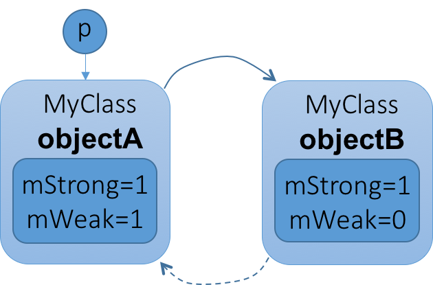
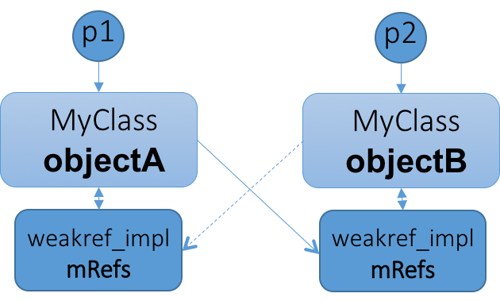

# 轻量级指针
Binder的学习历程爬到驱动的半山腰明显感觉越来越陡峭，停下业务层的学习，补补基础层知识吧，这首当其冲的就是智能指针了，智能指针的影子在Android源码中随处可见。打开frameworkds/rs/cpp/util，RefBase.h和StrongPointer.h两个文件，代码多读几遍都能读懂，可是串起来总感觉摸不到骨架，把不住主线。闭上眼零零星星的点串不成一条线。究其原因应该是此处使用了模式，最好先剔除掉业务层的皮肉，把模式的骨架摸个门清，再回来看代码就会势如破竹了。

不是多么高深的设计模式，智能指针和引用计数的混合而已。但，不要轻敌。翻开书，对这两个模式的描述竟有50页之多。我读的是Scott Meyers的《More Effective C++》，侯sir翻译的版本，十年前读这本书的时候囫囵吞枣很多读不懂，有一些概念依稀留下点印象。这些印象就构成了日后遇到问题时的路标，告诉我答案在哪里。这本书条款28、29讲的正是智能指针和引用计数，两章结尾处的代码几乎就是Android源码中LightRefBase和sp的原型。每一个条款都从一个简单的目标入手，不断地解决问题，再升级提出它的不足，再找答案，直到把这个问题打穿打透为止。这两个条款的内容就不赘述了，书里写的更精彩。接下来我把模式和Android源码的智能指针对接起来。

《More Effective C++》第203页，条款29描绘了具有引用计数功能的智能指针模式图如下：

这张图还是把业务逻辑和模式框架混在一起了：
* String代表业务逻辑
* RCPtr是具备引用计数功能的智能指针
* RCObject用来履行引用计数的职责
* StringValue和HeapMemory又是局部的业务逻辑了

所以该模式本质上是由RCPtr和RCObject联袂完成，RCPtr负责智能指针，RCObject负责引用计数，如下：

一个对象如果要配备引用计数和智能指针，则需要：
``` c++
class MyClass : public RCObject // 让该对象的类从RCObject派生
{...};
RCPtr<MyClass> pObj; // 声明对象
```
对应到Android源码中，LightRefBase就是RCObject，sp就是RCPtr：


我在初读Android源码的时候一直琢磨为什么搞得这么复杂，不能把智能指针封装在一个基类里。如果可以的话，MyClass只需要从这个类派生就好了。答案是不可以。因为RCPtr本质上要充当指针的角色，ptr1可以指向A，也可以指向B，当从A转向了B，应该让A的引用计数递减，让B的引用计数递增，这个计数只能是被指对象的属性，而不能是指针的。

我之所以会有合二为一的年头，是因为过去接触的智能指针大都是为了解决遇到Exception或错误返回时防止内存或资源泄露，又不想使用goto语句，比如：
``` c++
int fun(char * filename)
{
    FILE* fp = fopen(filename, "r");
    int result = 0
    ... ...
    if(error){
        result = -1;
        goto exit;
    }
exit:
    fclose(fp);
    return result;
}
```
如果在函数中打开了多种资源，则要么记住它们的状态，在exit中根据状态擦屁股；要么就得有多个goto标记。此时就可以使用智能指针的思想，给文件做个封装：
``` c++
void fun(char * filename)
{
    MyFile file;  // MyFile在析构的时候会自动关闭文件
    if(!file.open(filename, "r"))
        return -1;
    ... ...
}
```
这一类的智能指针可以看做“具备引用计数的智能指针”的特例，它的引用计数最多为1，且不存在所有权的转移，可以把引用计数RCObject模块退化掉，指针指向资源即代表引用计数为1，不指向任何资源则代表引用计数为0。因此这种情况可以让MyClass仅派生自RCPtr基类即可，一旦引用计数允许大于1，就必须带上RCObject的角色了。

回到Android源码上来，轻量级的智能指针：
* LightRefBase负责维护引用计数，并提供递增/递减的接口。
* sp履行智能指针的角色，负责构造析构、拷贝和赋值、提领。

还有一个问题：LightRefBase和《More Effective C++》条款29中的RCObject相比多出一个模板参数，在该类的定义中几乎没有用到这个模板参数，这是为什么？我分析应该是出于性能的考虑——这样做可以省去虚表的开销：
``` c++
RCObject::removeReference()
{if(--refCount == 0) delete this;}
```
这里要经由基类的指针删除派生类的对象，在《Effecive C++（第三版）》（刚刚发现这本书的第二版和第三版调整很大！）第7条中说到:
> 当派生类的对象经由基类指针被删除时，基类必须有虚析构函数，否则会导致未定义的行为，通常是对象的devrived成分没被销毁。

RCObject确实声明了析构函数为virtual，也因此不得不引入虚表。再看LightRefBase：
``` c++
template <class T>
class LightRefBase
{
... ...
    inline void decStrong(const Void* id) const{
        if(android_atomic_dec(&mCount) == 1){
            // 这里并没有delete this，而是先转成子类再delete，这就不再是
            // “经由基类指针删除子类对象”，而是“由子类指针删除子类对象”了，
            // 怎么得到子类指针？模板参数T呀！为这段代码拍案叫绝！
            delete static_cast<const T*>(this);
        }
    }
};
```
## 情景分析
Android智能指针的代码不多，且比较独立，我把它们抽取出来，再写一些测试用例，对这块代码的理解大有裨益。我在Anrdoid源码中每个函数头部都打了Log，标示函数名。代码可以到这里下载[androidex/host-smartptr](https://github.com/palanceli/androidex/tree/master/host-smartptr)。这里的Android源码取自android-6.0.1_r11。
* StrongPointer.h
来自`frameworks/rs/cpp/util/StrongPointer.h`
* RefBase.h
来自`frameworks/rs/cpp/util/RefBase.h`
* RefBase.cpp
来自`system/core/libutils/RefBase.cpp`
* meyers.h
来自《More Effective C++》条款29，是带有引用计数功能的智能指针的实现
* testlightptr.cpp和testweightptr.cpp
是对Android轻量级智能指针和强、弱智能指针的测试用例，
* logger.h
是一个log工具，
* smartptr.cpp
是主入口函数，该文件包含若干测试用例，函数名为tc01、tc02...

该程序的使用方法为：
``` bash
smartptr <tcname>
```
例如：
``` bash
smartptr tc01  # 它执行例程函数tc01
```
一下是对轻量级指针的测试代码：
``` c++
#include <stdio.h>
#include "RefBase.h"
#include "logger.h"

class LightClass : public LightRefBase <LightClass>
{
public:
    LightClass(){}
    ~LightClass(){}
};

int testlightptr(int argc, char const * argv[])
{
    // 初始lpLightClass的引用计数为0
    LightClass * pLightClass = new LightClass();
    // 调用sp的复制构造函数sp::sp(T* other)，使得pLightClass的引用计数为1。
    sp<LightClass> lpOut = pLightClass;
    Logging("Light Ref Count: %d.", pLightClass->getStrongCount());
    {
        // 调用sp的赋值构造函数sp::sp(const sp<T>& other)，
        // 使得pLightClass的引用计数累加为2
        sp<LightClass> lpInner = lpOut;
        Logging("Light Ref Count: %d.", pLightClass->getStrongCount());
        // lpInner析构，pLightClass的引用计数递减为1
    }
    Logging("Light Ref Count:%d.", pLightClass->getStrongCount());
    return 0;
    // lpOut析构，pLightClass引用计数递减为0，在decStrong(...)中delete pLightClass
}
```
执行结果如下：
``` bash
$ ./smartptr tc01
[StrongPointer.h:41] sp::sp(T*)
[testlightptr.cpp:16] Light Ref Count: 1.
[StrongPointer.h:47] sp::sp(const sp<T>&)
[testlightptr.cpp:19] Light Ref Count: 2.
[StrongPointer.h:53] sp::~sp()
[testlightptr.cpp:21] Light Ref Count:1.
[StrongPointer.h:53] sp::~sp()
```
# 强/弱智能指针
强/弱指针把我折腾的七荤八素的，因为没有原型可参考了，我相信这个设计必有出处，只是自己没有找到，于是只好啃代码。强/弱智能指针的代码比轻量级智能指针复杂很多，静态代码研究很容易陷入“每句代码都明白，就是抓不住灵魂”的境地，我发现最好的应对方法是从需求出发，找到一两个使用场景代入走查一下。好在这块代码比较独立，前面我已经把他们抽取出来，情景分析是比较容易的。

## 强/弱智能指针的目的
轻量级智能指针可以完成对目标对象的引用计数的记录，并在没有没有任何指针指向目标对象的时候自动销毁对象，防止内存泄漏。但是当遇到循环引用的时候，该手段就失效了，如下图：

当p不再指向objectA，其引用计数由2变为1，相互指向的objectA和objectB就变成悬浮的两座孤岛，再也没有路径可以访问到它们，于是造成了内存泄漏。

解决方案是给循环引用的双方定义主从关系，由主指向从的智能指针就称为强指针，由从指向主的指针就称为弱指针，强/弱指针仍然都是具备引用计数功能的智能指针，只是当一个对象没有强指针指向的时候就可以销毁掉了。如下图：

实线代表强指针，虚线代表弱指针。当p不再指向objectA，其强引用计数递减为0，于是objectA可以销毁，它指向objectB的强指针也被销毁，于是objectB的强引用计数递减为0，objectB也可以销毁。

## 强/弱智能指针的使用
强/弱智能指针的定义和使用形式如下：
``` c++
// 对象实体必须从RefBase派生，该类在`RefBase.h`和`RefBase.cpp`中声明和定义
class MyClass : public RefBase
{
......
};
......
sp<MyClass> pStrong(new MyClass);   // 定义强指针
wp<MyClass> pWeak(new MyClass);     // 定义弱指针
```
我们来看看RefBase，frameworks/rs/cpp/util/RefBase.h
``` c++
class RefBase
{
........

    class weakref_type
    {
        ........
    };

......

    virtual                 ~RefBase();

    enum {
        OBJECT_LIFETIME_STRONG  = 0x0000,
        OBJECT_LIFETIME_WEAK    = 0x0001,
        OBJECT_LIFETIME_MASK    = 0x0001
    };

......

private:
    ......
    class weakref_impl;
        
    weakref_impl* const mRefs;
};
```
和LightRefBase相比有三个明显的差异：
1. 没有模板参数，前文已经分析过LightRefBase使用模板参数是出于性能的考虑，省去一个虚表的开销，而RefBase定义了virtual的析构函数，可见继承关系可能是在所难免的，于是再用模板参数就没有任何意义了。
2. RefBase没有像LightRefBase那样直接用成员变量记录引用计数，而是又定义了一个weakref_impl*类型的成员，由它来记录强/弱引用计数。这是为什么？从前面模型图上就能找到答案：

继续前面的推演，objectA被销毁后，objectB还有一个弱指针指向objectA的。objectA在销毁的时刻，只能处理由自己发出的指针，而无法知道都有谁指向了自己。于是objectA被销毁后，来自objectB的弱指针也就成了野指针。为了解决这个问题，可以让引用计数和对象实体分离，如下图：

于是就有了weakref_impl* mRefs成员，该成员被称为他所记录的实体对象的影子对象，影子和本尊之间有指针指向对方，但影子的生存周期可能比本尊还要长。因为影子负责记录本尊的强/弱引用计数，当强引用计数为0时，本尊被销毁，影子继续记录其弱引用计数，直到两个引用计数分别为0，影子才被销毁掉。
3. 枚举类型OBJECT_LIFETIME_xxx。这本不算和LightRefBase之间的差异，但在阅读RefBase代码时这三种类型左右着实体对象的生命周期策略。这也是最让我疑惑的地方：既然强引用计数决定实体的生命周期，为什么还要在reakref_impl中用一个成员变量mFlags来记录实体的生命周期受哪个引用计数控制呢？试想如下这种情况：

当p1不再指向objectA，它的强引用计数就为0了，于是可以被销毁。可此时还有p2指向objectB，两个实体对象并没有成为孤岛，还有可能要通过p2再访问objectA和objectB组成的循环链表，在objectA和objectB之间定义主从关系仅仅是为了避免孤岛导致的内存泄漏。所以尽管objectA此时的强引用计数已为0，只要弱引用计数还在，还是先留objectA一条小命，让它再苟延残喘一段时间，直到其弱引用计数也为0，说明彻底没用了，到那时候再真地干掉。这就是mFlags和这三个枚举类型的作用：
 * 当mFlags为OBJECT_LIFETIME_STRONG，实体对象的生命周期遵循强/弱指针最初始的规则：强引用计数为0，就销毁；
 * 当mFlags为OBJECT_LIFETIME_WEAK，如果强引用计数为0，实体对象暂时不要销毁，等到弱引用计数也为0时再销毁

## 情景分析
### 构造sp对象和wp对象
在smartptr.cpp中
``` c++
int tc03(int argc, char const *argv[]) // 测试sp转为wp
{
    return testSWPtr(argc, argv);
}
```
testweightptr.cpp
``` c++
int testSWPtr(int argc, char const * argv[])
{
    WeightClass* pObj = new WeightClass();  // 创建RefBase对象实体
    sp<WeightClass> spObj(pObj);            // 用强指针指向该实体
    spObj->printRefCount();
    wp<WeightClass> wpObj(spObj);           // 用弱指针指向强指针
    spObj->printRefCount();
    return 0;
}
```
#### RefBase构造函数
WeightClass继承自RefBase，其构造函数如下：
``` c++
RefBase::RefBase() 
    : mRefs(new weakref_impl(this))  // RefBase对象在创建的同时会为自己创建影子对象
{
    Logging("RefBase::RefBase()");
}
```
影子对象的构造如下：
``` c++
weakref_impl(RefBase* base) // 初始化强弱引用计数，mBase指向本尊完成互指
    : mStrong(INITIAL_STRONG_VALUE)
    , mWeak(0)
    , mBase(base)
    , mFlags(0)
{
    Logging("RefBase::weakref_impl::weakref_impl(RefBase* base)");
}
```
** 因此，构造一个RefBase对象完成的工作就是，创建负责维护引用计数的影子对象，初始化强弱引用计数，并完成本尊和影子的互指。**

#### sp拷贝构造函数
回到`testSWPtr(...)`函数，接下来的`sp<WeightClass> spObj(pObj); `执行sp的拷贝构造函数：
``` c++
sp(T* other): m_ptr(other)
{
    Logging("sp::sp(T*)");
    if (other) other->incStrong(this);
}
```
它会增加实体对象的强引用计数，即RefBase::incStrong(...)。RefBase.cpp:
``` c++
void RefBase::incStrong(const void* id) const
{
    weakref_impl* const refs = mRefs;
    refs->incWeak(id);  // 累加弱引用计数
    
    refs->addStrongRef(id); // 忽略
    const int32_t c = android_atomic_inc(&refs->mStrong);

    if (c != INITIAL_STRONG_VALUE)  {
        return;
    }

    android_atomic_add(-INITIAL_STRONG_VALUE, &refs->mStrong);
    refs->mBase->onFirstRef();
}
```
weakref_impl的定义在RefBase.cpp中，其中有一堆空函数，在Debug版本中用于调试，因此遇到这样的代码都可以忽略：
``` c++
    void addStrongRef(const void* /*id*/) { }
    void removeStrongRef(const void* /*id*/) { }
    void renameStrongRefId(const void* /*old_id*/, const void* /*new_id*/) { }
    void addWeakRef(const void* /*id*/) { }
    void removeWeakRef(const void* /*id*/) { }
    void renameWeakRefId(const void* /*old_id*/, const void* /*new_id*/) { }
    void printRefs() const { }
    void trackMe(bool, bool) { }
```
`RefBase::inStrong(...)`函数主要干了三件事：
1. 累加弱引用计数，其调用很简单
``` c++
void RefBase::weakref_type::incWeak(const void* id)
{
    weakref_impl* const impl = static_cast<weakref_impl*>(this);
    impl->addWeakRef(id); // 忽略
    const int32_t c __unused = android_atomic_inc(&impl->mWeak);
}
```
2. 累加强引用计数。
强引用计数在构造的时候被初始化为INITIAL_STRONG_VALUE，表示“我是处”！这是个不可能达到的极大常量，第一次累加后会把该常量减掉
3. 如果强引用计数破处，通知本尊，允许它在第一次时做一些和业务逻辑相关的事情

问题来了：明明是incStrong(...)，增加强引用计数，为什么连带弱引用计数一起加呢？谁能告诉我答案？
我的猜测是酱紫滴：主要出于简化逻辑的考虑，前文分析过一般情况下，当强引用计数递减到0就可以销毁实体对象了，此时影子还不能销毁，因为还要维护弱引用计数，直到弱引用计数递减到0才可以销毁影子对象。也就是说：
> 强引用计数控制实体对象的生命周期，弱引用计数控制影子对象的生命周期。

这句话的描述显然比上一段简洁，转换成代码也是一样的，两个对象的销毁只看单一变量就可以了，由此带来的代价就是要在强引用计数累加的同时也要累加弱引用计数。你可能会觉得根据两个变量决定影子的销毁策略并没有引入太大的复杂度，可是还有第三个变量mFlags，纠缠在一起事情就变得麻烦很多，后面我们就会遇到。我认为这个deal是非常划算的。

** 因此sp的拷贝构造函数完成的工作是：初始化实体对象指针，将实体对象的强弱引用计数加1，并允许其第一次被强引用时插入业务逻辑 **

#### wp拷贝构造函数
回到`testSWPtr(...)`函数，接下来的`wp<WeightClass> wpObj(spObj);`执行wp拷贝构造函数：
``` c++
template<typename T>
wp<T>::wp(const sp<T>& other)
    : m_ptr(other.m_ptr)
{
    Logging("wp::wp(const sp<T>& other)");
    if (m_ptr) {
        m_refs = m_ptr->createWeak(this);
    }
}
```
执行了实体对象即RefBase的createWeak(...)函数：
``` c++
RefBase::weakref_type* RefBase::createWeak(const void* id) const
{
    mRefs->incWeak(id); // 前面遇到过这行代码，就是将弱引用计数累加1
    return mRefs;
}
```

** wp的拷贝构造函数很简单，就是将实体对象的弱引用计数累加1，然后把实体对象的影子交给自己的m_refs成员。 **
我们来比较一下sp和wp的数据成员，sp只有一个m_ptr，代表它所指向的实体对象，而wp有两个：m_ptr和m_refs。前者是它所指向的实体对象，后者是该实体对象的影子对象。前面说过，本尊和影子之间是互指的，得到一个就能找到另一个，但是本尊可能比影子更早地被销毁掉，因此弱指针wp仅保存m_ptr是不够的，必须同时保存其影子；而强指针则不必，因为强引用计数递减到0，m_ptr被销毁，强指针也就没有存在的意义了。

构造部分就分析完了，隐藏的析构部分。
#### wp析构函数
首先被析构的是wp，RefBase.h
``` c++
template<typename T>
wp<T>::~wp()
{
    Logging("wp::~wp()");
    if (m_ptr) m_refs->decWeak(this);
}
```
继续追踪RefBase.cpp
``` c++
void RefBase::weakref_type::decWeak(const void* id)
{
    weakref_impl* const impl = static_cast<weakref_impl*>(this);
    impl->removeWeakRef(id);  // 忽略
    const int32_t c = android_atomic_dec(&impl->mWeak); // 递减弱引用计数
    if (c != 1) return;
    // 如果弱引用计数被减到0
    if ((impl->mFlags&OBJECT_LIFETIME_WEAK) == OBJECT_LIFETIME_STRONG) {
                // 一般逻辑
        // This is the regular lifetime case. The object is destroyed
        // when the last strong reference goes away. Since weakref_impl
        // outlive the object, it is not destroyed in the dtor, and
        // we'll have to do it here.
        if (impl->mStrong == INITIAL_STRONG_VALUE) {
            // Special case: we never had a strong reference, so we need to
            // destroy the object now.
            delete impl->mBase;
        } else {
            // ALOGV("Freeing refs %p of old RefBase %p\n", this, impl->mBase);
            delete impl;
        }
    } else {    // 暂存逻辑
        // less common case: lifetime is OBJECT_LIFETIME_{WEAK|FOREVER}
        impl->mBase->onLastWeakRef(id);
        if ((impl->mFlags&OBJECT_LIFETIME_MASK) == OBJECT_LIFETIME_WEAK) {
            // this is the OBJECT_LIFETIME_WEAK case. The last weak-reference
            // is gone, we can destroy the object.
            delete impl->mBase;
        }
    }
}
```
如果弱引用计数被递减到0，就需要根据mFlags来分别处理了，不记得OBJECT_LIFETIME_xxx的点右侧的火箭上楼复习:)
* mFlags为OBJECT_LIFETIME_STRONG就是一般逻辑，即强引用计数减到0时立即销毁实体对象。弱引用计数被递减到0也就意味着强引用计数也必为0，不过这个0有两种可能：1、强引用计数从未被破处过，即`impl->mStrong == INITIAL_STRONG_VALUE`为真，此时需要销毁掉实体对象；2、强引用计数被递减到了0，那么实体对象此时肯定已经不存在了（因为在强引用计数被递减到0的时刻已经被销毁了），此时只需要销毁影子对象。
* `(impl->mFlags&OBJECT_LIFETIME_WEAK) == OBJECT_LIFETIME_STRONG`非真则是缓存逻辑，即实体对象会被缓存直到弱引用计数也递减到0才销毁。与onFirstRef()类似，在被销毁掉之前有机会让实体对象执行一把业务逻辑onLastWeakRef(...)，然后销毁实体对象。我认为这里面的if语句是多余了，它有非真的可能吗？

有一个问题：此处为什么有销毁实体对象的逻辑分支，就不再销毁影子对象impl了，而没有销毁实体对象的分支需要销毁影子对象呢？这不会造成影子对象的泄露吗？

答案隐藏在实体对象RefBase的析构函数中，RefBase.cpp：
``` c++
RefBase::~RefBase()
{
    Logging("RefBase::~RefBase()");
    if (mRefs->mStrong == INITIAL_STRONG_VALUE) {
        // we never acquired a strong (and/or weak) reference on this object.
        delete mRefs;
    } else {
        // 暂存逻辑
        // life-time of this object is extended to WEAK or FOREVER, in
        // which case weakref_impl doesn't out-live the object and we
        // can free it now.
        if ((mRefs->mFlags & OBJECT_LIFETIME_MASK) != OBJECT_LIFETIME_STRONG) {
            // It's possible that the weak count is not 0 if the object
            // re-acquired a weak reference in its destructor
            if (mRefs->mWeak == 0) {
                delete mRefs;
            }
        }
    }
    // for debugging purposes, clear this.
    const_cast<weakref_impl*&>(mRefs) = NULL;
}
```
该析构函数主要就是负责销毁影子对象：
* 当实体对象从未被强指针指向过，那只有两种可能：
    - 未被弱指针指向过，也就是说跟智能指针没关系了，它在构造的时候创建了影子对象，析构时当然要负责销毁
    - 被弱指针指向过，此时的析构必然是因为弱引用计数递减到了0而导致，decWeak(...)没有负责销毁影子对象，因此这里就必须要做
* 或者在暂存逻辑下弱引用计数为0，则销毁影子对象。

回到前面的`void RefBase::weakref_type::decWeak(const void* id)`，
当弱引用计数被递减到0：
* 在一般逻辑下
    - 如果强引用计数未被破处：则销毁实体对象，对象的析构函数又会销毁影子对象
    - 否则也就意味着强引用计数被递减到了0，当时实体对象就被销毁了，但弱引用计数不为0，所以对象的析构函数不会销毁影子，此时需要把影子销毁掉
* 在暂存逻辑下，让实体对象说几句遗言，然后销毁之，对象的析构函数又会销毁掉影子对象

可以看出销毁影子对象的职责优先由RefBase的析构函数来做，这也是合情合理的，因为影子对象是由RefBase的构造函数创建出来的。仅当RefBase析构函数无法完成销毁影子对象的时候，即RefBase先于影子销毁的时候，才交给decWeak(...)函数在弱引用计数递减到0的时候完成销毁。

以上是wp析构函数的完整分析，不过结合tc03实例，wp析构的时候，实体对象的弱引用计数并为递减到0，因此`void RefBase::weakref_type::decWeak(const void* id)`仅仅将其弱引用计数递减到1，在第#6行就返回了。接下来则是sp的析构。

#### sp析构函数
StrongPointer.h:
``` c++
~sp()
{
    Logging("sp::~sp()");
    if (m_ptr) m_ptr->decStrong(this); // 递减强引用计数
}
```
继续追踪RefBase.cpp:
``` c++
void RefBase::decStrong(const void* id) const
{
    weakref_impl* const refs = mRefs;
    refs->removeStrongRef(id);  // 忽略
    const int32_t c = android_atomic_dec(&refs->mStrong);

    if (c == 1) {
        refs->mBase->onLastStrongRef(id);
        // 一般逻辑
        if ((refs->mFlags&OBJECT_LIFETIME_MASK) == OBJECT_LIFETIME_STRONG) {
            delete this;
        }
    }
    refs->decWeak(id);
}
```
`decStrong(...)`主要完成两件事：
* 递减强引用计数，如果是一般逻辑，当强引用计数减到0则销毁实体对象
* 递减弱引用计数，如果弱引用计数也递减到0，也会引发一堆销毁处理，前文已经分析过了
结合本例，到此时强弱引用计数才被递减到0，在decWeak(...)中才执行影子对象的销毁。

下面是tc03的执行结果：
``` bash
$ ./smartptr tc03
[RefBase.cpp:25] RefBase::weakref_impl::weakref_impl(RefBase* base)
[RefBase.cpp:315] RefBase::RefBase()
[StrongPointer.h:41] sp::sp(T*)
[StrongPointer.h:73] sp::operator->()
[testweightptr.cpp:17] StrongCount=1. WeakCount=1.
[RefBase.h:274] wp::wp(const sp<T>& other)
[StrongPointer.h:73] sp::operator->()
[testweightptr.cpp:17] StrongCount=1. WeakCount=2.
[RefBase.h:312] wp::~wp()
[StrongPointer.h:53] sp::~sp()
[RefBase.cpp:320] RefBase::~RefBase()
```

尽管只分析了一个用例，我觉得已经把Android的智能指针研究得很透彻了，也揭开了之前看binder代码的一些疑团。如果本周还有时间，我会再分析一下弱指针由弱升强的`wp::promte()`函数，其实也不过是前面获得的认知的综合运用而已，没有太新鲜的内容。

苦苦追寻了一个礼拜，今晚终于可以睡个踏实觉啦。
最后再沉淀几句鸡汤：读代码不要一头扎得太深，初期观其大略了解意图最重要，这也是说起来容易，如果代码量大一些，把“大略”装到肚子里也挺考验肺活量，尤其是上班累得像狗一样，只能每晚一两个小时来搞。把当天研究的内容记录下来，做有效的沉淀很重要，我用hexo的draft来暂存。最后，尽量扩展自己的视野，讲究的程序员是最懂得不重复造轮子的，一来成熟的东西稳定；二来模式降低了学习和交流沟通的成本。

----

今晚再添最后一笔，智能指针就齐活了！
### wp::promote()弱指针升格为强指针
在RefBase.h:
``` c++
template<typename T>
sp<T> wp<T>::promote() const
{
    sp<T> result;
    if (m_ptr && m_refs->attemptIncStrong(&result)) {
        result.set_pointer(m_ptr);
    }
    return result;
}
```
RefBase.cpp:
``` c++
bool RefBase::weakref_type::attemptIncStrong(const void* id)
{
    incWeak(id);  // 增加弱引用计数
    
    weakref_impl* const impl = static_cast<weakref_impl*>(this);
    int32_t curCount = impl->mStrong;
    // 当强引用计数已破处，且大于0：给impl->mStrong递加1，并将递加后的值赋给curCount
    while (curCount > 0 && curCount != INITIAL_STRONG_VALUE) {
        // we're in the easy/common case of promoting a weak-reference
        // from an existing strong reference.
        if (android_atomic_cmpxchg(curCount, curCount+1, &impl->mStrong) == 0) {
            break;
        }
        // the strong count has changed on us, we need to re-assert our
        // situation.
        curCount = impl->mStrong;
    }
    // 当强引用计数未破处或被递减到0：
    if (curCount <= 0 || curCount == INITIAL_STRONG_VALUE) {
        // we're now in the harder case of either:
        // - there never was a strong reference on us
        // - or, all strong references have been released
        // 一般逻辑
        if ((impl->mFlags&OBJECT_LIFETIME_WEAK) == OBJECT_LIFETIME_STRONG) {
            // this object has a "normal" life-time, i.e.: it gets destroyed
            // when the last strong reference goes away
            // 强引用计数已被递减到0，实体对象肯定已被销毁，无法升格，还原弱引用计数，返回
            if (curCount <= 0) {
                // the last strong-reference got released, the object cannot
                // be revived.
                decWeak(id);
                return false;
            }
            // 强引用计数大于0，试图递加1，并将递加后的值赋给curCount
            // here, curCount == INITIAL_STRONG_VALUE, which means
            // there never was a strong-reference, so we can try to
            // promote this object; we need to do that atomically.
            while (curCount > 0) {
                if (android_atomic_cmpxchg(curCount, curCount + 1,
                        &impl->mStrong) == 0) {
                    break;
                }
                // the strong count has changed on us, we need to re-assert our
                // situation (e.g.: another thread has inc/decStrong'ed us)
                curCount = impl->mStrong;
            }
            // 上一步中“试图递加”失败，被别的线程递减回0，实体对象肯定也没了，只能返回
            if (curCount <= 0) {
                // promote() failed, some other thread destroyed us in the
                // meantime (i.e.: strong count reached zero).
                decWeak(id);
                return false;
            }
        } else {  // 暂存逻辑下，实体对象总是存在的
            // this object has an "extended" life-time, i.e.: it can be
            // revived from a weak-reference only.
            // Ask the object's implementation if it agrees to be revived
            如果实体对象不允许尝试递增强引用计数，则返回失败
            if (!impl->mBase->onIncStrongAttempted(FIRST_INC_STRONG, id)) {
                // it didn't so give-up.
                decWeak(id);
                return false;
            }
            // grab a strong-reference, which is always safe due to the
            // extended life-time.
            curCount = android_atomic_inc(&impl->mStrong);
        }

        // If the strong reference count has already been incremented by
        // someone else, the implementor of onIncStrongAttempted() is holding
        // an unneeded reference.  So call onLastStrongRef() here to remove it.
        // (No, this is not pretty.)  Note that we MUST NOT do this if we
        // are in fact acquiring the first reference.
        if (curCount > 0 && curCount < INITIAL_STRONG_VALUE) {
            impl->mBase->onLastStrongRef(id);
        }
    }
    
    impl->addStrongRef(id);  //忽略


    // 如果前面的递加使强引用计数破处，则需要清理掉处女膜
    // now we need to fix-up the count if it was INITIAL_STRONG_VALUE
    // this must be done safely, i.e.: handle the case where several threads
    // were here in attemptIncStrong().
    curCount = impl->mStrong;
    while (curCount >= INITIAL_STRONG_VALUE) {
        if (android_atomic_cmpxchg(curCount, curCount-INITIAL_STRONG_VALUE,
                &impl->mStrong) == 0) {
            break;
        }
        // the strong-count changed on us, we need to re-assert the situation,
        // for e.g.: it's possible the fix-up happened in another thread.
        curCount = impl->mStrong;
    }

    return true;
}
```
`RefBase::weakref_type::attemptIncStrong(const void* id)`的逻辑并不复杂，核心目标就是尝试给实体对象的强引用指针递加1。但有些情况下是注定不可能完成任务的，比如实体对象已经被销毁了；或者在执行此函数的时候实体对象还在，但在执行递加的过程中被销毁了；或者实体对象拒绝被升格。这些情况返回false。
