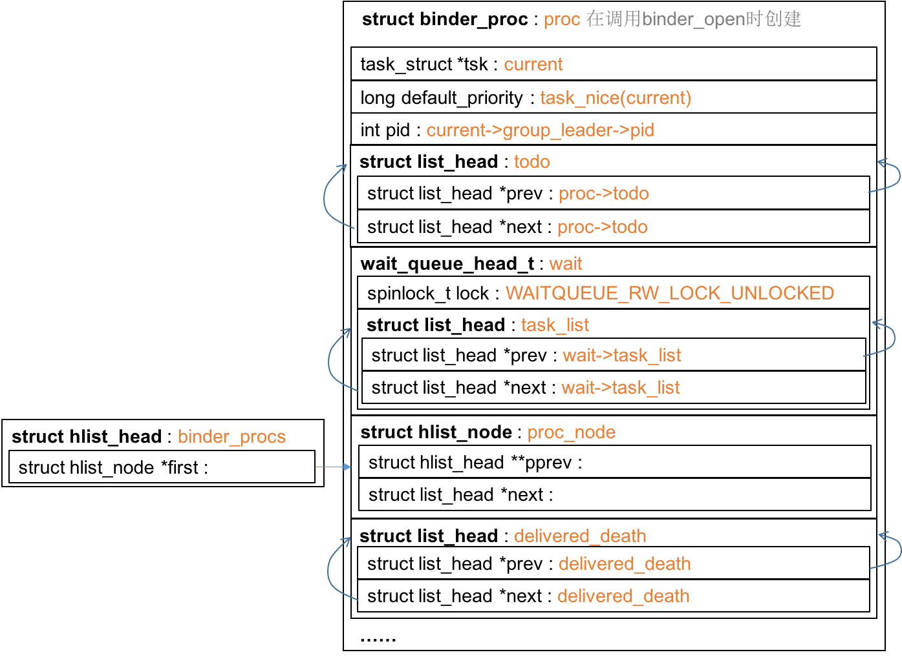
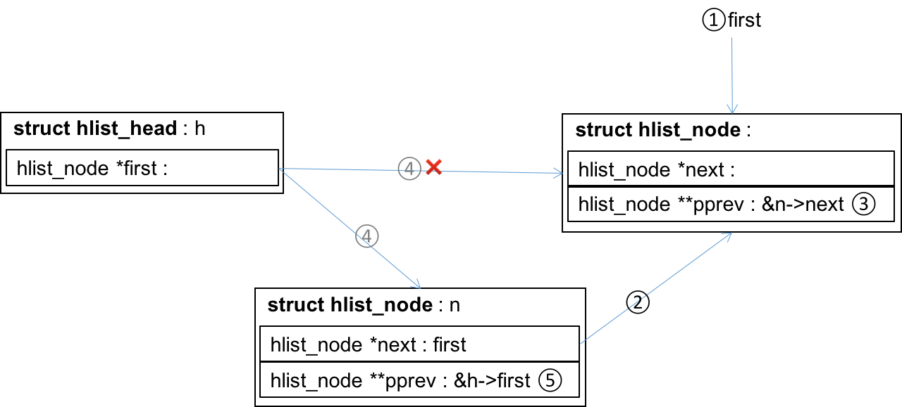
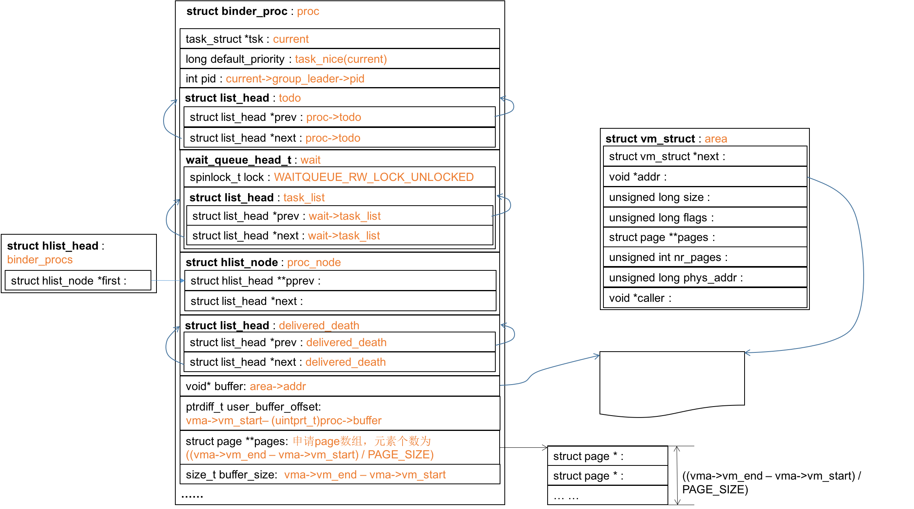
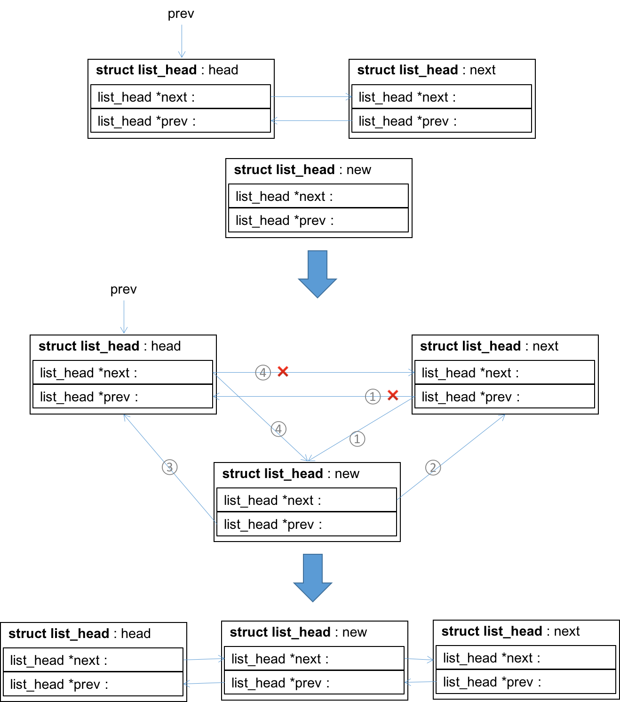
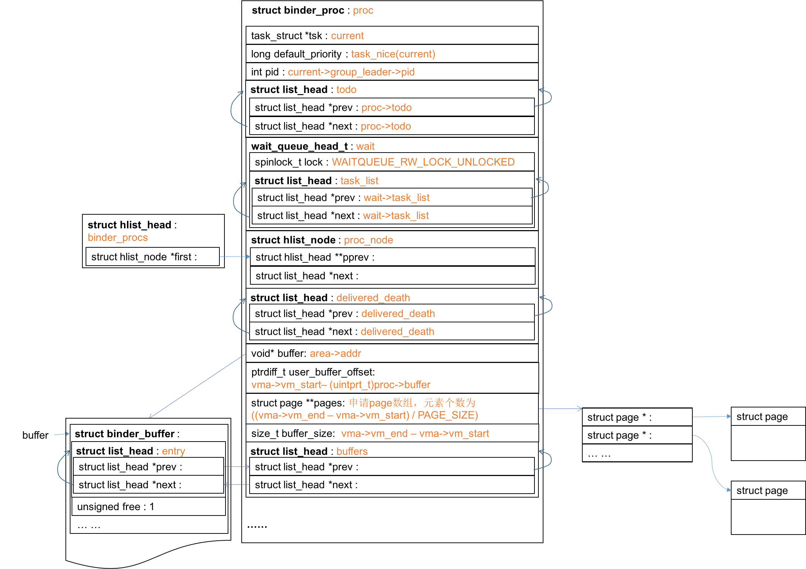
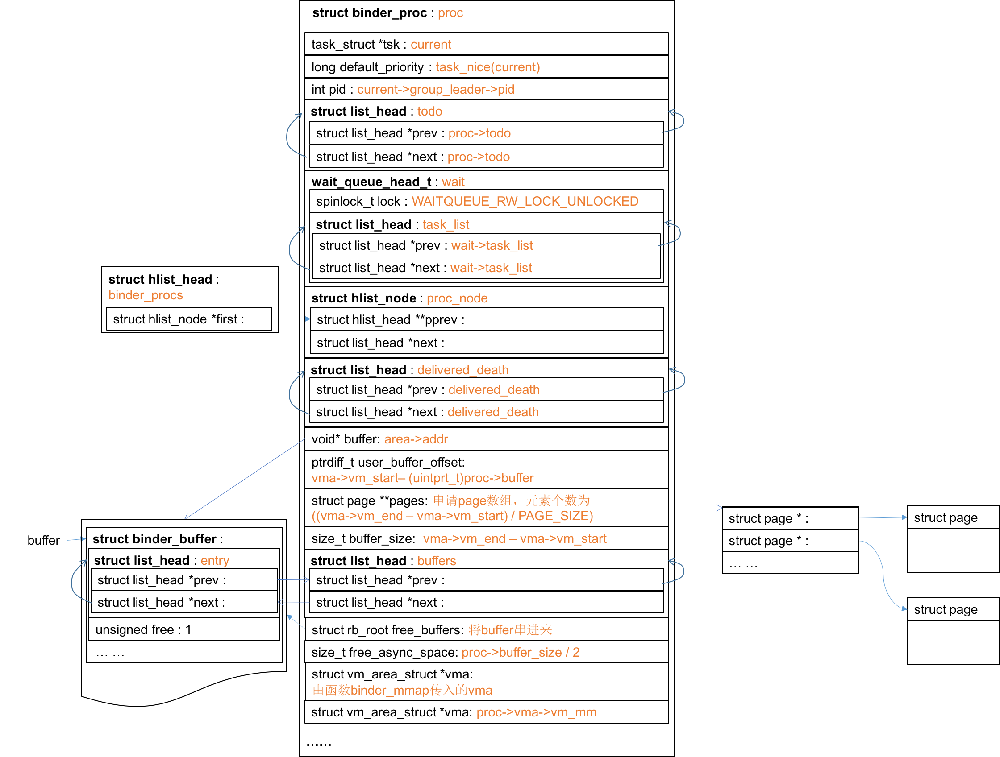
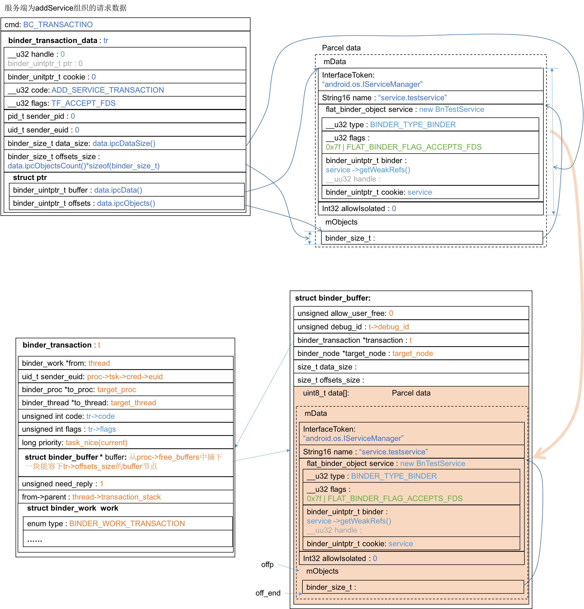
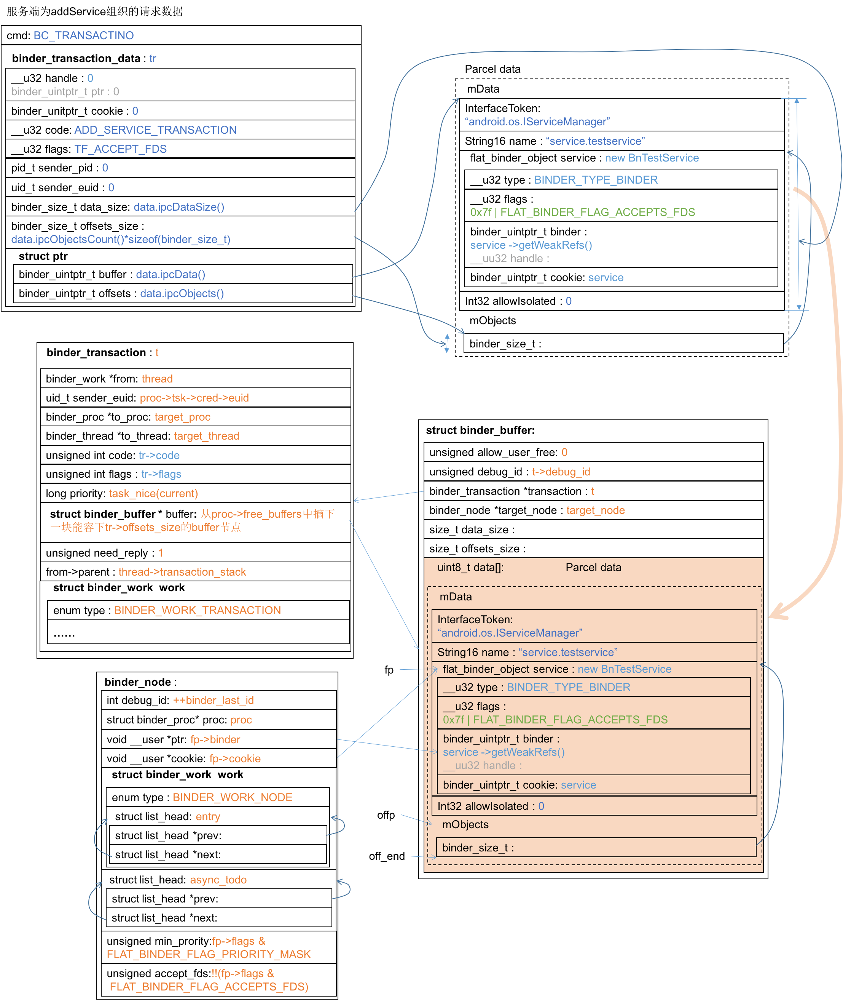
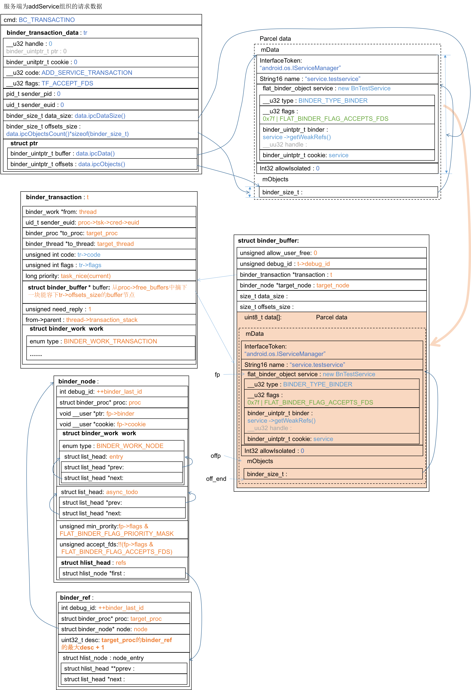
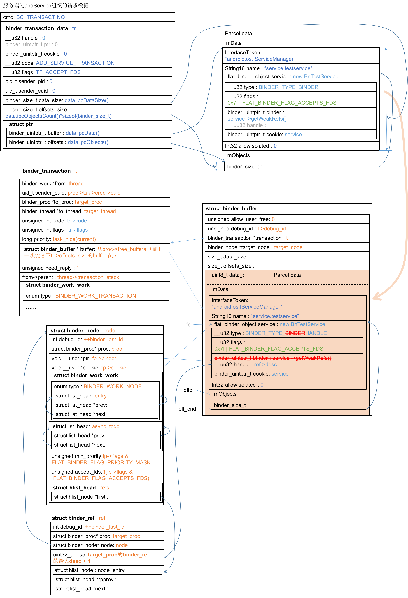

# binder_open(...)都干了什么？
在回答binder_transaction(...)之前，还有一些基础设施要去探究，比如binder_open(...)，binder_mmap(...)，这些调用是在打开设备文件/dev/binder之后必须完成的程式化操作，而在它们内部需要做一些数据结构的准备。首先来看binder_open(...)
<!-- more -->
kernel/drivers/staging/android/binder.c:2979
``` c++
static int binder_open(struct inode *nodp, struct file *filp)
{
    struct binder_proc *proc;
    ......
    proc = kzalloc(sizeof(*proc), GFP_KERNEL); // 创建binder_proc结构体
    ......
    get_task_struct(current);
    proc->tsk = current;
    INIT_LIST_HEAD(&proc->todo);  // 初始化链表头
    init_waitqueue_head(&proc->wait);   
    proc->default_priority = task_nice(current);

    ......
    // 将proc_node串入全局链表binder_procs中
    hlist_add_head(&proc->proc_node, &binder_procs); 
    proc->pid = current->group_leader->pid;
    INIT_LIST_HEAD(&proc->delivered_death);
    filp->private_data = proc;

    ......
    return 0;
}
```
binder_open(...)生成并初始化binder_proc结构体如下：


## struct binder_proc
struct binder_proc描述一个“正在使用Binder进程间通信机制”的进程，它的定义参见kernel/goldfish/drivers/staging/android/binder.c:286
``` c++
struct binder_proc {
    // 进程打开设备文件/dev/binder时，Binder驱动会为它创建一个binder_proc结构体，并将它
    // 保存在全局hash列表中，proc_node是该hash列表的节点。
    struct hlist_node proc_node;

    // 每个使用了Binder机制的进程都有一个Binder线程池，用来处理进程间通信请求。threads以
    // 线程ID作为key来组织进程的Binder线程池。进程可以调用ioctl将线程注册到Binder驱动中
    // 当没有足够的空闲线程处理进程间通信请求时，驱动可以要求进程注册更多的线程到Binder线程
    // 池中
    struct rb_root threads; 

    struct rb_root nodes;           // 组织Binder实体对象，它以成员ptr作为key
    struct rb_root refs_by_desc;    // 组织Binder引用对象，它以成员desc作为key
    struct rb_root refs_by_node;    // 组织Binder引用对象，它以成员node作为key
    int pid;                        // 指向进程组ID
    struct vm_area_struct *vma;     // 内核缓冲区的用户空间地址，供应用程序使用
    struct mm_struct *vma_vm_mm;
    struct task_struct *tsk;        // 指向进程任务控制块
    struct files_struct *files;     // 指向进程打开文件结构体数组

    // 一个hash表，保存进程可以延迟执行的工作项，这些延迟工作有三种类型
    // BINDER_DEFERRED_PUT_FILES、BINDER_DEFERRED_FLUSH、BINDER_DEFERRED_RELEASE
    // 驱动为进程分配内核缓冲区时，会为该缓冲区创建一个文件描述符，进程可以通过该描述符将该内
    // 核缓冲区映射到自己的地址空间。当进程不再需要使用Binder机制时，就会通知驱动关闭该文件
    // 描述符并释放之前所分配的内核缓冲区。由于这不是一个马上就要完成的操作，因此驱动会创建一
    // 个BINDER_DEFERRED_PUT_FILES类型的工作来延迟执行；
    // Binder线程池中的空闲Binder线程是睡眠在一个等待队列中的，进程可以通过调用函数flush
    // 来唤醒这些线程，以便它们可以检查进程是否有新的工作项需要处理。此时驱动会创建一个
    // BINDER_DEFERRED_FLUSH类型的工作项，以便延迟执行唤醒空闲Binder线程的操作；
    // 当进程不再使用Binder机制时，会调用函数close关闭文件/dev/binder，此时驱动会释放之
    // 前为它分配的资源，由于资源释放是个比较耗时的操作，驱动会创建一个
    // BINDER_DEFERRED_RELEASE类型的事务来延迟执行
    struct hlist_node deferred_work_node;

    int deferred_work;              // 描述该延迟工作项的具体类型
    void *buffer;                   // 内核缓冲区的内核空间地址，供驱动程序使用
    ptrdiff_t user_buffer_offset;   // vma和buffer之间的差值

    // buffer指向一块大的内核缓冲区，驱动程序为方便管理，将它划分成若干小块，这些小块的内核缓
    // 冲区用binder_buffer描述保存在列表中，按地址从小到大排列。buffers指向该列表的头部。
    struct list_head buffers; 

    struct rb_root free_buffers;      // buffers中的小块有的正在使用，被保存在此红黑树
    struct rb_root allocated_buffers;   // buffers中的空闲小块被保存在此红黑树
    size_t free_async_space;            // 当前可用的保存异步事务数据的内核缓冲区的大小

    struct page **pages;    // buffer和vma都是虚拟地址，它们对应的物理页面保存在pages
                            // 中，这是一个数组，每个元素指向一个物理页面
    size_t buffer_size;     // 进程调用mmap将它映射到进程地址空间，实际上是请求驱动为它
                            // 分配一块内核缓冲区，缓冲区大小保存在该成员中
    uint32_t buffer_free;   // 空闲内核缓冲区的大小
    struct list_head todo;  // 当进程接收到一个进程间通信请求时，Binder驱动就将该请求封
                            // 装成一个工作项，并且加入到进程的待处理工作向队列中，该队列
                            // 使用成员变量todo来描述。
    wait_queue_head_t wait; // 线程池中空闲Binder线程会睡眠在由该成员所描述的等待队列中
                            // 当宿主进程的待处理工作项队列增加新工作项后，驱动会唤醒这
                            // 些线程，以便处理新的工作项
    struct binder_stats stats;  // 用来统计进程数据

    // 当进程所引用的Service组件死亡时，驱动会向该进程发送一个死亡通知。这个正在发出的通知被
    // 封装成一个类型为BINDER_WORK_DEAD_BINDER或BINDER_WORK_DEAD_BINDER_AND_CLEAR
    // 的工作项，并保存在由该成员描述的队列中删除
    struct list_head delivered_death;  

    int max_threads;        // 驱动程序最多可以主动请求进程注册的线程数
    int requested_threads;
    int requested_threads_started;
    int ready_threads;      // 进程当前的空闲Binder线程数
    long default_priority;  // 进程的优先级，当线程处理一个工作项时，线程优先级可能被
                            // 设置为宿主进程的优先级
    struct dentry *debugfs_entry;
};
```
## binder_proc中的链表
在binder_proc内部有若干个list_head类型的字段，用来把binder_proc串到不同的链表中去。一般写链表的做法是在链表节点结构体中追加业务逻辑字段，顺着链表的prev、next指针到达指定节点，然后再访问业务逻辑字段：

在Linux代码中则常常反过来，先定义业务逻辑的结构体，在其内部嵌入链表字段list_head，顺着该字段遍历链表，在每个节点上根据该字段与所在结构体的偏移量找到所在结构体，访问业务逻辑字段：

这样做的好处是让业务逻辑和链表逻辑分离，Linux还定义了宏用于操作链表，以及根据链表字段找到所在结构体。如binder_proc结构体内部盛放多个list_head，表示把该结构体串入了不同的链表。
具体技巧可参见《Linux内核设计与实现》第6章。

## INIT_LIST_HEAD(&proc->todo)
回到binder_open(...)，除了直接字段赋值，需要解释的是几个链表字段的处理。
`INIT_LIST_HEAD(&proc->todo)`用于将todo的next、prev指针指向自己，该宏的定义在kernel/goldfish/include/linux/lish.t:24
``` c++
static inline void INIT_LIST_HEAD(struct list_head *list)
{
    list->next = list;
    list->prev = list;
}
```

## init_waitqueue_head(&proc->wait)
`init_waitqueue_head(&proc->wait)`这个宏定义在kernel/goldfish/include/linux/wait.h:81
``` c++
#define init_waitqueue_head(q)              \
    do {                        \
        static struct lock_class_key __key; \
                            \
        __init_waitqueue_head((q), #q, &__key); \
    } while (0)
```
`__init_waitqueue_head(...)`定义在kernel/goldfish/kernel/wait.c:13，主要完成了对task_list字段的初始化：
``` c++
void __init_waitqueue_head(wait_queue_head_t *q, const char *name, struct lock_class_key *key)
// q=(&proc->todo)
{
    spin_lock_init(&q->lock);
    lockdep_set_class_and_name(&q->lock, key, name);
    INIT_LIST_HEAD(&q->task_list);  // 为什么使用符号->来提领task_list呢？
}
```
说到底还是初始化proc->wait->task_list字段。不过有点奇怪task_list是wait内的结构体，而不是结构体指针，为什么对task_list的提领使用符号`->`呢？
``` c
struct binder_proc {
    ......
    wait_queue_head_t wait;
    ......
};
```
kernel/goldfish/include/linux/wait.h:53
``` c 
struct __wait_queue_head {
    spinlock_t lock;
    struct list_head task_list;
};
typedef struct __wait_queue_head wait_queue_head_t;
```
## hlist_add_head(&proc->proc_node, &binder_procs)
`hlist_add_head(&proc->proc_node, &binder_procs)`将proc->proc_node节点串到全局链表binder_procs的头部，其定义在kernel/goldfish/include/linux/list.h:610
``` c++
static inline void hlist_add_head(struct hlist_node *n, struct hlist_head *h)
{
    struct hlist_node *first = h->first;
    n->next = first;
    if (first)
        first->pprev = &n->next;
    h->first = n;
    n->pprev = &h->first;
}
```
kernel/goldfish/include/linux/types.h:233
``` c
struct hlist_head {
    struct hlist_node *first;
};

struct hlist_node {
    struct hlist_node *next, **pprev;
};
```



综上所述，binder_open(...)组织的数据结构proc为：


# binder_mmap(...)都干了什么？
接下来就是binder_mmap(...)，当进程打开/dev/binder之后，必须调用mmap(...)函数把该文件映射到进程的地址空间。
kernel/goldfish/drivers/staging/android/binder.c:2883
``` c++
static int binder_mmap(struct file *filp, struct vm_area_struct *vma)
{
    int ret;
    struct vm_struct *area; // area描述内核地址空间；vma描述用户地址空间
    struct binder_proc *proc = filp->private_data;
    const char *failure_string;
    struct binder_buffer *buffer;

    ......
    vma->vm_flags = (vma->vm_flags | VM_DONTCOPY) & ~VM_MAYWRITE;

    ......
    // 在内核地址空间分配
    area = get_vm_area(vma->vm_end - vma->vm_start, VM_IOREMAP);
    ......
    proc->buffer = area->addr;
    proc->user_buffer_offset = vma->vm_start - (uintptr_t)proc->buffer;
    mutex_unlock(&binder_mmap_lock);
......
    // 创建物理页面结构体指针数组
    proc->pages = kzalloc(sizeof(proc->pages[0]) * ((vma->vm_end - vma->vm_start) / PAGE_SIZE), GFP_KERNEL);
    ......
    proc->buffer_size = vma->vm_end - vma->vm_start;

    vma->vm_ops = &binder_vm_ops;
    vma->vm_private_data = proc;

    // 分配物理页面，并将之同时映射到用户和内核地址空间
    if (binder_update_page_range(proc, 1, proc->buffer, proc->buffer + PAGE_SIZE, vma)) {
        ret = -ENOMEM;
        failure_string = "alloc small buf";
        goto err_alloc_small_buf_failed;
    }
    buffer = proc->buffer;
    INIT_LIST_HEAD(&proc->buffers);
    list_add(&buffer->entry, &proc->buffers); // 把entry串到buffers链表中
    buffer->free = 1;
    binder_insert_free_buffer(proc, buffer);
    proc->free_async_space = proc->buffer_size / 2;
    barrier();
    proc->files = get_files_struct(proc->tsk);
    proc->vma = vma;
    proc->vma_vm_mm = vma->vm_mm;

    /*printk(KERN_INFO "binder_mmap: %d %lx-%lx maps %p\n",
         proc->pid, vma->vm_start, vma->vm_end, proc->buffer);*/
    return 0;

err_alloc_small_buf_failed:
    kfree(proc->pages);
    proc->pages = NULL;
err_alloc_pages_failed:
    mutex_lock(&binder_mmap_lock);
    vfree(proc->buffer);
    proc->buffer = NULL;
err_get_vm_area_failed:
err_already_mapped:
    mutex_unlock(&binder_mmap_lock);
err_bad_arg:
    printk(KERN_ERR "binder_mmap: %d %lx-%lx %s failed %d\n",
           proc->pid, vma->vm_start, vma->vm_end, failure_string, ret);
    return ret;
}
```
到第28行调用binder_update_page_range(...)之前，binder_mmap(...)在内核地址空间申请了`struct vm_struct area`，并完成部分成员的初始化，如下：


## binder_update_page_range(...)做了什么
kernel/goldfish/drivers/staging/android/binder.c:627
``` c
static int binder_update_page_range(struct binder_proc *proc, int allocate,
                    void *start, void *end,
                    struct vm_area_struct *vma)
{
    void *page_addr;
    unsigned long user_page_addr;
    struct vm_struct tmp_area;
    struct page **page;
    struct mm_struct *mm;

    ... ...

    if (vma)
        mm = NULL;
    else
        mm = get_task_mm(proc->tsk);

    if (mm) {
        down_write(&mm->mmap_sem);
        vma = proc->vma;
        ... ...
    }

    if (allocate == 0) 
        goto free_range;    // 执行释放逻辑

    ... ...

    // 遍历所有页面
    for (page_addr = start; page_addr < end; page_addr += PAGE_SIZE) {
        int ret;
        struct page **page_array_ptr;
        page = &proc->pages[(page_addr - proc->buffer) / PAGE_SIZE];

        BUG_ON(*page);
        *page = alloc_page(GFP_KERNEL | __GFP_HIGHMEM | __GFP_ZERO);
        ... ...
        // 映射内核地址空间
        tmp_area.addr = page_addr;
        tmp_area.size = PAGE_SIZE + PAGE_SIZE /* guard page? */;
        page_array_ptr = page;
        ret = map_vm_area(&tmp_area, PAGE_KERNEL, &page_array_ptr);
        ... ...

        // 映射用户地址空间
        user_page_addr =
            (uintptr_t)page_addr + proc->user_buffer_offset;
        ret = vm_insert_page(vma, user_page_addr, page[0]);
        ... ...
    }
    if (mm) {
        up_write(&mm->mmap_sem);
        mmput(mm);
    }
    return 0;

free_range:
    for (page_addr = end - PAGE_SIZE; page_addr >= start;
         page_addr -= PAGE_SIZE) {
        page = &proc->pages[(page_addr - proc->buffer) / PAGE_SIZE];
        // 解除物理页面在用户地址空间和内核地址空间的映射
        if (vma)
            zap_page_range(vma, (uintptr_t)page_addr +
                proc->user_buffer_offset, PAGE_SIZE, NULL);
err_vm_insert_page_failed:
        unmap_kernel_range((unsigned long)page_addr, PAGE_SIZE);
err_map_kernel_failed:
        __free_page(*page);     // 释放物理页面
        *page = NULL;
err_alloc_page_failed:
        ;
    }
err_no_vma:
    if (mm) {
        up_write(&mm->mmap_sem);
        mmput(mm);
    }
    return -ENOMEM;
}
```

## struct binder_buffer
之后在binder_mmap(...)第34行，buffer的类型是`struct binder_buffer*`，该结构体用来描述一个内核缓冲区，该缓冲区用于在进程间传输数据。
kernel/goldfish/drivers/staging/android/binder.c:263
``` c
struct binder_buffer {
    // 每一个使用Binder机制的进程在Binder驱动中都有一个内核缓冲区列表，用来保存Binder驱动
    // 程序为它分配的内核缓冲区，entry是该列表的一个节点
    struct list_head entry; /* free and allocated entries by address */ 

    // 进程使用两个红黑树分别保存使用中以及空闲的内核缓冲区。如果空闲，free=1，
    //rb_node就是空闲内核缓冲区红黑树中的节点，否则是使用中内核缓冲区红黑树中的节点
    struct rb_node rb_node; /* free entry by size or allocated entry */ 
                         /* by address */                       

    unsigned free:1;
    // Service处理完成该事务后，若发现allow_user_free为1，会请求驱动程序释放该内核缓冲区
    unsigned allow_user_free:1;         
    unsigned async_transaction:1;           // 与该内核缓冲区关联的是一个异步事务
    unsigned debug_id:29;

    struct binder_transaction *transaction; // 内核缓冲区正交给哪个事务使用
    struct binder_node *target_node;        // 内核缓冲区正交给哪个Binder实体对象使用
    size_t data_size;
    size_t offsets_size;

    // 保存通信数据，分两种类型：普通数据、Binder对象。驱动程序不关心普通数据，但必须知道里面
    // 的Binder对象，因为要根据它们来维护内核中Binder实体对象和Binder引用对象的生命周期。
    uint8_t data[0];                        
};
```

## list_add(&buffer->entry, &proc->buffers)
初始化完proc->buffers之后，第36行执行一个list_add(...)，该函数定义见kernel/goldfish/include/linux/list.h:37~60
``` c
static inline void __list_add(struct list_head *new,
                  struct list_head *prev,
                  struct list_head *next)
{
    next->prev = new;
    new->next = next;
    new->prev = prev;
    prev->next = new;
}
... ...
static inline void list_add(struct list_head *new, struct list_head *head)
{
    __list_add(new, head, head->next);
}
```
运算过程如下图：

于是到`binder_mmap(...)`第37行为止，binder_mmap(...)构造的数据结构如下：


## 函数binder_insert_free_buffer(...)
kernel/goldfish/drivers/statging/android/binder.c:545
``` c
static void binder_insert_free_buffer(struct binder_proc *proc,
                      struct binder_buffer *new_buffer)
{   // new_buffer就是之前分配的buffer，被转型成了binder_buffer
    struct rb_node **p = &proc->free_buffers.rb_node;
    struct rb_node *parent = NULL;
    struct binder_buffer *buffer;
    size_t buffer_size;
    size_t new_buffer_size;
    ... ...
    // 计算binder_buffer中data部分的大小
    new_buffer_size = binder_buffer_size(proc, new_buffer);

    ... ...
    // 根据new_buffer的大小，找到在proc->free_buffers红黑树中的正确位置，并插入
    while (*p) {
        parent = *p;
        buffer = rb_entry(parent, struct binder_buffer, rb_node);
        BUG_ON(!buffer->free);

        buffer_size = binder_buffer_size(proc, buffer);

        if (new_buffer_size < buffer_size)
            p = &parent->rb_left;
        else
            p = &parent->rb_right;
    }
    rb_link_node(&new_buffer->rb_node, parent, p);
    rb_insert_color(&new_buffer->rb_node, &proc->free_buffers);
}
```

于是到binder_mmap(...)结束，这个binder_proc结构体就被做成了这样：


# 从服务端addService触发的`binder_transaction(...)`
从native层的调用过程参见[binder学习笔记（十）—— 穿越到驱动层](https://palanceli.github.io/2016/05/28/2016/0528BinderLearning10/)。我们以addService为例深入到binder_transaction(...)内部，
传入的`binder_transaction_data`输入参数为：

kernel/goldfish/drivers/staging/android/binder.c:1402
``` c
static void binder_transaction(struct binder_proc *proc,
                   struct binder_thread *thread,
                   struct binder_transaction_data *tr, int reply)
{   // reply=(cmd==BC_REPLY)即false，flags=TF_ACCEPT_FDS
    // proc和thread表示当前进程对应的数据结构
    struct binder_transaction *t;
    struct binder_work *tcomplete;
    size_t *offp, *off_end;
    struct binder_proc *target_proc;
    struct binder_thread *target_thread = NULL;
    struct binder_node *target_node = NULL;
    struct list_head *target_list;
    wait_queue_head_t *target_wait;
    struct binder_transaction *in_reply_to = NULL;
    struct binder_transaction_log_entry *e;
    uint32_t return_error;

    ......

    if (reply) {
        ......
    } else {
        if (tr->target.handle) {  // tr->target.handle!=0
            ......
        } else {
            // target_node表示binder请求要发送到的节点，此处即
            // service manager对应的节点
            target_node = binder_context_mgr_node; 
            ......
        }
        ......
        target_proc = target_node->proc; // 得到目标进程的binder_proc
        ......
        // 得到目标线程tr->flags=TF_ACCEPT_FDS
        // thread未被操作过，故transaction_stack为0
        if (!(tr->flags & TF_ONE_WAY) && thread->transaction_stack) {
            struct binder_transaction *tmp;
            tmp = thread->transaction_stack;
            ... ...
            while (tmp) {
                if (tmp->from && tmp->from->proc == target_proc)
                    target_thread = tmp->from;
                tmp = tmp->from_parent;
            }
        }
    }
    if (target_thread) {
        e->to_thread = target_thread->pid;
        target_list = &target_thread->todo;
        target_wait = &target_thread->wait;
    } else { // 走这里
        target_list = &target_proc->todo;
        target_wait = &target_proc->wait;
    }
    ......
    t = kzalloc(sizeof(*t), GFP_KERNEL);  // 创建binder_transaction节点
    ......
    tcomplete = kzalloc(sizeof(*tcomplete), GFP_KERNEL);//创建一个binder_work节点
    ......
    // 这里岂不是为真？thread来自binder_ioctl(...)中的binder_get_thread(proc)
    // 返回proc的当前线程
    if (!reply && !(tr->flags & TF_ONE_WAY)) 
        t->from = thread;
    else
        t->from = NULL;
    t->sender_euid = proc->tsk->cred->euid; // 源线程用户id
    t->to_proc = target_proc;               // 负责处理该事务的进程，sm
    t->to_thread = target_thread;           // 负责处理该事务的线程
    t->code = tr->code;                     // ADD_SERVICE_TRANSACTION
    t->flags = tr->flags;                   // TF_ACCEPT_FDS
    t->priority = task_nice(current);       // 源线程优先级
    ... ...
    t->buffer = binder_alloc_buf(target_proc, tr->data_size,
        tr->offsets_size, !reply && (t->flags & TF_ONE_WAY));
    ......
    t->buffer->allow_user_free = 0;// Service处理完该事务后，驱动不会释放该内核缓冲区
    t->buffer->debug_id = t->debug_id;
    t->buffer->transaction = t; // 缓冲区正交给哪个事务使用
    t->buffer->target_node = target_node;   // 缓冲区正交给哪个Binder实体对象使用
    ......
    if (target_node)
        binder_inc_node(target_node, 1, 0, NULL);
    // 分析所传数据中的所有binder对象，如果是binder实体，在红黑树中添加相应的节点。
    // 首先，从用户态获取所传输的数据，以及数据里的binder对象偏移信息。
    offp = (size_t *)(t->buffer->data + ALIGN(tr->data_size, sizeof(void *)));
    // 将服务端传来的Parcel的数据部分拷贝到内核空间
    if (copy_from_user(t->buffer->data, tr->data.ptr.buffer, tr->data_size)) {
        ......
    }
    // 将服务端传来的Parcel的偏移数组拷贝到内核空间
    if (copy_from_user(offp, tr->data.ptr.offsets, tr->offsets_size)) {
        ......
    }
    ......
    off_end = (void *)offp + tr->offsets_size;
    // 遍历每个flat_binder_object信息，创建必要的红黑树节点
    for (; offp < off_end; offp++) {
        struct flat_binder_object *fp;
        ......
        fp = (struct flat_binder_object *)(t->buffer->data + *offp);
        switch (fp->type) {
        case BINDER_TYPE_BINDER:
        case BINDER_TYPE_WEAK_BINDER: { // 如果是binder实体
            struct binder_ref *ref;
            // fp->binder是BnTestService::getWeakRefs()，BnTestService的影子对象
            // binder_get_node(...)在proc->nodes.rb_node中找fp->binder，如果没有
            // 找到，则在该红黑树中为fp->binder创建节点
            struct binder_node *node = binder_get_node(proc, fp->binder);
            if (node == NULL) {
                node = binder_new_node(proc, fp->binder, fp->cookie);
                ......
                node->min_priority = fp->flags & FLAT_BINDER_FLAG_PRIORITY_MASK;
                node->accept_fds = !!(fp->flags & FLAT_BINDER_FLAG_ACCEPTS_FDS);
            }
            ......
            // 必要时，会在目标进程的binder_proc中创建对应的binder_ref红黑树节点
            ref = binder_get_ref_for_node(target_proc, node);
            ......
            if (fp->type == BINDER_TYPE_BINDER)
                fp->type = BINDER_TYPE_HANDLE;
            else
                fp->type = BINDER_TYPE_WEAK_HANDLE;
            // 修改所传数据中的flat_binder_object信息，因为远端的binder实体到
            // 了目标端就变为binder代理了，所以要记录下binder句柄了。
            fp->handle = ref->desc;
            binder_inc_ref(ref, fp->type == BINDER_TYPE_HANDLE,
                       &thread->todo);
            ......
        } break;
        case BINDER_TYPE_HANDLE:
        case BINDER_TYPE_WEAK_HANDLE: { 
            // 对flat_binder_object做必要的修改，比如将BINDER_TYPE_HANDLE改为
            // BINDER_TYPE_BINDER
            struct binder_ref *ref = binder_get_ref(proc, fp->handle);
            ......
            if (ref->node->proc == target_proc) {
                if (fp->type == BINDER_TYPE_HANDLE)
                    fp->type = BINDER_TYPE_BINDER;
                else
                    fp->type = BINDER_TYPE_WEAK_BINDER;
                fp->binder = ref->node->ptr;
                fp->cookie = ref->node->cookie;
                binder_inc_node(ref->node, fp->type == BINDER_TYPE_BINDER, 0, NULL);
                trace_binder_transaction_ref_to_node(t, ref);
                ... ...
            } else {
                struct binder_ref *new_ref;
                new_ref = binder_get_ref_for_node(target_proc, ref->node);
                if (new_ref == NULL) {
                    return_error = BR_FAILED_REPLY;
                    goto err_binder_get_ref_for_node_failed;
                }
                fp->handle = new_ref->desc;
                binder_inc_ref(new_ref, fp->type == BINDER_TYPE_HANDLE, NULL);
                trace_binder_transaction_ref_to_ref(t, ref,
                                    new_ref);
                ... ...
            }
        } break;

        case BINDER_TYPE_FD: {
            int target_fd;
            struct file *file;
            ... ...

            file = fget(fp->handle);
            ... ...
            target_fd = task_get_unused_fd_flags(target_proc, O_CLOEXEC);
            ... ...
            task_fd_install(target_proc, target_fd, file);
            trace_binder_transaction_fd(t, fp->handle, target_fd);
            binder_debug(BINDER_DEBUG_TRANSACTION,
                     "        fd %ld -> %d\n", fp->handle, target_fd);
            /* TODO: fput? */
            fp->handle = target_fd;
        } break;

        default:
            ... ...
            return_error = BR_FAILED_REPLY;
            goto err_bad_object_type;
        }
    }
    if (reply) {
        ......
    } else if (!(t->flags & TF_ONE_WAY)) {
        ... ...
        t->need_reply = 1;
        t->from_parent = thread->transaction_stack;
        thread->transaction_stack = t;
    } else {
        ......
        if (target_node->has_async_transaction) {
            target_list = &target_node->async_todo;
            target_wait = NULL;
        } else
            target_node->has_async_transaction = 1;
    }
    t->work.type = BINDER_WORK_TRANSACTION;
    // 把binder_transaction节点插入target_list（即目标todo队列）
    list_add_tail(&t->work.entry, target_list);
    tcomplete->type = BINDER_WORK_TRANSACTION_COMPLETE;
    list_add_tail(&tcomplete->entry, &thread->todo);
    if (target_wait) // 传输动作完毕，现在可以唤醒系统中其它相关线程，wake up!
        wake_up_interruptible(target_wait);
    return;

err_get_unused_fd_failed:
err_fget_failed:
err_fd_not_allowed:
err_binder_get_ref_for_node_failed:
err_binder_get_ref_failed:
err_binder_new_node_failed:
err_bad_object_type:
err_bad_offset:
err_copy_data_failed:
    trace_binder_transaction_failed_buffer_release(t->buffer);
    binder_transaction_buffer_release(target_proc, t->buffer, offp);
    t->buffer->transaction = NULL;
    binder_free_buf(target_proc, t->buffer);
err_binder_alloc_buf_failed:
    kfree(tcomplete);
    binder_stats_deleted(BINDER_STAT_TRANSACTION_COMPLETE);
err_alloc_tcomplete_failed:
    kfree(t);
    binder_stats_deleted(BINDER_STAT_TRANSACTION);
err_alloc_t_failed:
err_bad_call_stack:
err_empty_call_stack:
err_dead_binder:
err_invalid_target_handle:
err_no_context_mgr_node:
    binder_debug(BINDER_DEBUG_FAILED_TRANSACTION,
             "binder: %d:%d transaction failed %d, size %zd-%zd\n",
             proc->pid, thread->pid, return_error,
             tr->data_size, tr->offsets_size);

    {
        struct binder_transaction_log_entry *fe;
        fe = binder_transaction_log_add(&binder_transaction_log_failed);
        *fe = *e;
    }

    BUG_ON(thread->return_error != BR_OK);
    if (in_reply_to) {
        thread->return_error = BR_TRANSACTION_COMPLETE;
        binder_send_failed_reply(in_reply_to, return_error);
    } else
        thread->return_error = return_error;
}
```
## struct binder_transaction
在函数binder_transaction(...)第53行创建了结构体binder_transaction，该结构体用来描述进程间通信过程，即事务。其定义在kernel/goldfish/drivers/staging/android/binder.c:346
``` c
struct binder_transaction {
    int debug_id;

    // 当驱动为目标进程或线程创建一个事务时，就会将该成员的type置为
    // BINDER_WORK_TRANSACTION，并将它添加到目标进程或线程的todo队列，等待处理
    struct binder_work work;

    struct binder_thread *from;         // 发起事务的线程

    // 事务所依赖的另外一个事务以及目标线程下一个要处理的事务
    struct binder_transaction *from_parent; 

    struct binder_proc *to_proc;        // 负责处理该事务的进程
    struct binder_thread *to_thread;    // 负责处理该事务的线程
    struct binder_transaction *to_parent;
    unsigned need_reply:1;              // 同步事务为1需要等待对方回复；异步为0
    /* unsigned is_dead:1; */   /* not used at the moment */

    // 指向驱动为该事务分配的内核缓冲区，保存了进程间通信数据
    struct binder_buffer *buffer;   

    unsigned int    code;   // 直接从进程间通信数据中拷贝过来
    unsigned int    flags;  // 直接从进程间通信数据中拷贝过来
    long    priority;       // 源线程优先级

    // 线程在处理事务时，驱动会修改它的优先级以满足源线程和目标Service组建的要求。在修改之
    // 前，会将它原来的线程优先级保存在该成员中，以便线程处理完该事务后可以恢复原来的优先级
    long    saved_priority; 
    uid_t   sender_euid;    // 源线程用户ID
};
```

## struct binder_work
在binder_transaction(...)第55行创建了struct binder_work，该结构体用于描述待处理的工作项，其定义在kernel/goldfish/drivers/staging/android/binder.c:205
``` c
struct binder_work {        
    struct list_head entry; // 用来将该结构体嵌入到一个宿主结构中
    // 描述工作项的类型，根据取值，Binder驱动程序就可以判断出一个binder_work结构体嵌入到
    // 什么类型的宿主结构中
    enum {
        BINDER_WORK_TRANSACTION = 1,
        BINDER_WORK_TRANSACTION_COMPLETE,
        BINDER_WORK_NODE,
        BINDER_WORK_DEAD_BINDER,
        BINDER_WORK_DEAD_BINDER_AND_CLEAR,
        BINDER_WORK_CLEAR_DEATH_NOTIFICATION,
    } type;             
};
```

到binder_transaction(...)第92行为止，它构造的数据结构如下。此时用户控件的部分数据被拷贝到了内核空间，内核空间中binder_transaction的buffer是从proc->free_buffers中摘取下来的，为了避免图片过大，此处的细节暂不展现了。摘取下的buffer的数据部分用于暂存从用户空间拷贝来的数据。


## struct binder_node
从94行开始，逐个遍历t->buffer.data中的binder objects，在for循环中，fp指向当前的binder object。如果fp->type是BINDER_TYPE_BINDER或BINDER_TYPE_WEAK_BINDER，#104先从proc->nodes.rb_node中查找有没有fp->binder，如果没有则调用binder_new_node(...)在proc->nodes.rb_node中创建此节点。接下来先看看`struct binder_node`，kernel/goldfish/drivers/staging/android/binder.c:217，它用来描述一个Binder实体对象，每一个Service组件在驱动层都对应一个binder_node，用来描述在内核中的状态：
``` c
struct binder_node {            
    int debug_id;               // 帮助调试用的

    // 当Binder实体对象的引用计数由0变为1或由1变为0时，Binder驱动程序就会请求相应的
    // Service组件增加或减少其引用计数。Binder驱动程序就会将“该引用计数修改”封装成一个类
    // 型为一个类型为binder_node的工作项，即将成员work的值置为BINDER_WORK_NODE，并将
    // 它添加到相应进程的todo队列中等待处理
    struct binder_work work;

    union {
        struct rb_node rb_node;
        struct hlist_node dead_node;
    };

    // 指向宿主进程，宿主进程使用一个红黑树来维护它内部所有Binder实体对象，而每一个
    // Binder实体对象的成员变量rb_node就正好是这个红黑树的一个节点。如果Binder实体对象
    // 的宿主进程已经死亡，那么该Binder实体对象就会通过它的成员变量dead_node保存在一个全
    // 局的hash列表中。
    struct binder_proc *proc;

    // 一个Binder实体对象可能会同时被多个Client组件引用，因此Binder驱动使用结构体
    // binder_ref来描述这些引用关系，并且将引用了同一个Binder实体对象的所有引用都保存在
    // 一个hash列表中。这个hash列表通过Binder实体对象的refs成员来描述，而Binder驱动通
    // 过refs就可以知道有哪些Client组件引用了同一个Binder实体对象
    struct hlist_head refs;

    int internal_strong_refs;       // 描述Bidner实体对象的强引用计数
    int local_weak_refs;            // 描述Binder实体对象的弱引用计数
    int local_strong_refs;          // 描述Bidner实体对象的强引用计数

    void __user *ptr;       // 描述用户空间中的Service组件，指向Service的影子对象
    void __user *cookie;    // 描述用户空间中的Service组件的地址，指向Service的地址

     // 当Binder实体对象请求Service执行某个操作时，会增加该Service的强/弱引用计数，
     // has_strong_ref和has_weak_ref被置1；
     // 当Service完成Binder所请求的操作后，会递减该Service的强/弱引用计数，has_strong_ref和has_weak_ref被置0；
     // Binder实体在请求Service增/减强/弱引用计数的过程中，会将
     // pending_strong_ref或pending_weak_ref置1；
     // 当Service完成增/减强/弱引用计数之后，会将这两个成员变量置为0。
    unsigned has_strong_ref:1;     
    unsigned pending_strong_ref:1;
    unsigned has_weak_ref:1;
    unsigned pending_weak_ref:1;

    // 描述Binder对象是否正在处理一个异步事务。Binder驱动程序将一个事务保存在todo队列中
    // 表示将由该线程来处理该事务。每个事务都关联着一个Binder实体对象，要求与该Binder实
    // 体对象对应的Service组件在指定线程中处理该事务。然而，当Binder驱动发现一个事务是异
    // 步事务时，就会将它保存在目标Binder实体对象的一个异步事务队列中，这个异步事务队列就
    // 是由成员变量async_todo来描述的。异步事务的定义是那些单向的进程间通信请求，即不需
    // 要等待应答的进程间通信请求，与此相对的是同步事务。因为不需要等待应答，Binder驱动就
    // 认为异步事务优先级低于同步事务，具体表现为在同一时刻，一个Binder实体对象的所有异步
    // 事务最多只有一个会得到处理，其余的都等待在异步事务队列中，而同步事务无此限制。
    unsigned has_async_transaction:1;

    // 描述Binder实体对象是否可以接收包含有文件描述符的进程间通信数据。1表示可以接收，0表
    // 示禁止接收。当一个进程向另一个进程发送的数据中包含有文件描述符时，Binder驱动程序就
    // 会自动在目标进程中打开一个相同的文件。基于安全性考虑，Binder程序就要通过该变量防止
    // 源进程在目标进程中打开文件。
    unsigned accept_fds:1;

    // 表示Binder实体对象在处理来自Client进程的请求时，他所要求的处理线程（即Server进程
    // 中的一个线程）应具备的最小线程优先级。
    unsigned min_priority:8;       
    struct list_head async_todo;
};
```
接下来的binder_new_node(proc, fp->binder, fp->cookie)将申请一个`struct binder_node`，在初始化中，将该节点挂到proc->nodes.rb_node中，并初始化部分成员，数据结构图如下：

## struct binder_ref
struct binder_ref用来描述一个Binder引用对象，当客户端使用Binder实体时，在客户端保存的就是对该实体的引用，该结构体用来描述引用对象在内核中的状态。kernel/goldfish/drivers/staging/android/binder.c:246
``` c
struct binder_ref {
    /* Lookups needed: */
    /*   node + proc => ref (transaction) */
    /*   desc + proc => ref (transaction, inc/dec ref) */
    /*   node => refs + procs (proc exit) */
    int debug_id;

    // 宿主进程使用两个红黑树来保存它内部所有Binder引用对象，分别以句柄值和对应的Binder
    // 实体对象地址来作为关键字保存这些引用对象，这两个rb_node_xxxx正是红黑树中的节点
    struct rb_node rb_node_desc;    
    struct rb_node rb_node_node;

    // 每个Binder实体对象都有一个hash表保存引用了它的Binder引用对象，这些引用对象的成员
    // node_entry就是该hash表的节点
    struct hlist_node node_entry;   
    struct binder_proc *proc;   // 宿主进程
    struct binder_node *node;   // 描述Binder引用对象所引用的Binder实体对象

    // 描述Binder引用对象的句柄值，驱动通过该句柄找到对应的Binder引用对象，然后再根据该
    // Binder引用对象的成员node找到对应的Binder实体对象，然后就可以通过该实体对象找到要
    // 访问的Service组件了。一个Binder引用对象的句柄值仅在进程范围内唯一，因此在两个不同
    // 进程中，同一个句柄可能代表不同的Service组件
    uint32_t desc;

    int strong;                 // 描述Binder引用对象的强/弱引用计数
    int weak;

    // 指向一个Service组件的死亡接收通知。当Client进程向Binder驱动程序注册一个它所引用
    // 的Service组件死亡接收通知时，Binder驱动程序会创建一个binder_ref_death结构体，然
    // 后保存在该成员变量death中
    struct binder_ref_death *death; 
};
```
接下来看binder_get_ref_for_node(target_proc, node)。需要注意，前面创建binder_node的时候，是为proc创建的，proc是在调用binder_open(...)时创建，用来描述“使用（打开）该binder的进程”，proc就藏在binder文件的文件描述符的私有数据中；而此处（第150行）参数使用的是target_proc，它表示当前的binder请求发向的目标进程，在本上下文中就是handle为0的service manager，即binder_context_mgr_node。
kernel/goldfish/drivers/staging/android/binder.c:1107
``` c
static struct binder_ref *binder_get_ref_for_node(struct binder_proc *proc,
                          struct binder_node *node)
{
    struct rb_node *n;
    struct rb_node **p = &proc->refs_by_node.rb_node;
    struct rb_node *parent = NULL;
    struct binder_ref *ref, *new_ref;
    // 在target_proc中查找node，如果找不到就创建
    while (*p) {
        parent = *p;
        ref = rb_entry(parent, struct binder_ref, rb_node_node);

        if (node < ref->node)
            p = &(*p)->rb_left;
        else if (node > ref->node)
            p = &(*p)->rb_right;
        else
            return ref;
    }
    new_ref = kzalloc(sizeof(*ref), GFP_KERNEL);
    ... ...
    binder_stats_created(BINDER_STAT_REF);
    new_ref->debug_id = ++binder_last_id;
    new_ref->proc = proc;
    new_ref->node = node;
    rb_link_node(&new_ref->rb_node_node, parent, p);
    rb_insert_color(&new_ref->rb_node_node, &proc->refs_by_node);

    // 遍历target_proc的binder_ref，找到最大的desc，加1后赋给new_ref->desc
    new_ref->desc = (node == binder_context_mgr_node) ? 0 : 1;
    for (n = rb_first(&proc->refs_by_desc); n != NULL; n = rb_next(n)) {
        ref = rb_entry(n, struct binder_ref, rb_node_desc);
        if (ref->desc > new_ref->desc)
            break;
        new_ref->desc = ref->desc + 1;
    }

    // 将new_ref插入到target_proc->refs_by_desc.rb_node中
    p = &proc->refs_by_desc.rb_node;
    while (*p) {
        parent = *p;
        ref = rb_entry(parent, struct binder_ref, rb_node_desc);

        if (new_ref->desc < ref->desc)
            p = &(*p)->rb_left;
        else if (new_ref->desc > ref->desc)
            p = &(*p)->rb_right;
        else
            BUG();
    }
    rb_link_node(&new_ref->rb_node_desc, parent, p);
    rb_insert_color(&new_ref->rb_node_desc, &proc->refs_by_desc);
    if (node) {
        hlist_add_head(&new_ref->node_entry, &node->refs);
        ... ...
    } 
    ... ...
    return new_ref;
}
```
于是，在binder_transaction(...)函数第114行完成调用`binder_get_ref_for_node(target_proc, node)`之后，数据结构图为：


接下来在函数binder_transaction(...)中还有几个关键操作，见第116行，如果fp->type为BINDER_TYPE_BINDER，就改为BINDER_TYPE_HANDLE，然后把fp->handle改为ref->desc，接下来的binder_ref_ref(ref, fp->type==BINDER_TYPE_HANDLE, &thread->todo)定义在kernel/goldfish/drivers/staging/android/binder.c:1200
``` c
static int binder_inc_ref(struct binder_ref *ref, int strong,
              struct list_head *target_list)
{   // strong = (fp->type==BINDER_TYPE_HANDLE)即为1
    // target_list = &thread->todo
    int ret;
    if (strong) {
        if (ref->strong == 0) {
            // ref->node->internal_strong_ref++，成功返回0
            ret = binder_inc_node(ref->node, 1, 1, target_list);
            if (ret)
                return ret;
        }
        ref->strong++;
    } else {
        if (ref->weak == 0) {
            ret = binder_inc_node(ref->node, 0, 1, target_list);
            if (ret)
                return ret;
        }
        ref->weak++;
    }
    return 0;
}
```
接下来跳出case后还有对t的成员need_reply、from_parent、t->work.type的处理，并将t插入到target_list即target_proc或target_thread的todo队列中，尔后返回。此时的数据结构图为：


到此为止，终于完成了binder_transaction(...)的分析，知道怎么回事，但心里有很多个“为什么”。而且把前面的学习笔记串联起来，隐约觉得能感应到一些曙光了，本节的篇幅太长了，这些曙光留待下一节一起领略吧。


