夏天每个周末的傍晚，我和小雨点做完各自的功课都会去软件园的湖边捞鱼，尽管渔网只有巴掌那么大，可是湖边活跃着超多小鱼。初夏的时候闭着眼睛，一网下去每次都能收获好几条，那个时候是小雨点大显身手的时候。每次天擦黑小水桶里就能轻轻松松收获几十条。

到了盛夏，鱼群长大了，游得飞快，而且看到人知道逃跑，捞鱼就变成一项技术活了，这个时候就得我上了。常常蹲在那耐心等上几分钟才能等到一两条，不要犹豫立刻下网，有的时候也会扑空。长到两公分长的鱼，逃跑的速度已经超乎想象，除非下网的时候这条倒霉蛋刚好冲你游来，否则网速很可能追不上它。

今天软件园湖水上涨，明显鱼群比前两周多了不少。而且这次整点高科技，捞鱼前撒上一把馒头渣，不一会就吸引到鱼群过来，今天收获真是不小：四只虾，十几条小鱼，临走时我老婆还抓到一只小乌龟！眼看着一直小乌龟冲自己游过来，伸手就捞上来了。看看今天的成果吧~

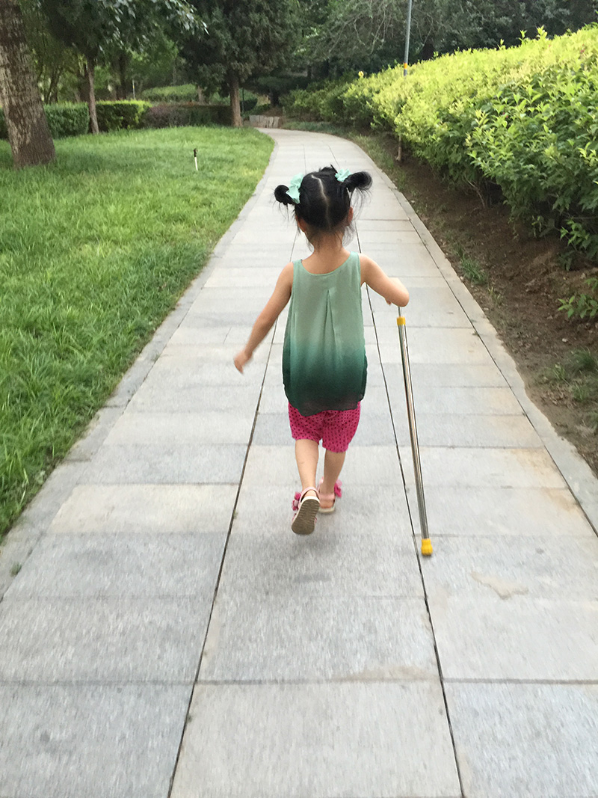
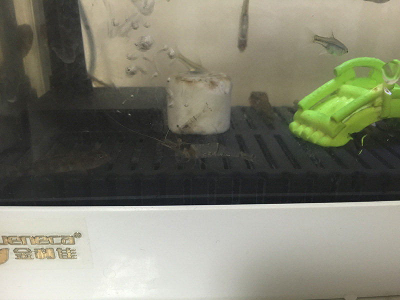
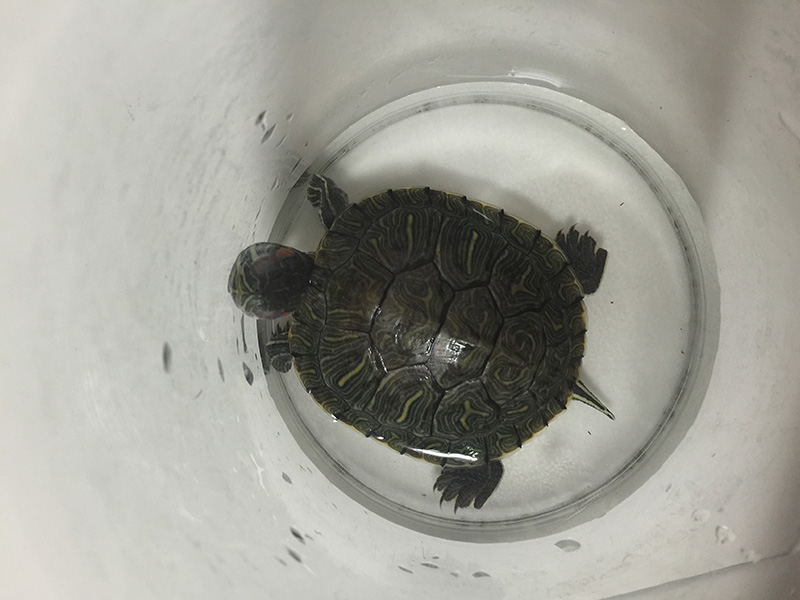
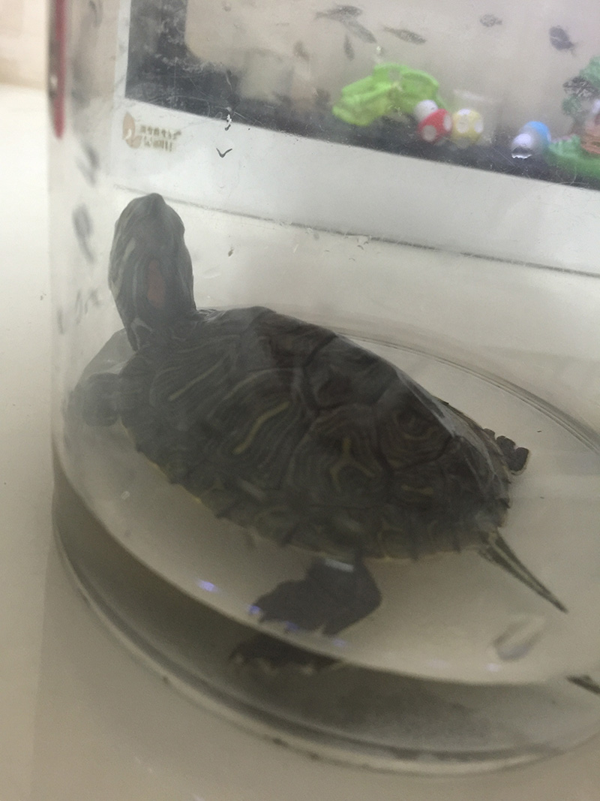
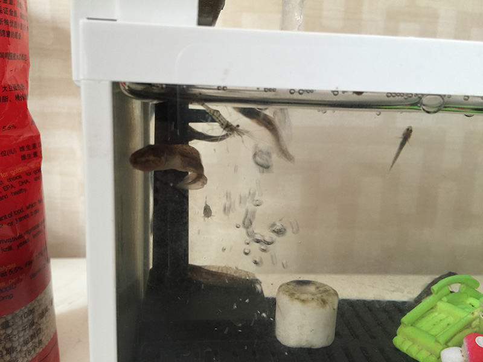
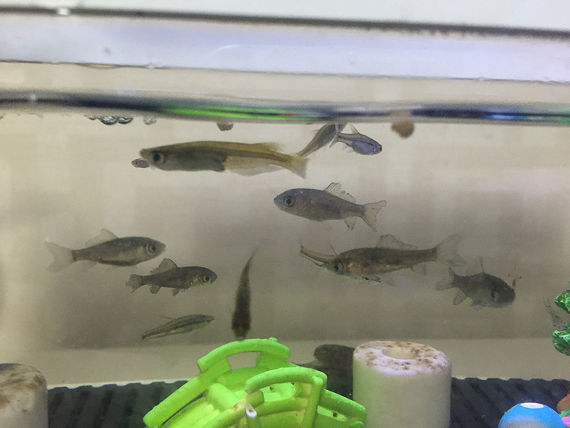
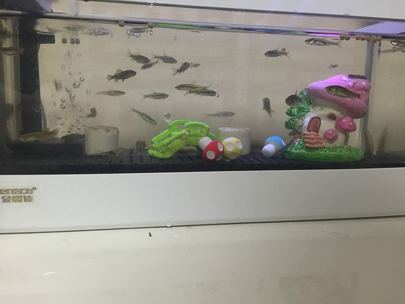

鱼缸不大，但还是颇有一些品种的，其中最凶猛的是一种贴地的，平时不爱游起来，而是紧贴着地面或墙壁。上一张照片里蘑菇的左下角就是这个品种。再来一张：
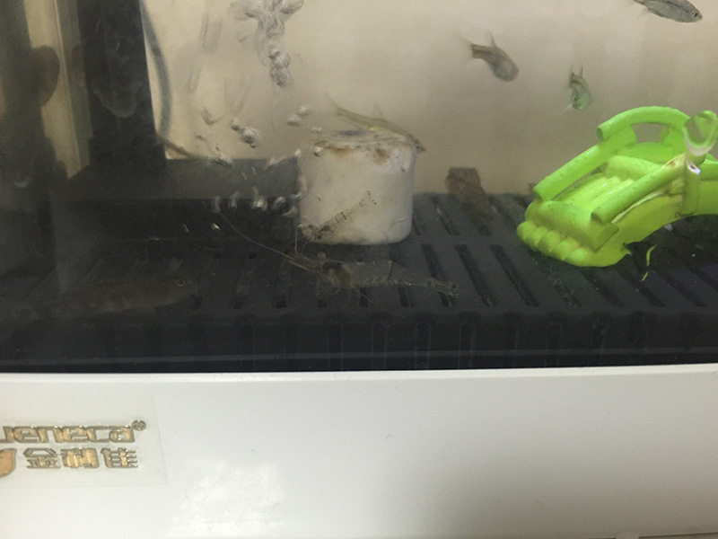
别看个头不大，异常凶猛，它会冷不丁地蹿起来向猎物发起攻击，这只虾跟它个头差不多，但战斗力极弱，在这个鱼缸里也就两三天就会连渣渣都不剩。这种鱼特别爱咬别的鱼的尾巴，有一次扔进去十几条鱼，到了晚上再去看，发现浮在上面好几条都只会让尾巴一颤一颤的，根本游不动了。丧失逃跑的能力，就只好等着当别人的每餐，果然到了第二天全消失了。
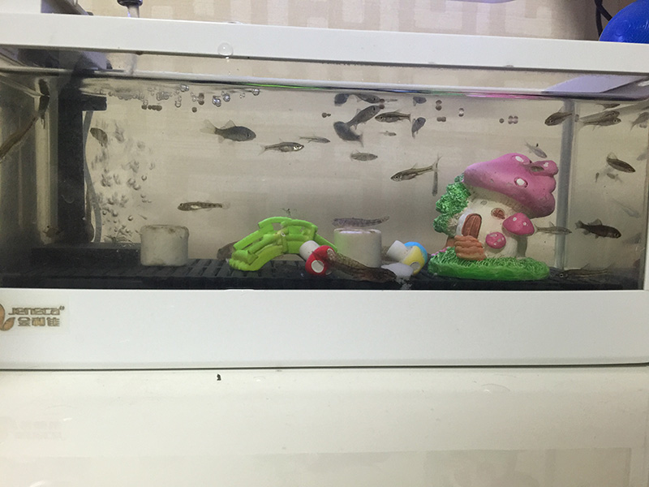

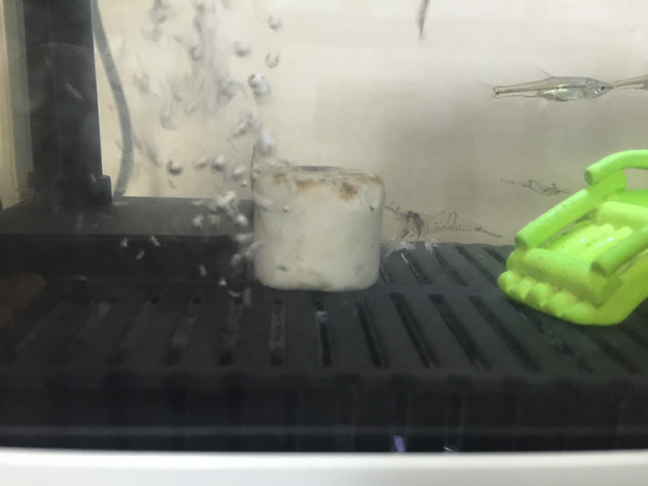
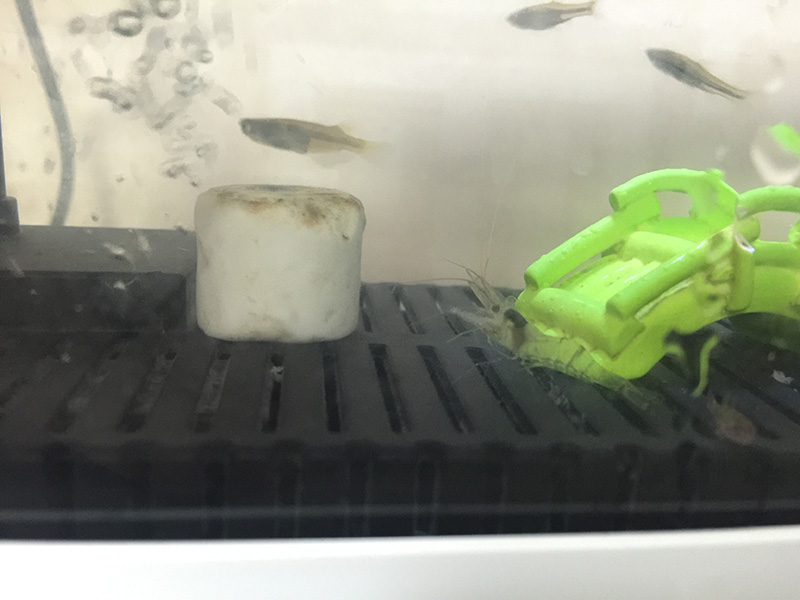

捕鱼、看鱼是这个夏天我们三口找到的新乐趣，平时晚出晚归，几乎看不到小雨点。到了周末，傍晚吃完饭我喜欢跟老婆一起绕着湖边走一圈，消消食、聊聊天，也是一周当中唯一能够慢下来的时间。可是小雨点很快就腻了，提起湖边散步就墙裂反对，每次都要编出一个新花样勾起她的兴趣。这个夏天完全不用，晚饭一抹嘴就吵着去抓鱼。真希望每天都能这样，还记得小时候到了夏天，每天晚上吃完饭都会跟父母出去乘凉。现在那种生活节奏绝对是奢望了。

