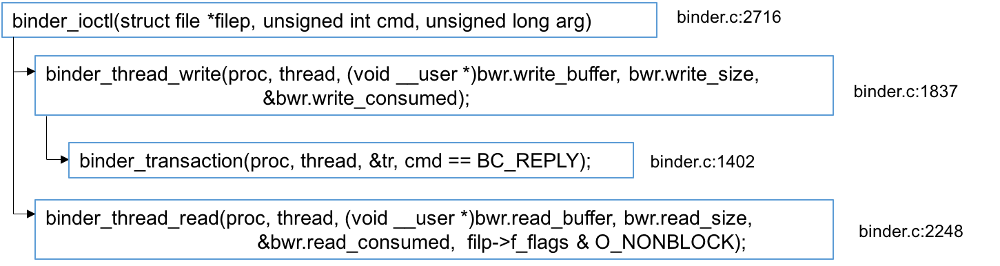

在binder请求的发起端，[binder_transaction(...)](https://palanceli.github.io/2016/06/14/2016/0614BinderLearning12/#从服务端addService触发的binder-transaction)函数的结尾，第#198行，它将`struct binder_transaction`的`work`字段插入`target_list`的尾部，然后完成发起端的工作。

在接收端[binder_loop(...)](https://palanceli.github.io/2016/05/09/2016/0514BinderLearning4/#binder-loop-bs-svcmgr-handler)函数的第#19行，也在通过调用`ioctl(bs->fd, BINDER_WRITE_READ, &bwr)`等待着来自发起端的请求。在驱动层，沿着如下的调用路径，通过`binder_thread_read(...)`函数接收到请求。

需要注意的是，对于checkService请求，在发起端（即Client端）的`binder_thread_write(...)`函数中，其proc、thread均表示Client端，target_proc、target_thread以及target_xxx均表示目标端（即ServiceManager）；而在接收端的`binder_thread_read(...)`函数中则刚好相反，proc、thread表示ServiceManager。

kernel/goldfish/drivers/staging/android/binder.c:2248
``` c
static int binder_thread_read(struct binder_proc *proc,
                  struct binder_thread *thread,
                  void  __user *buffer, int size,
                  signed long *consumed, int non_block)
{
    void __user *ptr = buffer + *consumed;
    void __user *end = buffer + size;

    int ret = 0;
    int wait_for_proc_work;

    if (*consumed == 0) {
        if (put_user(BR_NOOP, (uint32_t __user *)ptr))
            return -EFAULT;
        ptr += sizeof(uint32_t);
    }

retry:
    wait_for_proc_work = thread->transaction_stack == NULL &&
                list_empty(&thread->todo);
    ... ...
    thread->looper |= BINDER_LOOPER_STATE_WAITING;
    if (wait_for_proc_work)
        proc->ready_threads++;
    ... ...
    if (wait_for_proc_work) {
        ... ...
            ret = wait_event_freezable_exclusive(proc->wait, binder_has_proc_work(proc, thread));
    } else {
        ... ...
            ret = wait_event_freezable(thread->wait, binder_has_thread_work(thread));
    }
    ... ...
    if (wait_for_proc_work)
        proc->ready_threads--;
    thread->looper &= ~BINDER_LOOPER_STATE_WAITING;

    if (ret)
        return ret;

    while (1) {
        uint32_t cmd;
        struct binder_transaction_data tr;
        struct binder_work *w;
        struct binder_transaction *t = NULL;
        // 读取todo列表首节点，这正是在Client端触发的binder_transaction(...)
        // 函数在结尾处插进来的t->work.entry
        if (!list_empty(&thread->todo))
            w = list_first_entry(&thread->todo, struct binder_work, entry);
        else if (!list_empty(&proc->todo) && wait_for_proc_work)
            w = list_first_entry(&proc->todo, struct binder_work, entry);
        ... ...
        switch (w->type) {
        case BINDER_WORK_TRANSACTION: {
            // 根据binder_work找到他所在的binder_transaction
            t = container_of(w, struct binder_transaction, work);
        } break;
        case BINDER_WORK_TRANSACTION_COMPLETE: {
            cmd = BR_TRANSACTION_COMPLETE;
            if (put_user(cmd, (uint32_t __user *)ptr))
                return -EFAULT;
            ptr += sizeof(uint32_t);

            binder_stat_br(proc, thread, cmd);
            ... ...

            list_del(&w->entry);
            kfree(w);
            binder_stats_deleted(BINDER_STAT_TRANSACTION_COMPLETE);
        } break;
        case BINDER_WORK_NODE: {
            struct binder_node *node = container_of(w, struct binder_node, work);
            uint32_t cmd = BR_NOOP;
            const char *cmd_name;
            int strong = node->internal_strong_refs || node->local_strong_refs;
            int weak = !hlist_empty(&node->refs) || node->local_weak_refs || strong;
            if (weak && !node->has_weak_ref) {
                cmd = BR_INCREFS;
                cmd_name = "BR_INCREFS";
                node->has_weak_ref = 1;
                node->pending_weak_ref = 1;
                node->local_weak_refs++;
            } else if (strong && !node->has_strong_ref) {
                cmd = BR_ACQUIRE;
                cmd_name = "BR_ACQUIRE";
                node->has_strong_ref = 1;
                node->pending_strong_ref = 1;
                node->local_strong_refs++;
            } else if (!strong && node->has_strong_ref) {
                cmd = BR_RELEASE;
                cmd_name = "BR_RELEASE";
                node->has_strong_ref = 0;
            } else if (!weak && node->has_weak_ref) {
                cmd = BR_DECREFS;
                cmd_name = "BR_DECREFS";
                node->has_weak_ref = 0;
            }
            if (cmd != BR_NOOP) {
                if (put_user(cmd, (uint32_t __user *)ptr))
                    return -EFAULT;
                ptr += sizeof(uint32_t);
                if (put_user(node->ptr, (void * __user *)ptr))
                    return -EFAULT;
                ptr += sizeof(void *);
                if (put_user(node->cookie, (void * __user *)ptr))
                    return -EFAULT;
                ptr += sizeof(void *);

                binder_stat_br(proc, thread, cmd);
                ... ...
            } else {
                list_del_init(&w->entry);
                if (!weak && !strong) {
                    binder_debug(BINDER_DEBUG_INTERNAL_REFS,
                             "binder: %d:%d node %d u%p c%p deleted\n",
                             proc->pid, thread->pid, node->debug_id,
                             node->ptr, node->cookie);
                    rb_erase(&node->rb_node, &proc->nodes);
                    kfree(node);
                    binder_stats_deleted(BINDER_STAT_NODE);
                } ... ...
            }
        } break;
        case BINDER_WORK_DEAD_BINDER:
        case BINDER_WORK_DEAD_BINDER_AND_CLEAR:
        case BINDER_WORK_CLEAR_DEATH_NOTIFICATION: {
            struct binder_ref_death *death;
            uint32_t cmd;

            death = container_of(w, struct binder_ref_death, work);
            if (w->type == BINDER_WORK_CLEAR_DEATH_NOTIFICATION)
                cmd = BR_CLEAR_DEATH_NOTIFICATION_DONE;
            else
                cmd = BR_DEAD_BINDER;
            if (put_user(cmd, (uint32_t __user *)ptr))
                return -EFAULT;
            ptr += sizeof(uint32_t);
            if (put_user(death->cookie, (void * __user *)ptr))
                return -EFAULT;
            ptr += sizeof(void *);
            binder_stat_br(proc, thread, cmd);
            ... ...

            if (w->type == BINDER_WORK_CLEAR_DEATH_NOTIFICATION) {
                list_del(&w->entry);
                kfree(death);
                binder_stats_deleted(BINDER_STAT_DEATH);
            } else
                list_move(&w->entry, &proc->delivered_death);
            if (cmd == BR_DEAD_BINDER)
                goto done; /* DEAD_BINDER notifications can cause transactions */
        } break;
        }
        ... ...
        // 重点在这里，它有组织了一个binder_transaction_data结构体，从发起端的binder_transaction以及binder_buffer中提取数据
        if (t->buffer->target_node) {
            struct binder_node *target_node = t->buffer->target_node; // SM
            tr.target.ptr = target_node->ptr;
            tr.cookie =  target_node->cookie;
            t->saved_priority = task_nice(current);
            if (t->priority < target_node->min_priority &&
                !(t->flags & TF_ONE_WAY))
                binder_set_nice(t->priority);
            else if (!(t->flags & TF_ONE_WAY) ||
                 t->saved_priority > target_node->min_priority)
                binder_set_nice(target_node->min_priority);
            cmd = BR_TRANSACTION;
        } ... ...
        tr.code = t->code;
        tr.flags = t->flags;
        tr.sender_euid = t->sender_euid;

        if (t->from) {
            struct task_struct *sender = t->from->proc->tsk;
            tr.sender_pid = task_tgid_nr_ns(sender,
                            current->nsproxy->pid_ns);
        } else {
            tr.sender_pid = 0;
        }

        tr.data_size = t->buffer->data_size;
        tr.offsets_size = t->buffer->offsets_size;
        tr.data.ptr.buffer = (void *)t->buffer->data +
                    proc->user_buffer_offset;
        tr.data.ptr.offsets = tr.data.ptr.buffer +
                    ALIGN(t->buffer->data_size,
                        sizeof(void *));

        if (put_user(cmd, (uint32_t __user *)ptr))
            return -EFAULT;
        ptr += sizeof(uint32_t);
        // 将binder_transaction_data结构体拷贝到用户空间，由接收端ServiceManager收到
        if (copy_to_user(ptr, &tr, sizeof(tr))) 
            return -EFAULT;
        ptr += sizeof(tr);

        trace_binder_transaction_received(t);
        binder_stat_br(proc, thread, cmd);
        ... ...

        list_del(&t->work.entry);
        t->buffer->allow_user_free = 1;
        if (cmd == BR_TRANSACTION && !(t->flags & TF_ONE_WAY)) {
            t->to_parent = thread->transaction_stack;
            t->to_thread = thread;
            thread->transaction_stack = t;
        } else {
            t->buffer->transaction = NULL;
            kfree(t);
            binder_stats_deleted(BINDER_STAT_TRANSACTION);
        }
        break;
    }

done:

    *consumed = ptr - buffer;
    if (proc->requested_threads + proc->ready_threads == 0 &&
        proc->requested_threads_started < proc->max_threads &&
        (thread->looper & (BINDER_LOOPER_STATE_REGISTERED |
         BINDER_LOOPER_STATE_ENTERED)) /* the user-space code fails to */
         /*spawn a new thread if we leave this out */) {
        proc->requested_threads++;
        ... ...
        if (put_user(BR_SPAWN_LOOPER, (uint32_t __user *)buffer))
            return -EFAULT;
        binder_stat_br(proc, thread, BR_SPAWN_LOOPER);
    }
    return 0;
}
```
走到这里，[上一节](https://palanceli.github.io/2016/07/09/2016/0709BinderLearning13/#再看ServiceManager是如何响应checkService请求的)末尾处的悬疑似乎可以水落石出了。

# 小结
无论addService还是checkService请求，发起端的请求经由驱动层，驱动层的主要工作有两部分：
1. 修改字段。如果请求中包含binder实体，驱动会修改实体的提领字段，比如addService是Server端向SM注册Service实体，传入的是实体在本地的影子地址以及实体地址，到了驱动层转手给ServiceManager之前会改写成在ServiceManager内唯一的handler；如果请求中不包含binder实体，驱动层不作类似地篡改。
2. 将请求挂到目标进程或线程的todo链表中。

在接收端，无论是SM还是一般的Server端，不断地从todo链表检查是否有节点，如果有的话就会摘取下来并解析、执行。驱动层在交给接收端解析、执行之前，会把节点中的数据包装成一个`struct binder_transaction_data`结构体，数据的内容基本上保持了发起端组织时的样子，只不过在发起端发送到驱动层时，提领信息会被修改，但还是指向同一个实体。

当SM收到addService请求后会把(name, handle)缓存起来；收到checkService请求后，会找到该缓存并将结果发送给Client，只是此时Client端没有Service任何的提领信息，SM会给它什么呢？肯定是handle，只是这个handle是怎么注册到Client端的？接下来还要再跟。

Client端再组织Test请求，驱动层再次将handle改成指针，发送到Server端执行，并将执行结果发送给Client。

这次是真地`山高月小，水落石出`了！接下来需要把前面的流水账系统地梳理一遍。可以先从原理上宏观地描述三方的职责以及关键操作，然后再从具体需求入手，从addService、checkService、Test三条线梳理清楚控制流、数据流，Binder的主流操作，无非也就这些。当然还有一些扩展话题，比如“死亡通知”可以在主流操作梳理完成后再研究。

