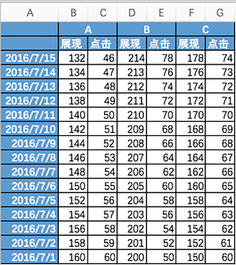
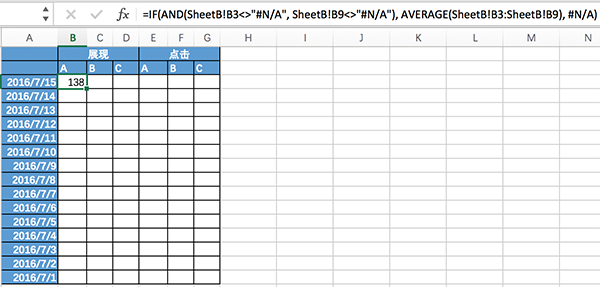
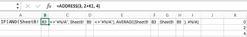
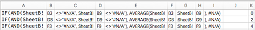
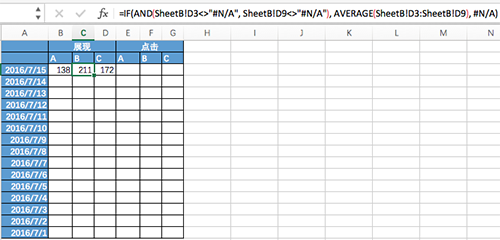

Excel是个好东西，不管做什么工作，精通这个东西都绝逼有必要。它可以用作更轻量级的统计，不必动用awk或python，鼠标划拉几下就OK了。而且它片刻就能搞出一份数据图表出来，很多时候宏观数据分析必须借助图表而不是盯数字。这篇博文记录我遇到的稍麻烦点的case，很多问题会一再遇到。下次再碰见，翻一翻就直接拿去用了。

# 怎么让SheetA的A B C列引用SheetB的A C E（奇数）列的七日周均？
SheetB是原始数据，列代表不同的数据字段，行代表每天的数值，SheetA中需要提取SheetB中的奇数列，并求七日周均。这个问题可以分解为：1、先把SheetB中的奇数列提取出来；2、再以七行为单位取每天对应的七日周均。第1步网上给出的方法一般使用vlookup函数，在SheetA中找到和当前行的时间列相等的SheetB中的数据，取第奇数列。我没有用这种方法因为当数据量太大的时候，此方案的运算量略大。

我的思路是尽量使用excel完成可预处理的运算，把运算结果通过文本编辑器转换成公式，hardcode回excel。这种方法操作步骤上稍微繁琐一些，但效率更高。在macOS上，稍复杂一些的数据表就能把excel拖成驴车，对于非常频繁维护的数据表来说，轻便很重要。



SheetA中B2、C2、D2的公式分别应该为：
```
=IF(AND(SheetB!B3<>"#N/A", SheetB!B9<>"#N/A"), AVERAGE(SheetB!B3:SheetB!B9), #N/A)
=IF(AND(SheetB!D3<>"#N/A", SheetB!D9<>"#N/A"), AVERAGE(SheetB!B3:SheetB!D9), #N/A)
=IF(AND(SheetB!F3<>"#N/A", SheetB!F9<>"#N/A"), AVERAGE(SheetB!F3:SheetB!F9), #N/A)
```


## 在另一张空闲表中分割公式
如果列数非常多，手工编辑也是不小的工作量，可以将公式中固定的字符串和行、列变量分割开，写到一张Excel表格中：

当列数很多的时候，可以用`ADDRESS(row_num, column_num, abs_num)`公式，它返回第row_num行，第column_num列的名称，abs_num含义如下：

abs取值|含义
---|---
1或省略|绝对引用
2|绝对行号，相对列标
3|相对行号，绝对列标
4|相对引用

先在第K列写好列的步进数字，然后利用公式`ADDRESS`和该数字计算出行、列变量，完成一行的公式后，可以下拉自动填充，如下：


## 在文本编辑器中修改公式
把公式拷贝到文本编辑器，查找并替换掉所有的Tab符，并在每一行前面添加等号，即：
``` 
=IF(AND(SheetB!B3<>"#N/A", SheetB!B9<>"#N/A"), AVERAGE(SheetB!B3:SheetB!B9), #N/A)
=IF(AND(SheetB!D3<>"#N/A", SheetB!D9<>"#N/A"), AVERAGE(SheetB!D3:SheetB!D9), #N/A)
=IF(AND(SheetB!F3<>"#N/A", SheetB!F9<>"#N/A"), AVERAGE(SheetB!F3:SheetB!F9), #N/A)
```
然后再查找回车符，并替换为Tab符

## 将文本编辑器中的公式拷回Excel
将公式拷贝到Excel SheetA中的首行：

然后下来首行自动填充，即可。
再如法炮制出偶数列。


