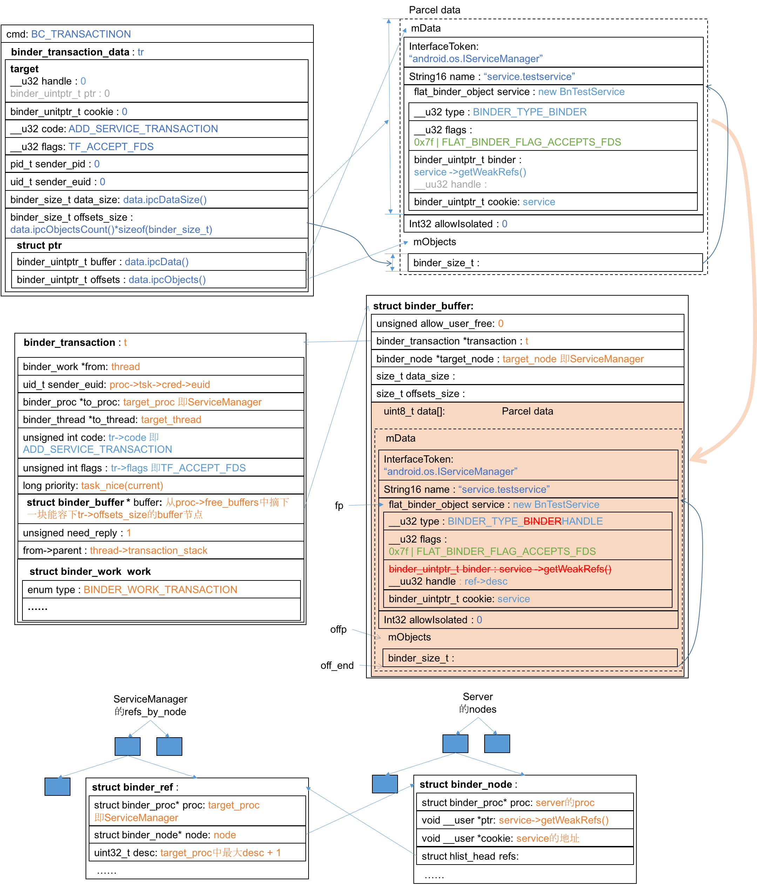
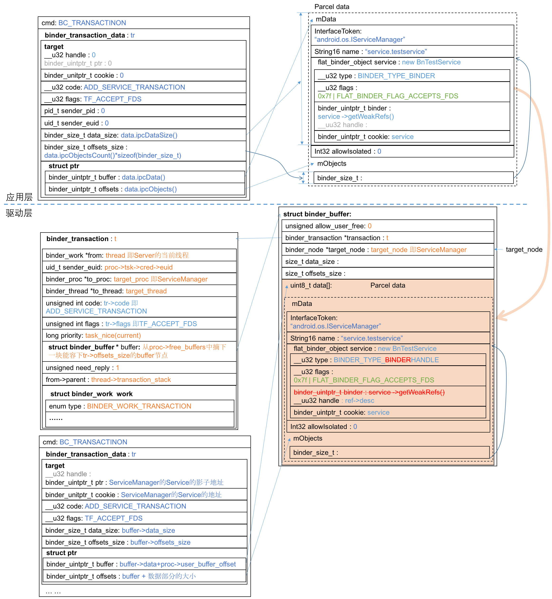

# 注册服务
注册服务是Server端首先要做的事情，Server段代码在[TestServer.cpp](https://github.com/palanceli/androidex/blob/master/external-testservice/TestServer.cpp)。
无论是服务端还是客户端，在使用Binder机制之前都必须找到取款机，即ServiceManager：
``` c
sp < ProcessState > proc(ProcessState::self());
sp < IServiceManager > sm = defaultServiceManager(); 
```
智能指针在本系列中不再赘述，参见[《Binder学习笔记（十一）—— 智能指针》](http://palanceli.github.io/blog/2016/06/10/2016/0610BinderLearning11/)，在framework层所有Binder相关的智能指针`sp <XXX> pObj`都可以当`XXX *pObj`来看。

sm是什么？为什么defaultServiceManager()就能返回ServiceManager？本质上ServiceManager也是Binder服务，位于另一个进程空间，为什么这么一行调用就能获取另一个进程空间的服务？这个“服务”具体是什么，实体？handle？
我们先给出答案，再逐步求证。

Binder Service对象只存在于Server的进程空间里，当Client端请求Service时，驱动程序会分配一个在该Client进程空间内唯一的整形数又叫handle，并将该handle和Service对象地址的对应关系缓存在内核空间。Client端的BPBinder本质上是对该handle的封装，所有对远程Binder的调用都会通过BPBinder被封装成一坨数据通过驱动层到达Server，驱动层在这坨数据到达Server前把handle改成Service地址，Server通过改地址提领到Service对象，执行请求。

ServiceManager是handle=0的Binder，它保存着系统内所有注册的Binder，只有通过它才能找到其他Binder。它是一切Binder的起点，因此必须hard code一个固定值，以便所有进程都能直接得到它，很自然这个固定值是0。
sm是handle=0的BPBinder，为什么对它的调用可以被转到进程ServiceManager呢？因为BPBinder会把调用打包成数据写入文件`/dev/binder`。每个进程都可以通过BPBinder打开这个文件，但驱动层确保每个进程打开的该文件是不同的，其内容是各进程一份的。如果一个进程打开两次呢？首先驱动层确保实际打开的是同一份数据，其次应用层的ProcessState以进程单体的方式确保进程内只打开一次。数据包进入驱动层后，驱动层会根据目标handle找到对应的Server进程，把数据包交由Server处理。

## 初始化proc
proc指向ProcessState::self()，这是一个进程单体，它返回一个ProcessState实例。在ProcessState的构造函数中有两个关键步骤：1、打开`/dev/binder`文件；2、将该文件映射到自己的地址空间。
``` c++
// frameworks/native/libs/binder/ProcessState.cpp 井号+数字表示行号
// #70
sp<ProcessState> ProcessState::self()  // 进程单体
{
    ... ...
    if (gProcess != NULL) {
        return gProcess;
    }
    gProcess = new ProcessState;  // 首次创建在这里
    return gProcess;
}

// #339
ProcessState::ProcessState()
    : mDriverFD(open_driver())  // 这里打开了/dev/binder文件，并返回文件描述符
    ... ...
{
    ... ...
    mVMStart = mmap(0, BINDER_VM_SIZE, PROT_READ, MAP_PRIVATE | MAP_NORESERVE, mDriverFD, 0);
    ... ...
}

// #311
static int open_driver()
{
    int fd = open("/dev/binder", O_RDWR);
    ... ...
    return fd;
}
```
通常打开一个磁盘上的文件，不管是由谁打开的，只要路径相同，所指的就是同一个文件，读写的也是同一坨数据。可是Binder不一样，规定统一的路径`dev/binder`只是为了让所有端获取Binder的方式一致，实际上每个进程获取的内容是不同的。就好像大家都通过同一个电话号码95555获得招商银行的客服，但实际上每个人分配到的客服小妹是不同的。只是在Binder的世界更极端，每个进程打开文件`dev/binder`都是不同的。可以进入到驱动层来证实这一点。

### 打开/dev/binder
应用层调用`open("/dev/binder")`最终对落地到驱动层的`binder_open(...)`调用上来，中间的流转过程是驱动层的知识，可以参见《Linux设备驱动程序》，我们直接进入`binder_open(...)`函数：
``` c++
// kernel/drivers/staging/android/binder.c
// #2979
static int binder_open(struct inode *nodp, struct file *filp)
{
    struct binder_proc *proc;
    ......
    proc = kzalloc(sizeof(*proc), GFP_KERNEL); // 创建binder_proc结构体
    ......
    filp->private_data = proc;
    ......
    return 0;
}
```
结构体`struct file`表示进程已打开的文件，包含访问模式、当前偏移等信息（参见《Linux内核设计与实现（第三版）》第13章11节），这说明对于同一个文件`struct file`是每进程一份的。
`binder_open(...)`函数创建了结构体`struct binder_proc`并将之保存在文件对象的private_data成员中。[struct binder_proc](http://palanceli.github.io/blog/2016/06/14/2016/0614BinderLearning12/#struct-binder-proc)描述一个正在使用Binder的进程。

### 映射/dev/binder
ProcessState在初始化列表中打开`/dev/binder`后，在构造函数体内立刻调用`mmap`完成映射，该函数最终落地在驱动层的`binder_mmap(...)`函数：
``` c++
// kernel/goldfish/drivers/staging/android/binder.c
// #2883
static int binder_mmap(struct file *filp, struct vm_area_struct *vma)
{
    int ret;
    struct vm_struct *area;
    struct binder_proc *proc = filp->private_data;
    const char *failure_string;
    struct binder_buffer *buffer;
    ... ...
    // 分配内核地址空间
    area = get_vm_area(vma->vm_end - vma->vm_start, VM_IOREMAP);
    ... ...
    proc->buffer = area->addr;
    proc->user_buffer_offset = vma->vm_start - (uintptr_t)proc->buffer;
    ... ...
    // 分配物理页面结构体指针数组
    proc->pages = kzalloc(sizeof(proc->pages[0]) * ((vma->vm_end - vma->vm_start) / PAGE_SIZE), GFP_KERNEL);
    ... ...
    proc->buffer_size = vma->vm_end - vma->vm_start;

    vma->vm_ops = &binder_vm_ops;
    vma->vm_private_data = proc;
    // 为proc->pages数组的每个元素创建物理页面，并将之同时映射到用户和内核地址空间
    if (binder_update_page_range(proc, 1, proc->buffer, proc->buffer + PAGE_SIZE, vma)) {
        ... ...
    }
    buffer = proc->buffer;
    INIT_LIST_HEAD(&proc->buffers);
    list_add(&buffer->entry, &proc->buffers);
    buffer->free = 1;
    binder_insert_free_buffer(proc, buffer);
    proc->free_async_space = proc->buffer_size / 2;
    barrier();
    proc->files = get_files_struct(proc->tsk);
    proc->vma = vma;
    proc->vma_vm_mm = vma->vm_mm;
    ... ...
    return 0;
... ...
}
```
该映射操作为Binder分配物理页面，并将页面同时映射到内核和用户地址空间。
这块内存空间就为未来数据包传输铺设的轨道，只是这条轨道对于Client或Server端来说都通往一个时光隧道，这个时光隧道就是驱动层。数据包里注明了数据要发往何处，数据进入隧道后就不见了，驱动层会根据数据包里的目的地址把数据包列车放到目的端的时光隧道出口，这样目的端就能源源不断地看到数据列车从隧道口驶来。
将页面同时映射到内核和用户地址空间的目的是为了提升效率。出于安全的考虑，从用户空间发往内核空间的数据应该使用`copy_from_user(...)`函数拷贝到内核空间，在内核驱动层处理完数据后没有必要再用`copy_to_user(...)`拷贝到对端，因此双重映射使得数据可被对端访问，且减少一次数据拷贝的开销。

## 初始化sm
完成轨道铺设后，就要建设跑在上面的火车了，其实火车原本都是一样的，但是客户端会根据发往的目的地不同给他们做成不同的封装，例如发往ServiceManager号的会被封装成sp<IServiceManager>，发往TestService号的会被封装成sp<ITestService>等等。接下来看`sp<IServiceManager> sm`，它是函数`defaultServiceManager()`的返回值：
``` c++
// frameworks/native/libs/binder/IServiceManager.cpp
// #33
sp<IServiceManager> defaultServiceManager()
{   // 又是个进程单体
    if (gDefaultServiceManager != NULL) return gDefaultServiceManager;
        ... ...
    gDefaultServiceManager = interface_cast<IServiceManager>(
        ProcessState::self()->getContextObject(NULL));  
        ... ...
    
    return gDefaultServiceManager;
}
```
### ProcessState::getContextObject(NULL)装配成火车
函数`ProcessState::self()`已经讲过了，来看它的`getContextObject(NULL)`函数：
``` c++
// frameworks/native/libs/binder/ProcessState.cpp
// #85
sp<IBinder> ProcessState::getContextObject(const sp<IBinder>& /*caller*/)
{
    return getStrongProxyForHandle(0);
}
// #179
sp<IBinder> ProcessState::getStrongProxyForHandle(int32_t handle)
{
    sp<IBinder> result;
    ... ...
    handle_entry* e = lookupHandleLocked(handle); //正常情况下总会返回一个非空实例
        ... ...
        IBinder* b = e->binder; 
        if (b == NULL || !e->refs->attemptIncWeak(this)) {// 如果首次创建，b==NULL
            ... ...
            b = new BpBinder(handle); // 即BpBinder(0)
            e->binder = b;
            if (b) e->refs = b->getWeakRefs();
            result = b;
        } 
        ... ...

    return result;
}
// #166
ProcessState::handle_entry* ProcessState::lookupHandleLocked(int32_t handle)
{
    const size_t N=mHandleToObject.size();  // 这是个以handle为下标的数组
    if (N <= (size_t)handle) {              // 如果没有则插入
        handle_entry e;
        e.binder = NULL;
        e.refs = NULL;
        status_t err = mHandleToObject.insertAt(e, N, handle+1-N);
        if (err < NO_ERROR) return NULL;
    }
    return &mHandleToObject.edissetItemAt(handle);
}
```
函数`getContextObject(NULL)`只是返回了`BpBinder(0)`的实例而已。

### interface_cast(...)把普通火车封装成XX号
其实前面`BpBinder(0)`已经是在普通火车上装配了目的地数据，参数0就是，接下来的转型操作是进一步把它刷成`XX号`。
``` c++
// frameworks/native/include/binder/IInterface.h
// #41
template<typename INTERFACE>
inline sp<INTERFACE> interface_cast(const sp<IBinder>& obj)
{   // INTERFACE=IServiceManager
    // obj=ProcessState::self()->getContextObject(NULL)，即
    // new BpBinder(0)

    return INTERFACE::asInterface(obj);
    // 代入模板参数即：
    // return IServiceManager::asInterface(new BpBinder(0));
}
```
`IServiceManager::asInterface(...)`函数的定义隐藏在一个宏里：
``` c++
// frameworks/native/libs/binder/IServiceManager.cpp
// #185
IMPLEMENT_META_INTERFACE(ServiceManager, "android.os.IServiceManager");
```
该宏定义在`frameworks/native/include/binder/IInterface.h:83`展开后为：
``` c++
const android::String16 IServiceManager::descriptor("android.os.IServiceManager");
const android::String16& IServiceManager::getInterfaceDescriptor() const {
    return IServiceManager::descriptor;
}
android::sp< IServiceManager > IServiceManager::asInterface(
            const android::sp<android::IBinder>& obj)
    {   // obj=new BpBinder(0)
        android::sp< IServiceManager > intr;
        if (obj != NULL) {
            intr = static_cast< IServiceManager *>( 
                obj->queryLocalInterface(IServiceManager::descriptor).get());
            if (intr == NULL) {  // 对于BpBinder类型的智能指针来说总为NULL
                intr = new BpServiceManager(obj);
            }
        }
        return intr;
    }
```
`BpBinder`继承自`IBinder`，
``` c++
// frameworks/native/libs/binder/Binder.cpp
// #42
sp<IInterface>  IBinder::queryLocalInterface(const String16& /*descriptor*/)
{
    return NULL;
}
```
也就是说`obj->queryLocalInterface(IServiceManager::descriptor)`返回NULL，又怎么能调用其get()成员函数呢？注意，此处需要考虑智能指针，obj实际上是指向空的智能指针，参见`system/core/include/utils/StrongPointer.h:89`，其`get()`函数就返回实际指向的对象，即为NULL。
所以`asInterface(...)`的返回值即`new BpServiceManager(new BpBinder(0))`这不就是拿SM号封装的普通火车嘛。`class BpServiceManager`定义在`frameworks/native/libs/IServiceManager.cpp:126`，沿着派生族谱层层向上追溯构造函数：
``` c++
// frameworks/natvie/libs/binder/IServiceManager.cpp:129
BpServiceManager(const sp<IBinder>& impl)       // impl=new BpBinder(0) 
    : BpInterface<IServiceManager>(impl)
{
}
// frameworks/native/include/binder/IInterface.h:134
template<typename INTERFACE>
inline BpInterface<INTERFACE>::BpInterface(const sp<IBinder>& remote)
    : BpRefBase(remote)                         // remote = new BpBinder(0)
{
}
// frameworks/native/libs/binder/Binder.cpp:241
BpRefBase::BpRefBase(const sp<IBinder>& o)
    : mRemote(o.get()), mRefs(NULL), mState(0)  // mRemote = new BpBinder(0)
{
    ... ...
}
```
来看看`class BpServiceManager`的定义：
``` c++
// frameworks/native/libs/binder/IServiceManager.cpp:126
class BpServiceManager : public BpInterface<IServiceManager>
{
public:
    BpServiceManager(const sp<IBinder>& impl)
        : BpInterface<IServiceManager>(impl)
    {}

    virtual sp<IBinder> getService(const String16& name) const
    {... ...}

    virtual sp<IBinder> checkService( const String16& name) const
    {... ...}

    virtual status_t addService(const String16& name, const sp<IBinder>& service, bool allowIsolated)
    {... ...}

    virtual Vector<String16> listServices()
    {... ...}
};
```
该类封装了ServiceManager的逻辑，其实很少，主要就是`addService(...)`和`addService(...)`两个函数，它们分别封装了ServiceManager注册服务和查找服务的数据包，然后使用“普通火车”`remote()`把数据包发出去。
> sm就是给BpBinder(0)加了薄薄一层封装成为BpServiceManager。

## addService(...)添加服务
### Server端把addService(...)的调用封装成一个数据包
对于Server端，添加服务的调用简单明了，传入服务的名字以及提供服务的对象；客户端查找服务时只需提供服务名字，即可获得服务的（代理）对象。添加服务的代码在TestService.cpp:30
`sm->addService(String16("service.testservice"), new BnTestService());`
上一节已经分析过sm是`BpServiceManager`的实例，其`mRemote`成员即`BpBinder(0)`。
`BpServiceManager::addService(...)`定义如下：
``` c++
// frameworks/native/libs/binder/IServiceManager.cpp
// #155
virtual status_t addService(const String16& name, const sp<IBinder>& service,
        bool allowIsolated)
{   // name="service.testservice", service=new BnTestService()
    // allowIsolated 默认值为 false，定义在IserviceManager.h:49
    Parcel data, reply;
    data.writeInterfaceToken(IServiceManager::getInterfaceDescriptor());
    data.writeString16(name);
    data.writeStrongBinder(service);
    data.writeInt32(allowIsolated ? 1 : 0);
    status_t err = remote()->transact(ADD_SERVICE_TRANSACTION, data, &reply);
    return err == NO_ERROR ? reply.readExceptionCode() : err;
}
```
Parcel的封装细节可参见[《Binder学习笔记（五）—— Parcel是怎么打包的？》](http://palanceli.github.io/blog/2016/05/10/2016/0514BinderLearning5/)。data中携带的重要数据还是服务名称以及服务对象。remote()返回的是BpBinder(0)，因此来看`BpBinder::transact(...)`
``` c++
// frameworks/native/libs/binder/BpBinder.cpp:159
status_t BpBinder::transact(
    uint32_t code, const Parcel& data, Parcel* reply, uint32_t flags)
{   // code = ADD_SERVICE_TRANSACTION
    // data 携带服务名称和服务对象
    // reply 一个清白的Parcel
    // flags 默认为0，定义在Binder.h:37
    ... ...
    status_t status = IPCThreadState::self()->transact(
            mHandle, code, data, reply, flags);  // mHandle=0
    ... ...
}

// frameworks/native/libs/binder/IPCThreadState.cpp:548
status_t IPCThreadState::transact(int32_t handle,
                                  uint32_t code, const Parcel& data,
                                  Parcel* reply, uint32_t flags)
{   // handle   0
    // code     ADD_SERVICE_TRANSACTION
    // data     携带服务名称和服务对象
    // reply    指向一个清白的Parcel
    // flags    0
    ... ...
    flags |= TF_ACCEPT_FDS;     // flags = TF_ACCEPT_FDS
    ... ...
    err = writeTransactionData(BC_TRANSACTION, flags, handle, code, data, NULL);
    ... ...
    if ((flags & TF_ONE_WAY) == 0) {  // 为真
        ... ...
        if (reply) {    // 非空
            err = waitForResponse(reply);
        } 
        ... ...
    } 
    ... ...
    return err;
}

// frameworks/native/libs/binder/IPCThreadState.cpp:904
status_t IPCThreadState::writeTransactionData(int32_t cmd, uint32_t binderFlags,
    int32_t handle, uint32_t code, const Parcel& data, status_t* statusBuffer)
{   // cmd          BC_TRANSACTION
    // binderFlags  TF_ACCEPT_FDS
    // handle       0
    // code         ADD_SERVICE_TRANSACTION
    // data         携带服务名称和服务对象
    // statusBuffer NULL
    binder_transaction_data tr;

    tr.target.ptr = 0; 
    tr.target.handle = handle;  // 0
    tr.code = code;             // ADD_SERVICE_TRANSACTION
    tr.flags = binderFlags;     // TF_ACCEPT_FDS
    tr.cookie = 0;
    tr.sender_pid = 0;
    tr.sender_euid = 0;
    ... ...
        tr.data_size = data.ipcDataSize();
        tr.data.ptr.buffer = data.ipcData();
        tr.offsets_size = data.ipcObjectsCount()*sizeof(binder_size_t);
        tr.data.ptr.offsets = data.ipcObjects();
    ... ...
    
    mOut.writeInt32(cmd);
    mOut.write(&tr, sizeof(tr));
    
    return NO_ERROR;
}
```

这个数据结构很重要，它表达了Server端本次请求的具体内容，即把addService(...)封装成的数据包。其中tr记录定长的控制信息，data记录变长的数据信息。本次的控制信息的核心内容就是ADD_SERVICE_TRANSACTION，数据信息的核心内容是服务名称和服务实体。

组织完数据接下来显然要发出去，

沿着调用关系，我们来看具体发送数据的`IPCThreadState::waitForResponse(...)`
``` c++
// frameworks/native/libs/binder/IPCThreadState.cpp:712
status_t IPCThreadState::waitForResponse(Parcel *reply, status_t *acquireResult)
{   // reply            指向一个清白的Parcel
    // acquireResult    NULL
    uint32_t cmd;
    int32_t err;

    while (1) {
        if ((err=talkWithDriver()) < NO_ERROR) break;
        ... ...
        cmd = (uint32_t)mIn.readInt32();
        // 接下来根据ServiceManager应答数据中的cmd分别处理，具体怎么处理暂且不表
        ... ...
    }
... ...
}

// frameworks/natvie/libs/binder/IPCThreadState.cpp:803
status_t IPCThreadState::talkWithDriver(bool doReceive)
{   // doReceive    默认参数为true，定义在IPCThreadState.h:98
    ... ...
    binder_write_read bwr;
    ... ...

    bwr.write_size = outAvail;
    bwr.write_buffer = (uintptr_t)mOut.data();
    ... ...
    bwr.read_size = mIn.dataCapacity();
    bwr.read_buffer = (uintptr_t)mIn.data();
    ... ...
    status_t err;
    do {
        ... ...
        // 对/dev/binder完成一次读写操作
        if (ioctl(mProcess->mDriverFD, BINDER_WRITE_READ, &bwr) >= 0)
            err = NO_ERROR;
        ... ...
    } while (err == -EINTR);
    ... ...
    return err;
}
```
这两个函数砍掉细枝末节主要完成两个事：1、从/dev/binder完成一次读写操作，把前面组好的数据包mOut发出去，把读入响应数据放到mIn中；2、根据响应数据中的cmd做相应的处理。我们先看1，因为只有分析过ServiceManager如何组织响应数据才能分析2中怎么处理。
1中数据通过ioctl(...)函数发向/dev/binder，接下来应该去看驱动层怎么处理了。

### 驱动层怎么处理Server端的addService数据包
承接`ioctl(m_Process->mDriverFD, BINDER_WRITE_READ, &bwr)`的驱动层函数是`binder_ioctl(...)`，这个函数的大框架比较简单：
* 将用户空间的数据拷贝到内核空间
* 根据cmd的值，对数据做不同处理。这里只涉及了BINDER_WRITE_READ命令，它的处理又分两部分
    - 调用binder_thread_write(...)来处理bwr中写缓冲区里用户写入的数据
    - 调用binder_thread_read(...)将用户要读出的数据放到bwr中读缓冲区里
* 将处理完的数据拷贝回用户空间
<font color=red>需要确定binder_get_thread(proc)都干了什么</font>
``` c++
// kernel/goldfish/drivers/staging/android/binder.c:2716
static long binder_ioctl(struct file *filp, unsigned int cmd, unsigned long arg)
{   // cmd      BINDER_WRITE_READ
    // arg      指向bwr的地址
    int ret;
    struct binder_proc *proc = filp->private_data;
    struct binder_thread *thread;
    unsigned int size = _IOC_SIZE(cmd);
    void __user *ubuf = (void __user *)arg;

    ... ...
    thread = binder_get_thread(proc);
    ... ...
    switch (cmd) {
    case BINDER_WRITE_READ: {
        struct binder_write_read bwr;
        ... ...
        // 将用户空间的bwr拷贝到内核空间
        if (copy_from_user(&bwr, ubuf, sizeof(bwr))) { 
            ... ...
        }
        ... ...

        if (bwr.write_size > 0) {  // 表明bwr的写缓冲区有数据，将数据发送到目标
            ret = binder_thread_write(proc, thread, (void __user *)bwr.write_buffer, bwr.write_size, &bwr.write_consumed);
            ... ...
        }
        if (bwr.read_size > 0) {    // 表明bwr的读缓冲区有空间，读取数据
            ret = binder_thread_read(proc, thread, (void __user *)bwr.read_buffer, bwr.read_size, &bwr.read_consumed, filp->f_flags & O_NONBLOCK);
            ... ...
            if (!list_empty(&proc->todo))
                wake_up_interruptible(&proc->wait);
            ... ...
        }
        ... ...
        // 将处理后的数据拷贝回用户空间
        if (copy_to_user(ubuf, &bwr, sizeof(bwr))) {
            ... ...
        }
        break;
    }
    ... ...
    }
... ...
    return ret;
}
```
先来看写入的部分，bwr的write_buffer是一个cmd跟着一个`binder_transaction_data`结构体。函数的大框架是根据cmd做不同的处理，addService请求对应的cmd是BC_TRANSACTION，我们先只看这部分。它把`binder_trsansction_data`结构体拷贝到内核空间，然后调用binder_transaction(...)来处理该结构体：
``` c++
// kernel/goldfish/drivers/staging/android/binder.c:1837
int binder_thread_write(struct binder_proc *proc, struct binder_thread *thread,
            void __user *buffer, int size, signed long *consumed)
{   // buffer   bwr.write_buffer
    // size     brw.write_size
    // consumed brw.write_confumed
    uint32_t cmd;
    void __user *ptr = buffer + *consumed;
    void __user *end = buffer + size;

    while (ptr < end && thread->return_error == BR_OK) {
        if (get_user(cmd, (uint32_t __user *)ptr))  // 从用户空间拿到cmd
            return -EFAULT;
        ptr += sizeof(uint32_t);
        ... ...
        switch (cmd) {
        ... ...
        case BC_TRANSACTION:
        case BC_REPLY: {
            struct binder_transaction_data tr;
            if (copy_from_user(&tr, ptr, sizeof(tr)))// 将用户空间的tr拷贝到内核空间
                return -EFAULT;
            ptr += sizeof(tr);
            binder_transaction(proc, thread, &tr, cmd == BC_REPLY); // 处理tr
            break;
        }
        ... ...
        }
        *consumed = ptr - buffer;
    }
    return 0;
}
```
`binder_transaction(...)`函数是处理写入数据的核心代码，在深入分析代码之前，让我们再温习一下已经从用户空间拷贝到内核空间的Server端为addService组织的请求数据：

`binder_transaction(...)`函数的核心功能就是把这份数据封装成一个binder事务`struct binder_transaction`，并把该事务结构体挂到目标 `binder_proc`或者`binder_thread`的todo队列中去。目标侧发现自己的todo队列中有内容，便取下处理，这就完成了一个请求从发起端到接收端的发送。
``` c++
kernel/goldfish/drivers/staging/android/binder.c:1402
static void binder_transaction(struct binder_proc *proc,
                   struct binder_thread *thread,
                   struct binder_transaction_data *tr, int reply)
{   // reply    (cmd==BC_REPLY)即false
    struct binder_transaction *t;
    struct binder_work *tcomplete;
    size_t *offp, *off_end;
    struct binder_proc *target_proc;
    struct binder_thread *target_thread = NULL;
    struct binder_node *target_node = NULL;
    struct list_head *target_list;
    wait_queue_head_t *target_wait;
    struct binder_transaction *in_reply_to = NULL;

    ... ...
        if (tr->target.handle) {                    // 从上图上查到handle为0
            ... ...
        } else {
            target_node = binder_context_mgr_node;  // 发往ServiceManager
            ... ...
        }
        ... ...
        // 这是ServiceManager在打开/dev/binder时，驱动层为该进程创建的内核数据结构
        target_proc = target_node->proc;
        ... ...
        if (!(tr->flags & TF_ONE_WAY) && thread->transaction_stack) {
            struct binder_transaction *tmp;
            tmp = thread->transaction_stack;
            ... ...
            while (tmp) {
                if (tmp->from && tmp->from->proc == target_proc)
                    target_thread = tmp->from;
                tmp = tmp->from_parent;
            }
        }

    if (target_thread) {
        e->to_thread = target_thread->pid;
        target_list = &target_thread->todo;
        target_wait = &target_thread->wait;
    } else {
        target_list = &target_proc->todo;
        target_wait = &target_proc->wait;
    }
    ... ...

    t = kzalloc(sizeof(*t), GFP_KERNEL);            // 创建binder_transaction节点
    ... ...

    tcomplete = kzalloc(sizeof(*tcomplete), GFP_KERNEL);    //创建binder_work节点
    ... ...

    if (!reply && !(tr->flags & TF_ONE_WAY))        // 为真
        t->from = thread;
    ... ...
    t->sender_euid = proc->tsk->cred->euid;
    t->to_proc = target_proc;                       // ServiceManager
    t->to_thread = target_thread;
    t->code = tr->code;                             // ADD_SERVICE_TRANSACTION
    t->flags = tr->flags;                           // TF_ACCEPT_FDS
    t->priority = task_nice(current);

    ... ...

    t->buffer = binder_alloc_buf(target_proc, tr->data_size,
        tr->offsets_size, !reply && (t->flags & TF_ONE_WAY));
    ... ...
    t->buffer->allow_user_free = 0;
    t->buffer->debug_id = t->debug_id;
    t->buffer->transaction = t;
    t->buffer->target_node = target_node;
    ... ...
    if (target_node)
        binder_inc_node(target_node, 1, 0, NULL);

    offp = (size_t *)(t->buffer->data + ALIGN(tr->data_size, sizeof(void *)));
    // 将tr的数据区拷贝到buffer
    if (copy_from_user(t->buffer->data, tr->data.ptr.buffer, tr->data_size)) {
        ... ...
    }
    // 将tr的binder对象偏移数组拷贝到buffer
    if (copy_from_user(offp, tr->data.ptr.offsets, tr->offsets_size)) {
        ... ...
    }
    ... ...
    off_end = (void *)offp + tr->offsets_size;
    for (; offp < off_end; offp++) {
        struct flat_binder_object *fp;
        ... ...
        fp = (struct flat_binder_object *)(t->buffer->data + *offp);
        switch (fp->type) {
        case BINDER_TYPE_BINDER:
        case BINDER_TYPE_WEAK_BINDER: {     // type为BINDER_TYPE_BINDER
            struct binder_ref *ref;
            // fp->binder是BnTestService的影子对象，binder_get_node函数在
            // proc->node中查找fp->binder，如果没有则在该红黑树中创建
            struct binder_node *node = binder_get_node(proc, fp->binder);
            if (node == NULL) {
                node = binder_new_node(proc, fp->binder, fp->cookie);
                ... ...
                node->min_priority = fp->flags & FLAT_BINDER_FLAG_PRIORITY_MASK;
                node->accept_fds = !!(fp->flags & FLAT_BINDER_FLAG_ACCEPTS_FDS);
            }
            ... ...
            // 在目标（即ServiceManager）binder_proc中查找node的引用，如果找不到则创建
            ref = binder_get_ref_for_node(target_proc, node);
            ... ...
            if (fp->type == BINDER_TYPE_BINDER)
                fp->type = BINDER_TYPE_HANDLE;
            else
                fp->type = BINDER_TYPE_WEAK_HANDLE;
            fp->handle = ref->desc;
            binder_inc_ref(ref, fp->type == BINDER_TYPE_HANDLE,
                       &thread->todo);

            ... ...
        } break;
        ... ...
    }
    if (reply) {                            // 为假
        ... ...
    } else if (!(t->flags & TF_ONE_WAY)) {  // 为真
        ... ...
        t->need_reply = 1;
        t->from_parent = thread->transaction_stack;
        thread->transaction_stack = t;
    } ... ...
    t->work.type = BINDER_WORK_TRANSACTION;
    list_add_tail(&t->work.entry, target_list);     // 将t插入目标todo队列
    tcomplete->type = BINDER_WORK_TRANSACTION_COMPLETE;
    list_add_tail(&tcomplete->entry, &thread->todo);
    if (target_wait)
        wake_up_interruptible(target_wait);
    return;

... ...
}
```
经过`binder_transaction(...)`的处理，产生的数据结构如下：

该函数的主要步骤如下：
* 生成了事务`struct binder_transaction t`，并为之分配了数据缓冲区`struct binder_buffer`
* 将tr的data部分拷贝到t的数据缓冲区，并逐个分析其中的binder对象：
   - 如果其类型为BINDER_TYPE_BINDER，则修改为BINDER_TYPE_HANDLE，并将原先指向binder影子对象的binder字段修改为指向该binder引用handle字段
   - 在当前进程的nodes红黑树中插入binder的实体`binder_node`
   - 在目标进程的refs_by_node红黑树中插入binder的引用`binder_ref`
* 将t插入到目标todo队列中

银行为了让自己的服务程序注册到取款机中，需要向取款机提交申请，把自己的银行名称以及对应的服务程序“快递”给取款机生产商。以上就填完了申请单，把配套的服务程序刻入光盘，把二者装入信封，再把信封投递到了邮箱里。


## ServiceManager端如何等待请求
接下来在取款机生产商的另一段，应该在不断地查找信箱，看有没有新的申请发过来，如果有，则赶紧收件，并把新的银行服务做进取款机里，以满足新的客户。接下来就应该以不断等待的ServiceManager为起点，看它如何收到请求，又如何处理请求的。

### ServiceManager应用层如何等待请求
找到ServiceManager端主函数代码：
``` c++
// frameworks/native/cmds/servicemanager/service_manager.c:347
int main(int argc, char **argv)
{
    struct binder_state *bs;

    bs = binder_open(128*1024);              // 创建binder_proc结构体，分配内核空间
    ... ...
    if (binder_become_context_manager(bs)) { //在内核设置全局变量指向ServiceManager
        ... ...
    }
    ... ...
    binder_loop(bs, svcmgr_handler);

    return 0;
}
```
函数`binder_open(...)`定义在frameworks/native/cmds/servicemanager/binder.c:96，它主要负责打开文件`/dev/binder`，并把它映射到进程的地址空间。本节前面讲“初始化proc”时已经介绍了`打开`和`映射`的含义，它们分别为当前进程创建了`struct binder_proc`，并创建了物理页面分配了内核地址空间。
接下来的`binder_become_context_manager(...)`函数仅有一行：
``` c++
// frameworks/natvie/cmds/servicemanager/binder.c:146
int binder_become_context_manager(struct binder_state *bs)
{
    return ioctl(bs->fd, BINDER_SET_CONTEXT_MGR, 0);
}
```
找到驱动层`binder_ioctl(...)`函数的case BINDER_SET_CONTEXT_MGR分支（kernel/goldfish/drivers/staging/android/binder.c:2792），发现其核心内容就是给ServiceManager创建`struct binder_node`结构体，并将全局变量`binder_context_mgr_node`指向该结构体。

接下来的`binder_loop(...)`函数体现了上一节末讲到的“不断地查找信箱，看有没有新的申请过来”的逻辑。
``` c++
void binder_loop(struct binder_state *bs, binder_handler func)
{
    int res;
    struct binder_write_read bwr;
    uint32_t readbuf[32];

    bwr.write_size = 0;
    bwr.write_consumed = 0;
    bwr.write_buffer = 0;

    readbuf[0] = BC_ENTER_LOOPER;
    binder_write(bs, readbuf, sizeof(uint32_t));

    for (;;) {
        bwr.read_size = sizeof(readbuf);
        bwr.read_consumed = 0;
        bwr.read_buffer = (uintptr_t) readbuf;

        res = ioctl(bs->fd, BINDER_WRITE_READ, &bwr);

        ... ...

        res = binder_parse(bs, 0, (uintptr_t) readbuf, bwr.read_consumed, func);
        ... ...
    }
}
```
函数`binder_write(...)`只是向binder写入了一个`BC_ENTER_LOOPER`命令，未携带任何数据。来到驱动层的`binder_thread_write(...)`有该命令对应的case分支，它把当前线程加入了ServiceManager的`binder_proc->threads`红黑树中，并将`binder_thread`的looper标志置为`BINDER_LOOPER_STATE_REGISTERED`，这种末枝细节先不必深究。
接下来给bwr配备了读缓冲区，然后调用`ioctl(...)`函数，坐等收件。

### 驱动层怎么接收请求
再次进入`binder_ioctl(...)`函数，前面调用`binder_write(...)`时已经把要写的数据都写完了，因此这次再调用`binder_ioctl(...)`时bwr.write_size为0，直接进入读环节：
``` c++
static long binder_ioctl(struct file *filp, unsigned int cmd, unsigned long arg)
{
    int ret;
    struct binder_proc *proc = filp->private_data;
    struct binder_thread *thread;
    unsigned int size = _IOC_SIZE(cmd);
    void __user *ubuf = (void __user *)arg;
    ... ...
    thread = binder_get_thread(proc);
    ... ...
    switch (cmd) {
    case BINDER_WRITE_READ: {
        struct binder_write_read bwr;
        ... ...
        if (copy_from_user(&bwr, ubuf, sizeof(bwr))) {
            ... ...
        }
        if (bwr.write_size > 0) {   // 没有要写的东西
            ret = binder_thread_write(proc, thread, (void __user *)bwr.write_buffer, bwr.write_size, &bwr.write_consumed);
            ... ...
        }
        if (bwr.read_size > 0) {
            ret = binder_thread_read(proc, thread, (void __user *)bwr.read_buffer, bwr.read_size, &bwr.read_consumed, filp->f_flags & O_NONBLOCK);
            ... ...
            if (!list_empty(&proc->todo))
                wake_up_interruptible(&proc->wait);
            ... ...
        }
        ... ...
        if (copy_to_user(ubuf, &bwr, sizeof(bwr))) {
            ... ...
        }
        break;
    }
    ... ...
    }
    ret = 0;
... ...
    return ret;
}
```
来看具体操作接收数据的`binder_thread_read(...)`函数，它先检查todo队列，如果为空则无事可做，如果打开设备时指定了非阻塞模式，则直接返回，如果指定了阻塞模式，则等待todo队列直到有请求发过来。
todo队列非空时，首先查看节点类型。Server端发来的addService请求类型是什么？翻一翻上面“binder_transaction(...)函数产生的数据结构”那张图，可以看到类型为`BINDER_WORK_TRANSACTION`，这说明该节点的数据结构类型为`binder_transaction`。接下来是根据`binder_transaction`再组织成一个数据结构`binder_transaction_data`，把该数据结构拷贝到用户空间。
``` c++
static int binder_thread_read(struct binder_proc *proc,
                  struct binder_thread *thread,
                  void  __user *buffer, int size,
                  signed long *consumed, int non_block)
{   
    void __user *ptr = buffer + *consumed;
    void __user *end = buffer + size;

    int ret = 0;
    int wait_for_proc_work;
    ... ...
retry:
    wait_for_proc_work = thread->transaction_stack == NULL &&
                list_empty(&thread->todo);
    ... ...
    thread->looper |= BINDER_LOOPER_STATE_WAITING;
    ... ...
    if (wait_for_proc_work) {
        // 没有事务要处理，如果非阻塞返回-EAGAIN；如果阻塞则等待
    } 
    ... ...
    thread->looper &= ~BINDER_LOOPER_STATE_WAITING;
    ... ...
    while (1) {
        uint32_t cmd;
        struct binder_transaction_data tr;
        struct binder_work *w;
        struct binder_transaction *t = NULL;
        // 如果todo队列非空，取下一个节点；如果为空，则回到retry
        if (!list_empty(&thread->todo))
            w = list_first_entry(&thread->todo, struct binder_work, entry);
        else if (!list_empty(&proc->todo) && wait_for_proc_work)
            w = list_first_entry(&proc->todo, struct binder_work, entry);
        else {
            if (ptr - buffer == 4 && !(thread->looper & BINDER_LOOPER_STATE_NEED_RETURN)) /* no data added */
                goto retry;
            break;
        }
        ... ...
        switch (w->type) {
        case BINDER_WORK_TRANSACTION: {
            t = container_of(w, struct binder_transaction, work);
        } break;
        ... ...
        }

        ... ...
        if (t->buffer->target_node) {
            struct binder_node *target_node = t->buffer->target_node;
            tr.target.ptr = target_node->ptr;   // SM Service的影子地址
            tr.cookie =  target_node->cookie;   // SM Service的地址
            t->saved_priority = task_nice(current);
            if (t->priority < target_node->min_priority &&
                !(t->flags & TF_ONE_WAY))
                binder_set_nice(t->priority);
            else if (!(t->flags & TF_ONE_WAY) ||
                 t->saved_priority > target_node->min_priority)
                binder_set_nice(target_node->min_priority);
            cmd = BR_TRANSACTION;
        } ... ...
        tr.code = t->code;      // ADD_SERVICE_TRANSACTION
        tr.flags = t->flags;    // TF_ACCEPT_FDS
        tr.sender_euid = t->sender_euid;

        if (t->from) {
            struct task_struct *sender = t->from->proc->tsk;
            tr.sender_pid = task_tgid_nr_ns(sender,
                            current->nsproxy->pid_ns);
        } else {
            tr.sender_pid = 0;
        }

        tr.data_size = t->buffer->data_size;
        tr.offsets_size = t->buffer->offsets_size;
        tr.data.ptr.buffer = (void *)t->buffer->data +
                    proc->user_buffer_offset;
        tr.data.ptr.offsets = tr.data.ptr.buffer +
                    ALIGN(t->buffer->data_size,
                        sizeof(void *));

        if (put_user(cmd, (uint32_t __user *)ptr))
            return -EFAULT;
        ptr += sizeof(uint32_t);
        if (copy_to_user(ptr, &tr, sizeof(tr)))
            return -EFAULT;
        ptr += sizeof(tr);

        ... ...
        binder_stat_br(proc, thread, cmd);
        ... ...

        list_del(&t->work.entry);
        t->buffer->allow_user_free = 1;
        if (cmd == BR_TRANSACTION && !(t->flags & TF_ONE_WAY)) {
            t->to_parent = thread->transaction_stack;
            t->to_thread = thread;
            thread->transaction_stack = t;
        } ... ...
        break;
    }

done:

    *consumed = ptr - buffer;
    if (proc->requested_threads + proc->ready_threads == 0 &&
        proc->requested_threads_started < proc->max_threads &&
        (thread->looper & (BINDER_LOOPER_STATE_REGISTERED |
         BINDER_LOOPER_STATE_ENTERED)) /* the user-space code fails to */
         /*spawn a new thread if we leave this out */) {
        proc->requested_threads++;
        ... ...
        if (put_user(BR_SPAWN_LOOPER, (uint32_t __user *)buffer))
            return -EFAULT;
        binder_stat_br(proc, thread, BR_SPAWN_LOOPER);
    }
    return 0;
}
```
经过`binder_thread_read(...)`处理后的数据结构如下：

它组装了驱动层的tr，并把该结构拷贝到用户地址空间。为什么它的成员buffer所指向的binder_buffer的data部分不需要拷贝到用户空间呢？因为这部分空间在对应的物理页面已经被同时映射到了内核和用户的地址空间，已经具备跨越阴阳两界的能力了。这个tr就是驱动层返回给应用层的数据了，也即是ServiceManager调用`ioctl(...)`函数的结果。

### ServiceManager应用层怎么处理请求

<font color="red">未完待续...</font>
## ProcessState::startThreadPool()时刻等待着接客

# 查找服务

# 调用服务接口


