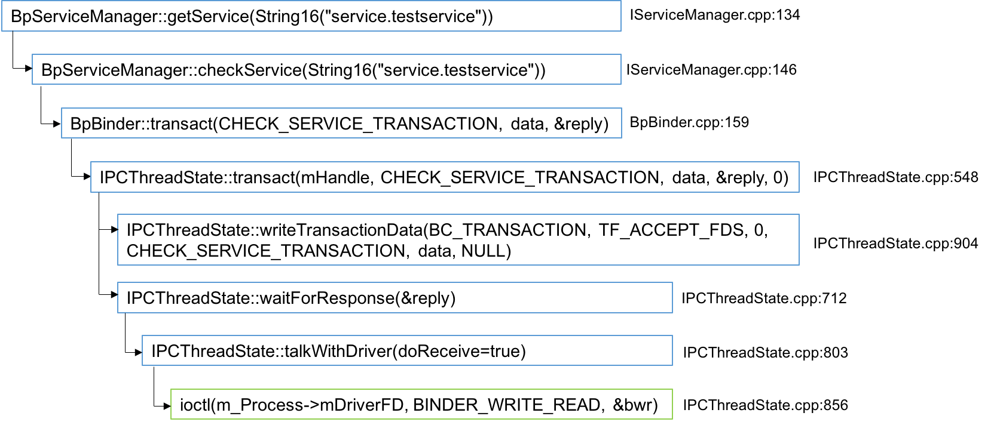
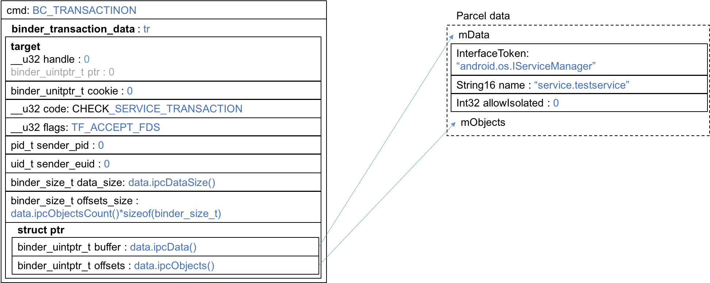
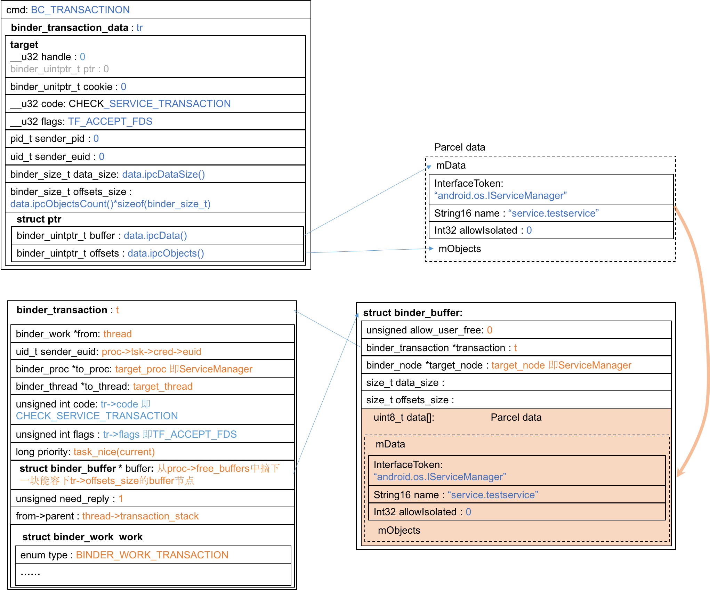
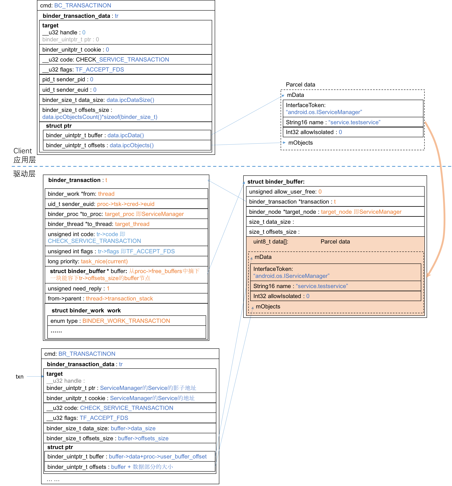
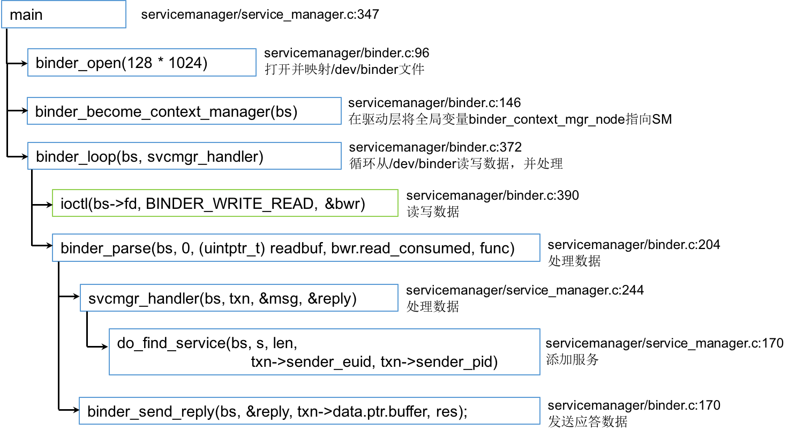
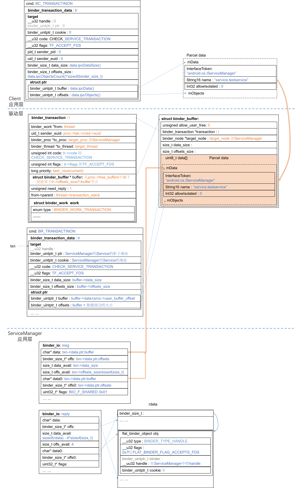
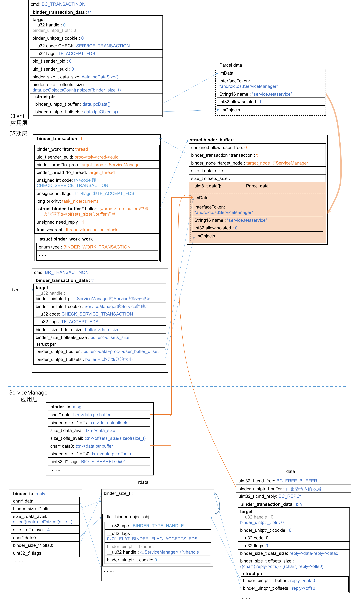
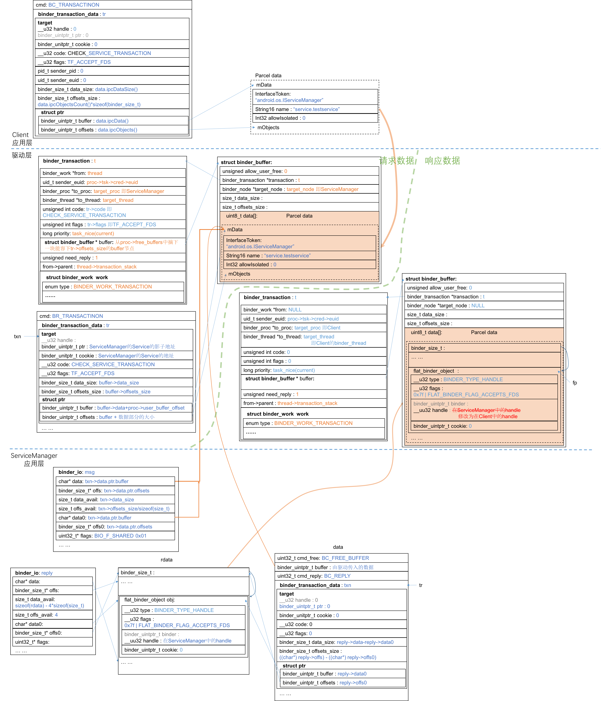

# 查找服务
查找服务的起点在Client端 [TestClient.cpp](https://github.com/palanceli/androidex/blob/master/external-testservice/TestClient.cpp)。客户把银行卡插到取款机，取款机负责根据前面的注册找到匹配的服务。

## 应用层如何组织checkService数据
客户端的调用很简单：根据服务名称获得服务，接下来就可以调用服务接口执行服务了：
`sp < IBinder > binder = sm->getService(String16("service.testservice"));`
上一节已经分析过sm就是给BpBinder(0)加了薄薄一层封装成为BpServiceManager，来看`BpServiceManager::getService(...)`
``` c++
// frameworks/native/libs/binder/IServiceManager.cpp:134
virtual sp<IBinder> getService(const String16& name) const
    {
        ... ...
            sp<IBinder> svc = checkService(name);
            if (svc != NULL) return svc;
        ... ...
    }
// frameworks/native/libs/binder/IServiceManager.cpp:146
    virtual sp<IBinder> checkService( const String16& name) const
    {
        Parcel data, reply;
        data.writeInterfaceToken(IServiceManager::getInterfaceDescriptor());
        data.writeString16(name);
        remote()->transact(CHECK_SERVICE_TRANSACTION, data, &reply);
        return reply.readStrongBinder();
    }
```
前文说过remote()就是BpBinder(0)，其`transact(...)`的调用过程在[addService添加服务](http://palanceli.github.io/blog/2016/08/06/2016/0806DissectingBinder2/#addService-…-添加服务)中也分析过了，此处只给出调用过程图：

其组织的数据为：

数据部分只有服务的名字，比addService简单很多。

## 驱动层如何发送checkService请求
数据通过`ioctl(...)`到达驱动层，来到`binder_ioctl(...)`。此处代码的调用过程也和[驱动层处理Server端的addService请求](http://palanceli.github.io/blog/2016/08/06/2016/0806DissectingBinder2/#驱动层怎么处理Server端的addService数据包)是一样的，这里也只给出调用过程图：

关键的处理在函数`binder_transaction(...)`中，它生成一个事务结构体`binder_transaction`，并把该事务插入到目标进程（即ServiceManager）的todo队列中。下图是数据结构：

和addService不同的是：checkService携带的data数据中没有Binder Object类型的数据，因此在`binder_transaction(...)`函数中不会走到处理`Binder Object`的for循环内，因此也就不会为源和目标进程创建binder实体和引用。

## ServiceManager如何接收checkService请求
ServiceManager应用层等待请求的逻辑和[addService在ServiceManager应用层如何等待请求](http://palanceli.github.io/blog/2016/08/06/2016/0806DissectingBinder2/#ServiceManager应用层如何等待请求)是一模一样，不再赘述。
驱动层接收checkService请求的逻辑和[驱动层接收addService请求](http://palanceli.github.io/blog/2016/08/06/2016/0806DissectingBinder2/#驱动层怎么接收请求)也非常相似，下面是数据结构图：


然后又到ServiceManager应用层接收和处理checkService请求了，调用过程跟[接收和处理addService](http://palanceli.github.io/blog/2016/08/06/2016/0806DissectingBinder2/#ServiceManager应用层怎么处理请求)也很相似，调用过程如下：

来看`do_find_service(...)`函数，其实不用看上一节都已经猜到了，砍掉细枝末节后逻辑非常简单，就是查表，找到名字匹配的节点后将handle返回：
``` c++
// frameworks/native/cmds/servicemanager/service_manager.c:170
uint32_t do_find_service(struct binder_state *bs, const uint16_t *s, size_t len, uid_t uid, pid_t spid)
{
    struct svcinfo *si = find_svc(s, len);
    ... ...
    return si->handle;
}
```
需要注意的是，这个handle是在ServiceManager空间内的handle，这个数值不能跨进程使用。此处直接返回handle我猜肯定要在驱动层找到对应的binder实体，再找到该实体在Client进程空间内的handle，如果没有，就给它创建一个。

## ServiceManager如何组织checkService的响应数据
再来看`svcmgr_handle(...)`函数的`case SVC_MGR_CHECK_SERVICE:`部分：
``` c++
// frameworks/native/cmds/servicemanager.service_manager.c:291
    case SVC_MGR_CHECK_SERVICE:
        s = bio_get_string16(msg, &len);
        ... ...
        handle = do_find_service(bs, s, len, txn->sender_euid, txn->sender_pid);
        ... ...
        bio_put_ref(reply, handle); // handle被塞入了reply
        return 0;
```
找到handle后会把它塞给reply，其实在处理完SVC_MGR_ADD_SERVICE后，在函数最末，也有这么一行：
`bio_put_uint32(reply, 0);`，只是Server不需要处理返回数据，所以前一节中我们没关注。
svcmgr_handle(...)完成对SVC_MGR_CHECK_SERVICE的处理，生成的数据结构为：


在`binder_parse(...)`调用完`svcmgr_handler(...)`后，再调用`binder_send_reply(...)`把应答数据发送出去：
``` c++
// frameworks/native/cmds/servicemanger/binder.c:170
void binder_send_reply(struct binder_state *bs,
                       struct binder_io *reply,
                       binder_uintptr_t buffer_to_free,
                       int status)
{
    struct {
        uint32_t cmd_free;
        binder_uintptr_t buffer;
        uint32_t cmd_reply;
        struct binder_transaction_data txn;
    } __attribute__((packed)) data;

    data.cmd_free = BC_FREE_BUFFER;
    data.buffer = buffer_to_free;
    data.cmd_reply = BC_REPLY;
    data.txn.target.ptr = 0;
    data.txn.cookie = 0;
    data.txn.code = 0;
    if (status) {                   // status是svcmgr_handler的返回值，正常应为0
        ... ...
    } else {
        data.txn.flags = 0;
        data.txn.data_size = reply->data - reply->data0;
        data.txn.offsets_size = ((char*) reply->offs) - ((char*) reply->offs0);
        data.txn.data.ptr.buffer = (uintptr_t)reply->data0;
        data.txn.data.ptr.offsets = (uintptr_t)reply->offs0;
    }
    binder_write(bs, &data, sizeof(data));
}
```
ServiceManager为checkService组织的数据如下，该数据被写入binder作为应答发送给Client端


## 驱动层如何处理checkService的响应数据
接下来的调用过程跟发送请求是一样的，通过`ioctl(...)`调用到达驱动层，再通过驱动层`binder_ioctl(...)`调用`binder_thread_write(...)`再调用`binder_transaction(...)`。只是此处的数据包含了两段，第一段是BC_FREE_BUFFER，要求释放在驱动层分配的data数据缓存，第二段是BC_REPLY。第一段不再深入探索，来看第二段。
BC_REPLY和BC_TRANSACTION走一样的逻辑分支，此处有必要把`binder_transaction(...)`再展开分析。

上一节中讲到[驱动层接收到`addService`的请求](http://palanceli.github.io/blog/2016/08/06/2016/0806DissectingBinder2/#驱动层怎么接收请求)，在`binder_thread_read(...)`函数的尾部有一段这样的代码：
``` c++
// kernel/godlfish/drivers/staging/android/binder.c:2528
        if (cmd == BR_TRANSACTION && !(t->flags & TF_ONE_WAY)) {
            t->to_parent = thread->transaction_stack;
            t->to_thread = thread;
            thread->transaction_stack = t;
        } else 
            ... ...
```
它把ServiceManager的thread->transaction_stack指向了收到的事务结构体`binder_transaction`。驱动层在处理`checkService`请求时此处的逻辑是一样的。接下来在组织应答数据的时候，需要用到该字段：
``` c++
// kernel/goldfish/drivers/staging/android/binder.c:1402
static void binder_transaction(struct binder_proc *proc,
                   struct binder_thread *thread,
                   struct binder_transaction_data *tr, int reply)
{   // proc     ServiceManager的binder_proc
    // thread   ServiceManager的binder_thread
    // tr       data中的txn
    // reply    cmd==BC_REPLY即true
    struct binder_transaction *t;
    struct binder_work *tcomplete;
    size_t *offp, *off_end;
    struct binder_proc *target_proc;
    struct binder_thread *target_thread = NULL;
    struct binder_node *target_node = NULL;
    struct list_head *target_list;
    wait_queue_head_t *target_wait;
    struct binder_transaction *in_reply_to = NULL;
    struct binder_transaction_log_entry *e;
    uint32_t return_error;

    ... ...

    if (reply) {
        // 驱动层组织checkService请求时生成的binder_transaction结构体
        in_reply_to = thread->transaction_stack;
        ... ...
        thread->transaction_stack = in_reply_to->to_parent;
        target_thread = in_reply_to->from;  // Client的binder_thread
        ... ...
        target_proc = target_thread->proc;  // Client的binder_proc
    } else 
        ... ...
    if (target_thread) {
        ... ...
        target_list = &target_thread->todo; // Client的todo队列
        target_wait = &target_thread->wait;
    } else 
    ... ...
    t = kzalloc(sizeof(*t), GFP_KERNEL);
    ... ...
    tcomplete = kzalloc(sizeof(*tcomplete), GFP_KERNEL);
    ... ...
        t->from = NULL;
    t->sender_euid = proc->tsk->cred->euid;
    t->to_proc = target_proc;               // Client的binder_proc
    t->to_thread = target_thread;           // Client的binder_thread
    t->code = tr->code;                     // 0
    t->flags = tr->flags;                   // 0
    t->priority = task_nice(current);
    ... ...

    t->buffer = binder_alloc_buf(target_proc, tr->data_size,
        tr->offsets_size, !reply && (t->flags & TF_ONE_WAY));
    ... ...
    t->buffer->allow_user_free = 0;
    t->buffer->debug_id = t->debug_id;
    t->buffer->transaction = t;
    t->buffer->target_node = target_node;
    ... ...
    if (target_node)
        binder_inc_node(target_node, 1, 0, NULL);

    offp = (size_t *)(t->buffer->data + ALIGN(tr->data_size, sizeof(void *)));

    if (copy_from_user(t->buffer->data, tr->data.ptr.buffer, tr->data_size)) {
        ... ...
    }
    if (copy_from_user(offp, tr->data.ptr.offsets, tr->offsets_size)) {
        ... ...
    }
    ... ...
    off_end = (void *)offp + tr->offsets_size;
    for (; offp < off_end; offp++) {
        struct flat_binder_object *fp;
        ... ...
        fp = (struct flat_binder_object *)(t->buffer->data + *offp);
        switch (fp->type) {
        ... ...
        case BINDER_TYPE_HANDLE:
        case BINDER_TYPE_WEAK_HANDLE: {
            struct binder_ref *ref = binder_get_ref(proc, fp->handle);
            ... ...
            // 左值是拥有binder实体的proc即Server，右值是Client
            if (ref->node->proc == target_proc) {   // 为假
                ... ...
            } else {                                // 为真
                struct binder_ref *new_ref;
                // 在Client中为Server的binder实体创建引用
                new_ref = binder_get_ref_for_node(target_proc, ref->node);
                ... ...
                fp->handle = new_ref->desc;
                binder_inc_ref(new_ref, fp->type == BINDER_TYPE_HANDLE, NULL);
                ... ...
            }
        } break;
        ... ...
    }
    if (reply) {
        BUG_ON(t->buffer->async_transaction != 0);
        binder_pop_transaction(target_thread, in_reply_to);
    } else 
        ... ...
    t->work.type = BINDER_WORK_TRANSACTION;
    list_add_tail(&t->work.entry, target_list);
    tcomplete->type = BINDER_WORK_TRANSACTION_COMPLETE;
    list_add_tail(&tcomplete->entry, &thread->todo);
    if (target_wait)
        wake_up_interruptible(target_wait);
    return;

... ...
}
```
把驱动层处理checkService的响应数据画出来如下（好大！）：

看驱动层的响应数据，驱动层的主要职责是生成`binder_transaction`结构体，它的buffer所指向的数据则来自ServiceManager的tr->data.ptr.buffer。尔后遍历fp中的`flat_binder_object`对象，如果该引用的实体和`target_proc（即Client）`不在同一个进程，则在`target_proc`中创建该对象的引用，再把handle改为在`target_proc`中的引用，因为包含该handle这坨数据是要发送给`target_proc`的。
最后，响应数据中的`binder_transaction`被插入到`target_proc`的todo队列中。

## 驱动层接收checkService的响应数据
回顾上文Client端调用`ioctl(...)`函数把checkService请求发出去：

驱动层发送完数据之后紧接着调用`binder_thread_read(...)`等待响应数据。接下来的过程和[ServiceManager触发的驱动层接收请求](http://palanceli.github.io/blog/2016/08/06/2016/0806DissectingBinder2/#驱动层怎么接收请求)过程是一模一样的。
驱动在内核层生成一个`binger_transaction_data`结构体用来记录收到的响应数据。这里不再赘述。

## Client端如何处理响应数据
Client端收到的数据其实就一个handle是它所请求的"service.testservice"binder在Client空间的引用描述符，通过该描述符，在内核空间可以找到binder实体，于是通过该描述符也就可以调用到binder的服务接口。

回到本文最头部`checkService(...)`函数，该函数最后一行`return reply.readStrongBinder();`
``` c++
// frameworks/native/libs/binder/Parcel.cpp:1334
sp<IBinder> Parcel::readStrongBinder() const
{
    sp<IBinder> val;
    unflatten_binder(ProcessState::self(), *this, &val);
    return val;
}

// frameworks/native/libs/binder/Parcel.cpp:293
status_t unflatten_binder(const sp<ProcessState>& proc,
    const Parcel& in, sp<IBinder>* out)
{
    const flat_binder_object* flat = in.readObject(false);

    if (flat) {
        switch (flat->type) {   // 这次读到的是个handle
            ... ...
            case BINDER_TYPE_HANDLE:
                *out = proc->getStrongProxyForHandle(flat->handle);
                return finish_unflatten_binder(
                    static_cast<BpBinder*>(out->get()), *flat, in);
        }
    }
    return BAD_TYPE;
}
```
又落到了
`ProcessState::getStrongProxyForHandle(...)`
函数里，在上一篇分析过该函数，它返回的就是`new BpBinder(handle)`。

接下来的
`sp<ITestService> cs = interface_cast < ITestService > (binder);`
在上一篇[把“普通火车”简单包装成“XX号”](http://palanceli.github.io/blog/2016/08/06/2016/0806DissectingBinder2/#interface-cast-…-把普通火车封装成XX号)中也介绍过了。

以上就是“查找服务”的整个过程。
我从早上醒来一直写到晚上快十二点，终于把“注册服务”、“查找服务”写完，希望下周能把“调用服务接口”也整理完，这样深度探索Binder也就告一段落了。其他还有一些相关知识，比如死亡通知、线程池等在这次探索的基础上应该不难攻克。但暂时我不想继续下去了，因为我更迫不及待地是探索Android键盘响应处理机制。研究Android源码就像年轻的时候追剧，水落石出之前，茶饭不思、睡不好觉、魂不守舍的，最近身体耗得比较厉害，现在脖子应有点酸了，希望明天颈椎病不要犯。再往后的几周，我想研究几个轻量级的问题，比如从JAVA层到JNI的调用关系、用AndroidStudio调试framework层代码，以及checkout Android N，休整好了就会尝试向键盘响应处理机制出发了，希望今年内能再拿下三个稍大点的专题。


