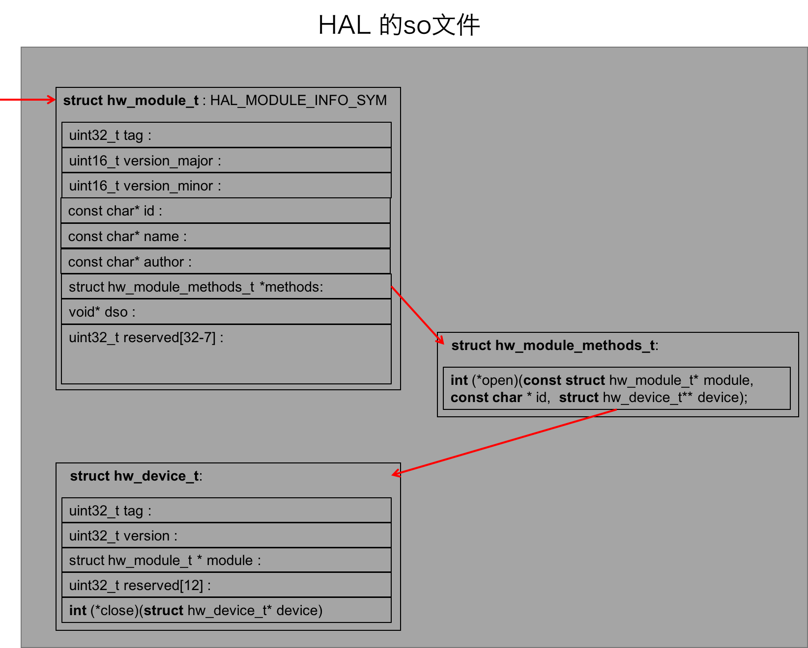

跟着《Android系统源代码情景分析》第2章，我想把从`驱动层`到`硬件抽象层`到`frameworks层`再到`应用层`各层的工作完整地做一遍、调一遍。之前已经有了一些积累，我希望在Android最新的源码上，并且使用AndroidStudio能编译、调试得到每一层。按照我下一步计划，接下来将深入研究键盘消息处理机制，希望在开展这一步工作之前，能够对Android的格局有更进一步的理解，对AndroidStudio的使用能够更娴熟。

首先我会按照《Android系统源代码情景分析》，在命令行下，自下而上把各层工作跑一遍。顺道把编译不过、错误的地方都修正了。尔后再从上到下，逐步把各层工作切换到AndroidStudio上来。计划用两周时间搞定。代码就放在[androidex/hello-android](https://github.com/palanceli/androidex/tree/master/hello-android)下。
<!-- more -->
androidex的文件结构如下：
```
├──android-6.0.1_r11            // Android源码
├──androidex       
   ├──... ...
   ├──setup.sh                  // 调用每个子项目的setup.sh，完成初始化工作
   └──hello-android            
      ├──hello-android-driver   // 驱动层
      │  └──... ...
      │
      ├──ha-driver-checker      // 验证驱动层dev文件系统接口的应用层代码
      │  └──... ...
      │
      ├──hello-android-hal      // 硬件抽象层
      │  └──... ...
      │
      ├──hello-android-service  // 硬件访问服务
      │  └──... ...        
      │
      └──hello-android-app      // 应用层
         └──... ... 
```
在编译之前要做的固定操作：
``` bash
$ cd android-6.0.1_r11
$ source build/envsetup.sh
$ lunch aosp_arm-eng
$ cd kernel/goldfish
$ export ARCH=arm
$ export SUBARCH=arm
$ export CROSS_COMPILE=arm-eabi-
$ export PATH=/Volumes/android-6.0.1_r11g/android-6.0.1_r11/prebuilts/gcc/darwin-x86/arm/arm-eabi-4.8/bin:$PATH
```

# 驱动层
驱动层的代码在[androidex/hello-android/hello-android-driver/](https://github.com/palanceli/androidex/tree/master/hello-android/hello-android-driver)。
结构为：
``` 
hello-android-driver       
├──setup.sh         // 创建软链到android-6.0.1_r11，完成初始化工作
├──hello-android.c  // 
├──hello-android.h  // 
├──Kconfig          // 内核配置文件，供make menuconfig使用，生成.config
└──Makefile         
```

## 执行`setup.sh`完成初始化

``` bash
$ cd androidex
$ sh setup.sh
```
hello-android-driver/setup.sh创建软链：
`kernel/goldfish/drivers/hello-android` -> 
`androidex/hello-android/hello-android-driver/`。

这么做的目的是让Android源码和我的代码分离开，我的代码全都集中在androidex下，可以完整地提交到GitHub上去。随Android源码编译的需要，androidex散落到源码树中，建个软链就确保Android源码树下总能访问到最新androidex了。

## 修改内核Kconfig文件
在文件
`kernel/goldfish/drivers/Kconfig`
尾部追加：
``` bash
source drivers/hello-android/Kconfig
```
它的原理和我前面做`androidex/setup.sh`是一样的，内核通过该`Kconfig`总文件知道都需要编译哪些子模块，具体子模块的编译规则，则存放在`hello-android/Kconfig`中。

Android源码是不包含内核源码的，需要独立下载。我从[这里](https://android.googlesource.com/kernel/goldfish.git)下到的Android内核源码，并使用了3.4分支。

## 修改内核Makefile文件
在文件
`kernel/goldfish/drivers/Makefile`
尾部添加：
``` bash
obj-$(CONFIG_HA) += hello-android/
```
其中`obj-$()`括号内的内容，前半部分`CONFIG_`是固定的，后半部分是`drivers/hello-android/Kconfig`第一行中`config`的名字。

## 编译内核驱动模块
先运行make menuconfig（注意：android6.0+goldfish3.4，默认运行make menuconfig有坑，解决办法详见[这里](http://www.cnblogs.com/palance/p/5187103.html)）：
``` bash
$ cd kernel/goldfish
$ make menuconfig
```
完成如下设置：
```
[*] Enable load module support --->   允许内核支持动态加载模块
  []  Forced module loading
  [*] Module unloading
  []  Forced module unloading
  [*] Module versioning support
  [*] Source checksum for all modules
Device Drivers --->
  <M> Hello Android Driver  指定以模块的方式编译
```

接下来就可以编译了：
``` bash
$ cd kernel/goldfish
$ make -j4
```
新编译的内核镜像文件被保存在`kernel/goldfish/arch/arm/boot/zImage`。

## 加载并运行内核驱动模块
启动模拟器并使用刚刚编译的新内核：
``` bash
$ emulator -kernel kernel/goldfish/arch/arm/boot/zImage &
```


把刚刚编译的ko文件拷贝到模拟器里：
``` bash
$ adb push drivers/hello-android/hello-android.ko /data
```

加载ko模块：
``` bash
adb shell insmod /data/hello-android.ko
```

列出已经安装好的模块：
``` bash
$ adb shell lsmod
Module                  Size  Used by
hello_android           2466  0
```
表明hello_android已经被成功加载了。

## 验证驱动模块各类接口
### 验证proc文件系统接口
验证虚拟设备ha的proc文件系统接口，返回值表明接口正常：
``` bash
$ adb shell cat proc/ha
0
$ adb shell "echo '1' > /proc/ha"
$ adb shell cat proc/ha
1
```
### 验证devfs文件系统接口
验证虚拟设备ha的devfs文件系统接口，返回值表明接口正常：
``` bash
$ adb shell "cd /sys/class/ha/ha && cat value"
1
$ adb shell "cd /sys/class/ha/ha && echo '3' > value"
$ adb shell "cd /sys/class/ha/ha && cat value"
3
```
### 验证dev文件系统接口
验证虚拟设备ha的dev文件系统访问接口略麻烦，因为它读/写的内容是二进制的，需要编一个小程序来验证，源码在[androidex/hello-android/ha-driver-checker](https://github.com/palanceli/androidex/tree/master/hello-android/ha-driver-checker)。
执行`androidex/setup.sh`完成初始化，它创建软链：
`external/ha-driver-checker` ->
`androidex/hello-android/ha-driver-checker`

然后单独编译ha-driver-checker：
``` bash
$ mmm external/ha-driver-checker
... ...
target Executable: ha (out/debug/target/product/generic/obj/EXECUTABLES/ha_intermediates/LINKED/ha)
target Unpacked: ha (out/debug/target/product/generic/obj/EXECUTABLES/ha_intermediates/PACKED/ha)
target Symbolic: ha (out/debug/target/product/generic/symbols/system/bin/ha)
Export includes file: external/ha-driver-checker/Android.mk -- out/debug/target/product/generic/obj/EXECUTABLES/ha_intermediates/export_includes
target Strip: ha (out/debug/target/product/generic/obj/EXECUTABLES/ha_intermediates/ha)
Install: out/debug/target/product/generic/system/bin/ha
```
输出信息已经清楚地写明了生成文件存放的路径，把它拷贝到模拟器上然后执行：
``` bash
$ emulator -kernel kernel/goldfish/arch/arm/boot/zImage &
$ adb push drivers/hello-android/hello-android.ko /data
$ adb push out/debug/target/product/generic/obj/EXECUTABLES/ha_intermediates/LINKED/ha /data
1843 KB/s (82652 bytes in 0.043s)
$ adb shell insmod /data/hello-android.ko
$ adb shell /data/ha
Read original value: 3.
Write value 13 to /dev/ha.
Read the value again:13.
```
说明dev文件系统访问接口正常！

# 硬件抽象层
硬件抽象层运行在用户控件，是Android系统的独有设计。Linux对硬件的支持是在驱动层，完全运行在内核空间。Android的这种设计是为了保护厂商的商业利益，它通过引入硬件抽象层允许厂商在该层封装对硬件的操作细节，该层遵循Apache License协议，因此厂商可以将业务逻辑实现闭源。

HAL层的框架不难理解，不过能讲得简洁、清晰的也不多，[mr_raptor](http://blog.csdn.net/mr_raptor)的[HAL Stub框架分析](http://blog.csdn.net/mr_raptor/article/details/8074549)就是一篇，应该先好好读透了再往下进行。

我简单说一下我的理解：HAL层的so文件都有一个固定入口符号即HAL_MODULE_INFO_SYM，该符号指向的结构体hw_moduel_t用来描述一个硬件对象。通过该结构体的methods可以找到打开该硬件对象的open方法，调用open方法返回针对该硬件对象的操作接口hw_device_t，它们之间的结构关系如下图：


这几个结构体以及函数正是我们在HAL层要实现的内容。该层的代码详见[androidex/hello-android/hello-android-hal](https://github.com/palanceli/androidex/tree/master/hello-android/hello-android-hal)。
第一步还是先执行setup.sh创建软链：
`hardware/libhardware/include/hardware/hello-android.h` ->
`androidex/hello-android/hello-android-hal/hello-android.h`

`hardware/libhardware/modules/hello-android` ->
`androidex/hello-android/hello-android-hal`

然后执行编译：
``` bash
$ cd android-6.0.1_r11
$ source build/envsetup.sh
$ lunch aosp_arm-eng
$ mmm hardware/libhardware/modules/hello-android
$ make snod
```
其中`make snod`是打包Android系统镜像文件system.img。

接下来，修改设备文件`/dev/ha`的访问权限，编辑`system/core/rootdir/ueventd.rc`，加入：
```
/dev/ha  0666  root  root
```
使得所有用户均可访问`/dev/ha`。然后需要重新编译Android源码：
``` bash
$ make -j8
```
由于绝大部分源代码并没有修改过，所以这次编译很快就完成了。

# 硬件访问服务
应用层通过该服务访问硬件抽象层，该层代码放在[androidex/hello-android/hello-android-service/](https://github.com/palanceli/androidex/tree/master/hello-android/hello-android-service)。
setup.sh执行几个操作：
1. 创建软链
`frameworks/base/core/java/android/os/IHAService.aidl` ->
`hello-android-service/IHAService.aidl`
这使得编译出的frameworks.jar包含IHAService接口。
2. 创建软链
`frameworks/base/services/java/com/android/server/HAService.java` ->
`hello-android-service/HAService.java`
这使得编译出的services.jar中包含HAService类，该服务调用native接口实现具体功能。
3. 创建软链
frameworks/base/services/core/jni/com_android_server_HAService.cpp ->
hello-android-service/com_android_server_HAService.cpp
这使得编译出的libandroid_servers.so文件包含init_native、setValue_native和getValue_native方法。

修改`frameworks/base/Android.mk`：
``` make
LOCAL_SRC_FILES += \
  ... ...
  core/java/android/os/IHaService.aidl \

```
以便编译系统将其转换为Java文件，执行编译命令，生成frameworks.jar：
``` bash
$ mmm frameworks/base/
```

修改frameworks/base/services/core/jni/onload.cpp，添加函数register_android_server_HAService的声明和和调用：
``` c++
... ...
namespace android {
... ...
int register_android_server_HAService(JNIEnv* env);
};

using namespace android;

extern "C" jint JNI_OnLoad(JavaVM* vm, void* /* reserved */)
{
    ... ...
    register_android_server_HAService(env);


    return JNI_VERSION_1_4;
}

```

修改/frameworks/base/services/core/jni/Android.mk：
``` base
LOCAL_SRC_FILES += \
  ... ...
  $(LOCAL_REL_DIR)/com_android_server_HAService.cpp \
  $(LOCAL_REL_DIR)/onload.cpp
```

执行编译命令，生成libandroid_server.so：
``` bash
$ mmm frameworks/base/services
```

保险起见，还是整体编译一遍吧：
``` bash
$ cd android-6.0.1_r11
$ make update-api -j4
```
注意，这里添加了参数`update-api`。这是因为当在Android源码中添加了自定义的包、类、方法或者修改了Android源码中标识为@hide的方法、类时，如果需要这些内容对Application可见，并且需要编译进SDK的Document的话，必须添加该参数更新文档。

# 应用层
代码详见[androidex/hello-android/hello-android-app/](https://github.com/palanceli/androidex/tree/master/hello-android/hello-android-app)。
setup.sh创建软链：
`packages/experimental/HelloAndroid` ->
`androidex/hello-android/hello-android-app`
它的目录结构为：
``` 
HelloAndroid
├──AndroidManifest.xml
├──Android.mk
├──src/palance/li/ha
│                 └──HelloAndroid.java
└──res
   ├──layout
   │  └──main.xml
   ├──values
   │  └──strings.xml
   └──drawable
      └──icon.png
```
接下来就可以编译引用层app，并打出系统镜像文件system.img：
``` bash
$ mmm packages/experimental/HelloAndroid/
$ make snod
```
运行emulator：
``` bash
$ emulator -kernel kernel/goldfish/arch/arm/boot/zImage &
$ adb push drivers/hello-android/hello-android.ko /data
$ adb shell insmod /data/hello-android.ko
```


