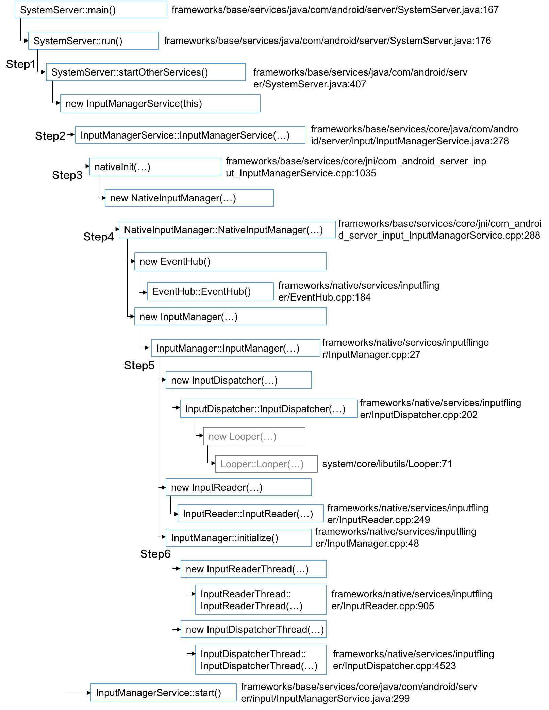

最近一个礼拜把[罗升阳](http://blog.csdn.net/luoshengyang)的《Android源码情景分析》之键盘消息处理机制的内容学习了一遍，感觉相比Binder要简单好多，而且有了智能指针和Binder的基础，学习键盘消息处理几乎没有什么障碍了。不过Android2.x和Android6之间的差异巨大，完全掌握最新的Android键盘消息处理机制还有很长的路要走。如学习Binder的过程，我还是打算分两个板块来记录Android键盘消息处理机制的探索：1、学习笔记；2、深度探索。“学习笔记”主要记录初次学习的轨迹，以及其中遇到的所有细节问题，目前我对键盘消息处理也仅处于“身在此山中”的状态，每个知识点都有些印象，但不成体系。完成学习笔记之后，我会再来回顾一遍，用自己的理解把它们讲出来，这就是“深度探索”系列的任务了。
<!-- more -->

# Step1: InputManagerService的创建
键盘消息处理机制的源头在InputManagerService，因此从它的启动搞起。在Android6中，InputManagerService是在SystemServer中被直接创建和调起的，如下：
``` java
// frameworks/base/services/java/com/android/server/SystemServer.java:167
public final class SystemServer {
... ...
    public static void main(String[] args) {    // 入口函数
        new SystemServer().run();
    }

    private void run() {
        ... ... 
        try {       // :270
            ... ...
            startOtherServices();               // 启动一批Services
        } catch (Throwable ex) {
            ... ...
        }
    }
    private void startOtherServices() {
        try{
            ... ... // :497
            inputManager = new InputManagerService(context);  // 🏁创建
            ... ...
            wm = WindowManagerService.main(context, inputManager,
                    mFactoryTestMode != FactoryTest.FACTORY_TEST_LOW_LEVEL,
                    !mFirstBoot, mOnlyCore);
            ServiceManager.addService(Context.WINDOW_SERVICE, wm);
            ServiceManager.addService(Context.INPUT_SERVICE, inputManager);

            mActivityManagerService.setWindowManager(wm);

            inputManager.setWindowManagerCallbacks(wm.getInputMonitor());
            inputManager.start(); // 🏁启动，将在《键盘消息处理学习笔记（二）》中讨论
        } catch (RuntimeException e) {
            ... ...
        }

```
这跟Android2.3有些差异，在Android2.3中，inputManager的类名就叫InputManager，是在WindowManagerService中被创建和启动。
# Step2: InputManagerService::InputManagerService()
<a name="InputManagerService__InputManagerService"></a>接下来看InputManagerService的构造函数：
``` java
// frameworks/base/services/core/java/com/android/server/input/InputManagerService.java

public class InputManagerService extends IInputManager.Stub
        implements Watchdog.Monitor {
    ... ...
    // :278
    public InputManagerService(Context context) {
        ... ...
        // 🏁
        mPtr = nativeInit(this, mContext, mHandler.getLooper().getQueue());
        ... ...
    }
    ... ...
}
```
# Step3: nativeInit(...)
nativeInit(...)返回的是一个NativeInputManager对象，该指针被强转成jlong，返回给mPtr。
``` cpp
// frameworks/base/services/core/jni/com_android_server_input_InputManagerService.cpp :1035
static jlong nativeInit(JNIEnv* env, jclass /* clazz */,
        jobject serviceObj, jobject contextObj, jobject messageQueueObj) {
    ... ...
    NativeInputManager* im = new NativeInputManager(contextObj, serviceObj,
            messageQueue->getLooper()); // 🏁
    im->incStrong(0);
    return reinterpret_cast<jlong>(im);
}
```
# Step4: NativeInputManager::NativeInputManager(...)
<a name="NativeInputManager__NativeInputManager"></a>
``` cpp
// frameworks/base/services/core/jni/com_android_server_input_InputManagerService.cpp :288
NativeInputManager::NativeInputManager(jobject contextObj,
        jobject serviceObj, const sp<Looper>& looper) :
        mLooper(looper), mInteractive(true) {
    ... ...
    sp<EventHub> eventHub = new EventHub();
    mInputManager = new InputManager(eventHub, this, this);     // 🏁
}
```

# Step5: InputManager::InputManager(...)
``` cpp
// frameworks/native/services/inputflinger/InputManager.cpp :27
InputManager::InputManager(
        const sp<EventHubInterface>& eventHub,
        const sp<InputReaderPolicyInterface>& readerPolicy,
        const sp<InputDispatcherPolicyInterface>& dispatcherPolicy) {
    mDispatcher = new InputDispatcher(dispatcherPolicy);
    mReader = new InputReader(eventHub, readerPolicy, mDispatcher);
    initialize();   // 🏁
}
```

# Step6: InputManager::initialize()
``` cpp
// frameworks/native/services/inputflinger/InputManager.cpp: 48
void InputManager::initialize() {
    mReaderThread = new InputReaderThread(mReader);
    mDispatcherThread = new InputDispatcherThread(mDispatcher);
}
```
# 总结
总结一下：InputManagerService的创建过程如下：

本文尚未涉及的，暂标为灰色。

它们之间的关系如下：


以上的创建过程是在SystemServer的启动阶段，产生的对象都在SystemServer的进程空间内。

在这次学习键盘消息处理机制的过程中，我把原先层层堆栈式的函数调用改成了同级串行的表述方式，如Step1和Step2之间是调用关系，而我在形式上把它们放在同一级。这也是从《Android系统源代码情景分析》中借鉴来的，因为在代码中层层调用的关系远比平级顺序调用关系要多得多，如果用“大标题->中标题->小标题“的方式来表述，尽管符合逻辑关系，但表现出来反而更复杂。改成串行后，要清晰很多。而且每一处都用一个StepN标示出来，需要引用或者指代的时候能很准确地说清楚。
我会把每一步骤中需要详细展开讨论的插个🏁，有的会在后面某篇博文中讨论，会在🏁后面注明。

读代码也是不断打磨方法的过程，好的方法可以事半功倍。