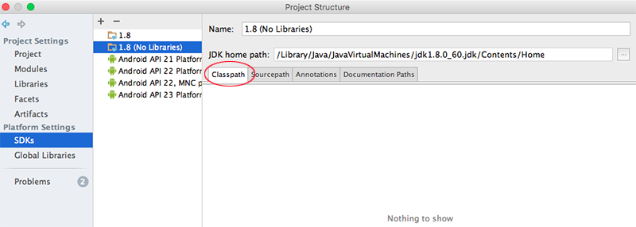
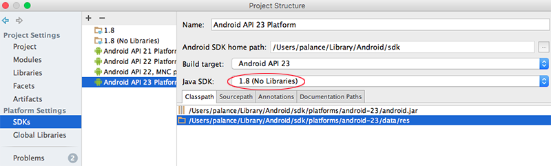
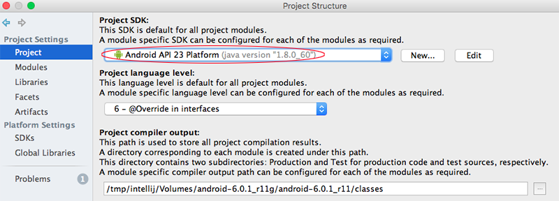

一直没有放弃调研怎么在模拟器上直接运行和调试代码。直接调试一个小程序当然没问题，可是对于一个比较庞大的工程，包含JNI和基于arm编译好的so，之前基础知识匮乏，操作这事总是遇到各种阻碍，又不知道该怎么解决。这两天再次尝试终于有突破了，把过程备忘下来。

<!-- more -->
尽管在模拟器上调试和运行程序比在真机上迟缓，可模拟器有自己独特的优势：
* 模拟器天然有root权限，我一直没有搞定root自己的华为手机。模拟器不用再操root的心，随意怎么搞，很爽。
* 不用总是带着调试机在身边，也不用叮叮当当的连线。平时自己用的手机有各种网银、电商，还是不太放心直接用来做开发机，再带一台调试机很累赘。
* 最近工作的重点都是使用adb，比如调查应用的存储尺寸、内存占用，这些跟模拟器运行的快慢没关系。
* Genymotion、AndroidStudio2.x自带的模拟器运行速度已经很快了，我相信Google还会不断优化模拟器的性能。
* 如果要调试的是Android源码，那只有使用Android自带的模拟器最便捷。

# 使用Gemymotion运行基于ARM指令的APP
以前之所以遇到各种问题，主要还是平台指令集不匹配的原因，解决起来其实非常简单。Genymotion和AndroidStudio2.x自带的模拟器都是x86的，而绝大部分app如果有带so的话，都是基于arm指令集编译的，直接跑在x86的模拟器上必然有问题。这两个模拟器现在的运行速度差不多，我选用Genymotion。模拟器启动后，先安装[ARM_Translation_Marshmallow.zip](https://pan.baidu.com/s/1hsQA2LQ)，把该zip文件直接拖到模拟器里，一路安装即可。重启后就可以运行基于arm编译的app了，使用AndroidStudio调试都没有问题。用这种方式调试应用层代码，体验上已经不比在真机上差了。

# 使用emulator安装app
有的时候，必须在基于ARM指令的模拟器上运行、调试代码，那就只有用Android源码自带的emulator。关于emulator的编译，可参见[《Android源码树中C代码的编译》](http://www.cnblogs.com/palance/p/5229500.html)。我尝试使用AndroidStudio直接编译大项目，并安装到模拟器上直接调试，总是在"Installing apk..."的地方模拟器就无响应了，目前还不知道该怎么解决。不过今天我发现直接adb install来安装是没问题的，比如从官网下载搜狗输入法，然后执行：
``` bash
// 设定内存和存储尺寸，设定dns以使网络畅通
$ emulator -memory 512 -partition-size 1024 -dns-server 10.129.181.211 &
// 安装输入法
$ adb install /Users/palance/Downloads/SogouInput_android_v8.4_sweb.apk 
```
就顺利完成安装了。

# 使用AndroidStudio在emulator上调试Android源码
上周只是蜻蜓点水地试了一下，貌似也可以了，详细的步骤我还要再梳理，稍后补上。这一块补足后，开发、调试环境这条道上的障碍就基本扫清了，以后就可以在上面更快地跑马咯~

记录我在macOS下的操作步骤：
## 修改AndroidStudio的内存配置
应用程序 - Android Studio.app右键 - 显示包内容 - Contents/bin/studio.vmoptions，被修改的两项内容如下：
``` bash
-Xms512m
-Xmx2048m
```
Xms是JVM启动的起始堆内存，Xmx是AndroidStudio能使用的最大heap内存。

## 使用源码生成ipr文件
在源码下执行
``` bash
$ source build/ensetup.sh
$ make idegen && development/tools/idegen/idegen.sh
```
该命令会在源码根目录下生成AndroidStudio所需要的ipr文件，打开AndroidStudio - Open an existing Android Studio project - 选择刚刚生成的android.ipr

接下来需要一段时间来读取源码，我等了25分钟。为了让以后每次打开项目的时候节省点时间，可以把一些文件夹设置为Excluded，这样以后再打开项目的时候，AndroidStudio就不再读取这些文件夹了。具体操作为：在项目上右键 - Open Module Settings - Project Settings - Modules，点击要排除的文件夹，点击Excluded。我选择排除了docs、out、prebuilts。

## 配置JDK、SDK
回到Module Settings - Platform Settings - SDKs。依照已有的JDK再添加一个，取名为1.8(No Libraries)，删除classpath下所有jar文件，以确保使用Android源码里的库文件。并将1.8(No Libraries)作为Android SDK使用的JDK，如下：


在Project SDK中选择对应的Android API版本：


回到Project Settings - Modules - Dependencies，删除除
`<Module source>`
`Android API 23 Platform(java version "1.8.0_60"`
以外的所有依赖，这样代码跳转时就会优先从这两个文件夹下查找，而不是去Android.jar。

## 为Debug配置
Project Settings - Modules - 选中中间试图中的android - 点击加号 - 选择Framework/Android