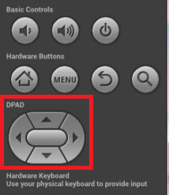

再回过头来看《键盘消息处理学习笔记（三）》中[InputReaderThread的启动](http://palanceli.com/2016/10/02/2016/1002KeyboardLearning3/#InputReaderThread的启动)。Step3中`mEventHub->getEvents(...)`从所有输入设备读取一轮IO事件，如果有IO事件发生，该函数中的循环就会中断，函数返回到Step2中的`InputReader::loopOnce()`，接着由`InputReader::processEventsLocked(...)`来处理这些IO事件。本文以该函数为起点研究键盘事件的处理。
<!-- more -->
``` c++
// frameworks/native/services/inputflinger/InputReader.cpp:272
void InputReader::loopOnce() {
    ... ...
    int32_t timeoutMillis;
    ... ...
    size_t count = mEventHub->getEvents(timeoutMillis, mEventBuffer, EVENT_BUFFER_SIZE);    // 从所有输入设备读取一轮IO事件，保存到mEventBuffer
    ... ...
        if (count) {
            processEventsLocked(mEventBuffer, count); // 🏁
        }
    ... ...
}
```
# Step1: InputReader::processEventsLocked(...)
``` c++
// frameworks/native/services/inputflinger/InputReader.cpp:336
void InputReader::processEventsLocked(const RawEvent* rawEvents, size_t count) {
    for (const RawEvent* rawEvent = rawEvents; count;) {
        int32_t type = rawEvent->type;
        // 扫描rawEvent之后连续出现且和rawEvent->deviceId相同的，非设备增删查的事件个数
        size_t batchSize = 1;
        if (type < EventHubInterface::FIRST_SYNTHETIC_EVENT) {
            int32_t deviceId = rawEvent->deviceId;
            while (batchSize < count) {
                if (rawEvent[batchSize].type >= EventHubInterface::FIRST_SYNTHETIC_EVENT
                        || rawEvent[batchSize].deviceId != deviceId) {
                    break;
                }
                batchSize += 1;
            }
... ...
            // 🏁批量处理这些IO事件
            processEventsForDeviceLocked(deviceId, rawEvent, batchSize);
        } else {
            // 处理设备的增、删、查请求
            switch (rawEvent->type) {
            case EventHubInterface::DEVICE_ADDED:
                addDeviceLocked(rawEvent->when, rawEvent->deviceId);
                break;
            case EventHubInterface::DEVICE_REMOVED:
                removeDeviceLocked(rawEvent->when, rawEvent->deviceId);
                break;
            case EventHubInterface::FINISHED_DEVICE_SCAN:
                handleConfigurationChangedLocked(rawEvent->when);
                break;
            default:
                ALOG_ASSERT(false); // can't happen
                break;
            }
        }
        count -= batchSize;
        rawEvent += batchSize;
    }
}
```
# Step2: InputReader::processEventsForDevicedLocked(...)
``` c++
// frameworks/native/services/inputflinger/InputReader.cpp:503
void InputReader::processEventsForDeviceLocked(int32_t deviceId,
        const RawEvent* rawEvents, size_t count) {
    ssize_t deviceIndex = mDevices.indexOfKey(deviceId);
    ... ... // 获取发生键盘事件的输入设备
    InputDevice* device = mDevices.valueAt(deviceIndex);
    ... ...
    device->process(rawEvents, count);  // 🏁
}
```
# Step3: InputDevice::process(...)
``` c++
// frameworks/native/services/inputflinger/InputReader.cpp:1027
void InputDevice::process(const RawEvent* rawEvents, size_t count) {
    // Process all of the events in order for each mapper.
    // We cannot simply ask each mapper to process them in bulk because mappers may
    // have side-effects that must be interleaved.  For example, joystick movement events and
    // gamepad button presses are handled by different mappers but they should be dispatched
    // in the order received.
    size_t numMappers = mMappers.size();
    // 遍历每一个IO事件
    for (const RawEvent* rawEvent = rawEvents; count--; rawEvent++) {
... ...
            // 遍历每一个InputMapper对象，找到和事件匹配的对象，处理
            for (size_t i = 0; i < numMappers; i++) {
                InputMapper* mapper = mMappers[i];
                mapper->process(rawEvent);  // 🏁
            }
... ...
    }
}
```
每一种类型的的IO事件都由一个InputMapper对象来处理，尽管在第二个for循环中遍历了所有的InputMapper对象，而实际只有一个InputMapper对象会对和自己匹配的事件进行处理。此处我们关心的是键盘事件，因此我们只需要关注处理键盘事件的mapper——KeyboardInputMapper。

# Step4: KeyboardInputMapper::process(...)
``` c++
// frameworks/native/services/inputflinger/InputReader.cpp:2172
void KeyboardInputMapper::process(const RawEvent* rawEvent) {
    switch (rawEvent->type) {
    case EV_KEY: {
        int32_t scanCode = rawEvent->code; // 获得扫描码
        int32_t usageCode = mCurrentHidUsage;
        mCurrentHidUsage = 0;
        // 检查该扫描码是否对应一个合法按键
        if (isKeyboardOrGamepadKey(scanCode)) {
            processKey(rawEvent->when, rawEvent->value != 0, scanCode, usageCode);  // 🏁
        }
        break;
    }
    ... ...
    }
}
```
简单介绍一下扫描码的概念：
>   当用户按下键盘上的一个键时，键盘内的芯片会检测到这个动作，并把这个信号传送到计算机。如何区别是哪一个键被按下了呢？键盘上的所有按键都有一个编码，称作键盘扫描码。当你按下一个键时，这个键的扫描码就被传给系统。扫描码是跟具体的硬件相关的，同一个键，在不同键盘上的扫描码有可能不同。键盘控制器就是将这个扫描码传给计算机，然后交给键盘驱动程序。键盘驱动程序会完成相关的工作，并把这个扫描码转换为键盘虚拟码。
>   与扫描码相对的还有一个虚拟码。因为扫描码与硬件相关，不具有通用性，为了统一键盘上所有键的编码，于是就提出了虚拟码概念。无论什么键盘，同一个按键的虚拟码总是相同的，这样程序就可以识别了。简单点说，虚拟码就是我们经常可以看到的像VK_A,VK_B这样的常数，比如键A的虚拟码是65，写成16进制就是0x41。
>   当键盘驱动程序把扫描码转换为虚拟码后，会把这个键盘操作的扫描码和虚拟码还有其它信息一起传递给操作系统。然后操作系统则会把这些信息封装在一个消息中，并把这个键盘消息插入到消息列队。

# Step5: KeyboardInputMapper::processKey(...)
``` c++
// frameworks/native/services/inputflinger/InputReader.cpp:2205
void KeyboardInputMapper::processKey(nsecs_t when, bool down, int32_t scanCode,
        int32_t usageCode) {
    int32_t keyCode;
    int32_t keyMetaState;
    uint32_t policyFlags;
    ... ...
    if (down) {
        // Rotate key codes according to orientation if needed.
        // 当屏幕旋转了，同一个DPAD按键对应的keyCode是不同的，此处完成转换
        if (mParameters.orientationAware && mParameters.hasAssociatedDisplay) {
            keyCode = rotateKeyCode(keyCode, mOrientation);
        }

        // Add key down.
        // 当前按下的键之前是否已经被按下了，如果是，keyDownIndex为非负
        ssize_t keyDownIndex = findKeyDown(scanCode);
        if (keyDownIndex >= 0) {
            // key repeat, be sure to use same keycode as before in case of rotation
            // mKeyDowns保存着已经被按下的按键集合，如果当前按键之前已经被按下了，
            // 则keyCode保持之前的含义，不要受屏幕旋转的影响。
            keyCode = mKeyDowns.itemAt(keyDownIndex).keyCode;
        } else {
            ... ...
            // 把当前按下的按键存入mKeyDowns
            mKeyDowns.push();
            KeyDown& keyDown = mKeyDowns.editTop();
            keyDown.keyCode = keyCode;
            keyDown.scanCode = scanCode;
        }

        mDownTime = when;
    } else {
        // Remove key down. 检查当前松开的按键之前处于被按下的状态
        ssize_t keyDownIndex = findKeyDown(scanCode);
        if (keyDownIndex >= 0) {
            // key up, be sure to use same keycode as before in case of rotation
            // 将该按键从mKeyDowns中删除
            keyCode = mKeyDowns.itemAt(keyDownIndex).keyCode;
            mKeyDowns.removeAt(size_t(keyDownIndex));
        } ... ...
    }

    int32_t oldMetaState = mMetaState;
    // 取出组合键信息（如Alt、Shift）保存在newMetaState中，如果发生变化则更新mMetaState
    int32_t newMetaState = updateMetaState(keyCode, down, oldMetaState);
    bool metaStateChanged = oldMetaState != newMetaState;
    if (metaStateChanged) {
        mMetaState = newMetaState;
        updateLedState(false);

        // If global meta state changed send it along with the key.
        // If it has not changed then we'll use what keymap gave us,
        // since key replacement logic might temporarily reset a few
        // meta bits for given key.
        keyMetaState = newMetaState;
    }

    nsecs_t downTime = mDownTime;

    ... ...

    NotifyKeyArgs args(when, getDeviceId(), mSource, policyFlags,
            down ? AKEY_EVENT_ACTION_DOWN : AKEY_EVENT_ACTION_UP,
            AKEY_EVENT_FLAG_FROM_SYSTEM, keyCode, scanCode, keyMetaState, downTime);
    getListener()->notifyKey(&args);    // 🏁
}
```
代码中的keyCode就是前面讲的虚拟码的概念，DPAD按键就是手机上的方向键：

同一个按键，当手机旋转后，尽管扫描码是相同的，可是按键的逻辑含义发生变化了，因此需要把keyCode作相应的转换，如原先的“上下左右”顺时针旋转90°后就变成了“右下左上”。

这一大段的代码主要是来微调keyCode以及更新组合键信息，最后把这些信息打包到NotifyKeyArgs中，由getListener()->notifyKey(...)来处理。函数KeyboardInputMapper::getListener()继承自基类InputMapper：
``` c++
// frameworks/native/services/inputflinger/InputReader.h:1012
    inline InputListenerInterface* getListener() { return mContext->getListener(); }
```
mContext是在构造函数中传入的：
``` c++
// frameworks/native/services/inputflinger/InputReader.cpp:1823
InputMapper::InputMapper(InputDevice* device) :
        mDevice(device), mContext(device->getContext()) {
}
```
<font color='red'>KeyboardInputMapper在构造的时候传入的InputDevice是谁？该设备的context又是谁？这些都是抽象类，从静态代码查找很困难。可以暂时搁置，日后调试进来再看。</font>
一个简单的静态方法是从notifyKey入手，在Android源码根目录查找"::notifyKey"：
``` bash
$ find . -name "*.cpp" |xargs grep "::notifyKey"
appledeiMac:android-6.0.1_r11 palance$ find . -name "*.cpp" |xargs grep "::notifyKey"
./frameworks/native/services/inputflinger/InputDispatcher.cpp:void InputDispatcher::notifyKey(const NotifyKeyArgs* args) {
./frameworks/native/services/inputflinger/InputListener.cpp:void QueuedInputListener::notifyKey(const NotifyKeyArgs* args) {
./system/core/fingerprintd/FingerprintDaemonProxy.cpp:void FingerprintDaemonProxy::notifyKeystore(const uint8_t *auth_token, const size_t auth_token_length) {
```
找到比较靠谱的代码就是InputDispatcher.cpp了。
# Step6: InputDispatcher::notifyKey(...)
``` c++
// frameworks/native/services/inputflinger/InputDispatcher.cpp:2359
void InputDispatcher::notifyKey(const NotifyKeyArgs* args) {
... ...
    uint32_t policyFlags = args->policyFlags;
    int32_t flags = args->flags;
    int32_t metaState = args->metaState;
    ... ...

    bool needWake;
        ... ...

        int32_t repeatCount = 0;
        KeyEntry* newEntry = new KeyEntry(args->eventTime,
                args->deviceId, args->source, policyFlags,
                args->action, flags, keyCode, args->scanCode,
                metaState, repeatCount, args->downTime);

        needWake = enqueueInboundEventLocked(newEntry); // 将键盘事件添加到待分发队列
    ... ...

    if (needWake) {
        mLooper->wake();
    }
}
```
这里我省略的代码比较多，因为一些按键的微调、过滤在这里都不是主要逻辑，此处的主流是将键盘事件封装成KeyEntry，添加到待分发队列，并唤醒Looper。
来看向待分发队列插入KeyEntry：

``` c++
// frameworks/native/services/inputflinger/InputDispatcher.cpp:408
bool InputDispatcher::enqueueInboundEventLocked(EventEntry* entry) {
    // 如果之前队列为空，则新来一个事件需要立刻唤醒InputDispatcher来处理
    bool needWake = mInboundQueue.isEmpty();
    mInboundQueue.enqueueAtTail(entry); // 将entry进队
    traceInboundQueueLengthLocked();

    switch (entry->type) {
    case EventEntry::TYPE_KEY: {
        // Optimize app switch latency.
        // If the application takes too long to catch up then we drop all events preceding
        // the app switch key.
        KeyEntry* keyEntry = static_cast<KeyEntry*>(entry);
        // 键盘事件与应用程序窗口切换操作相关，如Home键，
        // 在抬起时应立刻唤醒InputDispatcher来处理
        if (isAppSwitchKeyEventLocked(keyEntry)) { 
            if (keyEntry->action == AKEY_EVENT_ACTION_DOWN) {
                mAppSwitchSawKeyDown = true;
            } else if (keyEntry->action == AKEY_EVENT_ACTION_UP) {
                if (mAppSwitchSawKeyDown) {
... ...
                    mAppSwitchDueTime = keyEntry->eventTime + APP_SWITCH_TIMEOUT;
                    mAppSwitchSawKeyDown = false;
                    needWake = true;
                }
            }
        }
        break;
    }
    ... ...
    }

    return needWake;
}
```
InputDispatcher::mInboundQueue维护一个待分发键盘事件队列，队列中的事件都是需要分发给系统当前活动窗口来处理的。函数enqueueInboundEventLocked(...)除了让事件进队，还会返回是否立刻唤醒InputDispatcher，以分发队列中的键盘事件。
如果需要唤醒InputDispatcher，则在InputDispatcher::notifyKey(...)的尾部调用mLooper()->wake()。

# 总结
本文的起点是任何一个输入设备有IO事件发生，这将会唤醒InputReader，它收到这个事件后，把事件做了简单封装，插入待分发队列中，然后唤醒Dispatcher。回顾《键盘消息处理学习笔记（三）》之[InputDispatcherThread的启动](http://palanceli.com/2016/10/02/2016/1002KeyboardLearning3/#InputDispatcherThread的启动)一节中，InputDispatcher启动后就等待在`mLooper->pollOnce(timeoutMillis);`，InputReader通过调用`mLooper()->wake()`就把InputDispatcher的等待唤醒了。