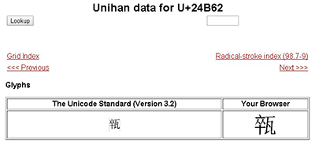
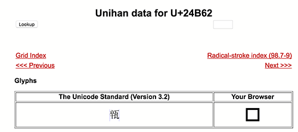
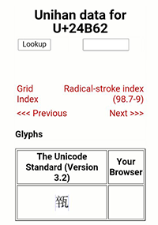
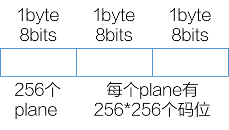

早上老板报了一个生僻字，左边卒，右边瓦：

这字在unicode.org的Unihan中念[“cèi”](http://www.unicode.org/cgi-bin/GetUnihanData.pl?codepoint=24b62)，在汉典中念[“suì”](http://www.zdic.net/z/97/js/24B62.htm)。
可是这字在输入法里敲不出来，在Windows、macOS、iOS和Android下的浏览器里，显示各不相同，这是为什么呢？
<!-- more -->
Windows下：

只有Windows下显示是正常的。

macOS下：

iOS下：

Android下：

原因是这样的：这个字的Unicode编码是0x24B62，落在了Unicode CJK扩展B的集合中。不同操作系统对于不同编码范围的字符集的字形支持度是不一样的，即使在Windows下，不同的版本也是不一样的。上面的截图是在Win7下截到的，Win7针对扩展B自带了一个字库，而WinXP是没有的，因此如果是在WinXP下面，就应该也看不到这个字。

# 关于Unicode的概念
Unicode的目的就写在Unicode[官网首页](http://www.unicode.org/)：让世界上使用任何语言的人们都能使用计算机。其实是让计算机能支持世界上任何一种语言。

语言是由字或字符组成的，拉丁语系下大部分语言都是通过有限的字母拼合而成，所以计算机只要支持这些有限的字母即可。而像汉字这种象形文字则包含了几万个字，如果计算机要支持世界上所有的语言体系，就必须给每个语言下的每个字符编个号，大家都认这个编号。过去不同国家会制定自己的编码标准，也就是给自己语言体系中的字符编号，不同标准之间可能会冲突。比如同一个号码序列，在欧洲表示“abc”，在中国就表示“你我他”，数据在相互交换之前就必须指明了我的编码采用的什么标准，到了对端再依照不同的标准做转换。这相当于给计算机限定了国界，可是互联网是无国界的。这不只是跟互联网文化相冲突，也给跨区域使用带来了现实上的不便。为了解决这个问题，Unicode组织说：“我来指定一套规范，能覆盖所有语言，给所有语言下的所有字符规定一套编码，大家都遵守我的编码规范，这个问题自然就解决了！”

# Unicode码位的组织
到2016年的Unicode 9.0为止，Unicode共使用了从0到0x10FFFF的编码，每一个数字代表一个字符。为了便于理解，它把这些码位按照前16位和后16位做了逻辑分区，前16位每个编码叫做一个Plane（平面），于是每个平面下就包含了0xFFFF个码位。例如前面说的“卒瓦”的编码是0x24B62，就可以在Plane2下的0x4B62处找到。

## Basic Multilingual Plane（BMP）
把Plane0下包含的编码称作**多语言基本面 Basic Multilingual Plane**，简称**BMP**。Unicode的编码方案在制定时考虑到了各语言的书写、使用方便，尽量把常用的往前排，符合哈夫曼编码原则；尽量把一个区域的字符编在相邻的位置。BMP下包含了世界各语言下比较常用的字符，所以才被称为基本面~在这个BMP中，包含了`27,973`个汉字。

## Supplementary Multilingual Plane（SMP）
把Plane1下包含的编码称作**多语言补充面 Supplementary Multilingual Plane**，简称**SMP**。位于这个面字符或者不太常用，或者是为了特殊含义专门造的，或者是表意符号，或者是BMP字符的不常用的变种。

## Supplementary Ideographic Plane（SIP）
把Plane2下包含的编码称作**表意补充面 Supplementary Ideographic Plane**，简称**SIP**。这个区域主要是为中日韩象形文字开辟的一块扩展空间，用于存放不适合放到BMP中的生僻字。这个区域除了有少量常用CJK字符外（如广东话里的常用字），绝大部分都是非常罕见的生僻字。

## Supplementary Special-purpose Plane（SSP）
把Plane14下包含的编码称作**特殊用途补充面 Supplementary Special-purpose Plane**，简称**SSP**。这个区域的字符基本上都是更不常用的格式控制符。

## Private Use Planes
还剩下Plane15、Plane16两个面，用于私有用途。这两个区域包含了131,068个字符，用于补充BMP中6400个代理去码位，具体细节在后面讲到UTF-16编码时再解释。

# 汉字在Unicode中的分布
在Unicode中，中日韩的汉字集中在几个区域，但是它们之间是混在一起的。这几个区域分别是：

块名称|位置|汉字个数|描述
---|----|----|----
CJK Unified Ideographs|4E00–9FFF|20,991|常用字
CJK Unified Ideographs Extension A|3400–4DBF|6591|生僻字
CJK Unified Ideographs Extension B|20000–2A6DF|42,719|古汉字遗留的生僻字
CJK Unified Ideographs Extension C|2A700–2B73F|4,159|古汉字遗留的生僻字
CJK Unified Ideographs Extension D|2B740–2B81F|223|现在还在用，但使用较少
CJK Unified Ideographs Extension E|2B820–2CEAF|5,775|古汉字遗留的生僻字
CJK Compatibility Ideographs|F900–FAFF|511|重复的变体字
CJK Compatibility Ideographs Supplement|2F800–2FA1F|543|变体字
总计||81,432|

关于变体字，有些看起来是一样的，比如`F902 車  8ECA 車`，`F907 龜  F908  龜 9F9C  龜`，这是因为在某些编码中同时存在了同一个字的若干写法（就是字形相似，且编码不同），为了兼容，才给了这么个区域，Unicode 组织不建议再使用这些字符。

# 关于编码的实现方案
过去一直把Unicode标准与实现方案搞不清楚，Unicode标准给每个字符规定一个数字编号，由于这个数字较长，在计算机里具体怎么存储和传输，也需要定义一个规范了。比如同样都是说2016年10月8日，有的书写规范写成2016/10/08，有的就写成16/10/08，还有16/08/10的……

既然编码方案都统一了，为什么实现方案不统一成一个呢？这是因为实现方案是根据用途不同而设计的，在不同的使用场景下有各自的优势。比如UTF-8是变长实现方案，Unicode中常用的字符集中在前面，UTF-8采用较少的字节就能表示，不常用的字符集中在后面，UTF-8需要使用较长的字节来表示。这种实现方案的好处就是节省字节数，缺点就是比较复杂，因为它是变长的。

定长的方案也有：UTF-32，跟Unicode标准完全一致，直观明了，但是缺点就是浪费字节数。

还有UTF-16，长期以来我以为Windows默认采用的UNCIODE编码就是UTF-16，其实正宗的UTF-16也是类似UTF-8的变长编码方式，以后有空再详细介绍。而Windows采用的只是它的阉割版，用定长的2字节表示BMP中的字符，至于其他平面大于等于0x10000的字符，就不能支持了。

# 几个平台下的字体支持
编码规范收录了，编码实现方案支持了，还需要有字体支持才能显示出来。拿python+[fonttools](https://github.com/fonttools/fonttools)写段脚本，可以跑出来每个平台下的字体文件各自包含什么区域的多少汉字。我把代码放在[这里](https://github.com/palanceli/blog/blob/master/source/_posts/2016/1008Unicode/ParseFont.py)了。

未完待续……

