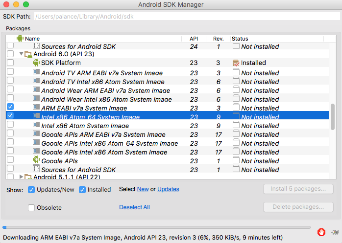
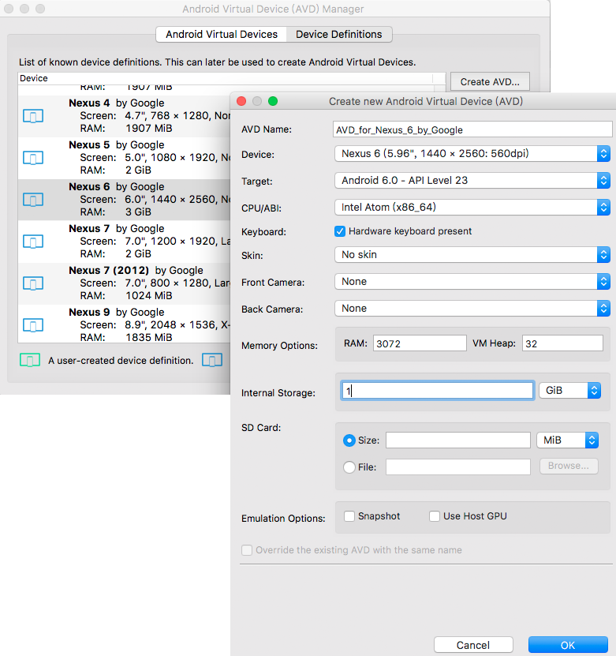

这篇博文本来想记录在Android源码下编译生成apk文件，因为我不太喜欢动辄拿AndroidStudio这种大东西来调试和验证小课题，如果不是搞大工程，我更喜欢emacs写几个文件，命令行下就编译、生成和执行了。
随着最近深入学习，我了解了SDK、NDK编译，它们不必每次都生成Android一大坨源码，调用现成的模拟器也更便捷，所以干脆把就这篇文章写成花式编译、打包。以后可以根据这篇记录，针对不同的目标采用最合适的编译方式。
<!-- more -->

# 最简单的Android工程
我把代码放在了[HelloAndroid](https://github.com/palanceli/blog/tree/master/source/_drafts/2016/1020HelloAndroid/HelloAndroid)，文件结构为：
```
HelloAndroid
├──AndroidManifest.xml
├──Android.mk
├──src
│  └──palance/li/hello
│     └──HelloAndroid.java
└──res
   ├──layout
   │  └──main.xml
   ├──values
   │  └──strings.xml
   └──drawable
      └──icon.png
```
# Android源码下编译
把该文件夹放到<Android源码>/packages/experimental目录下，我写了一个脚本HelloAndroid/ln2android.sh，只要执行
```
$ sh ln2android.sh <android-dir>
```
即可在<android-dir>/packages/experimental下生成指向HelloAndroid的软链接。执行命令：
``` bash
$ cd <android-dir>
$ source build/envsetup.sh
$ lunch aosp_arm_eng
$ mmm packages/experimental/HelloAndroid
```
即可生成apk文件：
`<android-dir>/out/debug/target/product/generic/system/app/HelloAndroid/HelloAndroid.apk`。
# 在源码编译的模拟器中运行
为了不重新编译Android源码，需要执行：
``` bash
$ make snod
```
重新生成系统镜像，该应用就会作为系统自带应用被放置到桌面。
但搞成系统自带应用并不便于调试，因为系统自带应用不能卸载，以后修改了代码，要重新调试就只能重新编译，生成系统镜像了。
可以在编译模拟器系统镜像的时候，不要把HelloAndroid放到`/packages/experimental`下，等模拟器启动后再单独编译`HelloAndroid`。编译完成后先查询模拟器中已安装的应用程序：
``` bash
$ adb shell pm list packages
package:com.android.providers.telephony
package:palance.li.hello
... ...
```
如果应用已安装，则先卸载再安装：
``` bash
$ adb uninstall palance.li.hello
... ...
$ adb install ~/HelloAndroid.apk
```
# 使用SDK编译

# 在SDK自带的emulator中运行
AndroidStudio2.x以后自带的模拟器运行速度已经快很多了，所以一般的app调试，可以用它。使用方法为：
* 双击`~/Library/Android/sdk/tools/android`，点击菜单`Tools - Manager ADVs...`
* 勾选和下载即将使用的Android系统镜像文件，如下图：

* 选择`Device Definitions`，选择有系统镜像的类型，点击`Create AVD...`创建新的模拟器，如下图所示，我创建的是个x86的模拟器，这样会在宿主机器上跑得快一些：

* 来到`Android Virutal Devices`页面，即可启动刚刚创建的模拟器。在macOS上启动x86的模拟器需要安装[Intel Hardware Accelerated Execution Manager](https://software.intel.com/en-us/android/articles/intel-hardware-accelerated-execution-manager-end-user-license-agreement-macosx)。
* 以后再次启动只需要在命令行下调用
`~/Library/Android/sdk/tools/emulator -avd AVD_for_Nexus_6_by_Google`
即可。