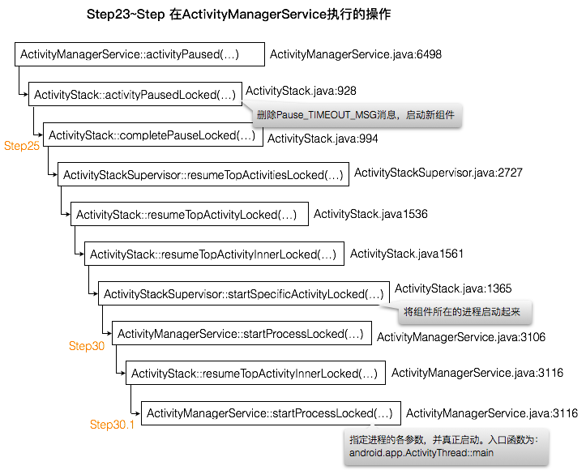
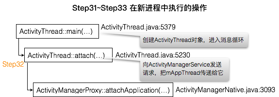
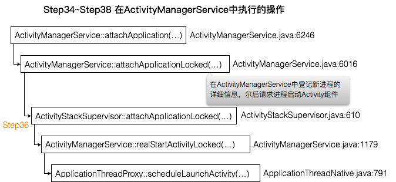

收到来自`ActivityManagerService`的进程间通信请求`SCHEDULE_PAUSE_ACTIVITY_TRANSACTION`后，Launcher通过`ApplicationThread::schedulePauseActivity(...)`来执行处理操作：
# Step18 ApplicationThread::schedulePauseActivity(...)
``` java
// frameworks/base/core/java/android/app/ActivityThread.java
public final class ActivityThread {
    ... ...
    private class ApplicationThread extends ApplicationThreadNative {
        ... ...
// :588
        public final void schedulePauseActivity(IBinder token, boolean finished,
                boolean userLeaving, int configChanges, boolean dontReport) {
            sendMessage(
                    finished ? H.PAUSE_ACTIVITY_FINISHING : H.PAUSE_ACTIVITY,
                    token,
                    (userLeaving ? 1 : 0) | (dontReport ? 2 : 0),
                    configChanges);
        }...
    }...
}
```
其中参数
`finished`为flase；
`token`是指向ActivityManagerService中Launcher对应的ActivityRecord对象的Binder代理对象；
`userLeaving`为true。
因此，sendMessage向Launcher的主线程发送PAUSE_ACTIVITY消息。
# Step19 ActivityThread::sendMessage(...)
``` java
// frameworks/base/core/java/android/app/ActivityThread.java:2265
    private void sendMessage(int what, Object obj, int arg1, int arg2) {
        sendMessage(what, obj, arg1, arg2, false);
    }

    private void sendMessage(int what, Object obj, int arg1, int arg2, boolean async) {
        ... ...
        Message msg = Message.obtain();
        msg.what = what;
        msg.obj = obj;
        msg.arg1 = arg1;
        msg.arg2 = arg2;
        if (async) {
            msg.setAsynchronous(true);
        }
        // mH用来处理进程的主线程消息，类型为H，继承自Handle。sendMessage向主线程消息队列
        // 发送一个消息，该消息最终由应用程序主线程的handleMessage处理。此处发送的消息将在
        // Launcher中执行中止Launcher组建的操作
        mH.sendMessage(msg);
    }
```
# Step20 ActivityThread::handleMessage(...)
``` java
// frameworks/base/core/java/android/app/ActivityThread.java:1335
        public void handleMessage(Message msg) {
            ... ...
            switch (msg.what) {
                ... ...
                case PAUSE_ACTIVITY:
                    ... ...
                    handlePauseActivity((IBinder)msg.obj, false, (msg.arg1&1) != 0, msg.arg2,
                            (msg.arg1&2) != 0);
                    ... ...
                    break;
                ... ...
            }
            ...
        }
```
# Step21 ActivityThread::handlePauseActivity(...)
``` java
// frameworks/base/core/java/android/app/ActivityThread.java:3305
    private void handlePauseActivity(IBinder token, boolean finished,
            boolean userLeaving, int configChanges, boolean dontReport) {
        ActivityClientRecord r = mActivities.get(token); // 找到Launcher的ActivityRecord对象
        if (r != null) {
            ... ...
            if (userLeaving) {
                performUserLeavingActivity(r); // 向Launcher发送一个用户离开事件通知
            }

            r.activity.mConfigChangeFlags |= configChanges;
            // 向Launcher发送一个中止事件通知
            performPauseActivity(token, finished, r.isPreHoneycomb());

            // 等待完成前面Launcher中止可能导致的数据写入操作完成
            if (r.isPreHoneycomb()) {
                QueuedWork.waitToFinish();
            }

            // 🏁通知ActivityManagerService，Launcher组件已经进入Paused状态
            if (!dontReport) {
                try { // getDefault()返回ActivityManagerService的代理对象
                    ActivityManagerNative.getDefault().activityPaused(token);
                } catch (RemoteException ex) {}
            }
            mSomeActivitiesChanged = true;
        }
    }
```
# Step22 ActivityManagerProxy::activityPaused(...)
``` java
// frameworks/base/core/java/android/app/ActivityManagerNative.java:3134
    public void activityPaused(IBinder token) throws RemoteException
    {
        Parcel data = Parcel.obtain();
        Parcel reply = Parcel.obtain();
        data.writeInterfaceToken(IActivityManager.descriptor);
        data.writeStrongBinder(token);
        mRemote.transact(ACTIVITY_PAUSED_TRANSACTION, data, reply, 0);
        reply.readException();
        data.recycle();
        reply.recycle();
    }
```
此处向ActivityManagerService发送类型为ACTIVITY_PAUSED_TRANSACTION的进程间通信请求。
以上Step18~Step22在Launcher中执行，如下图：

**接下来又转入ActivityManagerService执行。**
# Step23 ActivityManagerService::activityPaused(...)
``` java
// frameworks/base/service/core/java/com/android/server/am/ActivityManagerService.java:6498
    public final void activityPaused(IBinder token) {
        ... ...
            ActivityStack stack = ActivityRecord.getStackLocked(token);
            if (stack != null) {
                stack.activityPausedLocked(token, false);
            }
        ... ...
    }
```
# Step24 ActivityStack::activityPausedLocked(...)
``` java
// frameworks/base/service/core/java/com/android/server/am/ActivityStack.java:928
    final void activityPausedLocked(IBinder token, boolean timeout) {
        ... ...
        // 根据token找到Launcher对应的ActivityRecord对象
        final ActivityRecord r = isInStackLocked(token);
        if (r != null) {
            // Launcher已经在规定的时间内处理完成中止通知，因此可以删除消息了
            mHandler.removeMessages(PAUSE_TIMEOUT_MSG, r); 
            if (mPausingActivity == r) { // 前面已经将mPausingActivity指向Launcher
                ... ...
                completePauseLocked(true); // 🏁 启动新组件
            } else { ... }
        }
    }
```
# Step25 ActivityStack::completePauseLocked(...)
``` java
// frameworks/base/service/core/java/com/android/server/am/ActivityStack.java:994
    private void completePauseLocked(boolean resumeNext) {
        ActivityRecord prev = mPausingActivity;
        ... ...
        if (prev != null) {
            prev.state = ActivityState.PAUSED;
            ... ...
            mPausingActivity = null; // 系统当前正在中止的Activity已经进入Paused状态
        }

        if (resumeNext) {
            final ActivityStack topStack = mStackSupervisor.getFocusedStack();
            //系统不是正进入休眠或关闭状态，则启动位于组件堆栈顶端的Activity
            if (!mService.isSleepingOrShuttingDown()) { 
                mStackSupervisor.resumeTopActivitiesLocked(topStack, prev, null);
            } else { ... }
        }
        ... ...
    }
```
# Step26 ActivityStackSupervisor::resumeTopActivitiesLocked(...)
``` java
// frameworks/base/services/core/java/com/android/server/am/ActivityStackSupervisor.java:2727
    boolean resumeTopActivitiesLocked(ActivityStack targetStack, ActivityRecord target,
            Bundle targetOptions) {
        ... ...
        for (int displayNdx = mActivityDisplays.size() - 1; displayNdx >= 0; --displayNdx) {
            final ArrayList<ActivityStack> stacks = mActivityDisplays.valueAt(displayNdx).mStacks;
            for (int stackNdx = stacks.size() - 1; stackNdx >= 0; --stackNdx) {
                final ActivityStack stack = stacks.get(stackNdx);
                if (stack == targetStack) {
                    // Already started above.
                    continue;
                }
                if (isFrontStack(stack)) {
                    stack.resumeTopActivityLocked(null); // 🏁
                }
            }
        }
        return result;
    }
```
# Step27 ActivityStack::resumeTopActivityLocked(...)
``` java
// frameworks/base/services/core/java/com/android/server/am/ActivityStack.java:1536
    final boolean resumeTopActivityLocked(ActivityRecord prev) {
        return resumeTopActivityLocked(prev, null);
    }

    final boolean resumeTopActivityLocked(ActivityRecord prev, Bundle options) {
        ... ...
        boolean result = false;
        try {
            // Protect against recursion.
            mStackSupervisor.inResumeTopActivity = true;
            if (mService.mLockScreenShown == ActivityManagerService.LOCK_SCREEN_LEAVING) {
                mService.mLockScreenShown = ActivityManagerService.LOCK_SCREEN_HIDDEN;
                mService.updateSleepIfNeededLocked();
            }
            result = resumeTopActivityInnerLocked(prev, options); // 🏁
        } finally {
            mStackSupervisor.inResumeTopActivity = false;
        }
        return result;
    }
```
# Step28 ActivityStack::resumeTopActivityInnerLocked(...)
``` java
// frameworks/base/services/core/java/com/android/server/am/ActivityStack.java:1561
    private boolean resumeTopActivityInnerLocked(ActivityRecord prev, Bundle options) {
        ... ...
        // Find the first activity that is not finishing.
        final ActivityRecord next = topRunningActivityLocked(null);
        ... ...
        // 前面ActivityManagerServer已经调用过resumeTopActivityLocked试图启动
        // Activity组件了，但由于那时候Launcher尚未进入Paused状态，就先调用
        // startPausingLocke执行中止Launcher的操作。在向Launcher发送中止通知前，
        // 已经将mResumedActivity置null了，因此此处为false
        if (mResumedActivity != null) {
            ... ...
            pausing |= startPausingLocked(userLeaving, false, true, dontWaitForPause);
        }
        ... ...
        // 即将启动的Activity组件尚未被启动起来，因此app为null
        if (next.app != null && next.app.thread != null) { ... } 
        else {
            ... ...
            // 🏁启动next
            mStackSupervisor.startSpecificActivityLocked(next, true, true);
        }
        ... ...
        return true;
    }
```
# Step29 ActivityStackSupervisor::startSpecificActivityLocked(...)
``` java
// frameworks/base/services/core/java/com/android/server/am/ActivityStack.java:1365
    void startSpecificActivityLocked(ActivityRecord r,
            boolean andResume, boolean checkConfig) {
        // 获得r对应的Activity所在的进程
        ProcessRecord app = mService.getProcessRecordLocked(r.processName,
                r.info.applicationInfo.uid, true);
        ... ...
        if (app != null && app.thread != null) {
            try {
                ... ...
                // 如果进程已存在，则通知进程启动组件
                realStartActivityLocked(r, app, andResume, checkConfig);
                return;
            } catch (RemoteException e) { ... }
            ...
        }
        // 否则先将进程启动起来
        mService.startProcessLocked(r.processName, r.info.applicationInfo, true, 0,
                "activity", r.intent.getComponent(), false, false, true);
    }
```
`mService`的类型为ActivityManagerService。

# Step30 ActivityManagerService::startProcessLocked(...)
``` java
// frameworks/base/services/core/java/com/android/server/am/ActivityManagerService.java:3106
    final ProcessRecord startProcessLocked(String processName,
            ApplicationInfo info, boolean knownToBeDead, int intentFlags,
            String hostingType, ComponentName hostingName, boolean allowWhileBooting,
            boolean isolated, boolean keepIfLarge) { // isolated=false
        return startProcessLocked(processName, info, knownToBeDead, intentFlags, hostingType,
                hostingName, allowWhileBooting, isolated, 0 /* isolatedUid */, keepIfLarge,
                null /* ABI override */, null /* entryPoint */, null /* entryPointArgs */,
                null /* crashHandler */); // 🏁
    }
// :3116
    final ProcessRecord startProcessLocked(String processName, ApplicationInfo info,
            boolean knownToBeDead, int intentFlags, String hostingType, ComponentName hostingName,
            boolean allowWhileBooting, boolean isolated, int isolatedUid, boolean keepIfLarge,
            String abiOverride, String entryPoint, String[] entryPointArgs, Runnable crashHandler) {
        long startTime = SystemClock.elapsedRealtime();
        ProcessRecord app;
        if (!isolated) { // isolated=false
            app = getProcessRecordLocked(processName, info.uid, keepIfLarge);
            ... ...
        } else {...}
        ... ...
        String hostingNameStr = hostingName != null
                ? hostingName.flattenToShortString() : null;

        if (app == null) {
            ... ... // 如果请求创建的进程不存在，则根据指定名称和UID创建ProcessRecord对象
            app = newProcessRecordLocked(info, processName, isolated, isolatedUid);
            ... ...
        } else { ... }
        ... ... // 🏁创建进程
        startProcessLocked(
                app, hostingType, hostingNameStr, abiOverride, entryPoint, entryPointArgs);
        ... ...
        return (app.pid != 0) ? app : null;
    }
```
## Step30.1 ActivityManagerService::startProcessLocked(...)
``` java
// frameworks/base/services/core/java/com/android/server/am/ActivityManagerService.java:3247
    private final void startProcessLocked(ProcessRecord app, String hostingType,
            String hostingNameStr, String abiOverride, String entryPoint, String[] entryPointArgs) {
        ... ...
        try {
            ... ...
            int uid = app.uid;
            int[] gids = null;
            ... ...
            if (!app.isolated) {
                int[] permGids = null;
                try {
                    ... ... // 获取要创建进程的uid和gid
                    final IPackageManager pm = AppGlobals.getPackageManager();
                    permGids = pm.getPackageGids(app.info.packageName, app.userId);
                    ... ...
                } catch (RemoteException e) { ... }
                ... ...
            }
            ... ...
            int debugFlags = 0;
            ... ...
            app.gids = gids;
            app.requiredAbi = requiredAbi;
            app.instructionSet = instructionSet;
            ... ...
            // 指定函数入口为entryPoint的main函数
            if (entryPoint == null) entryPoint = "android.app.ActivityThread";
            ... ...
            Process.ProcessStartResult startResult = Process.start(entryPoint,
                    app.processName, uid, uid, gids, debugFlags, mountExternal,
                    app.info.targetSdkVersion, app.info.seinfo, requiredAbi, instructionSet,
                    app.info.dataDir, entryPointArgs);
            ... ...
                // 以pid为关键字，将app保存到mPidsSelfLocked中
                this.mPidsSelfLocked.put(startResult.pid, app);
                if (isActivityProcess) {
                    // 向ActivityManagerService发送此消息，并制定该消息在
                    // PROC_START_TIMEOUT毫秒后处理。新的应用程序必须在次时间内完成启
                    // 动工作，并向ActivityManagerService发送一个启动完成的通知，以便
                    // ActivityManagerService在它里面启动一个Activity组件；否则就会
                    // 认为它超时了，就不能将Activity启动起来。
                    Message msg = mHandler.obtainMessage(PROC_START_TIMEOUT_MSG);
                    msg.obj = app;
                    mHandler.sendMessageDelayed(msg, startResult.usingWrapper
                            ? PROC_START_TIMEOUT_WITH_WRAPPER : PROC_START_TIMEOUT);
                }
            ... ...
        } catch (RuntimeException e) {...}
    }
```
以上Step23~Step30.1的操作是在AvtivityManagerService中执行，如下图：


调用`Process::start(...)`启动新进程时，指定该进程的入口函数为`android.app.ActivityThread`类的静态成员函数`main`，因此接下来就从新应用的`main`函数开始分析其启动过程。
# Step31 ActivityThread::main(...)
``` java
// frameworks/base/core/java/android/app/ActivityThread.java:5379
    public static void main(String[] args) {
        ... ...
        Looper.prepareMainLooper();

        // 创建thread对象时，会在它内部创建一个ApplicationThread对象mAppThread
        // 这是一个Binder本地对象，ActivityManagerService通过它和应用程序进程通信
        ActivityThread thread = new ActivityThread();
        thread.attach(false); // 发送启动完成通知
        ... ...
        Looper.loop();        // 进入消息循环
        ... ...
    }
```
# Step32 ActivityThread::attach(...)
``` java
// frameworks/base/core/java/android/app/ActivityThread.java:5230
    private void attach(boolean system) {
        sCurrentActivityThread = this;
        mSystemThread = system;
        if (!system) {
            ... ...
            // 获得ActivityManagerService的代理对象
            final IActivityManager mgr = ActivityManagerNative.getDefault();
            try {
                // 🏁向ActivityManagerService发送进程间通信请求，把mAppThread传递给它
                mgr.attachApplication(mAppThread);
            } catch (RemoteException ex) {...}
            ... ...
        } else { ... }
        ... ...
    }
```
`mAppThread`的类型为`ApplicationThread`，
# Step33 ActivityManagerProxy::attachApplication(...)
``` java
// frameworks/base/core/java/android/app/ActivityManagerNative.java:3093
    public void attachApplication(IApplicationThread app) throws RemoteException
    {
        Parcel data = Parcel.obtain();
        Parcel reply = Parcel.obtain();
        data.writeInterfaceToken(IActivityManager.descriptor);
        data.writeStrongBinder(app.asBinder());
        mRemote.transact(ATTACH_APPLICATION_TRANSACTION, data, reply, 0);
        reply.readException();
        data.recycle();
        reply.recycle();
    }
```
此处向ActivityManagerService发送进程间通信请求，Step31~Step33的操作是在新进程中执行，如下图：

**接下来将转入ActivityManagerService中执行**。
# Step34 ActivityManagerService::attachApplication(...)
``` java
// frameworks/base/services/core/java/com/android/server/am/ActivityManagerService.java:6246
    public final void attachApplication(IApplicationThread thread) {
        synchronized (this) {
            ... ...
            attachApplicationLocked(thread, callingPid);
            ... ...
        }
    }
```
# Step35 ActivityManagerService::attachApplicationLocked(...)
``` java
// frameworks/base/services/core/java/com/android/server/am/ActivityManagerService.java:6016
    private final boolean attachApplicationLocked(IApplicationThread thread,
            int pid) { 
        // pid为将要创建的进程PID，前面曾以此为关键字将ProcessRecord保存到
        // mPidSelfLocked中，此处先根据pid将它取出
        ... ...
        ProcessRecord app;
        if (pid != MY_PID && pid >= 0) {
            synchronized (mPidsSelfLocked) {
                app = mPidsSelfLocked.get(pid);
            }
        } else { ... }
        ... ...  // 进程已经起来，对app做初始化
        // thread指向ApplicationThread代理对象，以便ActivityManagerService通过此对象
        // 和新创建的进程通信
        app.makeActive(thread, mProcessStats); 
        app.curAdj = app.setAdj = -100;
        app.curSchedGroup = app.setSchedGroup = Process.THREAD_GROUP_DEFAULT;
        app.forcingToForeground = null;
        updateProcessForegroundLocked(app, false, false);
        app.hasShownUi = false;
        app.debugging = false;
        app.cached = false;
        app.killedByAm = false;

        // 删除此消息，因为新的应用程序已经在规定的时间内启动起来了
        mHandler.removeMessages(PROC_START_TIMEOUT_MSG, app);

        boolean normalMode = mProcessesReady || isAllowedWhileBooting(app.info);
        List<ProviderInfo> providers = normalMode ? generateApplicationProvidersLocked(app) : null;
        ... ...
        // See if the top visible activity is waiting to run in this process...
        if (normalMode) {
            try {
                // 🏁请求进程启动一个Activity组件
                if (mStackSupervisor.attachApplicationLocked(app)) {
                    didSomething = true;
                }
            } catch (Exception e) { ... }
        }
        ... ...
        return true;
    }
```
# Step36 ActivityStackSupervisor::attachApplicationLocked(...)
``` java
// frameworks/base/services/core/java/com/android/server/am/ActivityStackSupervisor.java:610
    boolean attachApplicationLocked(ProcessRecord app) throws RemoteException {
        final String processName = app.processName;
        boolean didSomething = false;
        for (int displayNdx = mActivityDisplays.size() - 1; displayNdx >= 0; --displayNdx) {
            ArrayList<ActivityStack> stacks = mActivityDisplays.valueAt(displayNdx).mStacks;
            for (int stackNdx = stacks.size() - 1; stackNdx >= 0; --stackNdx) {
                final ActivityStack stack = stacks.get(stackNdx);
                if (!isFrontStack(stack)) {
                    continue;
                }
                // 得到栈顶ActivityRecord对象
                ActivityRecord hr = stack.topRunningActivityLocked(null);
                if (hr != null) {
                    if (hr.app == null && app.uid == hr.info.applicationInfo.uid
                            && processName.equals(hr.processName)) {
                        try {
                            // 🏁
                            if (realStartActivityLocked(hr, app, true, true)) {
                                didSomething = true;
                            }
                        } catch (RemoteException e) { ... }
                    }
                }
            }
        }
        ... ...
        return didSomething;
    }
```
# Step37 ActivityStackSupervisor::realStartActivityLocked(...)
``` java
// frameworks/base/services/core/java/com/android/server/am/ActivityStackSupervisor.java:1179
    final boolean realStartActivityLocked(ActivityRecord r,
            ProcessRecord app, boolean andResume, boolean checkConfig)
            throws RemoteException {
        ... ...
        r.app = app; // 即将启动的进程
        ... ...
        int idx = app.activities.indexOf(r);
        if (idx < 0) {
            app.activities.add(r);  // 将此Activity添加到app所描述的进程组件列表中
        }
        ... ...
        final ActivityStack stack = task.stack;
        try {
            ... ...
            List<ResultInfo> results = null;
            List<ReferrerIntent> newIntents = null;
            if (andResume) {
                results = r.results;
                newIntents = r.newIntents;
            }
            ... ...
            // 通知前面创建的进程启动有r所描述的Activity组件
            app.thread.scheduleLaunchActivity(new Intent(r.intent), r.appToken,
                    System.identityHashCode(r), r.info, new Configuration(mService.mConfiguration),
                    new Configuration(stack.mOverrideConfig), r.compat, r.launchedFromPackage,
                    task.voiceInteractor, app.repProcState, r.icicle, r.persistentState, results,
                    newIntents, !andResume, mService.isNextTransitionForward(), profilerInfo);
            ... ...
        } catch (RemoteException e) { ... }
        ... ...
        return true;
    }
```
app.thread是一个类型为ApplicationThreadProxy的Binder代理对象。
# Step38 ApplicationThreadProxy::scheduleLaunchActivity(...)
``` java
// frameworks/base/core/java/android/app/ApplicationThreadNative.java:791
    public final void scheduleLaunchActivity(Intent intent, IBinder token, int ident,
            ActivityInfo info, Configuration curConfig, Configuration overrideConfig,
            CompatibilityInfo compatInfo, String referrer, IVoiceInteractor voiceInteractor,
            int procState, Bundle state, PersistableBundle persistentState,
            List<ResultInfo> pendingResults, List<ReferrerIntent> pendingNewIntents,
            boolean notResumed, boolean isForward, ProfilerInfo profilerInfo) throws RemoteException {
        Parcel data = Parcel.obtain();
        data.writeInterfaceToken(IApplicationThread.descriptor);
        intent.writeToParcel(data, 0);
        data.writeStrongBinder(token);
        data.writeInt(ident);
        ... ...
        mRemote.transact(SCHEDULE_LAUNCH_ACTIVITY_TRANSACTION, data, null,
                IBinder.FLAG_ONEWAY);
        data.recycle();
    }
```
此处向刚刚创建的应用程序发送一个进程间通信请求。以上Step34~Step38是在ActivityManagerService中执行，如下图：

**接下来又转到刚刚创建的应用程序中执行。**
# Step39 ActivityThread::scheduleLaunchActivity(...)
``` java
// frameworks/base/core/java/android/app/ActivityThread.java:630
        public final void scheduleLaunchActivity(Intent intent, IBinder token, int ident,
                ActivityInfo info, Configuration curConfig, Configuration overrideConfig,
                CompatibilityInfo compatInfo, String referrer, IVoiceInteractor voiceInteractor,
                int procState, Bundle state, PersistableBundle persistentState,
                List<ResultInfo> pendingResults, List<ReferrerIntent> pendingNewIntents,
                boolean notResumed, boolean isForward, ProfilerInfo profilerInfo) {

            updateProcessState(procState, false);

            ActivityClientRecord r = new ActivityClientRecord();

            r.token = token;
            r.ident = ident;
            r.intent = intent;
            ... ...
            sendMessage(H.LAUNCH_ACTIVITY, r); // 🏁
        }
```
此处把将要启动的Activity封装成一个ActivityClientRecord对象，再将此对象通过sendMessage发送到消息队列。回顾Step19，该消息最终落到ActivityThread::handleMessage(...)中处理。
# Step40 ActivityThread::handleMessage(...)
``` java
// frameworks/base/core/java/android/app/ActivityThread.java:1335
        public void handleMessage(Message msg) {
            ... ...
            switch (msg.what) {
                case LAUNCH_ACTIVITY: {
                    ... ...
                    final ActivityClientRecord r = (ActivityClientRecord) msg.obj;

                    // 每个Android应用程序都打包在一个Apk文件中，一个Apk文件包含此应用
                    // 的所有资源，应用进程在启动一个Activity组件时需要加载它所属的Apk
                    // 文件以便访问里面的资源。packageInfo就用来描述已加载的Apk文件，
                    // 其类型为LoadedApk
                    r.packageInfo = getPackageInfoNoCheck(
                            r.activityInfo.applicationInfo, r.compatInfo);
                    handleLaunchActivity(r, null); // 🏁启动由r指定的Activity组件
                    ... ...
                } break;
            ...
        }...
    }
```
# Step41 ActivityThread::handleLaunchActivity(...)
``` java
// frameworks/base/core/java/android/app/ActivityThread.java:2456
``` java
    private void handleLaunchActivity(ActivityClientRecord r, Intent customIntent) {
        ... ... // 🏁将Activity组件启动起来
        Activity a = performLaunchActivity(r, customIntent);

        if (a != null) {
            r.createdConfig = new Configuration(mConfiguration);
            Bundle oldState = r.state;
            // 将Activity组件的状态设为Resumed，表示它是当前的活动Activity
            handleResumeActivity(r.token, false, r.isForward,
                    !r.activity.mFinished && !r.startsNotResumed);
            ... ...
        } else { ... }
    }
```
# Step42 ActivityThread::performLaunchActivity(...)
``` java
// frameworks/base/core/java/android/app/ActivityThread.java:2293
    private Activity performLaunchActivity(ActivityClientRecord r, Intent customIntent) {
        ... ...  // 要启动的Activity包名、类名
        ComponentName component = r.intent.getComponent(); 
        ... ...
        Activity activity = null;
        try { // 加载到内存并创建Activity实例
            java.lang.ClassLoader cl = r.packageInfo.getClassLoader();
            activity = mInstrumentation.newActivity(
                    cl, component.getClassName(), r.intent);
            ... ...
        } catch (Exception e) { ... }

        try {
            Application app = r.packageInfo.makeApplication(false, mInstrumentation);
            ... ...
            if (activity != null) {
                // appContext用来作为刚刚创建的Activity对象运行的上下文环境，通过它就
                // 可以访问到特定的应用程序资源，以及启动其他的应用程序组件。
                Context appContext = createBaseContextForActivity(r, activity);
                ... ...
                // 使用appContext和r来初始化Activity对象
                activity.attach(appContext, this, getInstrumentation(), r.token,
                        r.ident, app, r.intent, r.activityInfo, title, r.parent,
                        r.embeddedID, r.lastNonConfigurationInstances, config,
                        r.referrer, r.voiceInteractor);
                ... ...
                // 将Activity对象启动起来，在此过程中，Activity::onCreate就会被调用
                if (r.isPersistable()) {
                    mInstrumentation.callActivityOnCreate(activity, r.state, r.persistentState);
                } else {
                    mInstrumentation.callActivityOnCreate(activity, r.state);
                }
                ... ...
            // r.token是一个Binder代理对象，指向ActivityManagerService内部一个
            // ActivityRecord对象，该对象和ActivityClientRecord对象r一样，用来描述
            // 刚刚启动的Activity组件，只不过r.token是在ActivityManagerService中使
            // 用，而r在应用程序进程中使用。
            // 以token为关键字，将r保存到mActivities中
            mActivities.put(r.token, r);

        } catch (SuperNotCalledException e) { ... }
        catch (Exception e) { ... }

        return activity;
    }
```
接下来调用指定组件的`onCreate`函数，Activity组件的启动过程就完成了。
最后的Step39~Step42是在新进程中执行的，如下图：
