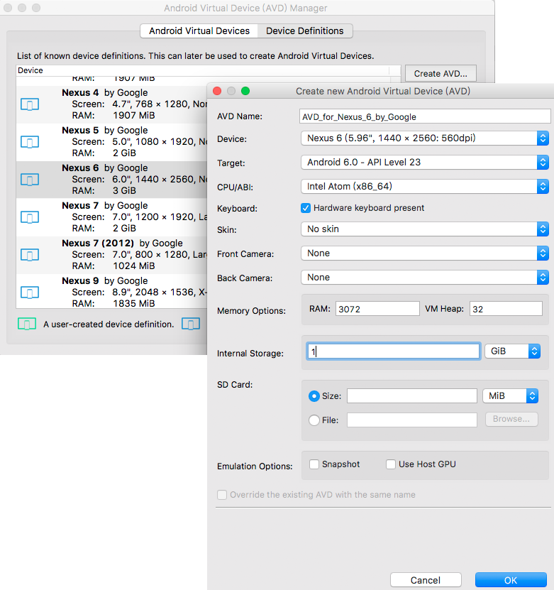

使用源码编译应用层程序还是有一些不便利的地方：
* 需要有Android源码。macOS下需要创建一个大小写区分的镜像文件存放Android源码，每次使用都需要把先挂载。
* 需要设置环境变量：`source build/senvsetup.sh`、`lunch aosp_arm-eng`等操作。

使用SDK编译则不需要这两个繁琐的步骤。AndroidStudio配备有Android SDK并负责更新升级，只需要事先一次性配置好环境变量，以后就可以编译应用程序了。而且SDK默认还带了一些辅助工具，比如生成默认的Android应用代码，不必手敲。
<!-- more -->
# 设置环境变量
Android SDK在macOS的存放路径为`~/Library/Android/sdk`，其下几个主要的目录为：
* platform-tools : 针对PC端和移动端交互的一些工具，如adb、sqlite3。
* build-tools : 存放aapt、aidl工具。
* tools : 针对pc平台下使用的工具，如模拟器、性能追踪可视化工具traceview等。
* platforms : android.jar文件

这些工具在编译、调试的时候会经常用到，路径名有点长，所以最好先设置好环境变量，把它们添加到`$PATH`中。打开`.bash_profile`我发现`sdk/tools`和`sdk/platform-tools`已经被添加过了，只需要再加入`build-tools`和`ndk-bundle`：
``` bash
export PATH=${PATH}:/Users/palance/Library/Android/sdk/platform-tools
export PATH=${PATH}:/Users/palance/Library/Android/sdk/tools
export PATH=${PATH}:/Users/palance/Library/Android/sdk/build-tools/25.0.0
export PATH=${PATH}:/Users/palance/Library/Android/sdk/ndk-bundle
```
# 生成标准Android工程
执行如下命令生成标准的Android工程：
``` bash
$ android create project \
      --activity MainActivity \
      --target 4 \
      --package palance.li.hello \
      --path HelloAndroid
```
`android`来自`sdk/tools/android`，前面已经将`sdk/tools`设置到`$PATH`，因此可以直接调用。各参数的含义从形参名称上就能看得出。其中target用于指定android平台，可以使用命令`android list targets`查看各id的含义：
``` bash
$ android list targets
Available Android targets:
----------
id: 1 or "android-21"
     Name: Android 5.0.1
     Type: Platform
     API level: 21
     Revision: 2
     Skins: HVGA, QVGA, WQVGA400, WQVGA432, WSVGA, WVGA800 (default), WVGA854, WXGA720, WXGA800, WXGA800-7in
 Tag/ABIs : no ABIs.
----------
id: 2 or "android-22"
... ...
----------
id: 4 or "android-23"
     Name: Android 6.0
     Type: Platform
     API level: 23
     Revision: 3
     Skins: HVGA, QVGA, WQVGA400, WQVGA432, WSVGA, WVGA800 (default), WVGA854, WXGA720, WXGA800, WXGA800-7in
 Tag/ABIs : no ABIs.
----------
... ...
```
由此可见id为4表示`android-23`，即`Android 6.0`。

回到前面的`android create project`命令上来，它会在当前目录下生成如下目录树：
``` bash
HelloAndroid
├──bin
│  └──
├──libs
│  └──
├──res
│  ├──drawable-hdpi        # 不同DPI下的应用程序图标
│  │  └──ic_launcher.png
│  ├──drawable-ldpi
│  │  └──ic_launcher.png
│  ├──drawable-mdpi
│  │  └──ic_launcher.png
│  ├──drawable-xhdpi
│  │  └──ic_launcher.pngd
│  ├──layout              # 描述界面布局
│  │  └──main.xml
│  └──values              # 存放常量
│     └──strings.xml
├──src/palance/li/hello
│  └──MainActivity.java   # java源码
├──ant.properties
├──local.properties
├──project.properties
├──proguard-project.txt
├──AndroidManifest.xml    # 描述应用程序的名称、组件等相关属性
└──build.xml
```
我用注释标出了在[《Android应用程序的编译（一）——源码下编译》](http://palanceli.com/2016/11/06/2016/1020BuildAndroidApp/)中手动创建的文件。其它的主要用于ant编译，暂时先不管。

# 使用SDK编译
1. 将工程的资源编译到R.java文件。
``` bash
$ aapt package -m -f \
    -J gen \
    -M AndroidManifest.xml \
    -S res \
    -I ~/Library/Android/sdk/platforms/android-25/android.jar 
```
  参数：
  `-m` 使生成的包的目录存放在-J参数指定的目录
  `-f` 如果编译出来的文件已经存在，强制覆盖
  `-J` R.java的生成目录，该目录必须事先创建好
  `-M` AndroidManifest.xml路径
  `-S` res路径
  `-I` android.jar路径
2. 编译java源文件。
``` bash
$ javac -encoding utf-8 \
    -source 1.6 -target 1.6 \
    -bootclasspath ~/Library/Android/sdk/platforms/android-25/android.jar \
    -d bin/classes \
    src/palance/li/hello/MainActivity.java gen/palance/li/hello/R.java
```
  `-encoding` java文件的编码方式 
  `-source` 指定编译器版本 
  `-target` 指定生成的class文件和哪个版本的虚拟机兼容 
  `-bootclasspath` 覆盖引导类的位置 
  `-d` 编译生成class文件的目录 ，该目录必须事先创建好
  最后指定需要编译的java文件，包括第1步生成R.java
3. 将编译好的文件打包成dex格式。
``` bash
$ dx --dex --output=bin/classes.dex bin/classes
```
  dx来自`~/Library/Android/sdk/build-tools/25.0.0/dx`。
  `--output` 指定生成dex的路径
  最后指定.class文件所在的目录
4. 创建未签名的apk文件，并将dex文件添加到该apk中：
``` bash
$ aapt package -f -M AndroidManifest.xml \
    -S res 
    -A assets 
    -I ~/Library/Android/sdk/platforms/android-25/android.jar 
    -F bin/HelloAndroid_unsigned.apk
$ cd bin
$ aapt add HelloAndroid_unsigned.apk classes.dex
```
  需要注意：`classes.dex`文件前一定不要加额外路径，否则这些路径会一并带进apk包里。而在Android apk里的classes.dex文件是不能带路径的。因此在添加dex之前需要先`cd bin`
5. 对apk文件签名
``` bash
$ jarsigner -verbose \
    -keystore ~/.android/debug.keystore \
    -keypass android \
    -storepass android \
    -signedjar bin/HelloAndroid_signed.apk" \
    bin/HelloAndroid_unsigned.apk" \
    androiddebugkey
```
  `-keystore` 秘钥库位置
  `-keypass` 专用密钥的口令
  `-storepass` 用于秘钥库完整性的口令
  `signedjar` 签名后的文件名称
  之后跟随的两个参数分别是待签名的文件以及文件别名。此处使用了debug签名证书，默认的密码是`android`，别名是`androiddebugkey`。
6. 对签名后的apk做对其优化
``` bash
zipalign -f 4 bin/HelloAndroid_signed.apk bin/HelloAndroid.apk
```
我把以上的编译过程写成脚本放在[build.sh](https://github.com/palanceli/blog/blob/master/source/_posts/2016/1106BuildAndroidApp2/build.sh)。

# 在SDK自带的emulator中运行
使用Android SDK 下载的x86的模拟器运行速度已经快很多了，所以一般的app调试，可以用它。要比源码编译出来的模拟器使用更方便。在使用之前要先创建模拟器，方法为：
* 命令行下运行android，点击菜单`Tools - Manager ADVs...`
* 勾选和下载即将使用的Android系统镜像文件，如下图：

* 选择`Device Definitions`，选择有系统镜像的类型，点击`Create AVD...`创建新的模拟器，如下图所示，我创建的是个x86的模拟器，这样会在宿主机器上跑得快一些：

* 来到`Android Virutal Devices`页面，即可启动刚刚创建的模拟器。在macOS上启动x86的模拟器需要安装[Intel Hardware Accelerated Execution Manager](https://software.intel.com/en-us/android/articles/intel-hardware-accelerated-execution-manager-end-user-license-agreement-macosx)。

创建完成后，再次启动模拟器只需要在命令行下调用：
```
$ emulator -avd AVD_for_Nexus_6_by_Google
```
其中`emulator`来自`~/Library/Android/sdk/tools/emulator`。要获得root权限，只需执行：
```
$ adb root
```
其中`adb`来自`~/Library/Android/sdk/platform-tools/adb`

