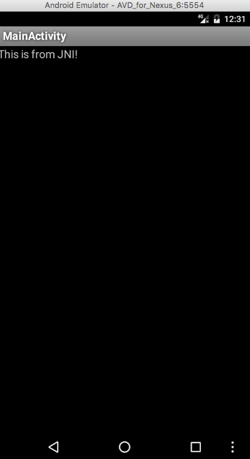

当工程当中包含C/C++代码，就需要使用NDK编译生成so文件，以供java调用，本文记录编译过程。
<!-- more -->
# 带有JNI的Android工程
同[Android应用程序的编译（二）——SDK编译](http://palanceli.com/2016/11/06/2016/1106BuildAndroidApp2/#生成标准Android工程)，使用`android create project`命令生成一个默认的HellAndroid，在其中手动添加一个jni目录，如下：
```
HelloAndroid
├──bin
│  └──
├──libs
│  └──
├──res
│  └──...
│  ├──layout
│  │  └──main.xml
│  └──values
│     └──strings.xml
├──jni                  # 手动添加此目录
│  ├──palance_li_hellojni_HelloJni.h
│  ├──palance_li_hellojni_HelloJni.c
│  ├──Android.mk
│  └──Application.mk
├──src/palance/li/hello
│  └──MainActivity.java
├──ant.properties
├──local.properties
├──project.properties
├──proguard-project.txt
├──AndroidManifest.xml
└──build.xml
```
# 通过javah创建.h文件
`javah`会根据`javac`编译出的class文件生成必要的.h头文件，并在其中生成函数声明的代码。首先，在`src/palance/li/hello/MainActivity.java`中添加native函数的声明和调用：
``` java
package palance.li.hello;

import android.app.Activity;
import android.os.Bundle;
import android.widget.TextView;

public class MainActivity extends Activity
{
  public native String stringFromJNI();  // 声明native函数
  static {
    System.loadLibrary("libhellojni");  // 加载so
  }
  
    /** Called when the activity is first created. */
    @Override
    public void onCreate(Bundle savedInstanceState)
    {
        super.onCreate(savedInstanceState);
        setContentView(R.layout.main);
        TextView tv = (TextView)findViewById(R.id.tv); // 通过id获得对象
        tv.setText(stringFromJNI());  // 调用native函数，设置对象文本
    }
}
```
此外还要在`layout/main.xml`中为TextView添加id：

``` xml
<?xml version="1.0" encoding="utf-8"?>
<LinearLayout xmlns:android="http://schemas.android.com/apk/res/android"
    android:orientation="vertical"
    android:layout_width="fill_parent"
    android:layout_height="fill_parent">
<!-- 为TextView添加id -->
<TextView
    android:id="@+id/tv"
    android:layout_width="fill_parent"
    android:layout_height="wrap_content"
    android:text="Hello World, MainActivity"
    />
</LinearLayout>
```
编译java源文件：
``` bash
$ javac -encoding utf-8 \
    -source 1.6 -target 1.6 \
    -bootclasspath ~/Library/Android/sdk/platforms/android-25/android.jar \
    -d bin/classes \
    src/palance/li/hello/HelloAndroid.java gen/palance/li/hello/R.java
```
调用javah为class文件生成.h头文件：
``` bash
$ javah -classpath bin/classes \
    -bootclasspath /Users/palance/Library/Android/sdk/platforms/android-25/android.jar  \
    -d jni \
    palance.li.hello.MainActivity
```
`-classpath` 指定javah用来查询类的路径，即需要为之生成.h文件的class文件所在路径
`-bootclasspath` 覆盖引导类的位置
`-d` 生成头文件的目录
最后一个参数是类名。
我在调用javah的时候曾经遇到各种问题，比如：`错误: 无法访问android.app.Activity`、`找不到android.app.Activity的类文件`之类的，网上给出的办法多是换个当前路径。当明白javah的工作机制以后，这些问题就不难解决了：首先要在java源文件中添加native函数的声明和调用，然后要编译成class文件，之后才能让javah根据这些class文件自动生成代码。
# 创建.c文件
jni/palance_li_hello_MainActivity.c：
``` c
#include <string.h>
#include "palance_li_hello_MainActivity.h"
JNIEXPORT jstring JNICALL Java_palance_li_hello_MainActivity_stringFromJNI(JNIEnv* env, jobject _this)
{
    return (*env)->NewStringUTF(env, "This is from JNI!");
}
```
# 创建jni/Android.mk文件
``` makefile
LOCAL_PATH:=$(call my-dir)
include $(CLEAR_VARS)

LOCAL_MODULE := libhellojni
LOCAL_SRC_FILES := \
    palance_li_hello_MainActivity.c

LOCAL_C_INCLUDES += \
    $(JNI_H_INCLUDE)

include $(BUILD_SHARED_LIBRARY)
```
# 通过ndk-build生成so文件
执行如下命令：
``` bash
$ cd HelloAndroid
$ ndk-build
```
`ndk-build`来自`$ ~/Library/Android/sdk/ndk-bundle/ndk-build`。它会生成目录`/libs`，并在其下生成一堆子目录：
```bash
HelloAndroid
├──...
└──libs
   ├──arm64-v8a
   │  └──libhellojni.so
   ├──armeabi
   │  └──libhellojni.so
   ├──armeabi-v7a
   │  └──libhellojni.so
   ├──mips
   │  └──libhellojni.so
   ├──mips64
   │  └──libhellojni.so
   ├──x86
   │  └──libhellojni.so
   └──x86_64
      └──libhellojni.so
```
可以放一个配置文件`jni/Application.mk`来制定需要的平台类型：
``` makefile
APP_ABI := armeabi-v7a x86_64
```
再次执行`ndk-build`命令，就会在`/libs`下只生成`armeabi-v7a`和`x86_64`两个平台的so文件了。

# 生成apk
接下来的打包过程和[使用SDK编译](http://palanceli.com/2016/11/06/2016/1106BuildAndroidApp2/#使用SDK编译)就一模一样了，唯一的差别在于在第4步之后插入一步，把so文件添加到apk里，完整的过程如下：
``` bash
$ cd HelloAndroid

# 1. 将工程的资源编译到R.java文件
$ aapt package -m -f \
    -J gen \
    -M AndroidManifest.xml \
    -S res \
    -I ~/Library/Android/sdk/platforms/android-25/android.jar

# 2. 编译java源文件
$ javac -encoding utf-8 \
    -source 1.6 -target 1.6 \
    -bootclasspath ~/Library/Android/sdk/platforms/android-25/android.jar \
    -d bin/classes \
    src/palance/li/hello/HelloAndroid.java gen/palance/li/hello/R.java

# 3. 将编译好的文件打包成dex格式
$ dx --dex --output=bin/classes.dex bin/classes

# 4. 创建未签名的apk文件，并将dex和so文件添加到该apk中
$ aapt package -f -M AndroidManifest.xml \
    -S res 
    -A assets 
    -I ~/Library/Android/sdk/platforms/android-25/android.jar 
    -F bin/HelloAndroid_unsigned.apk
$ cd bin
$ aapt add HelloAndroid_unsigned.apk classes.dex
$ mv libs lib
$ aapt add HelloAndroid_unsigned.apk lib/x86_64/libhellojni.so
$ mv lib libs

# 5. 对apk文件签名
$ jarsigner -verbose \
    -keystore ~/.android/debug.keystore \
    -keypass android \
    -storepass android \
    -signedjar bin/HelloAndroid_signed.apk" \
    bin/HelloAndroid_unsigned.apk" \
    androiddebugkey

# 6. 对签名后的apk做对其优化
$ zipalign -f 4 bin/HelloAndroid_signed.apk bin/HelloAndroid.apk
```
其中需要特别注意的是在第4步，添加so文件一定要带着路径，而且必须是`lib/<平台>/<so文件名>`，而不是android默认生成的libs。我被这个坑搞了一个多小时，发现apk确实把so打进去了，可就是到模拟器里安装不上。正常情况下安装apk文件的时候，so文件应该被拷贝到`/data/app/<包名>/lib/<平台名>`下的，结合本例就是`/data/app/palance.li.hello/lib/x86_64`。在命令行中，添加so到apk之前我先把libs目录改名为lib，添加完成后再改回来。

如果出现了加载so失败，可以先查看so文件是否被正确安装：
``` bash
$ adb shell ls /data/app/palance.li.hello-1/lib/x86_64
```
如果还有问题，可以使用logcat查看具体的输出：
``` bash
$ adb shell logcat *:d
```
终于算折腾出结果了：
